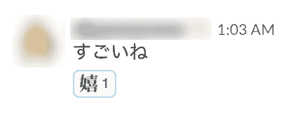
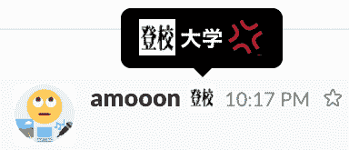

# 创建 Slack bot 以生成文本图像

> 原文：<https://dev.to/amotarao/create-slack-bot-to-generate-text-image-d4l>

*日文发布在 [dev.to](https://dev.to/amotarao/slackbot-376) ，[Qiita](https://qiita.com/amotarao/items/6bbb58ca74b4d9d1fae8)T5】*

我是日本人。我的英语水平是💩。谢谢你。

# 让我们使用 Node.js 创建 Slack bot

这一次，我将创建发送文本和生成图像的 Slack bot。
图片用于*文字表情符号*。

比如
发送`@textchan create 絵文字！`
Bot 返回 [](https://res.cloudinary.com/practicaldev/image/fetch/s--o_3wwYBM--/c_limit%2Cf_auto%2Cfl_progressive%2Cq_auto%2Cw_880/https://qiita-image-store.s3.amazonaws.com/0/99161/05e1dd90-233a-7bec-f373-65cbb451227e.png) 
注: **textchan** 为 Bot 名称。絵文字意思是“表情符号”。

## 什么是文字表情符号？

它只包含文本。

在 Slack 上，文字表情符号很重要，也很神奇。

对于反应:
[](https://res.cloudinary.com/practicaldev/image/fetch/s--1ntUCT_W--/c_limit%2Cf_auto%2Cfl_progressive%2Cq_auto%2Cw_880/https://qiita-image-store.s3.amazonaws.com/0/99161/2bc82e29-71f3-29e8-9202-0c82efa3da5f.png) 
すごいね的意思是‘你很了不起’。嬉意思是“高兴”。

而对于状态:
[](https://res.cloudinary.com/practicaldev/image/fetch/s--LimeeS24--/c_limit%2Cf_auto%2Cfl_progressive%2Cq_auto%2Cw_880/https://qiita-image-store.s3.amazonaws.com/0/99161/4b2bde77-2e5e-9d14-32be-36fcf6aa03b8.png) 
登校意思是“去上学”。大学意思是“大学”。

# 安装库

今天用`node-canvas`生成图像，用`Botkit`连接 Slack。

```
# Install libraries for node-canvas on Mac.
# Guide for other OS: https://github.com/Automattic/node-canvas#installation 
brew install pkg-config cairo pango libpng jpeg giflib

# Install node packages.
npm install --save node-canvas botkit 
```

# 编写程序

```
// index.js

const Botkit = require('botkit')
const canvas = require('./canvas')

if (!process.env.token) {
  console.log('Error: Specify token in environment')
  process.exit(1)
}

const controller = Botkit.slackbot({
  debug: false
})

controller.spawn({
  token: process.env.token
}).startRTM(function (err) {
  if (err) {
    throw new Error(err)
  }
})

controller.hears('create(.*)', ['direct_message', 'direct_mention', 'mention'], function (bot, message) {
  var setting = {
    text: '',
    color: '#000',
    fontFamily: 'YuGothic'
  }

  var args = message.match[1]
  var reg = /\s+(["“”][^"“”]+["“”]|[^  ]+)/g
  var arg, i = 0

  while (arg = reg.exec(args)) {
    arg = arg[1].replace(/^["“”](.*)["“”]$/, '$1')

    switch (i) {
      case 0:
        setting.text = arg
        break
      case 1:
        setting.color = arg
        break
      case 2:
        setting.fontFamily = arg
        break
    }
    i++
  }

  canvas(setting).then(function (fileObj) {
    var messageObj = fileObj
    messageObj.channels = message.channel

    bot.api.files.upload(messageObj, function (err, res) {
      if (err) console.log(err)
    })
  })
}) 
```

```
// canvas.js

const Canvas = require('canvas')
const fs = require('fs')

var insertStr = function (str, index, insert) {
  return str.slice(0, index) + insert + str.slice(index, str.length)
}
var canvas_to_base64 = function (c) {
  return c.toDataURL().split(',')[1]
}
var decode_and_copy = function (string, filename) {
  return new Promise(function (resolve, reject) {
    var buffer = new Buffer(string, 'base64')
    fs.writeFile(filename, buffer, function (err) {
      if (err) {
        reject(err)
        return
      }
      resolve()
    })
  })
}

async function canvas(setting, next) {

  setting = setting || {
    text: 'えもじ！',
    color: '#000',
    fontFamily: 'YuGothic'
  }

  const text_n = insertStr(setting.text, 2, '\n')
  const filename = './' + setting.text + '.png'

  const c = new Canvas(128, 128)
  const ctx = c.getContext('2d')

  ctx.font = 'bold 60px ' + setting.fontFamily
  ctx.textAlign = 'center'
  ctx.fillStyle = setting.color
  ctx.fillText(text_n, 64, 56)

  await decode_and_copy(canvas_to_base64(c), filename)

  const fileObj = {
    file: fs.createReadStream(filename),
    filename: setting.text + '.png',
    title: setting.text
  }

  return fileObj
}

module.exports = canvas 
```

# 运行

```
# [Slack API Token] is Slack Bots Integration's API Token
token=[Slack API Token] node index.js 
```

`@textchan create 絵文字！`
[T4】](https://res.cloudinary.com/practicaldev/image/fetch/s--sAMQoN7p--/c_limit%2Cf_auto%2Cfl_progressive%2Cq_auto%2Cw_880/https://qiita-image-store.s3.amazonaws.com/0/99161/fa83ec48-c92c-44d2-5fc5-a8e23c8ba323.png)

`@textchan create 赤・明朝 red "YuMincho"`
[T4】](https://res.cloudinary.com/practicaldev/image/fetch/s--gnsq3nQe--/c_limit%2Cf_auto%2Cfl_progressive%2Cq_auto%2Cw_880/https://qiita-image-store.s3.amazonaws.com/0/99161/f186a220-858c-c435-5c9a-2f106c2457ef.png)

# 终于

GitHub 资源库是这里的。

表情符号太神奇了！！！