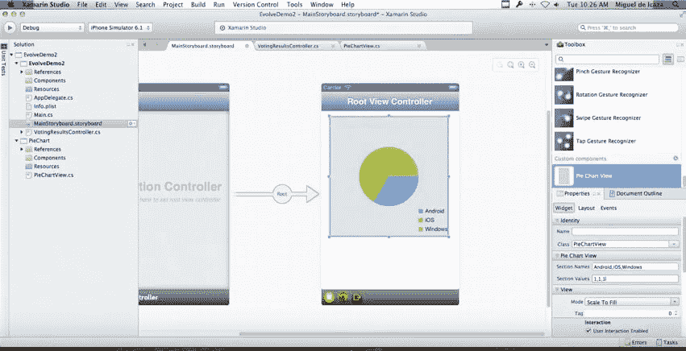
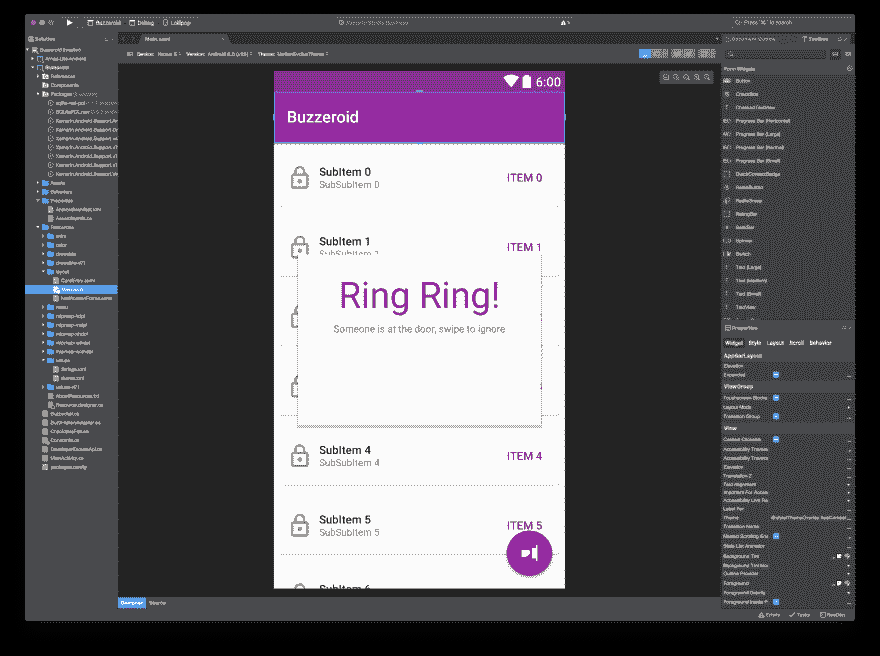

# Xamarin Android 设计器中的自定义控件

> 原文：<https://dev.to/garuma/custom-controls-in-the-xamarin-android-designer-55ed>

*又名介绍我们 Android 生态系统的内部情况*

在 Xamarin 平台的最新稳定版本中，我所做的一个具体功能是 Android designer 中的自定义控件支持(包括带有 Xamarin Studio 的 Mac 和 Visual Studio 上的 Windows)。

我们的 iOS 设计师早就享受到了这种支持，实际上从第一天就开始了。作为当时团队的一员，我可以肯定我们非常兴奋(并且松了一口气！)查看 Miguel [在 Evolve 2013 上介绍功能](https://www.youtube.com/watch?v=XVdqjGDkv9s#t=58m)时舞台上的饼状图:

[T2】](https://res.cloudinary.com/practicaldev/image/fetch/s--HWp0e5DT--/c_limit%2Cf_auto%2Cfl_progressive%2Cq_auto%2Cw_880/https://blog.neteril.org/wp-content/uploads/android-designer-custom-controls/ios-designer.png)

然而，由于两个设计者的渲染策略大相径庭，在 Android 上获得相同级别的自定义控件支持要困难得多。

在这篇文章中，我想强调 Android 设计者，更一般地说，Xamarin。Android 的工作方式以及如何实现适合它的自定义控件。

### 设计师建筑

Android 设计器大致分为两个主要部分。第一个是用 C#编写的，构成了大部分代码。这是一个跨 IDE 的库，实现了现代设计者的所有可视部分，如表面画布或属性面板，以及使这些工作的所有管道，包括用于 Android 布局的完整 DOM。

第二部分是用 Java 实现的，与上一部分和 Xamarin Studio 或 Visual Studio 一起运行不同，Java 层运行在自己的专用进程中。总结一下它的作用，假设它主要处理解析资源和渲染 Android 布局的繁重工作。

最后一项任务(渲染布局)实际上是通过使用名为 [layoutlib](https://android.googlesource.com/platform/tools/base/+/master/layoutlib-api/) 的现有 Google 库来完成的。它与 Android Studio 中的设计人员使用的是同一个底层库。它的目标是获取一个 XML 布局，膨胀它，布局它，并将其呈现到一个图像缓冲区。

Layoutlib 非常漂亮，它通过重用现有的 **android.jar** (它只包含原始的未实现的 android API surface)来工作，并动态地为类和方法连接足够的实现，以便能够在桌面上运行 Android 体验的一部分。关键的 API 使用标准的 JRE 库重新实现，一个很好的例子是 Android Canvas API，它被翻译成等价的 AWT 调用。

当实例化库时，这个过程在后台动态完成。它将自动获取与您想要使用的 API 级别相对应的 **android.jar** 档案，并将其与平台中另一个档案中包含的桌面实现(恰当地命名为 **layoutlib.jar** )相连接。如果你好奇，你也可以[在线查看那个代码](https://android.googlesource.com/platform/frameworks/base/+/master/tools/layoutlib/bridge/src/android/)。

最终结果是一个 Java `ClassLoader`实例，允许您检索和实例化所有 Android 框架类，如`android.view.View`。这种`ClassLoader`隔离实际上非常方便，因为它允许同时加载平台的几个版本(即不同的`android.view.View`定义),而不会污染主进程类空间。

除此之外，layoutlib 使用回调系统让库的消费者提供额外的输入。当 layoutlib 试图在它不知道的布局中膨胀一个项目时，就会调用这样一个回调，因为它不是来自我上面描述的框架`ClassLoader`。正如您可能猜到的，这些项目是定制用户视图。

### 搭售定制控件

因为 [Xamarin。Android](https://github.com/xamarin/xamarin-android) 让你同时使用 Java 和。基于. NET 的组件(前者被打包成绑定，包括我们的 [Android 支持库组件](https://github.com/xamarin/AndroidSupportComponents))，在设计器中支持这两者是必不可少的。

Java 组件实际上相当简单，因为渲染过程已经在 JVM 中运行。您只需将定制组件`.jar`代码(通常作为 Android 库项目的一部分发布在`.aar`文件中)引用到类似于`URLClassLoader`的实例中，并将加载关联到我提到的 layoutlib 回调中。

有趣的事情显然是包括托管组件。但是在我们深入探讨之前，让我们快速回顾一下 Xamarin。Android 的工作原理，或者更准确地说，它如何与运行它的 Java 虚拟机集成。

### 在你的 Java 里放一些 C#代码

我在这里要描述的主要是我们在 [Xamarin 中的遗留实现。Android](https://github.com/xamarin/xamarin-android) 虽然许多相同的想法仍然存在于我们新的 [Java 中。互操作库](https://github.com/xamarin/Java.Interop)(本质上是以一种清理的方式)。

Xamarin 的目标。Android *总而言之*是允许托管代码在现有的 Java 运行时中运行，并确保它们可以相互对话。为了实现这一点，它将 Mono 运行时嵌入到进程中，并允许它与现有的 Java VM 共存。

为了允许两个世界之间的通信，它使用了*桥接对象*的概念。每当 Java 对象出现在受管环境中时(例如，被覆盖的方法参数)，或者当 Java 对象的受管(可能是自动生成的)包装被创建时，对等过程发生，由此受管实例和 Java 实例变得相互链接，共享它们的生存期(意味着一个不能在没有另一个的情况下被收集)，直到链接被切断。

为了从托管环境中调用 Java 代码，使用了 [JNI 调用 API](http://docs.oracle.com/javase/7/docs/technotes/guides/jni/spec/functions.html#wp16656) 。为了让 Java 代码调用托管世界(由于子类化或回调)，会自动生成一个 Java 包装类。

这些包装器(称为 ACW/JCW，用于 Android/Java 可调用包装器)包含一堆用于充当 thunks 的`native`方法定义。然后使用带有函数指针的`RegisterNatives` [JNI 调用](http://docs.oracle.com/javase/7/docs/technotes/guides/jni/spec/functions.html#wp5833)将这些 thunks 动态插入到本质上的`mono_runtime_invoke`调用中。

例如，下面这个用 C#编写的`MyCustomView`子类，它的`OnDraw`方法被覆盖:

```
public class MyCustomView: Android.Views.View
{
    public override OnDraw (Canvas c)
    {}
} 
```

在构建过程中，会在您的 APK:
中生成、编译并打包一个等价的 Java 文件

```
package md55d31ab91effba0f9ed7ec79c59c38391;

public class MyCustomView
       extends android.view.View
       implements mono.android.IGCUserPeer
{
        public void onDraw (android.graphics.Canvas p0)
        {
                n_onDraw (p0);
        }

        private native void n_onDraw (android.graphics.Canvas p0);
} 
```

当您在 XML 布局中引用自定义视图时，您可能会以这种方式进行:

```
<MyNamespace.MyCustomView
    xmlns:android="http://schemas.android.com/apk/res/android"
    android:layout_width="match_parent"
    android:layout_height="match_parent" /> 
```

多加一些沙玛林。Android 处理，这将告诉 Android layout inflater 加载先前生成的 Java 类，当试图绘制视图时，将通过其本机 thunk 调用`OnDraw`方法的托管实现。

### 返回自定义控件

现在我们对托管 C#视图如何在 Android 环境中实例化有了更清晰的了解，很容易将它们加载到设计器中。只需将它们生成的 ACW 添加到我之前提到的特殊的`URLClassLoader`中，它们就会像任何其他标准的 Java 定制视图一样得到处理。

剩下要做的唯一一件事就是移植我们的 Xamarin.Android/Mono 运行时，使其能够在标准的 Java 桌面虚拟机中本地运行(与 Android API 的 layoutlib 的方式相同)，以便它可以执行 shim 自定义视图的另一面。这些代码现在也是开源的，你可以在 GitHub 上查看。

作为移植工作的一部分，我们需要对 AppDomain 实现进行一些除尘，特别是为了确保它在“移动”环境中可靠地工作。AppDomains 被用作 Java 类加载器的自然补充，允许在 Java 和托管端使用相同的竖井方法。

由于这种关联，设计者可以创建几个上下文，其中多个版本的 Android 可以以隔离的方式一起运行，并且可以重新加载刷新的二进制文件，而无需拆除渲染器进程本身。

### 整理完毕

[T2】](https://res.cloudinary.com/practicaldev/image/fetch/s--OQz51QXJ--/c_limit%2Cf_auto%2Cfl_progressive%2Cq_auto%2Cw_880/https://blog.neteril.org/wp-content/uploads/android-designer-custom-controls/xs_custom_controls.png)

上面呈现的布局摘自我的一个演示项目中的[，包含了许多不同类型的自定义控件，如 AppBarLayout、Toolbar、RecyclerView、CoordinatorLayout 和 FloatingActionButton 的自定义视图。顺便说一下，我们的 Xamarin 也使用了相同的功能。表单预览器显示一个布局的 Android 呈现。](https://github.com/garuma/Buzzeroid)

这里可以涵盖更多的内容，特别是我从来没有提到我们如何处理错误情况，甚至是当您在任何地方加载外部用户代码时必然会发生的关键运行时故障。可以说，我们需要一些好的错误处理和过程复活机制，这无疑是项目中最难实现的方面(现在仍然如此)。

这里的代码并不都是开源的，但是如果你感兴趣的话，还有很多可以看的:

*   Xamarin 的一些(旧的但仍然相关的)介绍。Android internals 在 NDC 奥斯陆由[@莎娜](https://twitter.com/sh4na)
*   [Java。互操作库](https://github.com/xamarin/Java.Interop)很好地展示了 Xamarin。Android 管道工程(在同名文件夹中也有文档)。
*   Xamarin 开发者门户有很多内容
    *   [与 JNI 合作](https://developer.xamarin.com/guides/android/advanced_topics/java_integration_overview/working_with_jni/)
    *   [发动机罩下导轨](https://developer.xamarin.com/guides/android/under_the_hood/)
*   [Xamarin。Android 开源库](https://github.com/xamarin/xamarin-android)