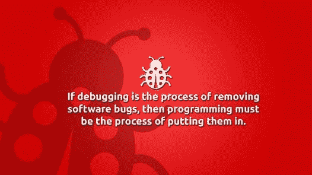
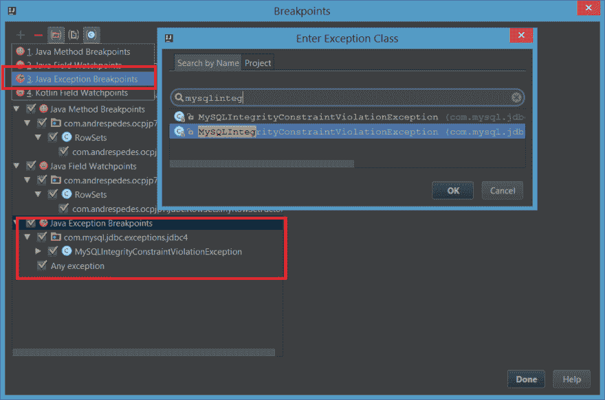
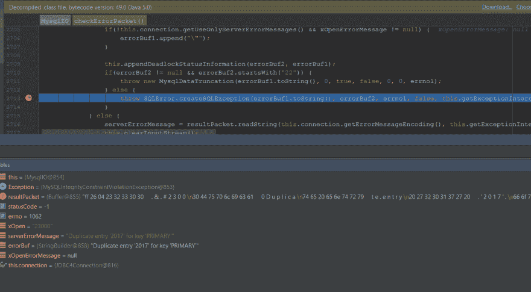
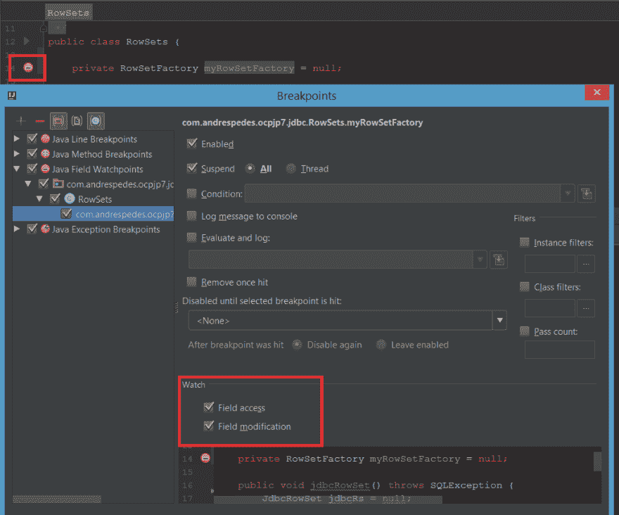
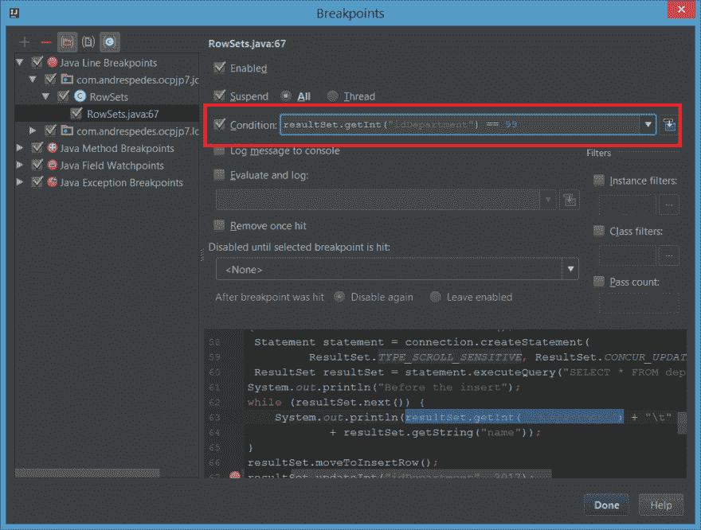
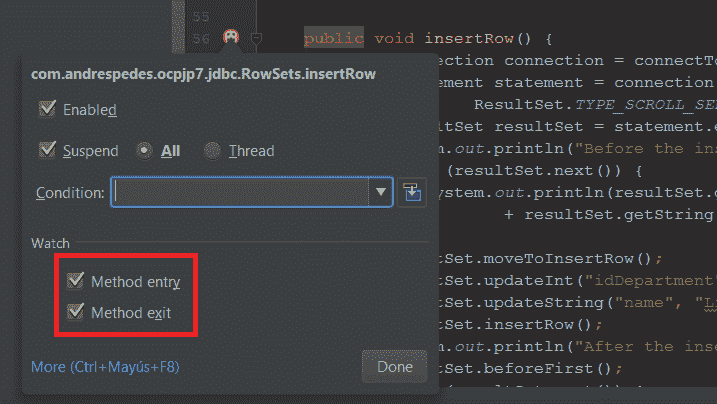
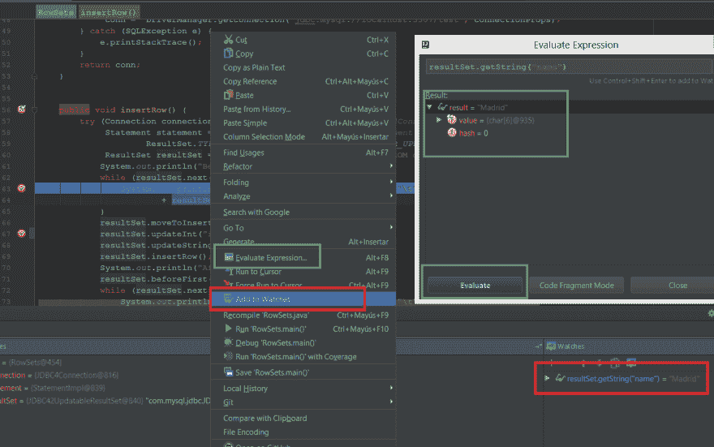

# 像冠军一样调试

> 原文：<https://dev.to/pedes/debug-like-a-champion>

[T2】](https://res.cloudinary.com/practicaldev/image/fetch/s--_CKvpWps--/c_limit%2Cf_auto%2Cfl_progressive%2Cq_auto%2Cw_880/https://thepracticaldev.s3.amazonaws.com/i/5s8pl0776n81i7fux36o.jpg)

正如帕累托定律所说:软件开发是 20%的时间开发，80%的时间调试。

想象一下，如果您缩短调试时间并使调试过程更有效，找到代码中问题的根本原因或理解算法的工作流程，您会变得多么强大。

磨砺这一关键技能并成为一名出色的开发人员来发现“意想不到的功能”也就是 bug 将是一件非常棒的事情。

调试不仅仅是放一些断点，让程序碰到它们。

### **“Java 调试”是如何工作的？**

当 JVM 运行时，可以启动 Java 调试会话，并通过 JDWP 协议与 JVM 通信。

这个 JDWP (Java Debug Wire Protocol)描述了被调试程序和调试器之间的调试信息和请求的格式。

这里的“调试器”可以是最基本的，JDB (Java 调试器)，它是一个简单的命令行，提供了一个检查和调试本地或远程 JVM 的接口。

此外，它也可以是一个 IDE 调试器，因此您的 IntelliJ | Eclipse | Netbeans 调试器是您的 IDE 的典型，它提供了一个 GUI 来通过 JVM TI (JVM 工具接口)与 JVM 进行通信，这就是为什么每个 IDE 调试器都彼此有很大的不同，尽管它们必须实现相同的接口。

因此，调试它的正常流程可能如下所示:

*   在异常或错误工作流发生之前设置断点。
*   之后设置另一个断点，以确保一切正常。
*   中间发生的事让你失去理智。

让我们从我最喜欢的高级技术开始，在异常中设置断点！之前没有，之后也没有。

### **异常断点**

如果您在运行时遇到一些未检查的异常或错误，您应该放置一个 Java 异常断点并查看异常代码。
[T3】](https://res.cloudinary.com/practicaldev/image/fetch/s--dNGvDUh5--/c_limit%2Cf_auto%2Cfl_progressive%2Cq_auto%2Cw_880/https://thepracticaldev.s3.amazonaws.com/i/nbdw5sv2cdncm300disd.png)

异常启动后，您可以在异常出现之前看到代码内部和对象的状态。您将到达抛出异常的确切位置。

[T2】](https://res.cloudinary.com/practicaldev/image/fetch/s--_YDVtPzP--/c_limit%2Cf_auto%2Cfl_progressive%2Cq_auto%2Cw_880/https://thepracticaldev.s3.amazonaws.com/i/sc20xpz836or7dlv0c70.png)

### **观察点**

我们可以在类的成员上设置一个观察点，而不是执行每一个执行步骤并观察变量值如何变化——这个调试点将向我们显示这个成员何时被访问或修改。

[T2】](https://res.cloudinary.com/practicaldev/image/fetch/s--jyh076K9--/c_limit%2Cf_auto%2Cfl_progressive%2Cq_auto%2Cw_880/https://dzone.com/storage/temp/3135361-watchpoint.png)

您可以通过在声明成员的行的左侧空白区域中单击来设置观察点。

当您知道达到执行点所需的条件时，这非常有帮助。您应该在断点属性中选中该条件的复选框，并编写一个布尔表达式——当该表达式返回 true 时，断点将命中。

[T2】](https://res.cloudinary.com/practicaldev/image/fetch/s--IJLSsdPy--/c_limit%2Cf_auto%2Cfl_progressive%2Cq_auto%2Cw_880/https://dzone.com/storage/temp/3135362-conditional-bp.png)

### **方法断点**

这是一个神奇的工具。您应该设置一个方法断点，并在方法进入或退出时观察程序的状态，而不是将断点放在方法的第一行和最后一个或 return 语句中。

[T2】](https://res.cloudinary.com/practicaldev/image/fetch/s--zG5AVgsX--/c_limit%2Cf_auto%2Cfl_progressive%2Cq_auto%2Cw_880/https://dzone.com/storage/temp/3135369-method-bp.png)

### **观看表情**

你甚至可能希望看到程序的一个特定值，但是这个值可能是一个布尔表达式，也可能是代码中某个对象持有的一个原始值。

[T2】](https://res.cloudinary.com/practicaldev/image/fetch/s--SU7zLQQ8--/c_limit%2Cf_auto%2Cfl_progressive%2Cq_auto%2Cw_880/https://dzone.com/storage/temp/3135372-watch-exp.png)

为此，请选择您想要监视的那段代码。在本例中，它是 resultSet.getString("name ")。这只是因为我想看看这个国家的名称是如何变化的。

当您没有类成员来设置观察点时，这可以帮助您，因为它可以被视为一个临时的局部变量观察点。

### **注释**

您可以自定义断点集，以使调试过程更快、更有效。尝试探索你的 IDE，你会掌握它的。即使抛出了运行时异常，您也可以完全控制 JVM 的执行。

还有其他想法吗？分享在评论里！