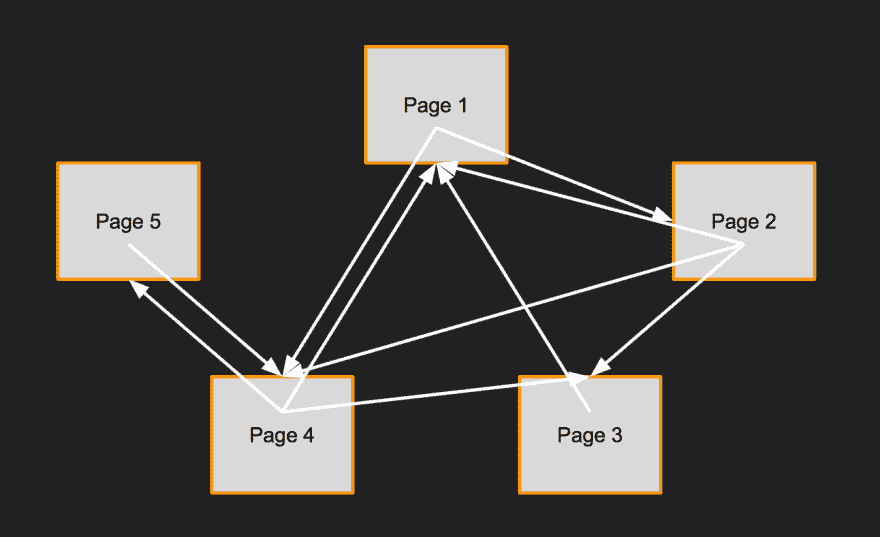
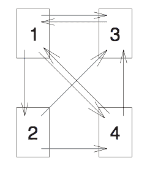
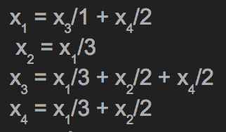
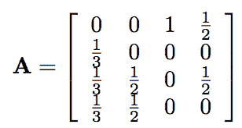

# 解密 PageRank 算法

> 原文：<https://dev.to/sishaarrao/demystifying-the-pagerank-algorithm>

PageRank 可以说是当今最广泛使用和最有影响力的算法——你每天都有可能使用它几十次。在这篇文章中，我希望不仅能解释什么是 PageRank 以及它是如何变得如此有影响力的，还能解释驱动它的矩阵/线性代数。我创建了[一个简单的 Python+Shell 演示](https://github.com/SishaarRao/PageRank)，你可以看看真实的 PageRank！

## 互联网的石器时代——搜索引擎是如何诞生的

从前，如果你想访问一个网页，你必须知道它的地址。你能想象那会有多令人沮丧吗？你几乎只能通过口口相传找到新的网站。
 
但是后来[阿奇](https://en.wikipedia.org/wiki/Archie_search_engine)说“让世界上第一个搜索引擎出现吧”

这些是如何工作的？世界上最早的搜索引擎或多或少遵循相同的过程:
1)爬行:获取域名/信息列表:
整合所有网站数据以供以后搜索的工具被称为[网络爬虫。](https://www.sciencedaily.com/terms/web_crawler.htm)这个家伙会找到每一个网站，然后仔细阅读页面上的链接，全面了解里面到底有什么。
2)索引:搜索(通常是 grepping)并找到相关信息:
该过程搜索网络爬虫找到的所有页面，并将匹配搜索查询的页面返回给你。例如，如果您的查询是“cat ”,网络爬虫将获取您的每一个网页，索引器将解析这些网页以返回带有关键字“cat”的页面

#### 这些早期搜索引擎的优点

互联网对普通人来说更容易接近，也更有用。他们现在可以从以前从来不知道的网站上找到新信息。因此，互联网的发展和使用呈爆炸式增长。

#### 这些早期搜索引擎的缺点

找到你想要的东西太难了。索引器将简单地返回包含查询的任何页面。查询“cat”可以返回卡特彼勒的网页。你必须点击多个链接才能找到你想要的。

## 为什么大家都知道 Google？

1996 年，斯坦福大学的两名博士生拉里·佩奇和 T2·谢尔盖·布林想要创建一个能够为用户提供相关查询结果的搜索引擎。他们接着设计了 **PageRank 算法**，正是为了实现这一点。他们的搜索引擎，最初被称为 BackRub，开始流行起来，因为出于某种原因，它会找到你正在搜索的东西。他们不仅用网络爬虫和索引器组件创建了一个搜索引擎，而且用 PageRank 作为筛选结果并找到最相关的第三步，从而实现了这一点。剩下的就是历史了。

## 那么什么是 PageRank 算法呢？

PageRank 算法:*给定一个由链接指向彼此的网站组成的网络，确定每个网站的重要性*
我们所说的网站网络是什么意思？沿着下面的东西:
 
在这个例子中(它被我创建的演示程序[所利用)我们可以看到第 1 页有到第 2 页& 4 的链接，第 2 页有到第 1、4、& 3 等的链接。](https://github.com/SishaarRao/PageRank)

然而，主要的问题是，我们如何确定“重要性”？我们如何知道哪个页面与查询相关？当我第一次想到这个问题时，我想出了几个办法。以下是他们错的原因:

#### 方法一:利用人工智能分析查询和网页中的文本

**为什么这不可行**:虽然这对于一两页来说可能是可行的，但是它的成本太高了。[超过 10 亿的页面](http://www.internetlivestats.com/total-number-of-websites/)，确定每个页面的重要性需要很长时间。

#### 方法二:简单统计一个关键词出现的次数

**为什么不能这样做**:最相关的页面并不总是那些提到查询次数最多的页面。不相关的网站可以通过在他们的页面上粘贴这个词一百万次来增加他们的流量。当我搜索“鞋子”时，我希望看到耐克、阿迪达斯和新百伦。

#### PageRank 使用的方法:统计指向该网页的链接数量

这个网站被网络中的其他人引用得越多，它就越有可能是重要的。我们可以认为这是一种“民主投票”制度。这个系统的关键是**每一页都有一个投票，这个投票是根据它的重要性来加权的**

## 技术细节+线性代数基础

给定网络中的一个页面，我们将计算当前页面拥有多少到其他页面的链接。然后，我们将取这个数的倒数，得到当前页面的加权投票中委托给其他页面的部分。让我们以一个 4 页的网络为例，其中的链接看起来像这样:

我们可以用一个方程组来表达每一页的意义，其中 Xn 是第 n 页。第 1 页有从第 3 页到第 4 页的链接(也就是第 3 页有到第 1 页的链接，第 4 页也有到第 1 页的链接)。因为第 3 页只指向一页，所以它把全部选票投给了第 1 页。因为第 4 页指向两页，所以它为第 1 页投了半票。我们继续这个过程，为网络中的其余页面创建方程组:

我们可以继续蛮力通过这个 SOE，但没有人有时间。如果我们仔细观察，我们可以观察到，这个系统中的所有变量都是彼此相关地定义的:即，Xn 被赋予了与 n 的不同值相关的某个值，并且 n 的那些不同值可以被定义为与 n 的原始值相关。因此，我们可以用矩阵形式 **Ax = x** 来表示这个方程组。矩阵 A 将用系统中的系数填充，矩阵 X 用系数 X1，X2，X3，X4 填充。

[T9】](https://res.cloudinary.com/practicaldev/image/fetch/s--XiQEXiP6--/c_limit%2Cf_auto%2Cfl_progressive%2Cq_auto%2Cw_880/http://i.imgur.com/nvcMVjG.png)

注意:矩阵 A 中的所有列加起来都是 1，因为每页可以投*总共一票*，而行是每页收到的加权投票的总和。此外，上标“T”表示转置，因为矩阵 X 是 4x1 而不是 1x4 矩阵。

所以现在我们已经把方程组转化成了矩阵系统。如何帮助我们找到系统的解(即 x 矩阵)？这就是特征值和特征向量出现的地方。

#### 特征值概述&特征向量

*特征向量*是向量的特殊例子，当乘以一个变换矩阵(在我们的例子中矩阵是 A)时，向量不会改变它的方向。然而，它可以改变尺度，我们称之为*特征值*的因子。这些特殊情况可以用等式**Ax = x**来表示，其中**是我们的特征值， **x** 是特征向量。注意:在这种情况下，向量是矩阵的另一个名称。**

在我们的系统中 **Ax = x** 我们说*嘿！解矩阵 X 是系统的一个特征向量，也就是说，当特征值等于 1 时，它就是特征向量！！！*
然后我们可以做以下步骤，这些步骤是求解特征向量的特征:
1)Ax = x
2)Ax-x = 0
3)(A-I)x = 0<-其中 I 是单位矩阵

从这里，当φ= 1 时，我们可以使用[行缩减](https://www.khanacademy.org/math/linear-algebra/vectors-and-spaces/matrices-elimination/v/matrices-reduced-row-echelon-form-1)来求解我们的矩阵 x。在这个特殊的例子中，我们得到如下矩阵作为我们的解 x:

正如我们所看到的，我们发现第 1 页是我们最相关的排名。考虑到第 3 页有更多的链接指向它，这看起来似乎是违反直觉的，但是请记住，*投票是基于加权重要性的*。

## 谷歌的天才

学习 PageRank 算法的工作原理应该会让每个人肃然起敬。他们使用 PageRank 的规模比我提供的例子要大得多。更不用说他们每天在几分之一秒内处理数百万个查询。

谷歌背后的天才之处在于，他们利用数学原理为当时每个人都面临的问题提供了解决方案。展望未来，当我审视我正在做的工作时，它帮助我后退一步，思考:**我在试图解决什么？我想要完成什么？我的工作如何为人们提供价值？**这个算法是对这种心态的赞美，我真诚地相信，如果你以这种方式工作，无论你在哪个领域，你都会获得成功。

我希望这篇文章有助于理解 PageRank 算法。查看我创建的 Python+Shell 演示！最重要的是，如果你觉得我犯了任何事实错误，或者如果有任何我可以澄清/扩展/修改以改进这篇文章的地方，请评论或联系我！