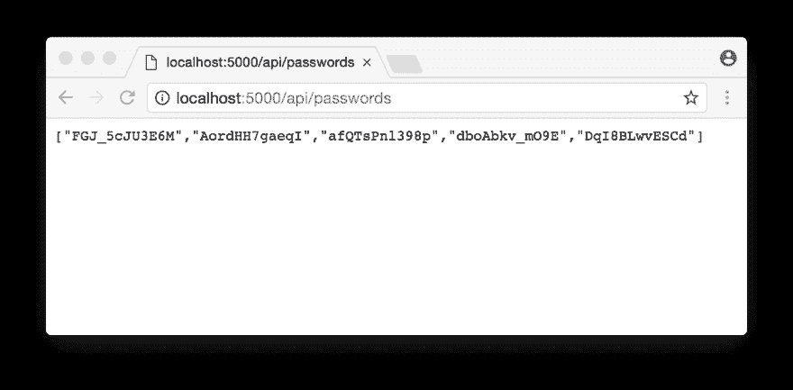

# 部署反应并向 Heroku 表达

> 原文：<https://dev.to/dceddia/deploy-react-and-express-to-heroku-5fd8>

你有一个 React 应用，和一个用 Express 或其他语言编写的 API 服务器。现在，如何将它们都部署到服务器上呢？

有几种方法可以做到这一点:

*   **将它们放在一起**–Express 和 React 文件位于同一台机器上，Express 有双重功能:它服务于 React 文件，也服务于 API 请求。
    *   例如在端口 80 上运行 Express 的数字海洋 VPS
*   **将它们分开**–在一台机器上托管 Express API，在另一台机器上托管 React app。
    *   例如，由亚马逊 S3 服务的 React 应用程序、在数字海洋 VPS 上运行的 API 服务器
*   **将 API 置于代理之后**–Express 和 React 应用程序文件位于同一台机器上，但由不同的服务器提供服务
    *   例如，NGINX 服务器将 API 请求代理到 API 服务器，并且还提供 React 静态文件

本文将介绍如何将它们结合在一起。我们将构建 Express 服务器，除了提供 API 之外，还为 React 的静态文件提供服务，然后将其部署到 [Heroku](https://heroku.com) 。Heroku 易于部署，并且可以免费使用。

### 做一个英雄帐

如果你还没有，请点击[这里](https://heroku.com)注册。它是免费的。

### 安装 Heroku 工具带

Heroku 提供了一个命令行命令，他们称之为“工具箱”按照这里的说明[进行安装。(在有](https://devcenter.heroku.com/articles/heroku-cli)[自制](https://brew.sh/)的 Mac 上，就`brew install heroku`)。

## App

我们将建立一个密码生成器。每次你加载应用程序或点击获取更多，你会得到 5 个随机密码。

[T2】](https://res.cloudinary.com/practicaldev/image/fetch/s--5Brwt1oC--/c_limit%2Cf_auto%2Cfl_progressive%2Cq_66%2Cw_880/https://daveceddia.cimg/password-generator.gif)

## 创建快递 App

创建一个包含所有内容的父目录。叫它`rando`或者随便你怎么叫。

```
$ mkdir rando; cd rando 
```

Enter fullscreen mode Exit fullscreen mode

用纱线或 NPM 初始化项目:

```
$ yarn init -y
  # or npm init -y 
```

Enter fullscreen mode Exit fullscreen mode

我们需要 2 个包:Express 本身，和一个[密码生成器](https://www.npmjs.com/package/password-generator)。现在就安装:

```
$ yarn add express password-generator 
```

Enter fullscreen mode Exit fullscreen mode

创建一个名为`index.js`的文件，它将成为 Express 应用程序，并输入:

```
const express = require('express');
const path = require('path');
const generatePassword = require('password-generator');

const app = express();

// Serve static files from the React app
app.use(express.static(path.join(__dirname, 'client/build')));

// Put all API endpoints under '/api'
app.get('/api/passwords', (req, res) => {
  const count = 5;

  // Generate some passwords
  const passwords = Array.from(Array(count).keys()).map(i =>
    generatePassword(12, false)
  )

  // Return them as json
  res.json(passwords);

  console.log(`Sent ${count} passwords`);
});

// The "catchall" handler: for any request that doesn't
// match one above, send back React's index.html file.
app.get('*', (req, res) => {
  res.sendFile(path.join(__dirname+'/client/build/index.html'));
});

const port = process.env.PORT || 5000;
app.listen(port);

console.log(`Password generator listening on ${port}`); 
```

Enter fullscreen mode Exit fullscreen mode

我们还需要 package.json 中的“启动”脚本，以便 Heroku 知道如何启动应用程序。打开`package.json`，在底部添加一个脚本部分。完整的文件应该是这样的:

```
{
  "name": "rando",
  "version": "1.0.0",
  "main": "index.js",
  "license": "MIT",
  "dependencies": {
    "express": "^4.15.3",
    "password-generator": "^2.1.0"
  },
  "scripts": {
    "start": "node index.js"
  }
} 
```

Enter fullscreen mode Exit fullscreen mode

### 测试一下

在你前进的过程中，确保事情正常进行总是好的。比到最后发现什么都没用要好得多。所以，我们来试试吧。

通过运行
启动快速应用程序

```
$ yarn start 
```

Enter fullscreen mode Exit fullscreen mode

打开浏览器，进入[http://localhost:5000/API/passwords](http://localhost:5000/api/passwords)。您应该会看到类似这样的内容:

[T2】](https://res.cloudinary.com/practicaldev/image/fetch/s--jJNPuL3H--/c_limit%2Cf_auto%2Cfl_progressive%2Cq_auto%2Cw_880/https://daveceddia.cimg/password-generator-working.png)

## 建立 Heroku

现在，我们将应用程序部署到 Heroku，确保它正常工作，然后我们将添加 React。

### 去初始化

Heroku 需要您的项目有一个 Git 存储库，所以我们将创建一个 Git 存储库和一个`.gitignore`文件来忽略 node_modules，然后提交代码:

```
$ git init
$ echo node_modules > .gitignore
$ git add .
$ git commit -m "Initial commit" 
```

Enter fullscreen mode Exit fullscreen mode

现在我们准备好迎接赫罗库了。运行其“创建”命令:

```
$ heroku create 
```

Enter fullscreen mode Exit fullscreen mode

你会看到这样的东西:

[T2】](https://res.cloudinary.com/practicaldev/image/fetch/s--gcNmJqgY--/c_limit%2Cf_auto%2Cfl_progressive%2Cq_auto%2Cw_880/https://daveceddia.cimg/heroku-created.png)

为了让它工作，我们只需要通过运行:
来提升我们的代码

```
$ git push heroku master 
```

Enter fullscreen mode Exit fullscreen mode

它会打印出一堆东西，然后应用程序就可以运行了。最后一行会告诉你这个应用的网址:

[T2】](https://res.cloudinary.com/practicaldev/image/fetch/s--83VQ-RU7--/c_limit%2Cf_auto%2Cfl_progressive%2Cq_auto%2Cw_880/https://daveceddia.cimg/deployed-heroku-url.png)

现在你可以去`<your url>/api/passwords`看看它能不能工作。

呜哇！你已经有一个应用程序在真实的互联网上运行了！只是它还不太好用。现在让我们添加一个 React 前端。

## 创建 React App

我们将使用 [Create React App](https://github.com/facebookincubator/create-react-app) 生成一个项目。还记得我们决定将 React 应用程序放在“客户端”文件夹中吗？(当我们设置 Express 指向静态资产的“client/build”时，我们确实这样做了)。

如果您还没有安装 Create React 应用程序，请先安装:

```
$ yarn global add create-react-app
# or npm install -g create-react-app 
```

Enter fullscreen mode Exit fullscreen mode

在 Express app 目录下生成 React app:

```
$ create-react-app client 
```

Enter fullscreen mode Exit fullscreen mode

如果我们像这样在 package.json 中添加一个“代理”键，Create React App 会将 API 请求从 React App 代理到 Express App:

```
"proxy": "http://localhost:5000" 
```

Enter fullscreen mode Exit fullscreen mode

这个放在 Express app 的 package.json 里的`client/package.json`、*而不是*，部署后会被 Heroku 忽略。

打开`src/App.js`并将其替换为:

```
import React, { Component } from 'react';
import './App.css';

class App extends Component {
  // Initialize state
  state = { passwords: [] }

  // Fetch passwords after first mount
  componentDidMount() {
    this.getPasswords();
  }

  getPasswords = () => {
    // Get the passwords and store them in state
    fetch('/api/passwords')
      .then(res => res.json())
      .then(passwords => this.setState({ passwords }));
  }

  render() {
    const { passwords } = this.state;

    return (
      <div className="App">
        {/* Render the passwords if we have them */}
        {passwords.length ? (
          <div>
            <h1>5 Passwords.</h1>
            <ul className="passwords">
              {/*
                Generally it's bad to use "index" as a key.
                It's ok for this example because there will always
                be the same number of passwords, and they never
                change positions in the array.
              */}
              {passwords.map((password, index) =>
                <li key={index}>
                  {password}
                </li>
              )}
            </ul>
            <button
              className="more"
              onClick={this.getPasswords}>
              Get More
            </button>
          </div>
        ) : (
          // Render a helpful message otherwise
          <div>
            <h1>No passwords :(</h1>
            <button
              className="more"
              onClick={this.getPasswords}>
              Try Again?
            </button>
          </div>
        )}
      </div>
    );
  }
}

export default App; 
```

Enter fullscreen mode Exit fullscreen mode

如果你愿意，你也可以更新 CSS(在`src/App.css` ):

```
.App {
  text-align: center;
  font-family: "Courier New", monospace;
  width: 100%;
}

h1 {
  font-weight: normal;
  font-size: 42px;
}

.passwords {
  list-style: none;
  padding: 0;
  font-size: 32px;
  margin-bottom: 2em;
}

.more {
  font-size: 32px;
  font-family: "Courier New", monospace;
  border: 2px solid #000;
  background-color: #fff;
  padding: 10px 25px;
}
.more:hover {
  background-color: #FDD836;
}
.more:active {
  background-color: #FFEFA9;
} 
```

Enter fullscreen mode Exit fullscreen mode

现在通过运行`client`文件夹中的`yarn start`来启动 React 应用程序。

确保 Express 应用程序也在运行:也从它的文件夹中运行`yarn start`。

转到 [http://localhost:3000](http://localhost:3000) 应用应该可以工作了！现在我们可以把整件事部署到 Heroku。

## 部署到 Heroku

当您使用`git push heroku master`命令部署应用程序时，git 会将所有签入的文件复制到 Heroku。现在有两个复杂因素:

*   我们需要签入新的`client`代码
*   Express 依赖于`client/build`中的*构建的*客户端代码，这是我们还没有的，我们不希望将其签入 git。

我们要做的是告诉 Heroku 在我们推送代码后构建 React 应用程序，我们可以通过在顶级(Express 应用程序的)package.json 中添加“heroku-postbuild”脚本来实现这一点。

### 使用纱线

如果您使用的是 Yarn，脚本如下:

```
"scripts": {
  "start": "node index.js",
  "heroku-postbuild": "cd client && yarn --production=false && yarn run build"
} 
```

Enter fullscreen mode Exit fullscreen mode

这告诉 Heroku“嘿，在你完成你所做的事情之后，进入客户端文件夹并构建我的 React 应用程序。”`yarn run build`脚本将启动 Create React 应用程序的生产构建，这将把它的输出文件放在`client/build`文件夹中，以便 Express 可以找到它们。

旗可能看起来很奇怪。它在那里是因为默认情况下，yarn 不会在生产中安装 devDependencies，我们需要这些(特别是“react-scripts”)来构建 react 应用程序。

一旦做出了更改，将所有内容添加到 git 中(从顶层的`rando`目录运行，而不是在`client`中运行):

### 利用 NPM

如果你使用的是 NPM，这个脚本看起来应该是这样的:

```
"scripts": {
  "start": "node index.js",
  "heroku-postbuild": "cd client && npm install --only=dev && npm install && npm run build"
} 
```

Enter fullscreen mode Exit fullscreen mode

这告诉 Heroku“嘿，在你完成你所做的事情之后，进入客户端文件夹并构建我的 React 应用程序。”`npm run build`脚本将启动 Create React 应用程序的生产构建，这将把它的输出文件放在`client/build`文件夹中，以便 Express 可以找到它们。

调用`npm install`两次并没有错:默认情况下，`npm install`会跳过“devDependencies ”,但是我们需要它们，因为“react-scripts”在那里，而`npm install --only-dev`命令会安装这些 devDependenices。我们*也*需要生产“依赖”,所以这就是我们第二次运行`npm install`的原因。

感谢马修·洛克和巴巴杰德·伊比亚约在评论中讲述了如何与 NPM 合作。

## 部署时间

剩下的就是提交文件了……

```
$ git add .
$ git commit -m "Ready for awesome" 
```

Enter fullscreen mode Exit fullscreen mode

然后部署 app:

```
$ git push heroku master 
```

Enter fullscreen mode Exit fullscreen mode

它再次打印出你的应用程序的主机名。我的名字是 https://glacial-brook-33351.herokuapp.com/。去那里试试吧！

恭喜你，你已经有了一个生产中的 React + Express 应用程序；)

## 获取代码

完整的应用程序可以在 Github 上找到[，那里的自述文件解释了如何部署它。](https://github.com/dceddia/rando)

如果你想使用 NPM，用`git checkout npm`检查`npm`分支。从那里开始，部署会略有不同——运行`git push heroku npm:master`来部署主节点的 npm 分支。

[Deploy React and Express to Heroku](https://daveceddia.com/deploy-react-express-app-heroku/)最初由戴夫·塞德迪亚于 2017 年 6 月 8 日在[戴夫·塞德迪亚](https://daveceddia.com)发布。

[代码项目](http://www.codeproject.com)