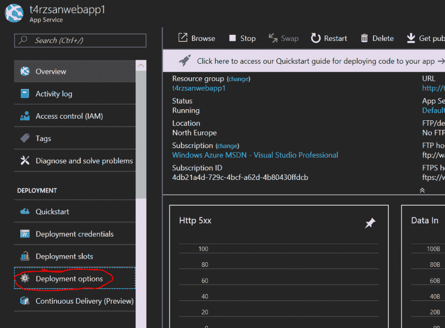
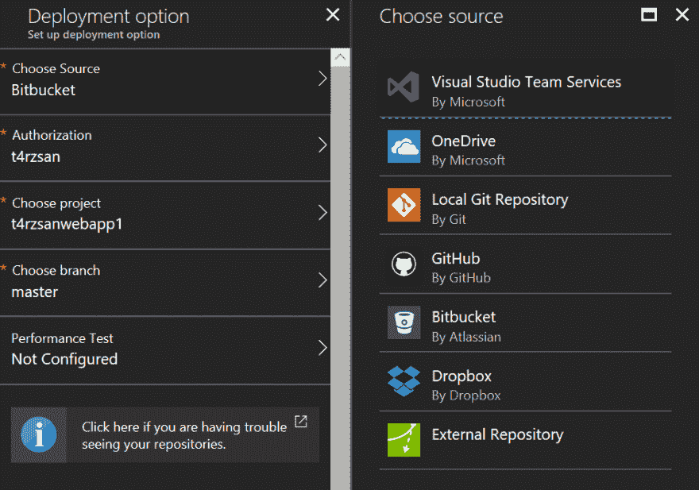
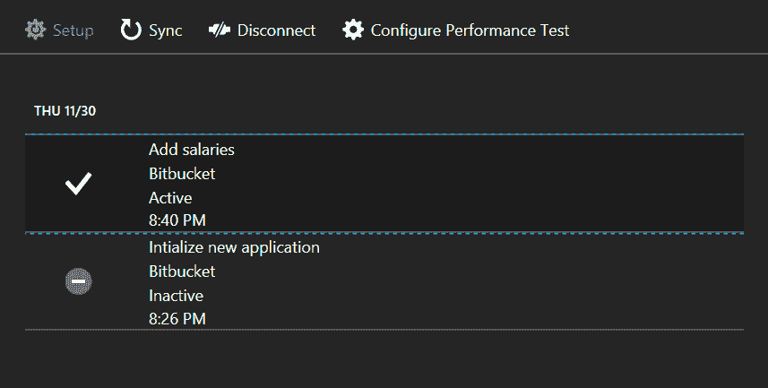

# 将 ASP.NET 核心应用从 Bitbucket 部署到 Azure

> 原文：<https://dev.to/t4rzsan/deploying-aspnet-core-applications-from-bitbucket-to-azure-24f>

*这篇文章最初出现在我的[个人博客](http://leruplund.dk/2017/11/30/deploying-asp-net-core-applications-from-bitbucket-to-azure/)上。*

> 把最枯燥的工作交给你最懒的员工，他们会自动完成。我的老板

没错。我很懒。我讨厌重复的任务。作为一名开发人员，您可能也有同样的感觉。

这些重复性任务之一是部署

有许多方法和框架来建立自动化的构建和部署。他们中的一些人几乎可以做任何事情，甚至可以在你等待建造的时候给你煮咖啡。

最近在一个小的 ASP.NET 核心网站工作时，我发现微软 Azure 有一个非常简单的部署工具，可以从你最喜欢的代码库构建和部署到 Azure web 应用程序。我特别高兴地发现它支持 BitBucket，尽管任何不在 Github 上的东西看起来都不酷。

嗯，我太老了，不酷了，我喜欢比特桶，所以容忍我。

## 设置

设置非常容易。进入[新的 Azure 门户](http://portal.azure.com)并创建新的 web 应用程序。

创建 web 应用程序后，转到您的 web 应用程序并选择“部署选项”。

[T2】](https://res.cloudinary.com/practicaldev/image/fetch/s--8f1f-bLc--/c_limit%2Cf_auto%2Cfl_progressive%2Cq_auto%2Cw_880/http://leruplund.dk/wp-content/uploads/2017/11/azure-deployment-options.png)

接下来的步骤允许您登录到您的源代码提供者(即 Bitbucket)并选择项目和分支(通常是主分支)。这里的美妙之处在于 Azure 支持从各种来源提取代码，如 Dropbox、Onedrive、Github，当然还有 Bitbucket。

[T2】](https://res.cloudinary.com/practicaldev/image/fetch/s--_9SXeeKC--/c_limit%2Cf_auto%2Cfl_progressive%2Cq_auto%2Cw_880/http://leruplund.dk/wp-content/uploads/2017/11/azure-deployment-options-configure.png)

保存设置后，Azure 将获取您的最后一次提交并开始构建。您可以通过再次单击“部署选项”来查看进度。

[T2】](https://res.cloudinary.com/practicaldev/image/fetch/s--DFs0IbHh--/c_limit%2Cf_auto%2Cfl_progressive%2Cq_auto%2Cw_880/http://leruplund.dk/wp-content/uploads/2017/11/azure-deployment-progress.png)

## 构建错误？

看起来微软最近刚刚升级了编译器，但我以前在构建新的 C#特性时遇到过问题，比如像这样的变量内联声明。

```
var salaries = new Dictionary<string, decimal>()
{
    { "Jakob", 10000000000 },
    { "Some other guy", 42 },
};

// Inlining variable declaration
if (salaries.TryGetValue("Jakob", out var salary))
{
    // Do something with salary.
} 
```

如果你遇到这个问题，你需要做的就是添加 Nuget 包[微软。Net.Compilers](https://www.nuget.org/packages/Microsoft.Net.Compilers/) 添加到您的项目中。这将确保您的项目是用最新的 C#编译器编译的。

## 结论

这种部署极其简单易行，是好事。另一方面，它不会在您的项目中运行任何单元测试，它会直接部署到生产环境中，而不需要任何测试或准备。对于较小的非关键站点，您可以考虑这种解决方案。