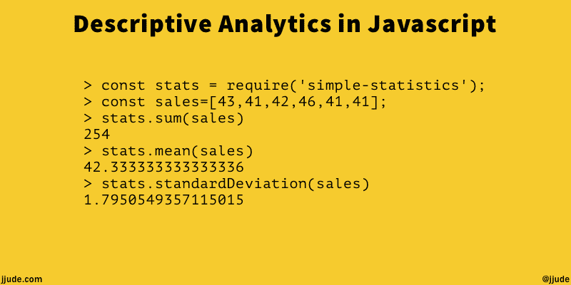

# Javascript 中的描述分析

> 原文：<https://dev.to/jjude/descriptive-analytics-in-javascript>

*这篇文章发表在我的[博客](https://jjude.com/descriptive-analytics-in-js/)T3 上*

[T2】](https://res.cloudinary.com/practicaldev/image/fetch/s--uZ0CggWW--/c_limit%2Cf_auto%2Cfl_progressive%2Cq_auto%2Cw_880/https://cdn.jjude.com/desc-analytics.png)

描述性分析通常是数据分析练习的第一步。顾名思义，它**描述了**一个数据集。它回答了这个问题，“**发生了什么**”。

任何数据集都可以用以下方式**描述**:

*   汇总因素，如均值和众数；
*   像标准差这样的扩散因子；
*   形状或模式因素，如标准分布。

让我们用一个例子来说。假设以下是两位销售经理在过去 6 周的单位销售数据:

*   43,41,42,46,41,41
*   32,34,68,62,28,30

这些数字说明了什么？总的来说，他们都卖出了 254 件商品，这意味着他们都具有同等的竞争力。他们的平均分是 42.3，这再次表明他们的能力相当。

标准差描绘了一幅不同的画面。**标准差测量平均值**附近的数据浓度。第一个经理的标准差是 1.8，而第二个是 16.2。这是什么意思？第一位经理每周都能持续达到目标，但第二位经理却不行。如果其他一切保持不变，那么这个数据表明第一个销售经理比第二个更可靠。

现在让我们来看看使用 **Javascript** 为任何数据集计算这些描述性分析。网络上充斥着 Python 教程，却没有多少 Javascript。如果开发人员已经在使用 Node.js 开发 web 应用程序，或者他们使用 Javascript 来设计前端开发，他们不应该只使用另一种语言来计算统计数据。

为此，我们将使用两个包。第一个， [**csvtojson**](https://www.npmjs.com/package/csvtojson) ，是读取 csv 记录，转换成 json 值。第二个， [**简单-统计**](https://www.npmjs.com/package/simple-statistics) ，是计算统计。请参考[文档](https://simplestatistics.org/docs/)了解该套件的所有特性。在这篇文章中，我们只使用基本功能。

简单统计接受一组值并计算统计数据。计算上述两个销售额的总和、平均值和标准偏差的过程如下。

```
$ node
> const stats = require('simple-statistics');
> const first=[43,41,42,46,41,41];
> const second=[32,34,68,62,28,30];
> stats.sum(first)
254
> stats.sum(second)
254
> stats.mean(first)
42.333333333333336
> stats.mean(second)
42.333333333333336
> stats.standardDeviation(first)
1.7950549357115015
> stats.standardDeviation(second)
16.224124698183942 
```

Enter fullscreen mode Exit fullscreen mode

当我们学习一门学科时，我们经常得到排列整齐的例子。这就像去动物园一样。但是现实世界是复杂的。

最近，我分析了一家大型电子商务公司的销售数据。大约有 15 万项记录。我不能浏览这些数字来理解。我加载了所有的数据，并通过简单的统计软件包进行分析。它向我展示了现实世界中不同的销售数字与我们在学习中获得的整齐排列的值相比是如何不同的。

下面是我写的加载数据和描述数据的代码:

```
const csv = require('csvtojson');
const stats = require('simple-statistics');

let salesData = [];
let totalRows = 0;

const data = csv()
  .fromFile('sales.csv')
  .on('json', (jsonObj, rowIndex) => {
    totalRows = rowIndex;
    salesData.push(parseFloat(jsonObj['Sales'].replace(',', '')));
  })
  .on('done', () => {
    descriptiveStats();
    process.exit(1);
  });

function descriptiveStats() {
  console.log('descriptiveStats of ' + totalRows + ' rows');
  console.log('Min: ', stats.min(salesData));
  console.log('Max: ', stats.max(salesData));
  console.log('Mean : ', stats.mean(salesData));
  console.log('Median: ', stats.median(salesData));
  console.log('Mode: ', stats.mode(salesData));
  console.log('standardDeviation: ', stats.standardDeviation(salesData));
} 
```

Enter fullscreen mode Exit fullscreen mode

结果是:

```
Min:  -33116.58
Max:  70049.89
Mean:  316.117162163024
Median:  159.53
Mode:  0.01
standardDeviation:  777.6360644532846 
```

Enter fullscreen mode Exit fullscreen mode

销售引擎对他们来说完全是一团糟。每个描述性统计元素只说明一件事:他们的销售没有一致性。

一本理解描述性统计和一般数字的好书来自《经济学人》，书名很恰当，叫做[数字指南](https://www.amazon.com/dp/1576601447?tag=jjude-20)。如果你想理解标准差，读读[理解标准差](http://datapigtechnologies.com/blog/index.php/understanding-standard-deviation-2/)。

我将继续写关于使用 Javascript 的机器学习和数据分析。如果你对此感兴趣，请订阅我的博客。