# 设计模式:工厂模式，第 1 部分

> 原文：<https://dev.to/henriavo/design-patterns-factory-pattern-part-1-6k0>

大家好。在第四章[头先设计模式:一个大脑友好的指南](https://www.amazon.com/Head-First-Design-Patterns-Brain-Friendly/dp/0596007124/ref=sr_1_1?ie=UTF8&qid=1505068308&sr=8-1&keywords=head+first+design+patterns)中，我们学习了工厂模式。本文首先讨论了一个被称为“简单工厂”的编程习语，作为两个真正工厂模式的热身。第一个称为“工厂方法”，第二个称为“抽象工厂”。

让我们从介绍工厂模式正在解决的问题开始。当我们编写使用 java 关键字 *new* 的代码时，我们是在调用具体类的构造函数，实质上是在具体类上创建一个硬依赖。下面的代码片段显示了如何为三个不同的 duck 类创建具体的依赖关系，这可能会很快失控。(第 1 章讲了很多鸭子)。

[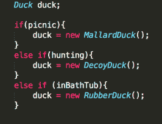T2】](https://res.cloudinary.com/practicaldev/image/fetch/s--HeRCfDw3--/c_limit%2Cf_auto%2Cfl_progressive%2Cq_auto%2Cw_880/https://henricodesjava.files.wordpress.com/2017/10/screen-shot-2017-10-22-at-4-47-35-pm1.png%3Fw%3D266%26h%3D203)

工厂模式可以帮助我们清理这些问题，并分离这些依赖关系。引入一个新的设计原则来帮助定义上面的设计错误。

**依赖倒置原则:**依赖抽象。不依赖于具体的类。

让我们举一个例子来帮助说明设计模式。我将在文中使用同一个比萨饼店的例子。假设我们有自己的披萨店，我们有一些代码来制作像这样的披萨。

[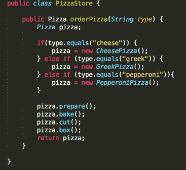T2】](https://res.cloudinary.com/practicaldev/image/fetch/s--phllLNZw--/c_limit%2Cf_auto%2Cfl_progressive%2Cq_auto%2Cw_880/https://henricodesjava.files.wordpress.com/2017/10/screen-shot-2017-10-23-at-10-38-08-pm2.png%3Fw%3D367%26h%3D337)

一旦我们开始添加新的 pizza 类型，这个类就很容易失去对 _if 语句的控制。_ 正如我们在前面章节中了解到的，我们需要确定代码的哪些部分可能会更改，哪些部分不会更改，并将它们分开。

[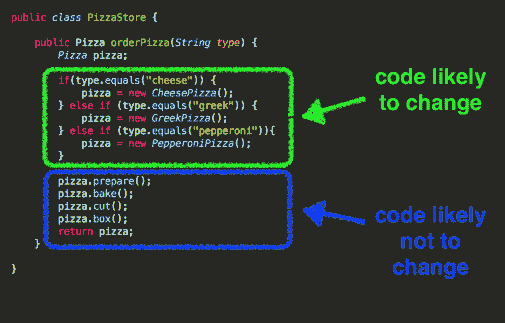T2】](https://res.cloudinary.com/practicaldev/image/fetch/s--U6c5ISzO--/c_limit%2Cf_auto%2Cfl_progressive%2Cq_auto%2Cw_880/https://henricodesjava.files.wordpress.com/2017/10/screen-shot-2017-10-23-at-10-52-43-pm.png%3Fw%3D505%26h%3D323)

工厂模式建议我们做的是移动所有可能改变的构造函数，并将它们放在自己的类中。此外，如果我们的比萨饼店需要能够创建不同类型的比萨饼，比如说，如果我们必须为纽约制作不同类型的比萨饼，并为芝加哥制作另一种不同类型的比萨饼(见下文)，该怎么办？

[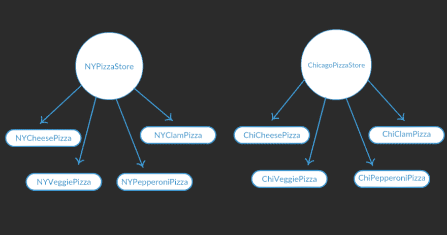T2】](https://res.cloudinary.com/practicaldev/image/fetch/s--8ap1T531--/c_limit%2Cf_auto%2Cfl_progressive%2Cq_auto%2Cw_880/https://henricodesjava.files.wordpress.com/2017/10/screen-shot-2017-10-24-at-11-40-17-am.png%3Fw%3D900)

我们将介绍的工厂模式允许我们组织客户端并将其从具体的类中分离出来。所有的工厂模式都封装了对象创建，但是让我们给出第一个工厂模式的正式定义。

**工厂方法模式:**定义创建对象的接口，但是让子类决定实例化哪个类。工厂方法让一个类将实例化推迟到子类。

让我们来看一个带有工厂方法模式设计的类图，用于我们的比萨饼店问题。

首先是一个称为“创建者类”的组的类图。这些是负责创建比萨饼的类。抽象创建器包含所有披萨创建之间的公共代码，即 prepare() bake() cut() box()方法。它还包含两个抽象方法 createPizza()和 orderPizza()。具体的创建者是我们使用 Java 关键字 *new* 和实例化类(称为产品类)的地方。

[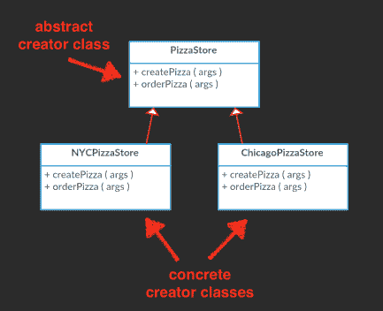T2】](https://res.cloudinary.com/practicaldev/image/fetch/s--d4pH7579--/c_limit%2Cf_auto%2Cfl_progressive%2Cq_auto%2Cw_880/https://henricodesjava.files.wordpress.com/2017/10/screen-shot-2017-10-25-at-12-42-17-pm.png%3Fw%3D433%26h%3D353)

接下来是产品类。这些是我们在具体的创建器中实例化的类。抽象产品作为一个通用类型，因此创建者不需要知道他们正在制作哪种比萨饼，他们只需要知道它是比萨饼类型。

[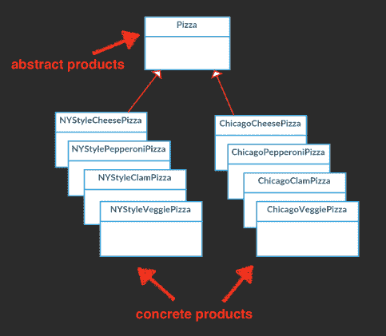T2】](https://res.cloudinary.com/practicaldev/image/fetch/s--eGi_AhEn--/c_limit%2Cf_auto%2Cfl_progressive%2Cq_auto%2Cw_880/https://henricodesjava.files.wordpress.com/2017/10/screen-shot-2017-10-25-at-12-49-12-pm.png%3Fw%3D483%26h%3D421)

现在让我们看一下纽约和芝加哥比萨饼店的工厂方法模式实现的一些代码。

抽象创建者:

[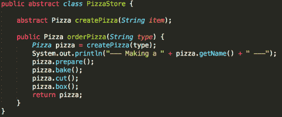T2】](https://res.cloudinary.com/practicaldev/image/fetch/s--ALkQkPD_--/c_limit%2Cf_auto%2Cfl_progressive%2Cq_auto%2Cw_880/https://henricodesjava.files.wordpress.com/2017/10/screen-shot-2017-10-29-at-11-14-29-am.png%3Fw%3D479%26h%3D200)

纽约市混凝土制造商:

[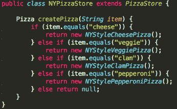T2】](https://res.cloudinary.com/practicaldev/image/fetch/s--7_z_EJjg--/c_limit%2Cf_auto%2Cfl_progressive%2Cq_auto%2Cw_880/https://henricodesjava.files.wordpress.com/2017/10/screen-shot-2017-10-29-at-11-16-03-am.png%3Fw%3D346%26h%3D214)

芝加哥混凝土制造商:

[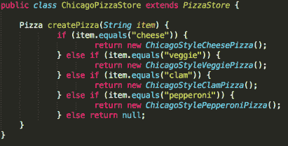T2】](https://res.cloudinary.com/practicaldev/image/fetch/s--BiahKOzR--/c_limit%2Cf_auto%2Cfl_progressive%2Cq_auto%2Cw_880/https://henricodesjava.files.wordpress.com/2017/10/screen-shot-2017-10-29-at-11-20-10-am.png%3Fw%3D411%26h%3D209)

接下来，我们的产品类组。首先是抽象产品。请注意，所有披萨之间的通用代码都保存在这里。显然，我们没有真正的实现，所以我们只是打印到标准输出。

[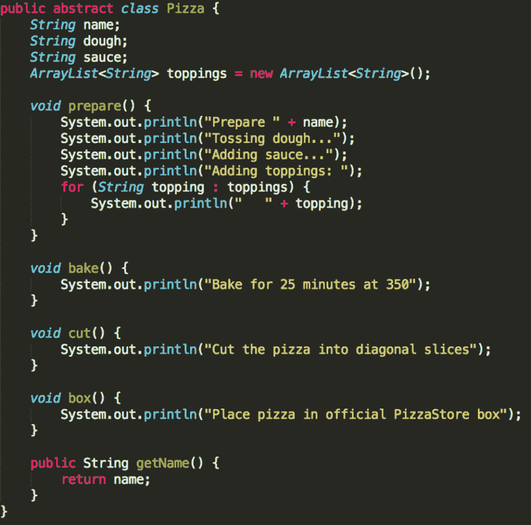T2】](https://res.cloudinary.com/practicaldev/image/fetch/s--2W6_8lLB--/c_limit%2Cf_auto%2Cfl_progressive%2Cq_auto%2Cw_880/https://henricodesjava.files.wordpress.com/2017/10/screen-shot-2017-10-29-at-11-24-25-am.png%3Fw%3D922)

我不会展示所有的具体产品，但这里有两个，一个是纽约的披萨店，一个是芝加哥的披萨店。

[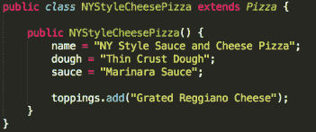T2】](https://res.cloudinary.com/practicaldev/image/fetch/s--g1WthsGb--/c_limit%2Cf_auto%2Cfl_progressive%2Cq_auto%2Cw_880/https://henricodesjava.files.wordpress.com/2017/10/screen-shot-2017-10-29-at-11-27-24-am.png%3Fw%3D351%26h%3D147)

[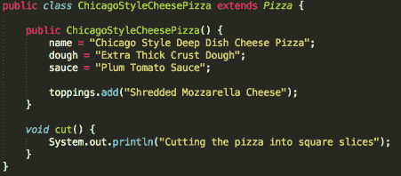T2】](https://res.cloudinary.com/practicaldev/image/fetch/s--3691cnBn--/c_limit%2Cf_auto%2Cfl_progressive%2Cq_auto%2Cw_880/https://henricodesjava.files.wordpress.com/2017/10/screen-shot-2017-10-29-at-11-28-07-am.png%3Fw%3D451%26h%3D198)

每个具体的产品类都可以决定名称、面团类型、酱料和配料。在这里，我们看到的只是字符串被设置，但你得到的想法。那么这些成分发生的事情就超出了具体产品的控制范围(它在抽象产品中)。

最后，让我们来看一个利用这个令人敬畏的工厂模式的客户端类。nyStore 和 chicagoStore 是我们的两家“纽约式和芝加哥式比萨饼工厂”。如果您运行下面的代码，您将看到打印的语句，这些语句描述了每个比萨饼的特定配料的准备，以及每个比萨饼的常见烘焙、切割和装箱步骤。

[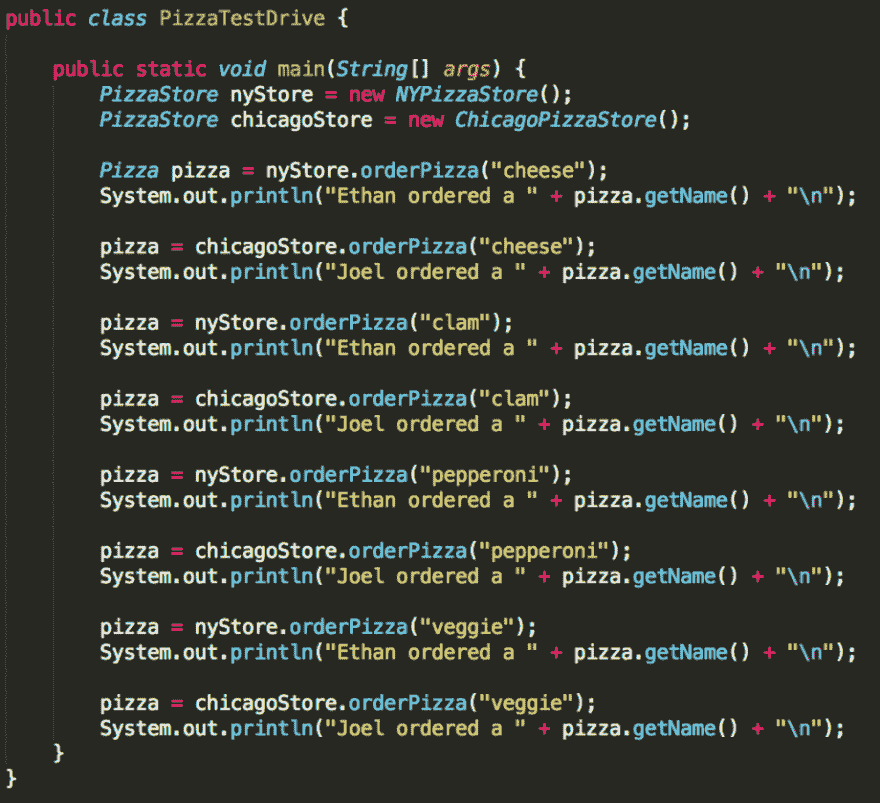T2】](https://res.cloudinary.com/practicaldev/image/fetch/s--tftj0Vie--/c_limit%2Cf_auto%2Cfl_progressive%2Cq_auto%2Cw_880/https://henricodesjava.files.wordpress.com/2017/10/screen-shot-2017-10-29-at-12-35-01-pm.png%3Fw%3D920)

如果您有兴趣查看和运行这个示例，请在这里查看这个回购[。就是这样！这种工厂方法模式依赖于继承来委托对象创建。我的下一篇文章将是工厂模式主题的第二部分，我将讨论抽象工厂模式，它依赖于组合而不是继承。感谢阅读](https://github.com/bethrobson/Head-First-Design-Patterns/tree/master/src/headfirst/designpatterns/factory/pizzafm)