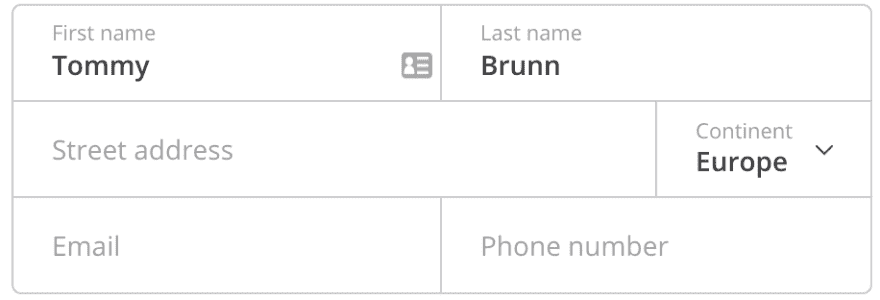
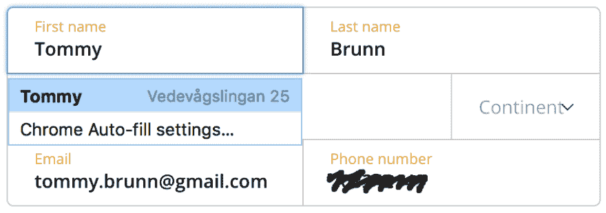

# 检测 Javascript 中的自动填充字段

> 原文：<https://dev.to/nevon/detecting-autofilled-fields-in-javascript-l46>

> *本文原载于 2016 年 Medium。在这一点上可能已经过时了。*

当浏览器自动填充表单字段时，它会添加一些样式来突出显示它编辑过的字段。在 Chrome 中，正如你在上面看到的，它增加了一个可爱的黄色背景色。

原则上，我认为这是一个好主意，因为它向用户显示了他们应该注意哪些字段，以便查看是否所有内容都正确填写了。然而，它很可能会与你的网站风格相冲突，所以如果我们能对它有更多的控制就好了。

```
input:-webkit-autofill {
    // Much nicer
    background-color: bisque;
} 
```

您可以通过使用供应商前缀的伪类 *-webkit-autofill* 来添加样式，但是如果您需要在字段被自动填充时运行一些 Javascript，那就麻烦多了。

[T2】](https://res.cloudinary.com/practicaldev/image/fetch/s--Renlvmdc--/c_limit%2Cf_auto%2Cfl_progressive%2Cq_auto%2Cw_880/https://cdn-images-1.medium.com/max/916/1%2AOACF7P1AqnHU4oKLLh8IHw.png)

在 [@klarna/ui](https://klarna.github.io/ui/) 、 [Klarna](https://klarna.com) 的开源 ui 组件工具包中，我们使用了浮动标签模式。标签最初像占位符一样显示，当您开始键入时，它会转变为字段顶部的小标签。

这是通过监听更改事件并将类 *is-filled* 添加到字段中来实现的，然后该字段应用适当的缩放和定位。

[T2】](https://res.cloudinary.com/practicaldev/image/fetch/s--lED92AqR--/c_limit%2Cf_auto%2Cfl_progressive%2Cq_auto%2Cw_880/https://cdn-images-1.medium.com/max/904/1%2AbNXnDCkiIBL0mspFeTpEBg.png)

但是，当字段被自动填充时，不会触发任何事件，所以没有办法知道何时添加该类。

*这就是黑客的用武之地……*

#### 通过动画改变事件

通过自动填充，我们无法知道字段值何时改变，但这并不是自动填充时发生的唯一事情——有些样式也会被应用！

不幸的是，我们不能真正监听样式的变化，但是我们可以监听动画的开始，我们可以使用前面提到的 *-webkit-autofill* 伪类来启动动画以响应自动填充。

```
@keyframes onAutoFillStart { from {/\*\*/} to {/\*\*/}}
@keyframes onAutoFillCancel { from {/\*\*/} to {/\*\*/}}

input:-webkit-autofill {
    // Expose a hook for JavaScript when autofill is shown
    // JavaScript can capture 'animationstart' events
    animation-name: onAutoFillStart;

    // Make the background color become yellow really slowly
    transition: background-color 50000s ease-in-out 0s;
}

input:not(:-webkit-autofill) {
    // Expose a hook for JS onAutoFillCancel
    // JavaScript can capture 'animationstart' events
    animation-name: onAutoFillCancel;
} 
```

为了澄清这里发生了什么，我们在伪类 *-webkit-autofill* 处于活动状态时运行 *onAutoFillStart* 动画，这将是 Chrome 自动填充输入并更改背景颜色的情况。

现在我们可以在 Javascript 中监听动画的开始。

```
const AUTOFILLED = 'is-autofilled'

const onAutoFillStart = (el) => el.classList.add(AUTOFILLED)

const onAutoFillCancel = (el) => el.classList.remove(AUTOFILLED)

const onAnimationStart = ({ target, animationName }) => {
    switch (animationName) {
        case 'onAutoFillStart':
            return onAutoFillStart(target)
        case 'onAutoFillCancel':
            return onAutoFillCancel(target)
    }
}

document.querySelector('input').addEventListener('animationstart', onAnimationStart, false) 
```

现在，每当 *onAutoFillStart* 或 *onAutoFillCancel* 动画开始播放时，我们相应的函数就会运行，在这里我们将添加或删除 *is-autofilled* 类，或者做任何我们想做的事情。

<figure>[](https://res.cloudinary.com/practicaldev/image/fetch/s--mo1Inu9D--/c_limit%2Cf_auto%2Cfl_progressive%2Cq_auto%2Cw_880/https://cdn-images-1.medium.com/max/914/1%2AwFilv4jvpGRB5SFngbiCFw.png) 

<figcaption>完全对齐的橙色标签表示该字段已被自动填充</figcaption>

</figure>

希望这个黑客对你有用。如果你想看看如何在 [@klarna/ui](https://github.com/klarna/ui) ，[中使用它，你可以在 Github 上找到这个字段的实现。](https://github.com/klarna/ui/tree/master/Field)