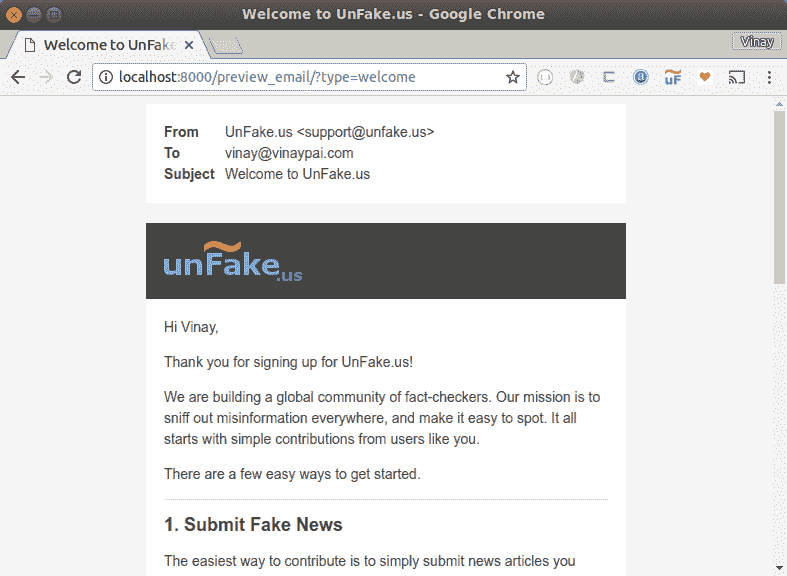

# Django 交易电子邮件变得简单

> 原文：<https://dev.to/vinaypai/django-transactional-emails-made-easy-1pf1>

当你建立一个像 [Facteroid](https://facteroid.com) 这样的社区网站时，交易邮件是保持用户参与的重要方式。关注细节以保持用户点击并回来是很重要的。

不幸的是，电子邮件的开发工作有点麻烦。你要么用测试邮件塞满你的收件箱来测试每一个小变化，要么最好配置另一个笨拙的解决方案在浏览器中打开它们。限制性 HTML 需求很难处理，尤其是需要使用内联样式的时候。

我构建了一些简单的基础设施，使电子邮件开发工作流程变得更加容易。我已经在 Django 中构建了 [Facteroid](https://facteroid.com) ，但是基本思想应该适用于任何平台。

## 基本设置

发送格式化的电子邮件意味着生成三个字符串:主题、HTML 正文和纯文本正文。最明显的方法是将每个部分放在自己的模板中(比如 welcome_email_subject.txt，welcome_email_plain.txt，welcome_email_html.txt)并使用 render_to_string。管理起来可能有点麻烦，因为您有三个单独的文件要编辑并保持同步。

为什么不利用[阻挡](https://docs.djangoproject.com/en/2.0/ref/templates/language/#template-inheritance)？django-render-block 包非常适合这个。它给了你一个`render_block_to_string`函数，它的工作方式就像 render_to_string 一样，但是它给了你一个特定块的内容。现在您所要做的就是为这三个部分定义一个带有独立块的模板。

让我们把它封装在一个类中

```
class Email:
    template = "emails/base.html"
    from_email = settings.DEFAULT_FROM_EMAIL

    def __init__(self, ctx, to_email):
        self.to_email = to_email
        self.subject = render_block_to_string(self.template, 'subject', ctx)
        self.plain = render_block_to_string(self.template, 'plain', ctx)
        self.body = render_block_to_string(self.template, 'html', ctx)

    def send(self):
        send_mail(self.subject, self.plain, self.from_email, 
                [self.to_email],  html_message=self.html) 
```

Enter fullscreen mode Exit fullscreen mode

```
Welcome to Facteroid

Hi,
This is an example email.

Thanks,
- The Facteroid Team


<html><body>
<p>Hi,</p>
<p>This is an example email.</p>
<p>Thanks,</p>
<p>The Facteroid Team</p>
</body></html>
 
```

Enter fullscreen mode Exit fullscreen mode

我们现在要做的就是创建一个扩展 base.html 的模板，并在`Email`的子类中覆盖`template`,这样我们就可以上路了。当然，它的 HTML 和主体可能要比这复杂得多，有很多样板文件。事实上，构建 HTML 电子邮件的标准方式包括[两个嵌套的表格](https://templates.mailchimp.com/development/html/)，所有内容都放在最里面表格的一个单元格中。一直重复那件事是非常浪费的。当然，我们可以很好地利用模板继承来避免这种情况。

```





<html>
  <head>
  </head>
  <body style="font-family: sans-serif; background: #f5f5f5;">
    <table cellspacing="0" cellpadding="0" border="0" width="100%">
     <tr>
       <td width="100%" align="center">
         <table cellspacing="0" cellpadding="0" border="0" width="480">
           <tr>
             <td style="background-color: #444444; padding: 18px;"></td>
           </tr>
           <tr>
             <td style="background-color: white; padding:18px 18px; font-family: Arial, Helvetica, sans-serif; font-size: 14px; line-height: 21px; color: #444444" width="480" >
               
               
             </td>
           </tr>
           <tr>
             <td style="font-family: Arial, Helvetica, sans-serif; font-size: 12px; line-height: 18px; color: #999999; padding: 12px 18px">
               <p>
                 You received this email because you signed up for an Facteroid account with this email. If you do not want to to hear from us, please reply to let us know.
               </p>
             </td>
           </tr>
         </table>
       </td>
     </tr>
   </table>
  </body>
</html>
 
```

Enter fullscreen mode Exit fullscreen mode

您仍然可以从 base.html 继承，但是大多数时候您不需要覆盖所有的`html`，您可以只覆盖`html_main`块并编写一个简单得多的文档。

当我们把东西弄干的时候，为什么不从 HTML 生成普通的主体呢？我们总是可以为最重要的电子邮件手动指定一个，但在大多数情况下，生成的正文应该足够好了。 [HTML2Text](https://pypi.python.org/pypi/html2text) 来救援。

```
class Email:
    template = "emails/base.html"
    from_email = settings.DEFAULT_FROM_EMAIL

    def __init__(self, ctx, to_email):
        self.to_email = to_email
        self.subject = render_block_to_string(self.template, 'subject', ctx)
        self.plain = render_block_to_string(self.template, 'plain', ctx)
        self.body = render_block_to_string(self.template, 'html', ctx)

        if self.plain == "":
            h = HTML2Text()
            h.ignore_images = True
            h.ignore_emphasis = True
            h.ignore_tables = True
            self.plain = h.handle(self.html)

    def send(self):
        send_mail(self.subject, self.plain, self.from_email, 
                [self.to_email],  html_message=self.html) 
```

Enter fullscreen mode Exit fullscreen mode

一封电子邮件带一个`User`对象并呈现相关对象的一些信息是很常见的。您还希望让用户能够方便地退订特定类型的电子邮件。这些由用户`Profile`中的布尔字段处理。让我们概括一下。

```
class UserEmail(Email):
    unsubscribe_field = None

    def __init__(self, ctx, user):
        if self.unsubscribe_field is None:
            raise ProgrammingError("Derived class must set unsubscribe_field")

        self.user = user

        ctx = { 
            'user': user, 
            'unsubscribe_link': user.profile.unsubscribe_link(self.unsubscribe_field)
            **ctx 
        }

        super().__init__(ctx, user.email)

    def send(self):
        if getattr(self.user.profile, self.unsubscribe_field):
            super().send()

class NotificationEmail(UserEmail):
    template = 'emails/notification_email.html'
    unsubscribe_field = 'notification_emails'

    def __init__(self, user):
        ctx = { 'notifications': user.notifications.filter(seen=False) }
        super().__init__(ctx, user) 
```

Enter fullscreen mode Exit fullscreen mode

## 在浏览器中查看邮件

现在，很容易编写一个视图来在浏览器中预览电子邮件。

```
# user_emails/views.py 
@staff_member_required
def preview_email(request):
    email_types = {
        'email_confirmation': ConfirmationEmail,
        'notification': NotificationEmail,
        'welcome': WelcomeEmail,
    }
    email_type = request.GET.get('type')
    if email_type not in email_types:
        return HttpResponseBadRequest("Invalid email type")

    if 'user_id' in request.GET:
        user = get_object_or_404(User, request.GET['user_id'])
    else:
        user = request.user

    email = email_types[email_type](user)

    if request.GET.get('plain'):
        text = "Subject: %s\n\n%s" % (email.subject, email.plain)
        return HttpResponse(text, content_type='text/plain')
    else:
        # Insert a table with metadata like Subject, To etc. to top of body
        extra = render_to_string('user_email/metadata.html', {'email': email})
        soup = BeautifulSoup(email.html)
        soup.body.insert(0, BeautifulSoup(extra))

        return HttpResponse(soup.encode()) 
```

Enter fullscreen mode Exit fullscreen mode

现在我可以在浏览器中轻松预览电子邮件。我还在开发中使用 [django-live-reload](https://github.com/tjwalch/django-livereload-server) ，这样我就可以编辑模板文件和代码，并在浏览器窗口中即时看到效果，而不必重新加载页面。

[T2】](https://res.cloudinary.com/practicaldev/image/fetch/s--Ph-ZFCUh--/c_limit%2Cf_auto%2Cfl_progressive%2Cq_auto%2Cw_880/https://thepracticaldev.s3.amazonaws.com/i/0dsw5t4h1csei6umiobo.png)

## 保持 CSS 理智

另一件让开发 HTML 电子邮件痛苦的事情是需要使用内嵌样式。与普通网页不同，你不能只有一个样式块，并依赖用户代理来正确地呈现它们。你真的必须在你想要设计的每个元素上添加属性，这使得最简单的事情，比如“把我的所有链接都变成浅蓝色，去掉下划线”变得相当痛苦。

我用一个小小的[定制模板标签](https://docs.djangoproject.com/en/2.0/howto/custom-template-tags/)简化了这个过程，它从外部文件读取样式，并输出一个`style`属性。我可以在字典中定义样式，但是在[的一点帮助下，cssutils](https://pypi.python.org/pypi/cssutils/) 可以将它保存在一个. CSS 文件中，这使得它可以很好地与代码编辑器一起使用，这样我就可以获得正确的语法高亮、自动完成等功能。

```
# user_email/templatetags/email_tags.py 
_styles = None

@register.simple_tag()
def style(names):
    global _styles
    if _styles is None or settings.DEBUG:
        _load_styles()

    style = ';'.join(_styles.get(name, '') for name in names.split())
    return mark_safe('style="%s"' % style)

def _load_styles():
    global _styles
    _styles = {}

    sheet = cssutils.parseFile(finders.find('user_email/email_styles.css'))
    for rule in sheet.cssRules:
        for selector in rule.selectorList:
            _styles[selector.selectorText] = rule.style.cssText 
```

Enter fullscreen mode Exit fullscreen mode

现在在我的 HTML 文件中，我需要做的就是:

```



<p>Hello {{user.profile.display_name}},</p>
<p>Thanks for signing up! Here's an <a href="{{BASE_URL}}/about-us" >article</a> to help you get started. </p>
<p ><a  href="{{BASE_URL}}/get-started">GET STARTED</a></p>
 
```

Enter fullscreen mode Exit fullscreen mode

## 结论

我从这个例子中去掉了一些代码，使它更简单，但是我有各种各样的附加功能，可以很容易地添加到这个基础上。

*   `Email`基类解析电子邮件，并自动将基本 URL 添加到任何相关链接的前面。
*   `send`函数在数据库中记录发送邮件的日志，如果存在的话，调用`after_send`方法。一些电子邮件类中的`after_send`函数完成内务处理任务，比如记录哪些通知已经发送给用户。
*   我的查看功能有点复杂，所以我可以预览不仅仅是用户的电子邮件(但它基于相同的想法)。

我欢迎任何意见、建议或问题！