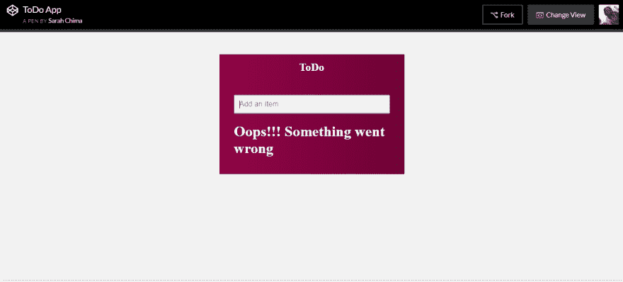
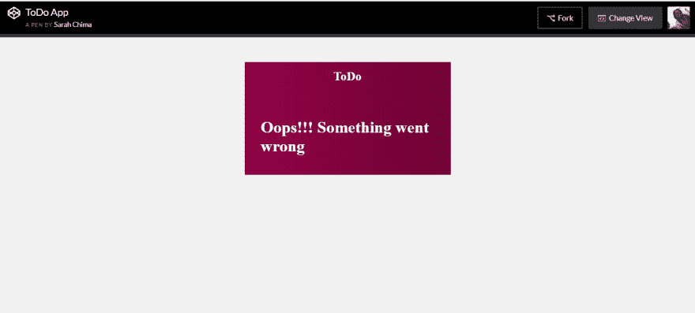
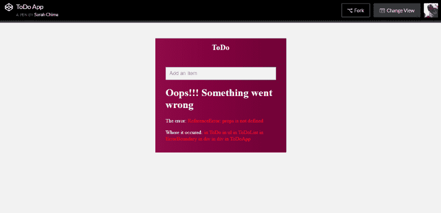

# 用错误边界处理 React 组件中的错误

> 原文：<https://dev.to/sarah_chima/error-boundaries-in-react-3eib>

[T2】](https://res.cloudinary.com/practicaldev/image/fetch/s--ati1JBNC--/c_limit%2Cf_auto%2Cfl_progressive%2Cq_auto%2Cw_880/http://res.cloudinary.com/dvj2hbywq/image/upload/v1517490342/logo-og_lxw2ze.png)

React 应用程序通常是一个由较小组件组成的大组件。这有利于代码的组织。然而，当这些较小的组件中的任何一个出现错误时，就会出现问题。会发生什么？整个应用程序崩溃。悲伤的故事是吧？嗯，不一定非要那样。

伴随 React 16 而来的是一个真正的好朋友——错误边界。官方文件是这样说的。

错误边界是 React 组件，它捕捉子组件树中任何地方的 JavaScript 错误，记录这些错误，并显示一个后备 UI，而不是崩溃的组件树。错误边界在渲染期间、在生命周期方法中以及在它们下面的整个树的构造函数中捕捉错误。

让我们部分理解。错误边界是 React 组件，它们捕捉子组件树中任何地方的错误。这意味着它们不能捕捉自身发生的错误，并且需要有子组件才有意义。错误被记录下来，因此可以获得关于错误的信息以及错误发生的确切位置。有趣的是，您可以显示一个后备 UI，因此您可以选择显示任何您想要的内容，而不是崩溃的组件。

如果一个组件定义了`componentDidCatch(error, info)`方法，它就会成为一个错误边界。React 16 中也引入了这种生命周期方法。

如果你还不明白这一点，我想一个实际的例子会有所帮助。因此，让我们创建一个错误边界组件类。

### 如何创建错误边界

```
 import React, {Component} from 'react';
    import ReactDOM from 'react-dom';

    class ErrorBoundary extends React.Component {
        constructor(props) {
        super(props);
        this.state = {hasError: false };
    }

    componentDidCatch(error, info) {
        this.setState({hasError: true });
    }

    render() {
        if (this.state.hasError) {
            return <h1>Oops!!! Something went wrong</h1>;
        } else {
            return this.props.children;
            }
        }
    } 
```

Enter fullscreen mode Exit fullscreen mode

从上面的代码中，请注意错误边界的定义类似于常规的 React 组件，不同之处在于`componentDidCatch`方法。那么组件中发生了什么呢？`hasError`被设置为初始状态`false`。如果在渲染过程中，在生命周期方法中，以及在它的任何子组件或它下面的任何子组件中的构造函数中有错误，那么`hasError`的状态将被更改为`true`。这个状态决定了渲染函数中所显示的内容。如果有错误，将显示一条错误消息。

让我们使用这个误差边界。

### 使用误差边界

我们将使用待办事项应用程序的一部分来解释这一点。这是 [CodePen](https://codepen.io/sayrah901/pen/dZRwZe) 上的完整应用。

```
 class ToDoApp extends React.Component {
      ...

      render() {
        return (
          <div>
            <h2>ToDo</h2>
            <div>
              <Input />

               //Error Boundary used here
              <ErrorBoundary>
                <ToDoList />
              </ErrorBoundary> 
            </div>
          </div>
        );
      }

    } 
```

Enter fullscreen mode Exit fullscreen mode

在上面的代码中，您可以看到错误边界像普通组件一样被使用，并且被包裹在`TodoList`组件周围。如果该组件或其子组件中出现错误，错误边界组件会显示一个后备 UI。下面是一个没有错误的待办事项应用程序的图像。

[T2】](https://res.cloudinary.com/practicaldev/image/fetch/s--VxNzK1cj--/c_limit%2Cf_auto%2Cfl_progressive%2Cq_auto%2Cw_880/http://res.cloudinary.com/dvj2hbywq/image/upload/v1517473257/Screenshot_189_jemaho.png)

下面是当`<ToDoList />`组件出现错误时会发生的情况。

[T2】](https://res.cloudinary.com/practicaldev/image/fetch/s--b2hYHZWm--/c_limit%2Cf_auto%2Cfl_progressive%2Cq_auto%2Cw_880/http://res.cloudinary.com/dvj2hbywq/image/upload/v1517473272/Screenshot_186_x96uog.png)

请注意，您在代码中放置错误边界的位置决定了回退 UI 的出现位置。让我们将错误边界开始标记放在`<Input />`组件之前。

```
 class ToDoApp extends React.Component {
      ...

      render() {
        return (
          <div>
            <h2>ToDo</h2>
            <div>

              //Error Boundary used here
              <ErrorBoundary>
                <Input />
                <ToDoList />
              </ErrorBoundary> 
            </div>
          </div>
        );
      }

    } 
```

Enter fullscreen mode Exit fullscreen mode

如果有一个错误，这里是你得到的显示。注意，与前面的图像不同，`input`没有出现。请忽略不均匀的间距。:)

[T2】](https://res.cloudinary.com/practicaldev/image/fetch/s--Z3i0S5Aw--/c_limit%2Cf_auto%2Cfl_progressive%2Cq_auto%2Cw_880/http://res.cloudinary.com/dvj2hbywq/image/upload/v1517473273/Screenshot_187_tfkkom.png)

理想情况下，错误边界组件声明一次，然后在整个应用程序中使用。

### 关于 componentDidCatch()的更多信息

现在，让我们回到`componentDidCatch`方法。它的工作方式类似于 Javascript `catch{}`块，但是是针对组件的。你会注意到`componentDidCatch`有两个参数，`error`和`info`。它们是什么？

第一个参数是实际抛出的错误。第二个参数是一个具有包含组件堆栈跟踪信息的`componentStack`属性的对象。这是组件树中从应用程序根一直到违规组件的路径。让我们修改我们的误差边界来利用这个参数。

```
 import React, {Component} from 'react';
    import ReactDOM from 'react-dom';

    class ErrorBoundary extends React.Component {
        constructor(props) {
            super(props);
            this.state = this.state = {
               hasError : false,
               error    : null,
               info     : null
            };
        }

        componentDidCatch(error, info) {
            componentDidCatch(error, info) {
                this.setState({ 
                  hasError : true, 
                  error    : error,
                  info     : info
                });
            }
        }

        render() {
            if (this.state.hasError) {
                return (
                    <div>
                        <h1>Oops!!! Something went wrong</h1>
                        <p>The error: {this.state.error.toString()}</p>
                        <p>Where it occured: {this.state.info.componentStack}</p>
                    </div>                    );       
             } else {
                return this.props.children;
                }
            }
        } 
```

Enter fullscreen mode Exit fullscreen mode

我们所做的是修改我们的状态来捕获错误和信息。然后在回退 UI 中显示此错误消息和信息。当出现错误时，我们会得到以下结果。

[T2】](https://res.cloudinary.com/practicaldev/image/fetch/s--jRPDBCRX--/c_limit%2Cf_auto%2Cfl_progressive%2Cq_auto%2Cw_880/http://res.cloudinary.com/dvj2hbywq/image/upload/v1517473273/Screenshot_188_b8t90i.png)

您还可以将错误记录到错误报告服务中。

```
 import React, {Component} from 'react';
    import ReactDOM from 'react-dom';

    class ErrorBoundary extends React.Component {
      ...
        componentDidCatch(error, info) {
            this.setState({hasError: true });
            logErrorToService(error, info);
        }
    ...
    } 
```

Enter fullscreen mode Exit fullscreen mode

### 结论

既然你已经理解了什么是错误边界，以及如何使用它，我打赌你会觉得它超级酷。但是，不要因为兴奋而想将每个组件都封装在一个错误边界中。这条推特说明了一切。

> 错误边界有很多层，所以没有必要“在每一层都换行”。只要把你的<errorboundary>放在几个有战略意义的地方。</errorboundary>
> 
> — Dan Abramov ([@dan_abramov](https://dev.to/dan_abramov) ) [July 27, 2017](https://twitter.com/dan_abramov/status/890716400981078016?ref_src=twsrc%5Etfw)

有什么问题或补充吗？留下评论。

感谢您的阅读。:)