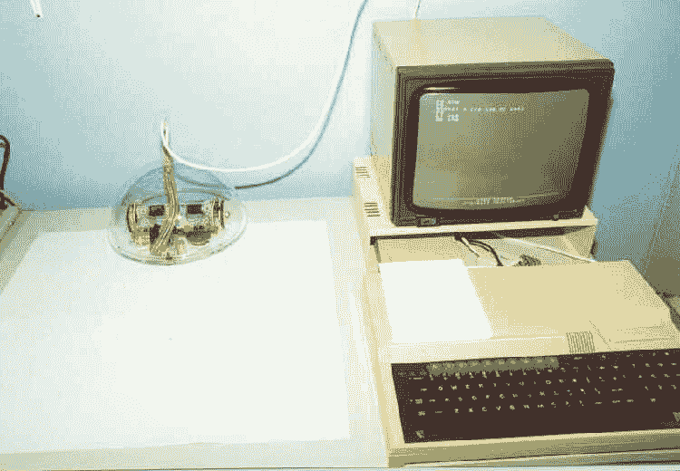
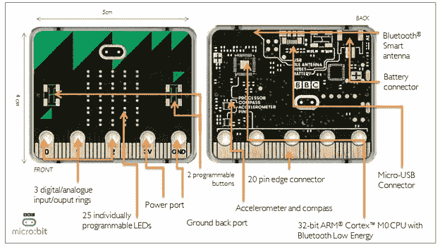
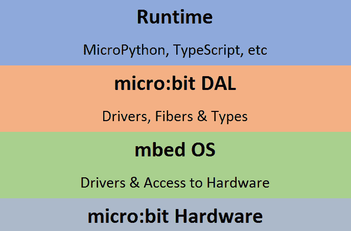
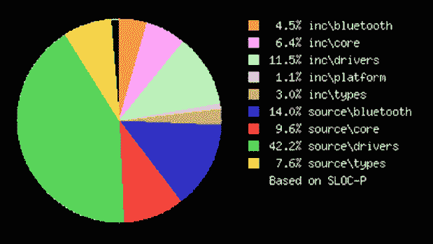

# 探索 BBC micro:bit 软件堆栈和操作系统

> 原文：<https://dev.to/mattwarren/exploring-the-bbc-microbit-software-stack-and-os-b11>

这篇文章最初出现在我的博客上

* * *

如果你在英国长大，并在 20 世纪 80 年代或 90 年代上学，这张照片很可能会勾起你美好的回忆:

[T2】](https://res.cloudinary.com/practicaldev/image/fetch/s--vCkJjXA4--/c_limit%2Cf_auto%2Cfl_progressive%2Cq_auto%2Cw_880/http://www.classicacorn.freeuk.com/8bit_focus/logo/logo_8.jpg)

(图片由[经典橡子](http://www.classicacorn.freeuk.com/)提供)

我可以想象，对于很多计算机程序员(目前 30 多岁)来说，BBC Micro 是他们第一次体验编程。如果这也适用于你，你想要一次回忆之旅，读一读《回忆:BBC 微和[我的教育中的 BBC 微](https://www.retro-kit.co.uk/page.cfm/content/The-BBC-Micro-in-Education/)。

经典的[海龟](https://angrytechnician.wordpress.com/2009/07/23/relic/)的编程是在 [Logo](http://www.walkingrandomly.com/?p=13) 中完成的，代码如下:

```
FORWARD 100
LEFT 90
FORWARD 100
LEFT 90
FORWARD 100
LEFT 90
FORWARD 100
LEFT 90 
```

当然，一旦你知道你在做什么，你会把它改写成这样:

```
REPEAT 4 [FORWARD 100 LEFT 90] 
```

* * *

## BBC 微:bit

最初的 Micro 是作为一种教育工具推出的，作为英国广播公司计算机扫盲项目的一部分，大多数人认为它取得了巨大的成功。作为后续行动，2016 年 3 月，作为 BBC“让它数字化”计划的一部分，推出了[micro:bit](http://www.bbc.co.uk/mediacentre/latestnews/2016/bbc-micro-bit-schools-launch)，并向英国的学校和图书馆发放了 100 万台设备，以“帮助培养新一代数字先锋”(即让他们参与编程！)

**旁白**:我喜欢 30 年来品牌的不同， *BBC Micro* 变成了*BBC Micro:bit*’(你必须包括冒号)*计算机扫盲项目*变成了 *Make it Digital Initiative* 。

[T2】](http://www.bbc.co.uk/mediacentre/mediapacks/microbit/specs)

几周前，我走进当地的图书馆，[拿起一个不错的初学者工具包](http://microbit.org/en/2017-10-23-libraries/)，然后花了几个小时看着我的儿子玩它(我担心他这么快就学会了编程的基础，我想我可能几年后就失业了！！)

然而，一旦他上床睡觉，这一切都是我的！我“玩”的结果是这篇文章，在这篇文章中，我将探索组成 micro:bit 的**软件栈**，它有什么，它做什么，以及它如何组合在一起。

如果你想了解如何编程 micro:bit，它的硬件或其他任何东西，看看这个[优秀的资源列表](https://github.com/carlosperate/awesome-microbit)。

* * *

有点跑题，但是如果你喜欢阅读**源代码**，你可能会喜欢这些其他的帖子:

*   [CLR 在执行一行代码之前要做的 68 件事](http://mattwarren.org/2017/02/07/The-68-things-the-CLR-does-before-executing-a-single-line-of-your-code/?recommended=1)
*   CoreCLR 源代码的搭便车指南
*   DotNetAnywhere:一个替代方案。NET 运行时

* * *

# BBC micro:bit 软件栈

如果我们从堆栈的*高层*来看，它分成 3 个独立的**软件**组件，它们都位于**硬件**本身之上:

[T2】](https://res.cloudinary.com/practicaldev/image/fetch/s--FZA5j_KD--/c_limit%2Cf_auto%2Cfl_progressive%2Cq_auto%2Cw_880/http://mattwarren.oimg/2017/11/BBC%2520Microbit%2520Software%2520Stack.png)

如果你想为自己建造这个堆栈，看看有 Yotta 指南的[建筑。我还发现这个描述](https://lancaster-university.github.io/microbit-docs/offline-toolchains)[在 BBC micro:bit【大概】](https://hackernoon.com/the-first-video-game-on-the-bbc-micro-bit-probably-4175fab44da8)上的第一个视频游戏的帖子很有帮助。

* * *

## 运行时

有几个高级的*运行时*可用，这些很有用，因为它们让你用 C/C++之外的语言写代码，甚至通过在屏幕上拖动*块*来创建程序。我遇到的主要问题如下(完整列表见[“编程”](https://github.com/carlosperate/awesome-microbit#programming)):

*   **Python**via[MicroPython](https://github.com/bbcmicrobit/micropython/)
*   **JavaScript** 与[微软编程体验工具包(PXT)](https://github.com/Microsoft/pxt-microbit)
    *   嗯，实际上是 [**打字稿**](https://makecode.com/language) ，这很好，我们不想用 Javascript - Wat 的[恐怖来腐蚀易受影响的小孩的大脑！！](https://www.destroyallsoftware.com/talks/wat)

它们都以类似的方式工作，用户代码(Python 或 TypeScript)与运行时本身的 C/C++代码捆绑在一起，然后整个二进制(hex)文件被部署到 micro:bit。当设备启动时，运行时会在内存中的已知位置查找用户代码，并开始解释它。

**更新**原来是我看错了微软的 PXT，它居然[把你的打字程序编译成原生代码](https://makecode.com/language#static-compilation-vs-a-dynamic-vm)，非常酷！有趣的是，他们这样做是因为:

> 与典型的动态 JavaScript 引擎相比，PXT 静态编译代码，带来了显著的时间和空间性能改进:
> 
> *   用户程序被直接编译成机器码，从来不是任何需要解释的字节码形式；这使得执行速度比典型的 JS 解释器快得多
> *   用户代码没有 RAM 开销——所有代码都在闪存中；在动态虚拟机中，通常有一些代表代码的数据结构
> *   由于缺少小整数装箱和静态类布局，对象的内存消耗大约是动态 VM 的一半(不包括上面提到的用户代码结构)
> *   虽然 PXT 中有一些运行时支持代码，但它通常比动态 VM 小 100KB 左右，降低了闪存消耗，为用户代码留出了更多空间
> 
> 根据经验，PXT 代码的执行时间、RAM 和闪存消耗是编译 C 代码的 2 倍，这使得它在编写驱动程序和其他用户空间库方面具有竞争力。

* * *

## 内存布局

在讨论软件堆栈的其他部分之前，我想深入了解一下内存布局。这很重要，因为内存在 micro:bit 上非常有限，只有*16KB 的 RAM。为了客观地看待这个问题，我们将使用 StackOverflow 问题[中的计算方法，一条 tweet 占用多少字节的内存？](https://stackoverflow.com/questions/5999821/how-many-bytes-of-memory-is-a-tweet/5999852#5999852)*

> Twitter 使用 UTF-8 编码的信息。UTF-8 码点最长可达 64 个八位字节，使得最大消息大小**为 140 x 4 = 560 个 8 位字节**。

如果我们重新计算更新更长的推文**280 x4 = 1120 字节**。所以我们只能在 micro:bit 上的可用 RAM 中放入**的 10 条 tweet**(结果是总共 16K 中只有 11K 可用于一般用途)。这就是为什么值得使用一个[定制版的 atoi()来节省 350 字节的 RAM](https://github.com/lancaster-university/microbit-dal/issues/323) ！

内存布局是由链接器在编译时使用 [NRF51822.ld](https://github.com/lancaster-university/microbit-targets/blob/master/bbc-microbit-classic-gcc-nosd/ld/NRF51822.ld#L6) 指定的，如果你想看看的话，有一个[示例输出可用](http://mattwarren.org/data/2017/11/microbit-samples.map)。因为这是在编译时完成的，所以如果配置不正确，就会遇到构建错误，比如[“区域 RAM 溢出堆栈”](https://github.com/bbcmicrobit/micropython/issues/363)。

下表显示了“Hello World”应用程序的“无 SD”版本的内存布局，即移除了蓝牙(ble)软设备(SD)支持后的最大可用内存量。与启用 BLE 相比，你马上就少了 [8K 可用内存](https://github.com/lancaster-university/microbit-targets/blob/master/bbc-microbit-classic-gcc/ld/NRF51822.ld#L6)，所以事情开始变得紧张起来！

| 名字 | 起始地址 | 结束地址 | 大小 | 百分率 |
| --- | --- | --- | --- | --- |
| 。数据 | 0x20000000 | 0x20000098 | 152 字节 | 0.93% |
| 。英国标准规格 | 0x20000098 | 0x20000338 | 672 字节 | 4.10% |
| 堆(mbed) | 0x20000338 | 0x20000b38 | 2048 字节 | 12.50% |
| 空的 | 0x20000b38 | 0x20003800 | 11，464 字节 | 69.97% |
| 堆 | 0x20003800 | 0x20004000 | 2048 字节 | 12.50% |

有关列名的更多信息，请参见维基百科页面上的[。数据](https://en.wikipedia.org/wiki/Data_segment)和[。bss](https://en.wikipedia.org/wiki/.bss) 以及[文本、数据和 bss:代码和数据大小说明](https://mcuoneclipse.com/2013/04/14/text-data-and-bss-code-and-data-size-explained/)

作为比较，在本文中有一个很好的微:位 RAM 布局图[。它展示了运行 MicroPython 时的情况，你可以清楚地看到中间的主 Python 堆](https://hackernoon.com/the-first-video-game-on-the-bbc-micro-bit-probably-4175fab44da8#5fea)[占据了所有剩余的空间](https://github.com/bbcmicrobit/micropython/blob/master/source/microbit/mprun.c#L95-L104)。

* * *

## [微生物](https://github.com/lancaster-university/microbit-dal)

位于高层运行时之下的堆栈是由英国[兰卡斯特大学](https://github.com/lancaster-university)创建的*设备抽象层* (DAL)，它由 4 个主要组件组成:

*   [**核心**](https://github.com/lancaster-university/microbit-dal/tree/master/source/core)
    *   高级组件，如`Device`、`Font`、`HeapAllocator`、`Listener`和`Fiber`，通常在一个或多个`driver`类之上实现
*   [**类型**](https://github.com/lancaster-university/microbit-dal/tree/master/source/types)
    *   辅助类型，如`ManagedString`、`Image`、`Event`和`PacketBuffer`
*   [**司机**](https://github.com/lancaster-university/microbit-dal/tree/master/source/drivers)
    *   用于控制特定的硬件组件，如`Accelerometer`、`Button`、`Compass`、`Display`、`Flash`、`IO`、`Serial`和`Pin`
*   [**蓝牙**](https://github.com/lancaster-university/microbit-dal/tree/master/source/bluetooth)
    *   与微:位一起发货的[的](https://lancaster-university.github.io/microbit-docs/ble/profile/)[蓝牙低能耗](https://www.kitronik.co.uk/blog/bbc-microbit-bluetooth-low-energy/) (BLE)栈的所有代码
*   [**ASM**T3】](https://github.com/lancaster-university/microbit-dal/tree/master/source/asm)
    *   汇编中只实现了 4 个功能，分别是`swap_context`、`save_context`、`save_register_context`和`restore_register_context`。顾名思义，它们处理让[微比特光纤调度器](https://github.com/lancaster-university/microbit-dal/blob/master/source/core/MicroBitFiber.cpp)工作所需的“上下文切换”

下图显示了“代码行”(LOC)的分布，正如你所看到的，大部分代码在`drivers`和`bluetooth`组件中。

[T2】](https://res.cloudinary.com/practicaldev/image/fetch/s--vvis7HMQ--/c_limit%2Cf_auto%2Cfl_progressive%2Cq_auto%2Cw_880/http://mattwarren.oimg/2017/11/LocMetricsPie-microbit-dal.png)

除了提供良好的助手类来处理底层设备，DAL 还提供了`Fiber`抽象来允许异步功能工作。这很有用，因为你可以在 LED 显示屏上异步显示文本，当*在屏幕上滚动*时，你的代码不会阻塞。此外，`Fiber`类用于处理当按下 micro:bit 上的按钮时发出信号的中断。这段代码中的注释清楚地展示了[纤程调度器](https://github.com/lancaster-university/microbit-dal/blob/master/source/core/MicroBitFiber.cpp)的功能:

> 这个轻量级的**非抢占式调度器**提供了一个**简单线程机制**用于两个主要目的:
> 
> 1)为应用程序语言提供一个清晰的抽象，以便在构建异步行为(回调)时使用。2)为在 ISR 环境中生成的 EventModel 事件提供 ISR 解耦。

最后，高级类 [MicroBit.cpp](https://github.com/lancaster-university/microbit/blob/master/source/MicroBit.cpp) 和 [MicroBit.h](https://github.com/lancaster-university/microbit/blob/master/inc/MicroBit.h) 位于 [microbit 库](https://github.com/lancaster-university/microbit)中。这些类定义了 MicroBit 运行时的 API 并设置默认配置，如`MicroBit.cpp`的`Constructor`所示:

```
/**
  * Constructor.
  *
  * Create a representation of a MicroBit device, which includes member variables
  * that represent various device drivers used to control aspects of the micro:bit.
  */
MicroBit::MicroBit() :
    serial(USBTX, USBRX),
    resetButton(MICROBIT_PIN_BUTTON_RESET),
    storage(),
    i2c(I2C_SDA0, I2C_SCL0),
    messageBus(),
    display(),
    buttonA(MICROBIT_PIN_BUTTON_A, MICROBIT_ID_BUTTON_A),
    buttonB(MICROBIT_PIN_BUTTON_B, MICROBIT_ID_BUTTON_B),
    buttonAB(MICROBIT_ID_BUTTON_A,MICROBIT_ID_BUTTON_B, MICROBIT_ID_BUTTON_AB),
    accelerometer(i2c),
    compass(i2c, accelerometer, storage),
    compassCalibrator(compass, accelerometer, display),
    thermometer(storage),
    io(MICROBIT_ID_IO_P0,MICROBIT_ID_IO_P1,MICROBIT_ID_IO_P2,
       MICROBIT_ID_IO_P3,MICROBIT_ID_IO_P4,MICROBIT_ID_IO_P5,
       MICROBIT_ID_IO_P6,MICROBIT_ID_IO_P7,MICROBIT_ID_IO_P8,
       MICROBIT_ID_IO_P9,MICROBIT_ID_IO_P10,MICROBIT_ID_IO_P11,
       MICROBIT_ID_IO_P12,MICROBIT_ID_IO_P13,MICROBIT_ID_IO_P14,
       MICROBIT_ID_IO_P15,MICROBIT_ID_IO_P16,MICROBIT_ID_IO_P19,
       MICROBIT_ID_IO_P20),
    bleManager(storage),
    radio(),
    ble(NULL)
{
...
} 
```

* * *

## [mbed-classic](https://github.com/lancaster-university/mbed-classic)

堆栈底部的软件使用的是 [ARM mbed OS](https://github.com/ARMmbed/mbed-os) ，它是:

> ..为物联网(IoT)中的“物”而设计的开源嵌入式操作系统。mbed OS 包括使用 ARM Cortex-M 微控制器开发互联产品所需的特性。
> 
> mbed OS 提供的平台包括:
> 
> *   安全基础。
> *   云计算管理服务。
> *   传感器、I/O 设备和连接的驱动程序。
> 
> mbed OS 是模块化的可配置软件，您可以根据您的设备对其进行定制，并通过排除未使用的软件来降低内存需求。

我们可以从其源代码的布局中看出这一点，它基于大约`common`组件，这些组件可以与特定于您正在运行的硬件的`hal`(硬件抽象层)和`target`相结合。

*   [**API**T3】](https://github.com/lancaster-university/mbed-classic/tree/master/api)
*   [**常见的**](https://github.com/lancaster-university/mbed-classic/tree/master/common)
*   [**哈尔**T3】](https://github.com/lancaster-university/mbed-classic/tree/master/hal)
*   [**目标**](https://github.com/lancaster-university/mbed-classic/tree/master/targets)

更具体地说，micro:bit 使用`yotta target bbc-microbit-classic-gcc`，但它也可以根据需要使用[其他目标](https://github.com/lancaster-university/microbit-targets)。

作为参考，下面是`mbed`的`common`段中被`micro:bit-dal`使用的文件:

*   [board.c](https://github.com/lancaster-university/mbed-classic/blob/master/common/board.c)
*   [错误. c](https://github.com/lancaster-university/mbed-classic/blob/master/common/error.c)
*   [FileBase.cpp](https://github.com/lancaster-university/mbed-classic/blob/master/common/FileBase.cpp)
*   [FilePath.cpp](https://github.com/lancaster-university/mbed-classic/blob/master/common/FilePath.cpp)
*   [FileSystemLike.cpp](https://github.com/lancaster-university/mbed-classic/blob/master/common/FileSystemLike.cpp)
*   [gpio.c](https://github.com/lancaster-university/mbed-classic/blob/master/common/gpio.c)
*   [I2C.cpp](https://github.com/lancaster-university/mbed-classic/blob/master/common/I2C.cpp)
*   [已中断。cpp](https://github.com/lancaster-university/mbed-classic/blob/master/common/InterruptIn.cpp)
*   [pinmap_common.c](https://github.com/lancaster-university/mbed-classic/blob/master/common/pinmap_common.c)
*   [RawSerial.cpp](https://github.com/lancaster-university/mbed-classic/blob/master/common/RawSerial.cpp)
*   [丝氨酸。cpp](https://github.com/lancaster-university/mbed-classic/blob/master/common/SerialBase.cpp)
*   [Ticker.cpp](https://github.com/lancaster-university/mbed-classic/blob/master/common/Ticker.cpp)
*   [ticker_api.c](https://github.com/lancaster-university/mbed-classic/blob/master/common/ticker_api.c)
*   [Timeout.cpp](https://github.com/lancaster-university/mbed-classic/blob/master/common/Timeout.cpp)
*   [定时器. cpp](https://github.com/lancaster-university/mbed-classic/blob/master/common/Timer.cpp)
*   [TimerEvent.cpp](https://github.com/lancaster-university/mbed-classic/blob/master/common/TimerEvent.cpp)
*   [us_ticker_api.c](https://github.com/lancaster-university/mbed-classic/blob/master/common/us_ticker_api.c)
*   [wait_api.c](https://github.com/lancaster-university/mbed-classic/blob/master/common/wait_api.c)

这里是针对`NORDIC - MCU NRF51822`的硬件特定文件:

*   [类似物 _api.c](https://github.com/lancaster-university/mbed-classic/blob/master/targets/hal/TARGET_NORDIC/TARGET_MCU_NRF51822/analogin_api.c)
*   [gpio_api.c](https://github.com/lancaster-university/mbed-classic/blob/master/targets/hal/TARGET_NORDIC/TARGET_MCU_NRF51822/gpio_api.c)
*   [gpio_irq_api.c](https://github.com/lancaster-university/mbed-classic/blob/master/targets/hal/TARGET_NORDIC/TARGET_MCU_NRF51822/gpio_irq_api.c)
*   [i2c_api.c](https://github.com/lancaster-university/mbed-classic/blob/master/targets/hal/TARGET_NORDIC/TARGET_MCU_NRF51822/i2c_api.c)
*   [pinmap.c](https://github.com/lancaster-university/mbed-classic/blob/master/targets/hal/TARGET_NORDIC/TARGET_MCU_NRF51822/pinmap.c)
*   [port_api.c](https://github.com/lancaster-university/mbed-classic/blob/master/targets/hal/TARGET_NORDIC/TARGET_MCU_NRF51822/port_api.c)
*   pwmout _ API . c
*   [retarget.cpp](https://github.com/lancaster-university/mbed-classic/blob/master/targets/cmsis/TARGET_NORDIC/TARGET_MCU_NRF51822/TOOLCHAIN_ARM_STD/sys.cpp)
*   [serial_api.c](https://github.com/lancaster-university/mbed-classic/blob/master/targets/hal/TARGET_NORDIC/TARGET_MCU_NRF51822/serial_api.c)
*   [startup_NRF51822。S](https://github.com/lancaster-university/mbed-classic/blob/master/targets/cmsis/TARGET_NORDIC/TARGET_MCU_NRF51822/TOOLCHAIN_GCC_ARM/startup_NRF51822.S)
*   [system_nrf51.c](https://github.com/lancaster-university/mbed-classic/blob/master/targets/cmsis/TARGET_NORDIC/TARGET_MCU_NRF51822/system_nrf51.c)
*   [twi_master.c](https://github.com/lancaster-university/mbed-classic/blob/master/targets/hal/TARGET_NORDIC/TARGET_MCU_NRF51822/twi_master.c)
*   [us_ticker.c](https://github.com/lancaster-university/mbed-classic/blob/master/targets/hal/TARGET_NORDIC/TARGET_MCU_NRF51822/us_ticker.c)

* * *

## 端到端(或自上而下)

最后，让我们看几个例子，看看在特定场景中如何使用堆栈中的不同组件

### 写入显示器

*   
    ***   [MicroBitDisplay.cpp](https://github.com/lancaster-university/microbit-dal/blob/master/source/drivers/MicroBitDisplay.cpp) ，处理滚动、异步更新和其他高级任务，然后移交给:*   [MicroBitFont.cpp](https://github.com/lancaster-university/microbit-dal/blob/master/source/core/MicroBitFont.cpp)*   [microbiotimage . CPP](https://github.com/lancaster-university/microbit-dal/blob/master/source/types/MicroBitImage.cpp)*   [MicroBitMatrixMaps.h](https://github.com/lancaster-university/microbit-dal/blob/master/inc/drivers/MicroBitMatrixMaps.h)**
***   [**mbed-classic**T3】](https://github.com/lancaster-university/mbed-classic)
    *   `void port_write(port_t *obj, int value)`在[port _ API . c](https://github.com/lancaster-university/mbed-classic/blob/master/targets/hal/TARGET_NORDIC/TARGET_MCU_NRF51822/port_api.c)(‘NORDIC NRF 51822’版本)，通过调用 [PortOut.h](https://github.com/lancaster-university/mbed-classic/blob/master/api/PortOut.h) 中的`void write(int value)`，使用来自 [PinNames.h](https://github.com/lancaster-university/mbed-classic/blob/master/targets/hal/TARGET_NORDIC/TARGET_MCU_NRF51822/TARGET_NRF51_MICROBIT/PinNames.h) 的信息**

 **### 在闪存上存储文件

*   
    ***   提供高级抽象，例如:*   [文件系统](https://github.com/lancaster-university/microbit-dal/blob/master/source/drivers/MicroBitFileSystem.cpp)*   [文件](https://github.com/lancaster-university/microbit-dal/blob/master/source/drivers/MicroBitFile.cpp)*   [闪光](https://github.com/lancaster-university/microbit-dal/blob/master/source/drivers/MicroBitFlash.cpp)**
***   [**mbed-classic**T3】](https://github.com/lancaster-university/mbed-classic)
    *   允许对硬件进行低级控制，例如直接或通过 SoftDevice (SD)层写入闪存本身**

 **此外，来自 [MicroBitStorage.h](https://github.com/lancaster-university/microbit-dal/blob/master/source/drivers/MicroBitStorage.h) 的评论很好地概述了文件系统是如何在原始闪存之上实现的:

```
* The first 8 bytes are reserved for the KeyValueStore struct which gives core
* information such as the number of KeyValuePairs in the store, and whether the
* store has been initialised.
*
* After the KeyValueStore struct, KeyValuePairs are arranged contiguously until
* the end of the block used as persistent storage.
*
* |-------8-------|--------48-------|-----|---------48--------|
* | KeyValueStore | KeyValuePair[0] | ... | KeyValuePair[N-1] |
* |---------------|-----------------|-----|-------------------| 
```

* * *

## 总结

all-in-all micro:bit 是一个非常好的套件，有望实现其“帮助培养新一代数字先锋”的目标。然而，它也有一个非常好的软件堆栈，很容易理解和找到你周围的路。

* * *

## 进一步阅读

除了这个[优秀、全面的资源列表](https://github.com/carlosperate/awesome-microbit)之外，我没有什么要补充的，感谢[卡洛斯](https://twitter.com/carlosperate)把它们放在一起！！****