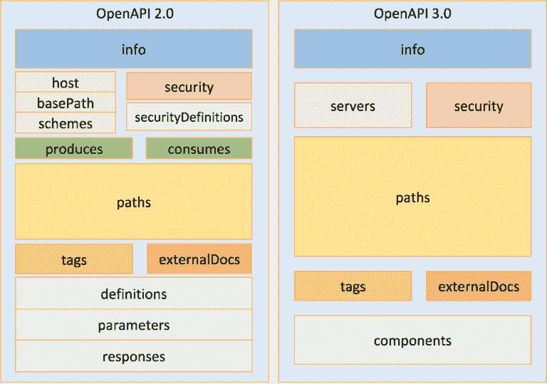

# 他们没有告诉你的五件事在 OpenAPI 3.0.0-RC0 中被改变了

> 原文：<https://dev.to/mikeralphson/five-things-they-didnt-tell-you-were-changing-in-openapi-300-rc0>

像[这篇文章](https://dzone.com/articles/what-you-need-to-know-about-oas-30)这样的文章在阐述 OpenAPI 3.0.0-RC0 实现者草案的主要变化方面非常出色。他们通常会有这样的照片:

[T2】](https://res.cloudinary.com/practicaldev/image/fetch/s--ieF6SHAc--/c_limit%2Cf_auto%2Cfl_progressive%2Cq_auto%2Cw_880/https://www.openapis.org/wp-content/uploads/2017/03/image00-1-768x539.png)

你可以通过它被复制和转发的次数来判断它有多优秀，通常不会检查诸如“`dataForm`参数”之类的错误(当然应该是`formData`)。

然而，一旦您开始深入研究该规范，就会有一些惊喜。

即使是 Marsh Gardiner 精彩的[演讲](https://youtu.be/4lBMQteMd6Y)也没有触及所有这些要点。

这里有五个改变，否则你可能会错过...

## 1。参数不再有类型属性

你没看错。我们都知道`body`和`file`参数已经消失了，但更令人惊讶的是，OpenAPI `parameter`上的`type`属性已经被移除，同时被移除的还有以下所有属性:

```
 'format',
    'minimum',
    'maximum',
    'exclusiveMinimum',
    'exclusiveMaximum',
    'minLength',
    'maxLength',
    'multipleOf',
    'items',
    'minItems',
    'maxItems',
    'uniqueItems',
    'additionalProperties',
    'pattern',
    'enum',
    'default' 
```

Enter fullscreen mode Exit fullscreen mode

~~参数现在默认为**非类型化**。除非另有说明，否则它们作为字符串使用。~~等待澄清，规范在这一点上有点模糊。

您现在需要声明一个`schema`属性来约束一个参数，甚至是一个基本类型。

```
 "parameters"  :  [{  "name"  :  "petId",  "in"  :  "path",  "description"  :  "ID of pet to return",  "required"  :  true,  "type"  :  "integer",  "format"  :  "int64"  }], 
```

Enter fullscreen mode Exit fullscreen mode

变成了

```
 "parameters":  [{  "name":  "petId",  "in":  "path",  "description":  "ID of pet to return",  "required":  true,  "schema":  {  "type":  "integer",  "format":  "int64"  }  }], 
```

Enter fullscreen mode Exit fullscreen mode

或者，一个参数可能有一个`content`属性(与`schema`互斥)，例如，如果一个参数被格式化为`application/json`。

听起来有点额外的工作？是的，但是它给了 OpenAPI 3 规范更多的灵活性和一致性。您可以用 JSON 模式描述的任何东西现在都可以成为您的类型。示例、缺省值、格式、`array`属性，都完全按照你在`requestBody`或`response`的模式中定义它们的方式工作。这是一个很大的变化，但我相信我们都会很快适应。

## 2。标头不再有类型属性

好吧，这有点作弊。正如我上面所说的，OpenAPI 3 规范的目标是一致性，这就是我们这里所拥有的。要定义一个标头的类型~~而不是无格式字符串，只需~~您必须声明或重用一个`schema`或`content`对象。

## 3。oAuth2 身份验证现在支持多个流

错过这个也是情有可原的，因为`securityScheme`对象有一个名为`flow`的属性，而不是`flows`。这是为 RC0 之后规范中可能的[改变](https://github.com/OAI/OpenAPI-Specification/issues/967)而准备的。

## 4。服务条款现在必须是一个 URL

据我所知，这一变化符合 Swagger / OpenAPI 2 定义中的绝大多数实际用法。我只发现了[一个在这个属性中包含附加文本的例子](https://github.com/APIs-guru/openapi-directory/blob/master/APIs/bigoven.com/partner/swagger.yaml#L7)。

然而，从我的经验来看，几乎任何东西都被解析为有效的 URL，所以你很可能通过任何出现的[验证器](https://github.com/mermade/swagger2openapi)。

## 5。关于可重用组件名的规则

对于可重用组件的有效名称，规则变得更加严格(例如，在 Swagger / OpenAPI 2.0 中，您在`parameters`、`definitions`和`responses`下的名称)。现在只有 a-z，A-Z，.、-和 _ 都是有效的。

## 资源

当然，现在还为时尚早，但是对 OpenAPI 3.0.0 的支持并不是不存在的，甚至在 RC0 阶段也是如此。

一个非官方列表已经开始收集支持新兴标准的项目。

## 包装完毕

我希望你在这篇文章中发现了一些有用的东西，但是如果我错过了什么，请不要犹豫，通过[电子邮件](//mailto:mike.ralphson@gmail.com)或 Twitter 上的@permittedSoc 联系我。

感谢@webron 对这篇文章的一些早期反馈。