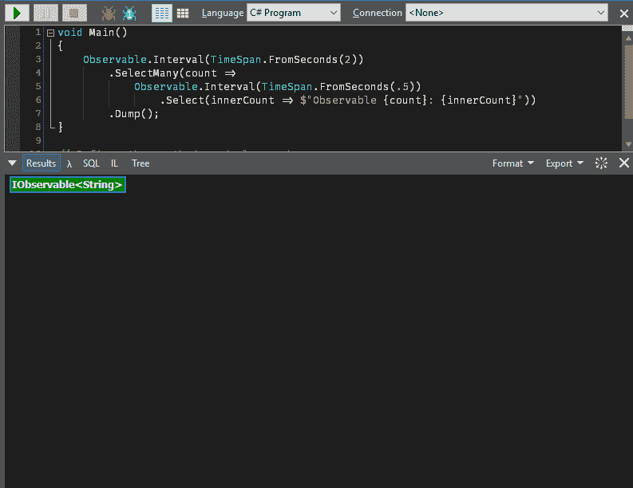
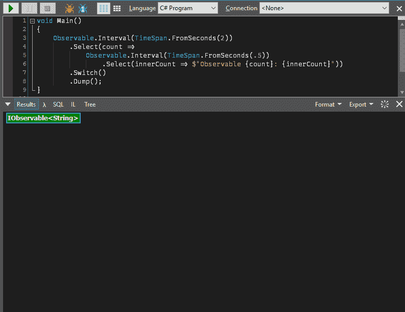
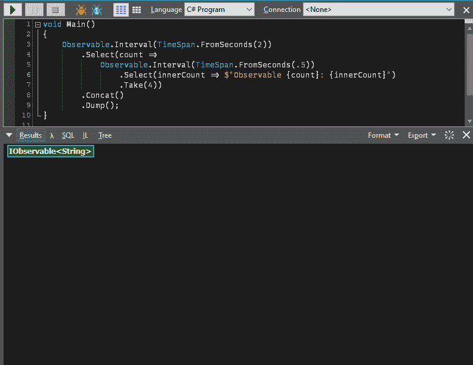

# Rx.NET 的扁平化现象

> 原文：<https://dev.to/jonstodle/flattening-observables-in-rxnet-e19>

经常地，当使用 Rx 时，你会以一个可观察到的事物结束:`IObservable<IObservable<int>>`例如。当你学习 Rx 的时候，你可能被告知使用`SelectMany`来*拉平*可观察的:

```
obs1
    .SelectMany(_ => Observable.FromAsync(() => DoWebCall()))
    ... 
```

Enter fullscreen mode Exit fullscreen mode

这使`IObservable<IObservable<int>>`变平为`IObservable<int>`。你可能会想“结案”，但是这里有一些事情需要考虑:`SelectMany`将合并所有返回到操作符内部的可观察值。让我们深入研究一下。

# 合并

为了更好地理解`SelectMany`，我们先来看看`Merge`。

我认为`Merge`最常见的用法要么是作为`Observable`的静态方法，要么是作为接受参数的操作符:

```
// As a static method
Observable.Merge(
    obs1, obs2
)
...

// As an operator taking an argument
obs1
    .Merge(obs2)
    ... 
```

Enter fullscreen mode Exit fullscreen mode

`Merge`也可以用作不带参数的运算符:

```
obs1
    .Merge()
    ... 
```

Enter fullscreen mode Exit fullscreen mode

这个`Merge`只对`IObservable<IObservable<T>>`起作用，或者说是一个可观测的。可观察的可观察的有点难以理解，所以有一种方法来思考它:

`IObservable<T>`是将来某个时候会发生的事情。未来可能在 1 毫秒或 10 分钟之外，不要紧，当它发生时，你会得到一个信号。该信号将包含 1 个类型为`T`的值。一个`IObservable<IObservable<T>>`是指当某件事预定在未来发生时会发出信号的东西。当预定的事情发生时，您将得到一个信号(该信号将包含 1 个类型为`T`的值)。

这是可以很快变得非常复杂的，这就是为什么合并这些可观测的。我们不会被告知添加了新的可观察对象，而是自动订阅新的可观察对象，并在现有的可观察对象中得到结果通知。

这就是`Merge`所做的。你给它一个`IObservable<IObservable<T>>`，你会得到一个`IObservable<T>`。每当有新的内部可观察对象时，`Merge`会自动订阅它，并将*下一个*和*错误*信号传递给外部可观察对象。

为了以这种方式使用`Merge`，我们可以像这样重写第一个例子:

```
// First example
obs1
    .SelectMany(_ => Observable.FromAsync(() => DoWebCall()))
    ...

// Rewritten
obs1
    .Select(_ => Observable.FromAsync(() => DoWebCall()))
    .Merge()
    ... 
```

Enter fullscreen mode Exit fullscreen mode

# 选择多项

您已经看到了`SelectMany`的基本工作原理:

1.  将信号转换为可观察值(`Select`)
2.  将信号合并到原始/外部可观测值中(`Merge`)

然而，想象一下，返回到`SelectMany`内部的可观察对象发出多个信号。在某些情况下，这是您所希望的，但是在进行 web 请求时，您很可能只对最近发送的请求感兴趣。`SelectMany`将传递任何返回的信号，不管它们是否有序。

这也许可以从视觉上得到最好的解释。这显示了一个`Observable.Interval`每 2 秒发出一个信号(这些信号再次被转换成字符串以便更容易区分它们)。该信号被转换成一个新的`Observable.Interval`，它将每隔半秒钟发出一次信号。

[T2】](https://res.cloudinary.com/practicaldev/image/fetch/s--_pXE9VXH--/c_limit%2Cf_auto%2Cfl_progressive%2Cq_66%2Cw_880/https://blog.jonstodle.com/conteimg/2017/10/selectmany.gif)

注意来自不同`Observable.Interval`的信号是如何相互混合的。这可能不是我们想要的。

# 开关

输入`Switch`。`Switch`对`IObservable<IObservable<T>>`也有效，但与`Merge`相反，它*将*切换到`IObservable<IObservable<T>>`内最近的`IObservable<T>`。

当`IObservable<IObservable<T>>`发出新的`IObservable<T>`时，`Switch`将取消订阅之前的`IObservable<T>`，并订阅新的`IObservable<T>`。这样，如果在你收到新的可观测数据后，它碰巧发送了一个信号，你就不会从先前的可观测数据中得到任何信号。

这个例子使用了一个`Select().Switch()`组合。请注意，我们只接收最近的`Observable.Interval`信号。

[T2】](https://res.cloudinary.com/practicaldev/image/fetch/s--ms7qwnJq--/c_limit%2Cf_auto%2Cfl_progressive%2Cq_66%2Cw_880/https://blog.jonstodle.com/conteimg/2017/10/selectswitch.gif)

# 串联

我要介绍的最后一个操作员是`Concat`。`Concat`也只允许一个*内部*可观察产生值，但它会等待前一个完成后再订阅新的。当一个*完成的*信号被前一个可观测对象发送时，`Concat`将订阅下一个，并在订阅下一个之前让它完成。

我们来看一张 gif:

[T2】](https://res.cloudinary.com/practicaldev/image/fetch/s--1bPWWZBx--/c_limit%2Cf_auto%2Cfl_progressive%2Cq_66%2Cw_880/https://blog.jonstodle.com/conteimg/2017/10/concat.gif)

每个可观察对象发出 4 个信号，当这个完成后，让下一个可观察对象发出它的 4 个值。

* * *

我在这些例子中使用的工具是 [Linqpad](http://www.linqpad.net/) 。如果你做任何事情，这都是一个很好的工具。网络开发。

编码快乐！