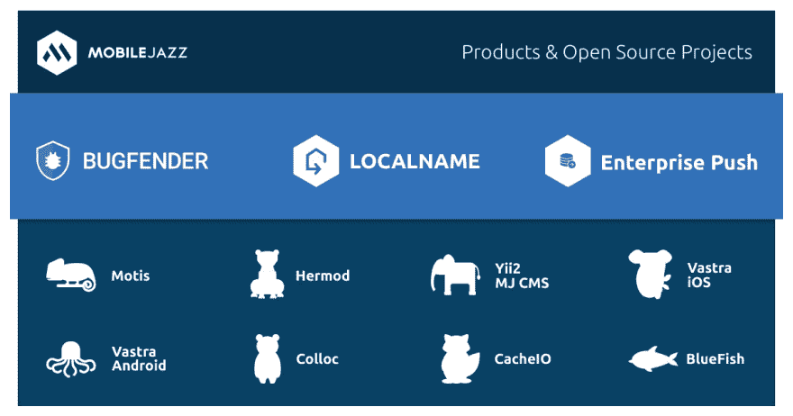
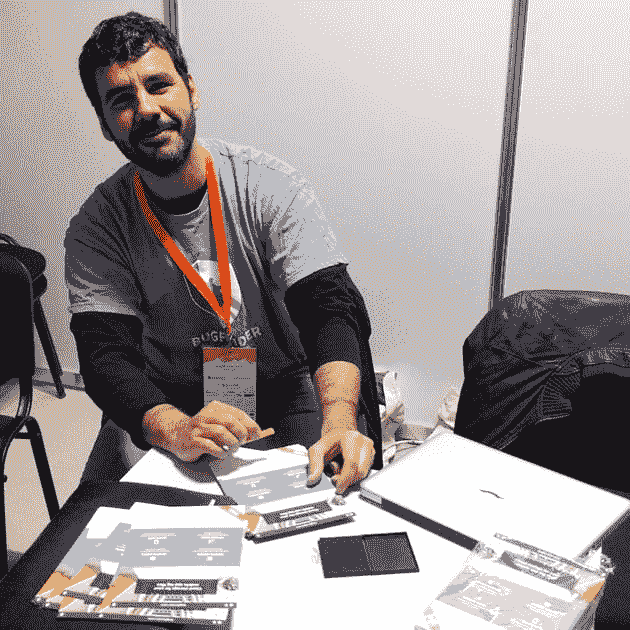
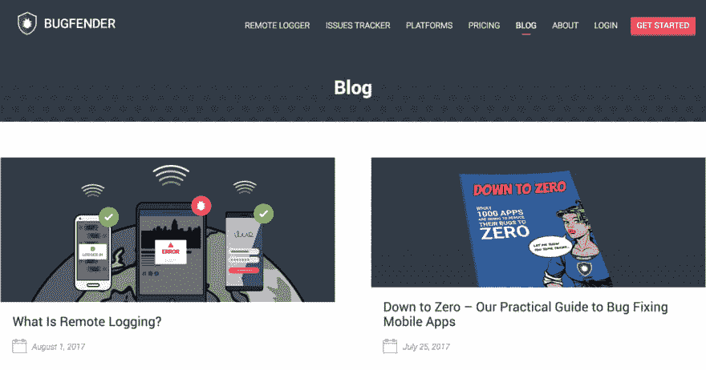
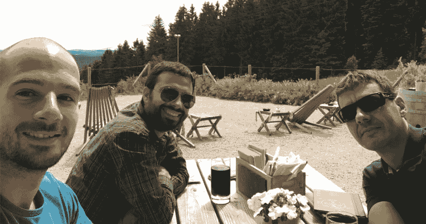
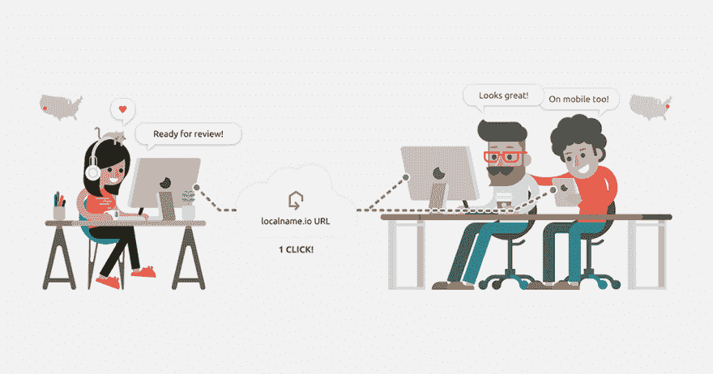
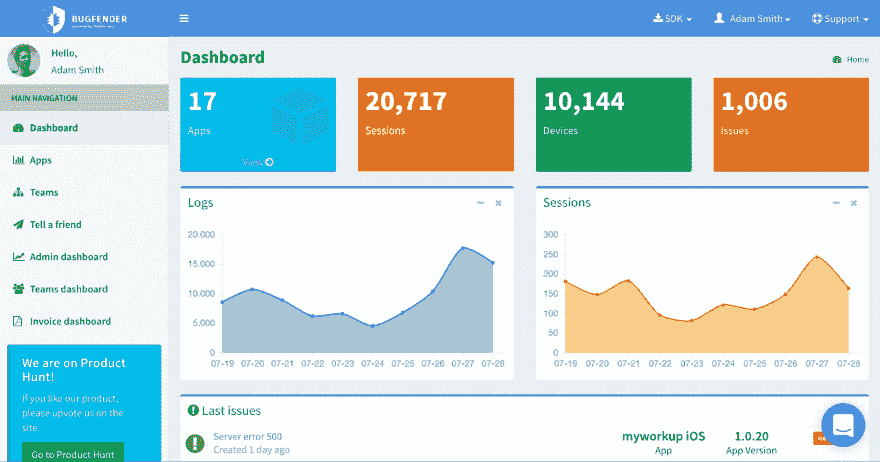

# 从引导产品中吸取的四个教训

> 原文：<https://dev.to/bugfenderapp/four-lessons-learned-from-bootstrapping-products>

*这篇文章最初发表在[我们的博客](https://bugfender.com/blog/four-lessons-learned-from-bootstrapping-products/)上。*

[T2】](https://res.cloudinary.com/practicaldev/image/fetch/s--6tGlulJW--/c_limit%2Cf_auto%2Cfl_progressive%2Cq_auto%2Cw_880/https://bugfender.com/wp-content/uploads/2017/08/bugfender-launching-products.jpg)

几乎每家软件咨询公司都有涉足产品的欲望——不依赖于用户付费的收入潜力太大了(我们最近[写了我们自己开发产品的理由](https://mobilejazz.com/blog/five-years-of-mobile-jazz-why-we-dont-want-to-be-google/))。但是从咨询到产品的跨越通常是困难的，如果不是不可能的话。在 Mobile Jazz，我们明白。在我们成立的第一年，我们开发了一款没有成功的产品，主要是因为我们在营销方面不够努力。三年前我们又尝试了一次，现在已经有了一个成功的手机应用登陆云端的产品，叫做 [Bugfender](https://bugfender.com) 。我们最近发布了两款新产品:[企业推送技术](https://mobilejazz.com/products/enterprise-push-technology)和[本地名称](https://www.localname.io)。

基于我们的成功和失败，我们想分享一些我们学到的东西，这些东西可能对其他考虑投入产品的咨询公司有所帮助。我们特别想分享我们作为开发人员构建产品的经验，因为我们觉得这是咨询公司的常见情况，也带来了一些独特的挑战。

首先要说的一件事是，这个列表上的课程没有一个是关于正确的产品实现的。这是因为大多数产品失败是因为[它们不适合市场需求或者在错误的时间](http://hbswk.hbs.edu/item/why-companies-failand-how-their-founders-can-bounce-back)推出，而不是因为团队在技术上失败。对于成功的咨询公司来说尤其如此，在那里团队已经有了成功构建软件的记录。因此，尽管你可能会试图将注意力完全集中在产品的制造上，但我们的经验与现有的研究完全一致:你应该同样或更多地担心制造什么以及如何销售。

[T2】](https://res.cloudinary.com/practicaldev/image/fetch/s--t3Pz87Be--/c_limit%2Cf_auto%2Cfl_progressive%2Cq_auto%2Cw_880/https://bugfender.com/wp-content/uploads/2017/08/bootstrapping-productsv2.jpg)

移动 Jazz 产品家族，包括我们的免费开源项目。

## 准备学习如何营销产品

我曾经是一家公司的成员，该公司用了大约 3-4 年的时间和一个 4 人团队一起开发了 4 种产品，但当它们卖得不好时，就把所有 4 种产品都废弃了。那是一大笔没有回报的钱！杀死产品的不是技术、功能或定价。是市场营销。这在咨询公司推出的产品中太常见了。

这家公司不是由白痴经营的。在这一点上，它是一家成功的咨询公司。大约在同一时间，他们在咨询销售和市场营销方面进行了投资，并取得了良好的回报。他们甚至最终在产品上取得了成功，但这是在学习如何营销产品的漫长而艰难的过程之后。

问题是营销和销售产品与销售咨询完全不同。似乎不应该有这么大的差别，但确实有。尤其是对于一个自举式的咨询公司来说，咨询销售大部分来自于口碑，对新客户的销售往往是由公司创始人来完成的。由讨人喜欢、知识渊博、值得信赖的创始人的个性驱动的面对面咨询推销很难转化为更广泛的销售和营销活动(尽管内容营销是一种可行的方式)。

[T2】](https://res.cloudinary.com/practicaldev/image/fetch/s--hnMdcha0--/c_limit%2Cf_auto%2Cfl_progressive%2Cq_auto%2Cw_880/https://bugfender.com/wp-content/uploads/2017/08/aleix-mobcon.jpg)

*Aleix 我们在保加利亚 Mobcon EU 的联合创始人。我们赞助的一个会议和一个对我们不起作用的营销策略。*

相比较而言，产品销售通常是不干涉的。对于一个软件即服务(SaaS)产品，所有的营销和销售可能根本不需要直接交互。即使对于相对复杂、需要亲自动手销售的产品，销售线索的产生通常也是相对不需要动手的营销。

那么，在学习销售产品时，如何才能避免犯代价高昂的错误呢？你如何建立高度自动化、可重复的销售和营销流程来帮助发展产品业务？

当然，没有神奇的解决方案，因为每个产品和目标市场都是不同的。更不用说预测人们对营销活动的反应是非常困难的。

最好的方法是做大量的实验，并清楚地跟踪结果，这样你就能看到什么是有效的。我知道这在很多方面都不是特别令人满意的建议。对于我们许多有技术背景的人来说，没有一个清晰、合理的计划可以遵循是令人沮丧的。但重要的是要知道，对于一个产品来说，成功的销售和营销没有一条简单、容易遵循的道路。

你必须计划花大量的时间——但不一定是很多钱——去做实验。如果你把实验做小，尝试许多创造性的选择，不要执着于什么“应该工作”,根据专家的说法，你应该能够在适度的预算内找到正确的方法。

如果你没有任何营销经验，有大量的建议可供参考。但我建议你将营销专家的想法——无论是一般的在线建议还是付费咨询——视为一个很好的尝试来源，而不是对你的产品应该起作用的预测。即使是最好的，最有经验的营销人员也不知道什么最终会对你的产品起作用。最好的营销人员会告诉你同样的事情，并强调实验的价值。

对于 Bugfender，我们希望能够简单地在脸书和谷歌上放一些广告，然后就完事了(什么“应该工作”)。脸书和谷歌赚了几十亿美元是有原因的，对吗？但是结果并不好。之后，我们尝试赞助会议、开发者通讯和播客。还是一无所获。

[T2】](https://res.cloudinary.com/practicaldev/image/fetch/s--74jROlyO--/c_limit%2Cf_auto%2Cfl_progressive%2Cq_auto%2Cw_880/https://bugfender.com/wp-content/uploads/2017/08/bugfender-blog.jpg)

撰写全面彻底的博文是我们推广 Bugfender 的一种策略。

最终，我们登陆了有深度、有见地的博客帖子(内容营销)，回答了 StackOverflow 和 Quora 上的问题，以及 Hacker News 和 Reddit 上的评论。这是一个让我们感到惊讶的营销计划，但它帮助我们建立了一个非常大的用户群，并转化为足够多的付费客户，从而拥有一个成功的产品。

从我们的经历中学到的一些东西。

首先，我们尝试的所有方法都适用于许多产品，只是其中一些不适合我们的产品和客户。如果你认为销售和营销是接触那些需要你产品的人的一种方式，那么你需要通过实验找到那些人聚集并寻找解决方案的地方，这是有意义的。如果人们在积极搜索你的产品，你可以找到正确的关键词，谷歌搜索广告会很棒。但是对我们来说，我们的潜在客户经常以一种更普遍的方式思考或谈论他们的问题。这使得更有教育意义的内容，如博客帖子、评论和问题答案，更适合。

第二，我们采用的方法是我们必须自己做的事情。我们可以在博客帖子、回答和评论中展示的洞察力和专业知识有助于说服我们的目标客户——持怀疑态度的软件开发人员——这是非专家或广告所写的内容所无法做到的。当然，这意味着我们必须继续参与。但好处是，它凸显了我们最大的资产之一。Bugfender 是我们为了解决我们的问题而制造的。我们对应用开发者的需求有着独特的见解。这种营销方式突出了这种优势。

[T2】](https://res.cloudinary.com/practicaldev/image/fetch/s--V69nOrUX--/c_limit%2Cf_auto%2Cfl_progressive%2Cq_auto%2Cw_880/https://bugfender.com/wp-content/uploads/2017/08/bootstrapping-products-7.jpg)

*Bugfender 的联合创始人在德国黑森林成立公司。*

最后一点与第二点有关。我们自己做营销，而不是使用营销代理。当然，这可以省钱，但是对于一个产品，如果你可以花两倍的钱在营销上来获得 10 倍的利润，那么你绝对应该花这笔钱。但我在与许多营销机构合作后得出的结论是，它们很少对营销新产品有帮助。这并不是说大多数人不擅长他们的工作，只是他们没有专注于营销以前不知名公司的新产品。当有很多大公司想要花很多钱反对相对宽松的目标时，他们为什么要这样做呢？大多数营销机构都没有优化到处理与营销新产品相关的相对少量的资金和非常具体且可衡量的目标(就像大多数软件咨询公司没有优化到为几乎没有资金的自举产品创业公司构建产品原型一样！).如果你能找到那个营销代理，那太好了。但是请注意，大多数人并不是这么做的。

建立一个内部团队来做产品营销(或者只是学习自己做)也有很多其他的好处。让市场营销与整体产品战略保持一致要容易得多。而不仅仅是对齐。如果你做得好，营销可以影响你的产品方向。了解哪些营销信息能引起共鸣是了解客户需求的好方法。您获得的专业知识也可以应用到您咨询的其他产品或营销中。成为一个伟大的营销，就像成为一个伟大的开发者一样，并不容易，需要不断的学习。但是你职业生涯的回报是巨大的。

## 尽早决定市场定位、商业模式和定价

虽然有时感觉创业公司只是随机地从一顶帽子里挑出一种商业模式，从另一顶帽子里挑出一个行业，为某样东西打造下一个优步，或为另一样东西打造蓝色围裙，但商业模式和定价往往对你的成功有着巨大的影响。人们很容易专注于一个产品能做什么——尤其是对技术人员来说——而忽略了如何用这个产品赚钱的细节。但是，弄清楚你将如何在市场中定位自己、你的商业模式以及收费多少是至关重要的。

让我们继续用优步来解释一下我的意思。优步一开始是为了以更便捷的方式向客户提供“黑车”服务。因此，它被定位为一种优质服务，定价高于出租车，以符合这一定位。随着他们的发展，他们直接用他们的优步 X 产品(允许司机使用不太优雅的汽车)来对付出租车，并相应地调整价格。如果他们没有改变市场定位，他们就不会发展得这么快。但即使他们的定位发生了变化，他们的基本商业模式——通过他们的应用程序轻松支付——仍保持不变，这也是他们吸引力的核心部分。一个需要现金或者只作为订阅服务出售的优步看起来很可笑。正如优步所阐述的，围绕市场定位、定价和商业模式的所有变量，以及你如何改变它们或保持它们不变，都会影响客户对产品的看法，并最终影响他们是否会为此付费。

[T2】](https://res.cloudinary.com/practicaldev/image/fetch/s--odmGrZmC--/c_limit%2Cf_auto%2Cfl_progressive%2Cq_auto%2Cw_880/https://bugfender.com/wp-content/uploads/2017/08/bootstrapping-products-3.jpg)

Localname 为开发人员的本地机器提供了一个安全通道，允许他们轻松地共享他们的工作。

对于 Mobile Jazz，我们有三种产品，每一种都有不同的商业模式。不是因为我们喜欢复杂，而是因为每个产品的成功需要不同的东西。

对于 Bugfender，我们使用“免费增值”模式，你可以在一定程度上免费使用这项服务，但之后你需要成为付费用户。对于开发人员来说非常容易上手的产品，这种模式非常有效。他们免费试用我们，我们帮助他们解决难题，说服他们成为付费客户要容易得多。

对于我们的企业推送技术，我们提供易于使用的推送通知服务，该服务具有难以置信的可扩展性并托管在您的基础架构中，因此您不必将敏感数据交给第三方提供商。该产品的定价高于 Bugfender，反映了它的关键基础架构角色、复杂的支持要求以及我们允许深度定制的意愿。因为我们的企业推送技术客户通常有复杂的要求，集成需要更多的投资，并且持续支持更加复杂，所以我们对每台服务器收取初始安装费和年度订阅费。

我们可以使用这两种应用的商业模式和定价策略。相反，我们根据产品以及有助于产品在市场上取得成功的因素来定制方法。

尽早考虑这些问题很重要，因为它们会对开发产生重大影响。例如，我开发的一个安全产品是基于这样的假设，即高端安全产品的更便宜、更灵活的版本有市场。但是，一旦开发完成，我们发现替代方案的价格实际上比我们想象的要低得多，尽管我们提供的灵活性很好，但我们提供的较低的安全性扼杀了太多交易。因此，我们只剩下一款定位和定价都很糟糕的产品，而要避免这些错误，就需要在产品开发上投入更多资金。不是个好地方。

在这些事情上做出正确的选择是困难的。你需要很好地了解你的竞争对手，远离你想要打造的产品，这样你就可以像潜在客户一样看待它，并获得真正潜在客户的意见。但是要注意:人们并不总是擅长预测他们会做什么。所以，即使你有很多人说他们会为一件产品付给你 X，你也不能确定他们会，直到他们真的买了。所以要做好发布后进行修改的准备。不过，请记住，降低价格往往比提高价格更容易，所以考虑先从更高的价格开始。

### 坚持你所知道的

还记得我说过大多数公司失败是因为他们生产的产品不符合市场需求吗？无论是从产品的整体功能还是单个功能的细节来看，都是如此。避免这些错误的一个很好的方法是构建一些东西来解决一个你已经非常了解的问题。

[T2】](https://res.cloudinary.com/practicaldev/image/fetch/s--Lol10hCm--/c_limit%2Cf_auto%2Cfl_progressive%2Cq_auto%2Cw_880/https://bugfender.com/wp-content/uploads/2017/08/bootstrapping-products-4.png)

*我们的远程记录器和控制台 Bugfender 的应用内截图。*

许多咨询公司这样做的一个方法是开发一个产品的核心，作为他们咨询工作的副产品。Bugfender 最初是我们为客户开发移动应用程序时开发的一个内部工具。我们需要一种从移动应用程序收集日志的方法，并且不喜欢市场上的产品。所以我们为自己建造了 Bugfender。当我们将它投入生产时，我们意识到许多其他公司在我们的位置上可能有同样的需求。

通过使用这种策略，我们消除了很多风险。我们知道产品满足了需求。我们也知道它如何适应类似工具的市场，因为我们首先试图找到其他人的产品来购买。这意味着我们对产品和潜在客户有非常清晰的认识。

我们也有一个工作原型，消除了很多技术风险。虽然我们必须继续投资维护产品，但这项工作与我们的咨询工作相关，并使其受益。

使用这种策略，你必须小心确保你构建的产品是通用的，以便它对各种各样的人都有用。产品是有趣的东西。虽然他们必须满足一种需求，但他们需要满足广泛人群的需求，才能在经济上有意义。这不同于许多作为咨询合同建立的东西。大公司的内部工具通常是有意为特定环境或工作流程定制的。大公司通常也有能力制造看似产品，但实际上更多是为了营销的东西。我曾经遇到过一个人，他为一家大型的全国性快餐连锁店开发了一个全动画的交互式汉堡制作应用程序。我很有信心，虚拟汉堡店没有巨大的市场需求，简单的菜单就足够了。但我敢肯定，应用程序截图在营销材料中看起来很棒。

[T2】](https://res.cloudinary.com/practicaldev/image/fetch/s--ajlaaA0L--/c_limit%2Cf_auto%2Cfl_progressive%2Cq_auto%2Cw_880/https://bugfender.com/wp-content/uploads/2017/08/bootstrapping-products-6.jpg)

*移动爵士乐团队成员在开普敦设立远程办公室。*

## 先决定成功是什么样子

开发一个产品是一项投资——它至少会占用付费工作的时间。如果你开始一个营销或销售活动，或者产品不是你可以自己构建的纯软件，它可能需要现金投资。如果你不小心的话，你可能会在一个产品上投资很多，而你永远也不会回来。

麻烦很少一开始就出现。你制定一个关于产品需要多长时间的计划，然后创建一个漂亮的电子表格来预测客户增长(“我们所要做的就是让十亿人口中的 0.05%购买我们的产品，我们就发财了！”).假设你能做一个基本的预算。

然后现实开始了。也许产品的开发时间比你希望的要长。或者营销没有你帮助的那么有效。或者你发现你的目标行业的销售周期很长，而且是周期性的，这是你没有意识到的。

最危险的地方是当你有一个产品在市场上有一些销售——所以它不是一个明显的失败——但它仍然不能自我维持。因此，你必须每月决定是继续投资还是终止产品。人们很容易认为多一个功能就能让你达成交易，或者只是在营销上多花点钱就能产生你需要的流量。

[这就是我们面对 Bugfender](https://bugfender.com/blog/three-years-bugfender-9-5m-users/) 的情况:

> “我们想看看我们的产品是否有需求，所以一开始我们完全免费提供。最后，在 2015 年 9 月，我们推出了付费订阅层，我们的第一批付费客户也很快跟进。快进一年，到 2016 年 6 月:17 个付费客户。每月经常性收入(MRR)略低于 1000 英镑/月。每月花费在开发、数据存储、客户支持和营销费用上的烧钱率为 3000-5000 英镑。不需要会计师就能看出我们在谈论扼杀产品。”

在这种情况下，做一些基本的商业规划和财务建模是很重要的(努力不让[沉没成本影响你的决策](https://en.wikipedia.org/wiki/Sunk_cost))。

最安全的方法是在开始开发产品之前决定你的投资有多大。这就像带着你愿意输掉的现金走进赌场一样。如果把带借记卡的钱包放在家里，根本没办法花太多。在你开始之前决定停止点应该是什么更容易，因为在产品赌博的过程中，你的情绪或中头奖的诱惑可能会诱惑你下太大的赌注(好吧——我保证在这之后不会再有赌博的比喻)。

但我建议大多数服务公司不要仅仅为了财务回报而开发产品。通常还有附带的好处:学习新技术，磨练营销技巧，为咨询业务带来商机，或者让你的公司所在的社区受益。虽然你不能忽视财务问题，但如果产品销售不如你所愿，牢牢把握成功的样子会有所帮助。

如果你已经思考过成功是什么样的——最好写下来——如果困难时期来了，做决定会更容易。如果你的主要目标是学习一项新技术和尝试一些市场营销，那么把一个在财务上不成功的产品视为在其他方面的成功并关闭它会更容易。类似地，如果产品本身没有产生很多收入，但它是你的咨询公司的一个很好的潜在客户，那么继续投资作为营销费用就更容易被证明是合理的。

## 最后的想法

制造和销售产品是艰苦的，但却是非常值得的工作。如果你有一家财务状况良好的咨询公司，并且你有尝试产品的愿望，这是一次很好的学习经历，也有助于你成为一名更好的顾问。如果你尝试产品，我希望这篇文章能给你一些考虑。但是——就像经营自己企业的其他事情一样——你最终只需要尝试一下，保持开放的心态，继续做更多对你有用的事情。