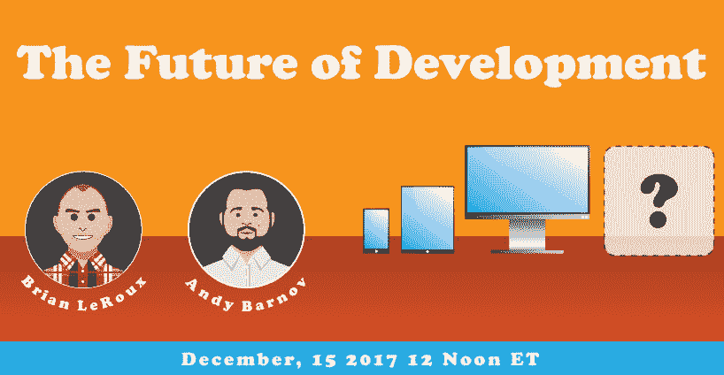

# 从科尔多瓦到机器人再到无服务器——布莱恩·勒鲁访谈

> 原文：<https://dev.to/remotesynth/from-cordova-to-bots-to-serverless---an-interview-with-brian-leroux-1nk>

[Brian Leroux](https://twitter.com/brianleroux) 是我将于 12 月 15 日(美国东部时间)下周五中午 12 点举办的免费[发展的未来](https://certifiedfreshevents.com/events/future-of-development/)在线活动的主讲人之一。

[T2】](https://certifiedfreshevents.com/events/future-of-development/)

Brian 和我在 Adobe 工作时相遇——他帮助领导 PhoneGap 和 Apache Cordova，这两个项目都属于我当时的工作范围。几年后，我们在盐湖城的 PhoneGap Day 上偶遇，他告诉我他专注于机器人的新创业公司，但最近他因创建了一个名为 arc.codes 的工具而获得了很多关注，该工具用于构建无服务器架构。在这次采访中，Brian 解释了这一旅程以及为什么无服务器很重要。

> 对于那些可能不了解你的读者，请简单介绍一下你自己，并概述一下你的技术/开发背景？

我写代码已经有很长时间了，但是可能我做的第一件引起人们注意的事情是 2007 年左右的 wtfjs.com。几年后，我和一群不合群的人创建了 PhoneGap，该公司于 2011 年被 Adobe 收购。在那里，我有幸主持了 Apache Cordova 的开幕式。所有的移动工作让我接触到了信息、机器人和——有点奇怪——无服务器。

> 你目前共同创立的小赢公司专注于什么？是什么激励你创建了这个企业？

“小胜”是我们的运营名称，反映了渐进主义的核心理念。我们的产品是[begin.com](https://begin.com/)，这是 Slack 的一个任务应用。大约在 2014 年，移动已经商品化，赢家显然是谷歌和苹果，有趣的是，通过移动应用的采用已经停止。移动市场仍然很大，但是已经没有增长了。所以最大的问题是:人们的注意力在这些设备上做什么？答案是信息传递。Slack 在 2015 年刚刚开始飙升，当时我和我的联合创始人瑞安(Ryan)看到，如果我们立即开始开发消息应用程序(有时被称为机器人)，就有机会提高生产率。

> 从事机器人工作是如何让你进入无服务器领域并创造出 [arc.codes](https://arc.codes/) 的？

是的，这是我没想到会发生的事。如果有什么不同的话，那就是我避免了。在驾驶 PhoneGap、PhoneGap/Build 和 Cordova 近十年之后，我对整个开发人员工具领域已经有点厌倦了。不要误会我喜欢它，但我已经准备好与 Ryan 一起深入消费者生产力和应用领域。那是 2015 年 11 月左右。我们面前是一片绿地。选择构建云是显而易见的。选择 AWS 无疑是风险最低的选择。机器人、实时自然语言处理、对话式用户界面和机器学习看起来风险很大！面对如何建立我们的初始基础架构，puck 显然要转向整个无服务器/功能即服务模式。你必须记住创业是有风险的。我们能得到的任何优势，任何东西，我们都会得到。API Gateway 在那年 7 月刚刚发布。我稍微摆弄了一下，意识到我们可以在几秒钟内实现部署到 HTTP 端点的零宕机。我从未见过这样的事。所以我们没有多想就去做了。

起初，事情很棒，但是团队很小，我们只有不到十几个端点。记住自动化工具是完全不存在的。有一个叫 JAWS 的东西，但是它并不比我们拼凑的 Bash 脚本好多少。(后来，它变成了著名的框架和风险投资支持的创业公司 Serverless。)没有云系支持。没有平台支持。更糟糕的是，我们的开发方法实际上是低劣的脚本和清单。不可避免地，事后看来也不奇怪，它开始分崩离析。我们不知道我们在哪里部署了什么。我们有几乎不可能追踪的错误，更不用说重现和修复了。

我们不得不自动化我们的基础设施供应和部署，因为我们陷入了深深的困境。我们创建了一个清单格式。arc 是对其他 UNIX-y 配置清单的认可，如。bashrc 或. vimrc。最初的格式代表 Amazon Run 命令，但今天我会说架构运行命令。

我们自动对抗。带有 npm 脚本的 arc 清单。事情很快变得可以预测。我们的节奏大大提高了。我们的质量和解决问题的速度紧随其后。其他方法开始得到关注，我们觉得我们有一个更好的答案。很多框架都是以成为一个框架为目标而构建的。我们建造了。弧来制造一个产品，它显示。它专为快速建立 web 和 Slack 应用程序而设计，并预烤了试运行和生产环境。资源调配需要几分钟。部署以秒为单位。

因此，我不认为云基础设施项目能制造出好的产品，我还非常强烈地认为，不是我们核心产品的专有代码是一种负债，而不是资产。开放代码是更快的代码。许多眼球确实使所有的错误变得肤浅，从性能和安全性的角度来看，这是一个很好的质量强制函数。Ryan 和我争论了很久，我有点不敢相信我会再次这样做，但这对公司来说是最好的想法，所以我们和 JS 基金会谈了谈，并向他们捐赠了代码和版权，以确保代码和治理是开源的。我们在 2017 年 7 月的节点峰会上以 JSF 建筑师的身份宣布了它，尽管我们通常称它为“arc”。

> 对许多人来说，无服务器似乎只是一个时髦词。为什么你认为开发人员了解它很重要？你认为会对未来的发展产生什么样的影响？

这是一个流行语！完全托管基础设施的想法显然不是什么新鲜事，但去除服务器隐喻的想法却是新鲜事。这是非常新的，也是微服务上的一个超级强大的进化。以这种方式构建的系统具有我从未见过的理论上无限可用性的抗脆弱性。当每个端点都独立部署时，很难关闭系统。零停机的部署可以在几秒钟内完成，这意味着您可以获得更多的迭代。更多的迭代意味着你在寻找产品/市场契合度上有优势。*你学得更快。*价格也不错。1000 万次处决相当于每月 1 美元。

作为一名开发人员，最终更快、更有弹性是让我兴奋的部分。

至于影响，我不知道，但有一个有趣的想法实验，这种水平的管理基础设施可能会导致第一个单独的员工十亿美元的创业公司。我喜欢这个想法中的雄心。有了传统技术，一个雇员数十亿美元的公司绝对不是不可企及的。

> 你的陈述说 arc.codes 在“简单模式”下是无服务器的，但没有给出整个陈述，你能解释一下这是什么意思吗？

JSF 建筑师在其关注创造快速迭代方面大放异彩。任何拥有 AWS 帐户和文本编辑器的人都可以在几分钟内启动一个端点。在另一个 20 你可以有一个自定义域名传播完全与一个完全可扩展的后端。这就是我们要做的。

[免费报名发展的未来！](https://certifiedfreshevents.com/events/future-of-development/)