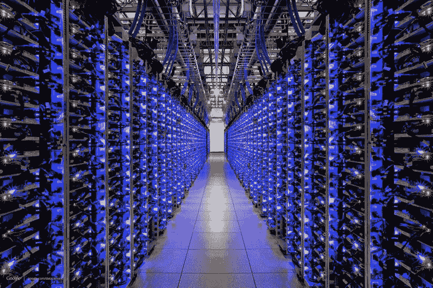

# 从产品制造商到服务提供商。关于软件开发进化的思考

> 原文：<https://dev.to/matteojoliveau/from-product-makers-to-service-providers-thoughts-on-the-evolution-of-software-development-d01>

### 我们用来运送产品。

[T2】](https://res.cloudinary.com/practicaldev/image/fetch/s--Z_GXoSeG--/c_limit%2Cf_auto%2Cfl_progressive%2Cq_auto%2Cw_880/https://matteojoliveau.com/conteimg/2017/08/Data-Center.jpg)

我们是工匠，拉勒维尔称我们为工匠。

我们花了几个月的时间计划一个项目，编写代码，打磨粗糙的边缘(嗯，说实话，不是每个人都做这个部分...)发布之前，让我们的用户没有发现任何问题。

当用户想要使用我们的软件时，他们必须购买，然后我们以下载或物理介质的形式发送给他们。他们拥有软件，即使他们不被允许用它做任何他们想做的事情，他们也不需要与我们交谈太久。

 

**现在已经不是这样了**。软件作为产品的时代已经一去不复返了，下载、安装和更新的时代已经一去不复返了...

嗯，还好还没有。但我能预见它的到来。 ***软件即服务*** 范式开始在软件领域扎根，用户已经习惯了。就拿谷歌的云服务来说，比如 [Gmail](https://mail.google.com) 或 [Inbox](https://inbox.google.com) 、 [Google Docs](https://docs.google.com) 和 [Drive](https://drive.google.com) 。

拿 [YouTube](https://www.youtube.com/) ，或者 [Skype Web](https://web.skype.com/) 。

甚至拿整个概念的*智能手机*来说，这是整个计算机历史上最常见、最普及的个人设备。

* * *

人们开始将 ***云*** 视为一个不断增长的强大计算平台，我不仅仅是指学生在谷歌文档上写笔记。我说的是大公司将他们的本地基础设施搬走，开始使用 *IaaS* ，比如[亚马逊 AWS](https://aws.amazon.com/) 或 [MS Azure](https://azure.microsoft.com/) ，像我这样的开发人员不需要将他们的软件发送给一个有完整部署手册的系统管理员来查看他们的应用程序运行。

例如，在我目前的工作场所，我们使用一个私有的 [Red Hat OpenShift](https://www.openshift.org/) 实例来部署我们解决方案的开发版本。它很容易使用，并且在**做得很好，让开发人员远离复杂性**，这样他们可以专注于全速前进的编码。

我们不再需要购买机器来运营我们的业务[【1】](https://matteojoliveau.com/from-product-makers-to-service-providers/#fn1)。我们只需使用网络浏览器并部署我们的软件。

您可以隐藏所有与硬件相关的问题，让您的开发团队继续运行并开发新功能,而不会牺牲用户体验。

* * *

在用户方面更好:硬件成本正在下降。不再需要功能强大的计算机或便携式设备，廉价、高能效的硬件可以利用远程机器的能力运行所有现代计算任务。

一些人接受了这个想法，并将其带到了一个疯狂的水平，用 ***cloud IDEs*** 和开发工具，如 [Eclipse Che](https://eclipse.org/che/) 、 [Codenvy](https://codenvy.com/) (它使用了前面提到的 Eclipse)和 [Cloud9](https://c9.io/) ，这些工具让你像在电脑上一样编码和开发软件，但却是从网络浏览器上。

* * *

Chromebooks 是这种心态转变的一个很好的例子。笔记本电脑存在的唯一目的是运行 **Chrome 网络浏览器**，完全依靠云的力量为**主流用户**提供他们需要的轻度生产力和内容消费环境，以低成本和非常低的规格出售。

他们是 ***即服务*** 理念的精髓，是我们现在正在软件行业构建的分布式世界的精髓。

* * *

#### 更轻松、更安全

当软件的新版本或补丁发布时，我们必须通知客户他们可以更新他们的应用程序。他们并不总是听进去。即使有一些形式的自动更新，安全风险仍然存在，遗留版本的维护仍然必须完成。LTS、候选版本、补丁、补丁，对于一个只想写电子表格穷用户来说，太多复杂的东西需要处理。

使用**基于云的方法**，通过将你的应用作为*软件即服务*分发，你将所有的负担**从用户的机器**上移开。安全更新和新版本可以直接部署在您的基础架构上，并立即提供给您的用户。忘记更新和下载链接，用户甚至不会注意到它就有了最新的版本。

* * *

#### 但也有弊端

当然，在我们的世界里没有什么是完美的，在软件世界里也是如此。

通过将所有的计算转移到云基础设施，你就**增加了你这边的计算需求**。更高的需求意味着更高的成本和更复杂的后端，可能是容错和冗余的，以便您的客户不必经历任何停机或数据丢失。

* * *

#### 还有很多事情要做

我们总有一天会到达那里。一个共享、分布式计算的世界，对最终用户来说，复杂性接近于零，对开发人员来说高度抽象，对系统管理员来说简单、标准的平台维护。

我们还没有完全实现，但是通过正确的努力 ***服务土地*** 可以很快成为现实。

* * *

* * *

1.  嗯，我们还是得租一台服务器来运行 OpenShift Origin。但是如果我们使用商业版本的话，它可以在 Red Hat 的基础设施上运行。 [↩︎](https://matteojoliveau.com/from-product-makers-to-service-providers/#fnref1)