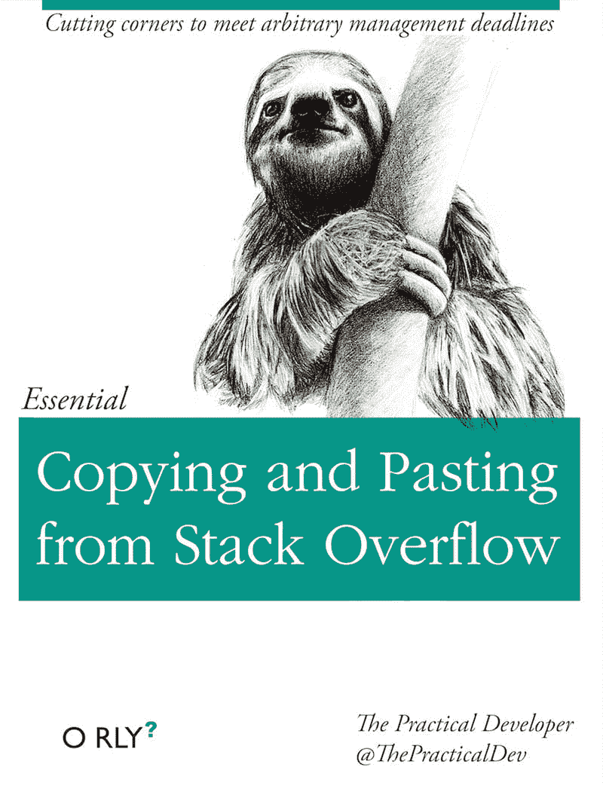

# 让“非技术”人员也写代码

> 原文：<https://dev.to/ben/get-non-technical-people-writing-code-too>

我的组织最近开发了一个新的绿色领域项目，为了避免我们以前遇到的一些复杂情况，我为这个项目制定了一个重要的标准，即“业务”人员应该能够在对他们有意义的时候直接为项目做出贡献。基本上，他们需要学习一些 CSS、HTML 和基本的 JavaScript，这样他们可能不得不无知地与我和其他开发人员交流的许多事情现在都是他们的领域了。我为一家小公司工作，所以你对这些想法的理解可能会有所不同，但我认为大多数原则都是通用的。

为什么这是一个好主意有两个主要原因:他们从你的盘子里拿走了许多小的修正，并且他们获得了对导致更好的选择和交流的过程的更大尊重。

当然，这个项目必须围绕这样一个理念来设计，即任何拥有基本技能的人都可以为之做出贡献。你需要做一些重要的决定，安排好事情，这样他们才能有所贡献。我不期望他们会破坏主要的应用程序逻辑，但是各种简单的网站页面最终会成为维护负担，需要经常更改，至少在我的世界里是这样。通常所需的改变很简单，但转换成本很高，如果最关心他们的人去做，事情会变得更容易。我还认为，当人们埋头做事情时，会取得最好的结果。在其他情况下，很多东西会在翻译中丢失。

另一种让业务类型做小改动的方法是在 Squarespace 或其他软件上托管部分站点。但是这些往往是相当容易泄漏的抽象，从长远来看限制了雄心勃勃的组织。如果您想要实际实现您最终需要的定制解决方案，您最好自己动手。

## 模块化之上的封装

根据我的经验，需要强调这种策略的设计原则是，你不应该太努力地重用项目中为半技术贡献者隔离的部分的任何代码或标记。你最好把注意力集中在分割每一件正在做的事情上，这样它就不会和其他事情紧密地联系在一起。如果没有经验的人接触到一个页面，代码会变得混乱，这没关系。与拥有一个对每一次触摸都敏感的代码库相比，拆除一个页面并重新构建它要容易得多。任何“不要重复自己”的观念都应该被扔出窗外。让人重复自己。您可以持续评估将元素作为可重用模块取出是否可行，但是不要过早地这样做。

[T2】](https://res.cloudinary.com/practicaldev/image/fetch/s--ZwQ9bLnJ--/c_limit%2Cf_auto%2Cfl_progressive%2Cq_auto%2Cw_880/http://res.cloudinary.com/practicaldev/image/upload/fl_progressive%2Cq_90/v1460124667/bigsloth_small_desndr.jpg)

## 避免构建工具和任何过于花哨东西

在这些过程中，移动的部件越少越好。不要使用 Postcss 或任何其他花哨的插件或库。坚持使用本机支持的基础知识和技术，因为这部分开发将真正是堆栈溢出驱动的开发。

除了选择基本软件之外，还要确保实施严格的约束，以确保上述封装，并从根本上防止事情失控。采取措施防止“全球”空间受到任何形式的污染。不要鼓励混乱的黑客行为，但要接受它们在这个系统中不可避免的存在。

## 结果

即使您最终会得到一些单独损坏的页面，如果您针对封装进行了优化，您仍然会得到一个可维护的代码库和一个更专注的技术团队。商务人士将能够在像素上做文章，并复制他们最关心的地方，因为他们只是在代码库中工作，没有 CMS 或其他系统的开销，你必须维护。我想你会看到，商界人士也会对这一过程产生更多的欣赏，并在未来对你的投入变得更加开放。所有的交流渠道都将变得更加开放，这将是一个重要的共情胜利。

提出这个想法可能是这个过程中最难的部分，这取决于你和谁一起工作。我当然知道一些和我一起工作过的人会百分百不接受这个想法。我建议不要太急于求成，逐渐向他们介绍这个概念。要意识到，与命令行相比，他们使用 Github Desktop 这样的工具很可能会更加得心应手，所以你应该尽可能地让每一次转换变得简单。如果做得好，我认为这一过程有助于形成一种更健康、更具交流性的文化。