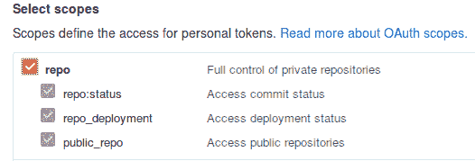

# 使用 Pronto 对您的拉取请求进行静态分析

> 原文：<https://dev.to/epergo/get-static-analysis-of-your-pull-requests-with-pronto>

几乎在每种编程语言中都有静态分析工具来评估代码质量，并检查它是否遵循了一系列基本的样式规则。

这一点非常重要，因为在一个有许多开发人员参与的项目中，如果每个人都遵循一套通用的规则来生成代码，那么阅读、理解和协作将会更加容易。

例如，在 Ruby 中，我们有 [Rubocop](https://github.com/bbatsov/rubocop) 作为样式(和更多)规则的参考。这些规则是由 ruby 社区创建和维护的。

Rubocop 可以安装在我们的开发环境中，并在我们的日常工作中用来检查我们生成的代码是否遵循 Rubocop 的风格指南，但是这个过程并不像它应该的那样有效，因为它依赖于开发人员来检查和修复它的代码。

为了改进这个过程，我们可以使用已经存在的多个 SAAS 中的任何一个来检查我们项目的 Pull 请求，比如 [HoundCI](https://houndci.com/) ，但是如果我们已经配置了一个持续集成系统，我们就不需要将这些检查委托给任何新的 SAAS。

我们可以重用我们的 [CircleCI](https://circleci.com/) 或 [TravisCI](https://travis-ci.org/) (或您选择的 CI 系统)来启动我们自定义的静态分析命令。

## 准备好了吗

[Pronto](https://github.com/prontolabs/pronto) 是一个专门创建的工具，用于检查 Pull 请求中所做的更改，无论是在 Github、Gitlab 还是 Bitbucket 中。它有许多插件，你可以根据你想让`pronto`检查你的代码库的哪些方面来添加。

我们将使用一个 Rails 应用程序作为测试对象，在这种情况下，我们将使用 Rubocop 检查我们代码的风格。

## 配置 Rails 应用程序

首先我们必须安装所需的依赖项，因为我们将只检查我们需要在`development`和`test`环境中安装`pronto`和`pronto-rubocop`的样式。

```
group :development, :test do
  gem 'pronto',          require: false
  gem 'pronto-rubocop',  require: false
end 
```

Enter fullscreen mode Exit fullscreen mode

从现在开始，我们可以使用 pronto cli 工具来启动样式检查。例如，如果我们将下面的 Article 类添加到我们的项目中并运行 pronto:

```
class Article < ApplicationRecord
    def is_available?
      Time.now >= publish_on
    end
end 
```

Enter fullscreen mode Exit fullscreen mode

[T2】](https://res.cloudinary.com/practicaldev/image/fetch/s--rgxl8eJh--/c_limit%2Cf_auto%2Cfl_progressive%2Cq_66%2Cw_880/https://cdn-images-1.medium.com/max/1600/1%2AuRB1KAhaJS904fxdjFtYWw.gif)

这样我们可以在提交之前检查我们刚刚编写的代码，但是我们希望它自动执行，对吗？

## 分析我们的拉取请求

下一步是配置我们的测试构建，当构建成功时，我们可以使用 CI 提供者给我们的钩子。

在本例中，我们使用 TravisCI，因此我们将修改其配置文件`.travis.yml`，配置如下:

```
language: ruby
cache: bundler
rvm: - 2.4.1
after_success: - export PRONTO_PULL_REQUEST_ID=${TRAVIS_PULL_REQUEST} && bundle exec pronto run -f github_pr 
```

Enter fullscreen mode Exit fullscreen mode

通过环境变量`TRAVIS_PULL_REQUEST`，我们将获得正在分析的 Pull 请求的 ID，然后 pronto 将启动并只检查与`origin/master`的代码差异，而不是完整的代码库。

这一次我们已经配置了构建，只有在测试构建成功时才检查样式问题，但是您可以使用许多不同的[钩子](https://docs.travis-ci.com/user/customizing-the-build/)。

在运行到 Github 检查我们的 Pull 请求之前，我们还要做一件事。Pronto 需要一个特定的令牌才能访问我们的 Github 库，创建它访问你的 [github 设置](https://github.com/settings/tokens)并生成一个只有读权限的新令牌，它不需要任何其他东西。

[T2】](https://res.cloudinary.com/practicaldev/image/fetch/s--GotkU9IU--/c_limit%2Cf_auto%2Cfl_progressive%2Cq_auto%2Cw_880/https://cdn-images-1.medium.com/max/1600/1%2ArxgTqAJej5DcYt1ynWurDQ.png)

一旦创建了令牌，转到 Travis 配置，将令牌作为环境变量名`PRONTO_GITHUB_ACCESS_TOKEN`添加

如果一切顺利，您可以用您的更改创建一个新的拉请求，并检查 pronto 是否正常工作。

[这个](https://github.com/epergo/pronto_post/pull/1)将是前面的示例代码的结果:

## 结论

我们用来检查和改进代码的工具范围很广，从样式问题到安全性和复杂性检查。

这里我们已经看到了一个小例子，它可以完成什么，但它可以做得更多，这取决于每个项目和开发人员组的必要性。

重要的是，我们对照一组质量规则检查了我们的代码，这些规则允许我们把时间花在重要的事情上，我们的业务逻辑。