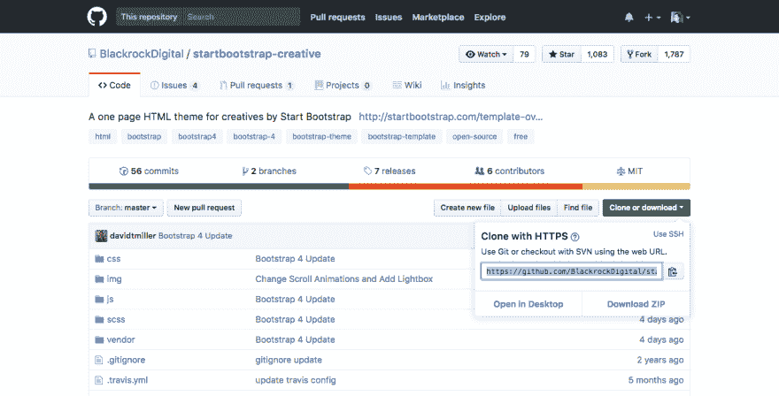

# Git——运行 git 所需的命令！

> 原文：<https://dev.to/davedodea/git--commands-you-need-to-git-going-3mpg>

首先，让我们确保安装了 git 如果没有，请查看下面您的系统的相关链接:

*   MacOS [这里](https://git-scm.com/download/mac)
*   这里的窗口[这里的](http://gitforwindows.org/)
*   Linux 这里[这里](https://git-scm.com/book/en/v2/Getting-Started-Installing-Git)

出于本文的目的，我将遵循您最有可能用于新的*存储库的流程，尽管一些步骤将用于现有的步骤。*

此外，对于其他命令——例如创建新目录时，我将使用 BASH shell 命令。这里有一个[方便那些](https://courses.cs.washington.edu/courses/cse390a/14au/bash.html)参考。

#### 创建新的存储库:

首先，让我们创建一个新目录来保存我们的存储库:

```
mkdir newRepo 
```

现在我们将进入新目录:

```
cd newRepo 
```

我们通过发出以下命令将它创建为新的 git 存储库:

```
git init 
```

#### 要克隆现有存储库:

#### 从服务器即 GitHub:

```
git clone https://github.com/path/to/repository.git 
```

例如，要从这里的[克隆一个引导启动模板:](https://github.com/BlackrockDigital/startbootstrap-creative)

```
git clone https://github.com/BlackrockDigital/startbootstrap-creative.git 
```

您会看到一个绿色按钮，上面写着“克隆或下载”:

[T2】](https://res.cloudinary.com/practicaldev/image/fetch/s--sQJE1qa4--/c_limit%2Cf_auto%2Cfl_progressive%2Cq_auto%2Cw_880/https://cdn-images-1.medium.com/proxy/1%2Abb6So7Y0zC5tcqyZm3LZQg.png)

或者…

#### 从本地机器上的现有存储库中:

```
git clone /path/to/repository 
```

#### 向 git 添加文件:

现在我们已经建立了一个存储库，我们需要添加一些文件供 git 跟踪:

在目录中添加所有新的和修改/编辑的文件:

```
git add . 
```

现在，我们要求 git 添加文件，然后我们需要*提交*这些文件:

```
git commit -m "add these changes" 
```

在上面的命令中，我们说了一些事情:

```
git commit ... //commit the added files. 
```

```
... -m "add these changes" //-m will precede a message which will let people know what changes are included in this commit. 
```

#### 将我们的提交/更改推送到远程存储库:

一旦我们*添加了*，然后*提交了*我们的文件，我们现在需要发送或者*推送*那些更改到我们的存储库中:

```
git push origin master 
```

在上面的命令中说了下面的话:

```
git push ... //send our changes. 
```

```
... origin ... //the location of our repository. 
```

```
... master //the _branch_ name, we will talk more about branches shortly. 
```

#### 分支:

假设你正在构建一个应用程序或项目，它可能有几个不同的特性。好的做法是将应用程序开发分成独立的功能。

假设我们正在构建一个应用程序，我们需要编码的功能之一可能是登录系统:

用 *git* 我们可以制作一个*新分支*叫做*登录*:

```
git checkout -b login 
```

在上面的命令中:

```
git checkout //switch to the following branch name. 
```

```
... -b login //-b will precede the new branch name. 
```

上面的命令实际上是一个精简的命令，因为它实际上是*检查*和*创建一个新的*分支。

如果我们已经创建了一个名为 *login* 的分支，我们可以简单地通过以下方式切换到它:

```
git checkout login 
```

#### 推枝:

我们上面所做的仅仅是创建一个*本地*分支。为了让其他人可以访问它，我们需要将它推送到我们的远程存储库:

```
git push origin login 
```

#### 拉扯:

假设我们需要检索远程存储库的所有最新更新，例如，如果您和您的团队在不同的机器上处理同一个项目，另一个团队成员可能已经做了一些更改，您希望确保您是最新的:

```
git pull // tells git to retrieve the latest version. 
```

#### 合并:

如果我们想要*合并*或者将我们之前在*登录*分支中提交的内容合并到*主*工作分支中:

让我们先*结帐*我们的*主人*分店:

```
git checkout master 
```

然后，我们可以将新分支与以下内容合并:

```
git merge login 
```

发出合并命令后，git 系统会合并分支，但这并不总是 git 能够自动实现*。*

 *如果你需要自己解决这些冲突，这里有一个简单易懂的指南。

#### 撤销修改:

您肯定会遇到需要撤销对本地存储库的更改的情况——例如，您想要删除对名为*index.html*的文件所做的更改:

```
git checkout -- index.html 
```

如果您想要移除*所有的*变更并回复到最新的远程版本:

```
git fetch origin //get the latest remote version. 
```

```
git reset --hard origin/master //remove all local changes. 
```

#### 有用链接:

当您乐于探索 git 的进一步特性时，这些是一些有价值的资源:

*   [http://rogerdler . github . io/git-guide/](http://rogerdudler.github.io/git-guide/)
*   [https://git-scm.com/documentation](https://git-scm.com/documentation)
*   [https://guides.github.com/introduction/git-handbook/](https://guides.github.com/introduction/git-handbook/)

我会在更高级的特性上做更多的文章，但是现在，就这些了…

如果你有任何问题或补充，请在下面的评论中告诉我，或者在 [Twitter](https://twitter.com/DaveDODea) 上联系我。

~戴夫。*