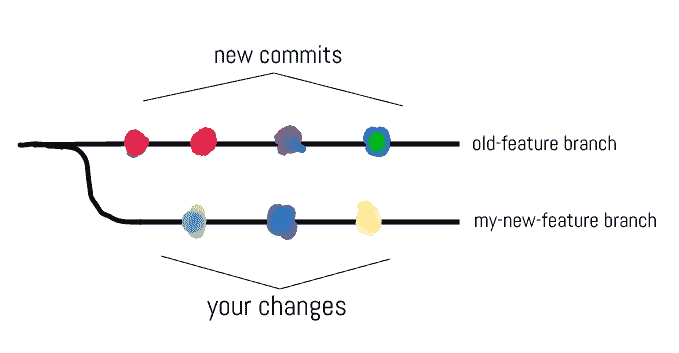
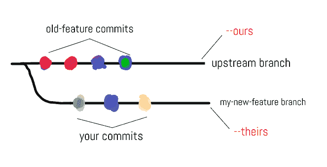
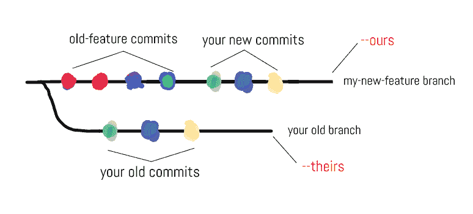

# 吉特:我们的还是他们的？(第二部分)

> 原文：<https://dev.to/willamesoares/git-ours-or-theirs-part-2-d0o>

[T2】](https://res.cloudinary.com/practicaldev/image/fetch/s--_Q2bmWAw--/c_limit%2Cf_auto%2Cfl_progressive%2Cq_auto%2Cw_880/http://willamesoares.cimg/posts/git/part2/mine.jpg)

###### 本帖最初发布于我的个人[博客](http://willamesoares.com)

在[的上一篇文章](https://dev.to/willamesoares/git-ours-or-theirs-part1-agh)中，你看到了一个用于自动处理合并冲突的基本工作流程。它还解释了为什么和什么时候你会想这样做。然而，重要的是要注意，在使用这种方法之前，你应该完全知道你在做什么。事实上，每当我在尝试拉取或重定基础时遇到冲突，我都会检查每一个冲突，看看我是否能够通过使用某种策略来快速处理这种情况，比如使用`--ours`或`--theirs`选项。

此外，我还警告您，尽管这看起来可能是一个非常简单的策略，但是在某些情况下，相同的策略会为您提供不同的结果，这取决于您使用哪个操作来合并提交。

您可能还记得，在前面的场景中，我们在分支`old-feature`和`my-new-feature`之间执行了一个合并过程。在这一点上，重要的是要注意你应该避免使用合并或拉方法来执行这种过程，正如在[这篇文章](https://coderwall.com/p/7aymfa/please-oh-please-use-git-pull-rebase)中所解释的。取而代之的是，您应该做一个获取，然后用一个远程分支更新您的本地分支。查看[这篇文章](https://www.atlassian.com/git/tutorials/merging-vs-rebasing)了解更多关于这个话题的信息。

此外，在我们进一步深入之前，您应该记住在上一篇文章中解释的经验法则:

> `--ours`选项表示在发生冲突之前合并/重定基础过程开始的当前分支，而`--theirs`选项指的是变更来自的分支。

这样，我们可以进入一个新的场景，这些选项看起来可能有点棘手。假设您现在想要执行一个 rebase，因为在上游分支中有新的提交。下图显示了您拥有的两个分支以及它们在重定基础之前的提交。

[T2】](https://res.cloudinary.com/practicaldev/image/fetch/s--G88b9LDw--/c_limit%2Cf_auto%2Cfl_progressive%2Cq_auto%2Cw_880/http://willamesoares.cimg/posts/git/part2/example1.png)

然后，在 my-new-feature 中，通过运行下面的命令，开始重新设置分支的基础:

```
$ (my-new-feature) git rebase old-feature 
```

Enter fullscreen mode Exit fullscreen mode

在这一点上，我们有了学习如何正确使用我们的和他们的选项的关键。

> 每当执行 rebase 时，Git 做的第一件事就是从当前分支切换到上游分支。只有在这之后，重定基础的过程才开始。

考虑到这一点，很容易注意到经验法则在这种情况下仍然有效，考虑到重定基数过程是从上游分支开始的。

现在，你可能明白为什么这个策略有时会很棘手。您注意到，根据规则，`--ours`选项指的是来自旧功能分支的提交的上游分支，而`--theirs`选项指的是`my-new-feature`分支，如下图所示。

[T2】](https://res.cloudinary.com/practicaldev/image/fetch/s--0EtKYcOT--/c_limit%2Cf_auto%2Cfl_progressive%2Cq_auto%2Cw_880/http://willamesoares.cimg/posts/git/part2/example2.png)

在签出之后，Git 开始在添加到旧特性分支的提交之上重放您的所有提交。这是 Git 在执行 rebase 时做的另一件不同的事情，它不是改变指向上游分支的头指针，而是更新远程分支，将您的提交添加到其中。

让我们考虑一下，在重定基数期间，你会再次在 index.html 文件中遇到大量冲突。幸运的是，您确信可以保留所有的更改，而忽略来自远程分支的更改。你也明白，在这种情况下，你应该稍微改变一下策略。因此，您可以通过运行下面的命令来解决冲突，保留您的更改。

```
$(old-feature) git checkout --theirs index.html 
```

Enter fullscreen mode Exit fullscreen mode

再次注意，这里的`--theirs`选项指的是您在`my-new-feature`中的更改。

在重设基础之后，你将得到下面的分支树，它看起来和你在上一篇文章中得到的有点不同。

[T2】](https://res.cloudinary.com/practicaldev/image/fetch/s--KQ53wl3C--/c_limit%2Cf_auto%2Cfl_progressive%2Cq_auto%2Cw_880/http://willamesoares.cimg/posts/git/part2/example3.png)

我希望现在您已经理解了在使用 Git 时如何自动化处理冲突的繁琐任务。此外，我希望你小心，只有当你知道你在做什么的时候才使用这样的策略。

感谢阅读！