# Go 变量-可视化操作指南

> 原文：<https://dev.to/inancx/go-variables---a-visual-how-to-guide-19h>

[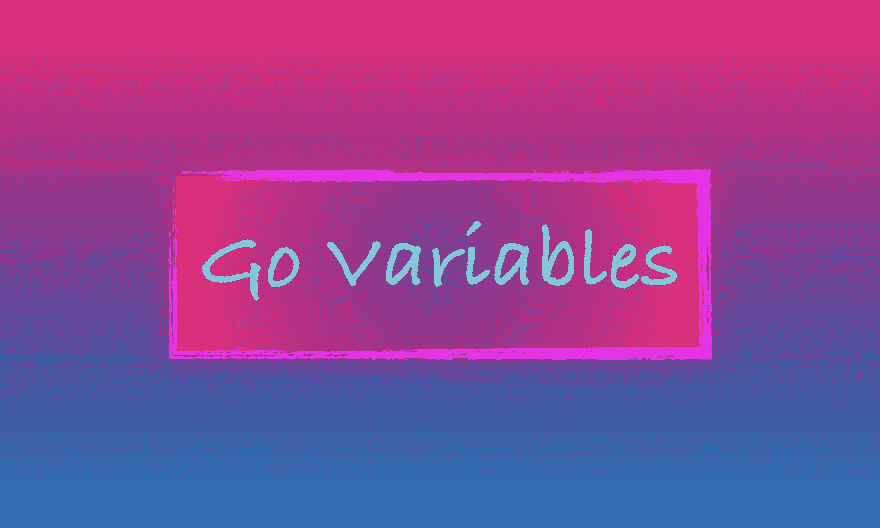T2】](https://res.cloudinary.com/practicaldev/image/fetch/s--3-_quZ7n--/c_limit%2Cf_auto%2Cfl_progressive%2Cq_auto%2Cw_880/https://thepracticaldev.s3.amazonaws.com/i/xn65hnt21r9v4lv5xl5h.png)

## 围棋宣言之美

> Go 定义读取的变量。Go 显式而简单。

Go 不用顺时针/螺旋规则 <sup id="fnref1">[1](#fn1)</sup> 的算法来读取 C 声明，而是对我们人类使用一种更简单的方法。

#### C 的版本:

[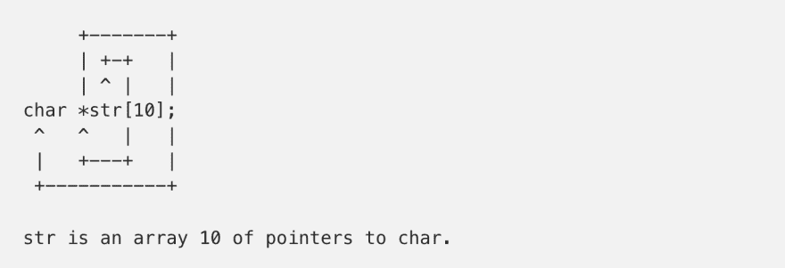](https://res.cloudinary.com/practicaldev/image/fetch/s--QcTPUdWH--/c_limit%2Cf_auto%2Cfl_progressive%2Cq_auto%2Cw_880/https://thepracticaldev.s3.amazonaws.com/i/eiuq0qqydyy65wjrujf9.png) 
*顺时针/螺旋法则*

#### 围棋版本:

[](https://res.cloudinary.com/practicaldev/image/fetch/s--D22eJUNu--/c_limit%2Cf_auto%2Cfl_progressive%2Cq_auto%2Cw_880/https://thepracticaldev.s3.amazonaws.com/i/mr1rcf96wigukrmasvzf.png) 
*人性化*

* * *

## 围棋中的变量是什么？

[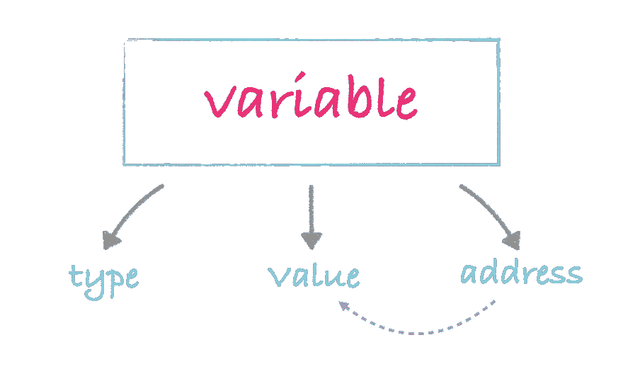T2】](https://res.cloudinary.com/practicaldev/image/fetch/s--11AsEYBx--/c_limit%2Cf_auto%2Cfl_progressive%2Cq_auto%2Cw_880/https://thepracticaldev.s3.amazonaws.com/i/acp9w9q6ukzyxw2m3xum.png)

**Type** 变量中可以存储什么样的信息。

**值**变量中存储的值。

**地址**,变量在计算机内存中的位置。

* * *

## 我们为什么需要变量？

没有变量，程序中就只有静态数据，我们无法改变。**变量让我们做动态的事情**，比如获取用户反馈，再次重用同一个值。

* * *

## 如何声明一个 Go 变量？

先说零值比较好。如果你声明了一个没有值的变量，那么根据变量的类型，它会有一个零值。

[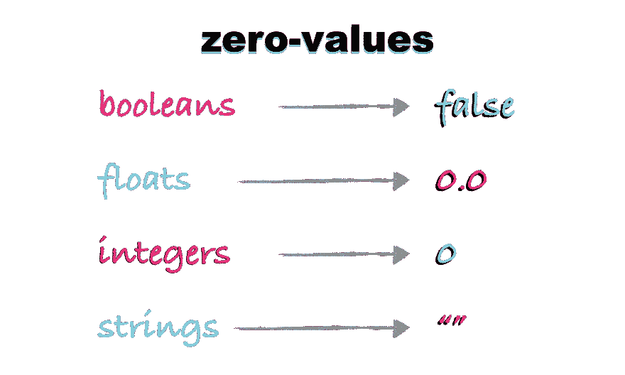](https://res.cloudinary.com/practicaldev/image/fetch/s--IioPPE8m--/c_limit%2Cf_auto%2Cfl_progressive%2Cq_auto%2Cw_880/https://thepracticaldev.s3.amazonaws.com/i/j75ij597zm87wsffun01.png) 
*如果没有初始化，左侧获取右侧的值。*

* * *

## 龙宣言

[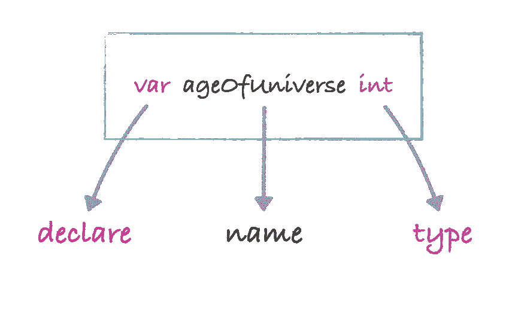T2】](https://res.cloudinary.com/practicaldev/image/fetch/s--wKe-NdKC--/c_limit%2Cf_auto%2Cfl_progressive%2Cq_auto%2Cw_880/https://thepracticaldev.s3.amazonaws.com/i/v6n6ga6xaqdugmduzfty.png)

> 声明一个名为 ageOfUniverse、类型为 int 的变量。

名字可以是任何东西，包括像“的”这样的 unicodes，但不是这个:ðÿ˜。它的值是 0 的整数的零值。

* * *

## 简短声明

[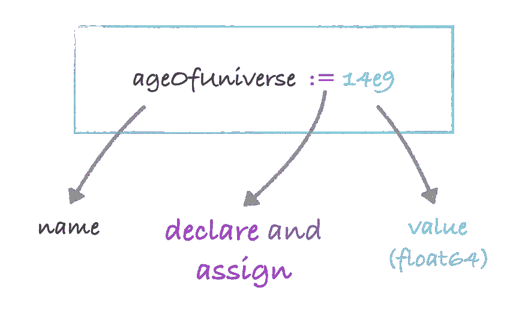T2】](https://res.cloudinary.com/practicaldev/image/fetch/s--sPMXlGCh--/c_limit%2Cf_auto%2Cfl_progressive%2Cq_auto%2Cw_880/https://thepracticaldev.s3.amazonaws.com/i/bcech4nlaojjeuln4baa.png)

> 声明一个名为 ageOfUniverse 的变量，在变量中存储 140 亿个值，并自动猜测其类型(类型推断)。

变量被声明，它的值和类型都用`:=`操作符赋值。显然，当你使用短声明时，Go 不会使用零值赋值。ðÿ'‹*Pascal 程序员可能还记得`:=`* 。

ðÿ'‰*要了解更多信息，你可以阅读[短申报规则手册](https://blog.learngoprogramming.com/golang-short-variable-declaration-rules-6df88c881ee)* 。

* * *

## 多重申报

[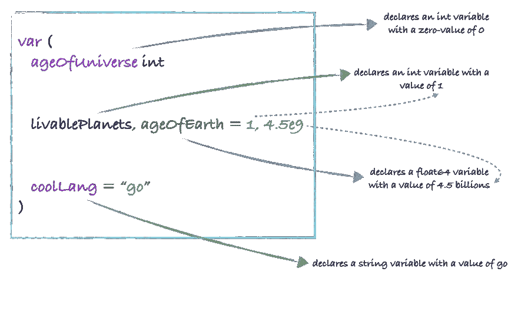T2】](https://res.cloudinary.com/practicaldev/image/fetch/s--cDHgo8TE--/c_limit%2Cf_auto%2Cfl_progressive%2Cq_auto%2Cw_880/https://thepracticaldev.s3.amazonaws.com/i/8tw0dixhtybgxglstwkr.png)

> 在同一语句中声明多个具有不同类型和值的变量。

左手边的项目数(*即:livablePlanets 和 ageOfEarth* )应该与右手边的项目数(*即:1 和 4.5e9* )相匹配。

* * *

## 多个短申报

[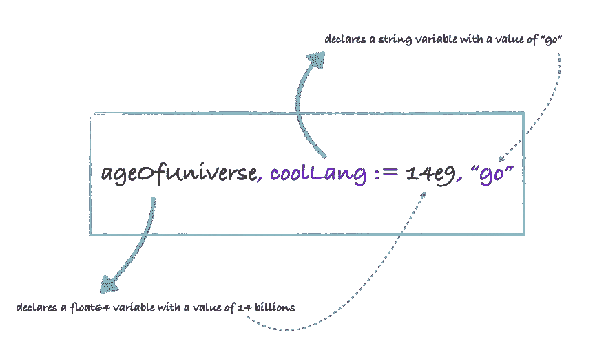T2】](https://res.cloudinary.com/practicaldev/image/fetch/s--23VXMBGk--/c_limit%2Cf_auto%2Cfl_progressive%2Cq_auto%2Cw_880/https://thepracticaldev.s3.amazonaws.com/i/g4mv389uc41ednzfb4fm.png)

> 声明 float64 和 string 类型的两个变量；并将 140 亿赋给第一个变量，将“go”赋给第二个变量。

* * *

## 赋值

[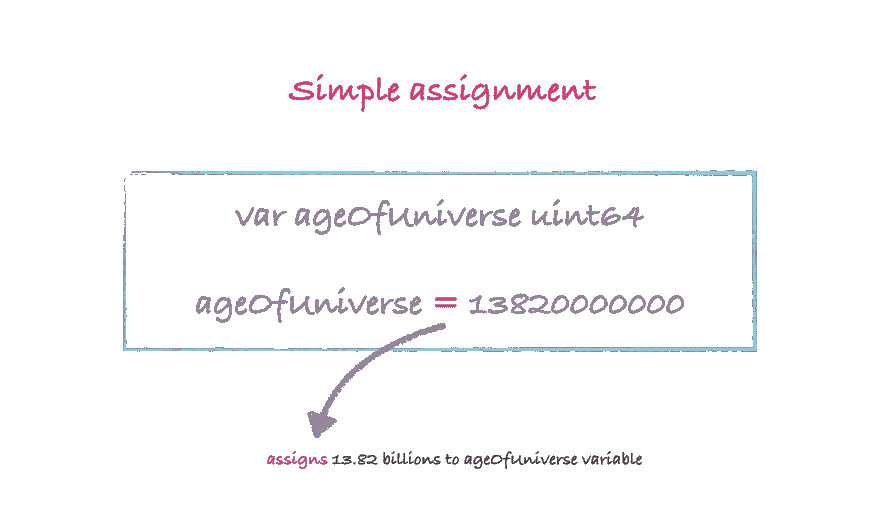T2】](https://res.cloudinary.com/practicaldev/image/fetch/s--4_KxX9EA--/c_limit%2Cf_auto%2Cfl_progressive%2Cq_auto%2Cw_880/https://thepracticaldev.s3.amazonaws.com/i/fmcfgeykmd5el3lon4yp.png)

[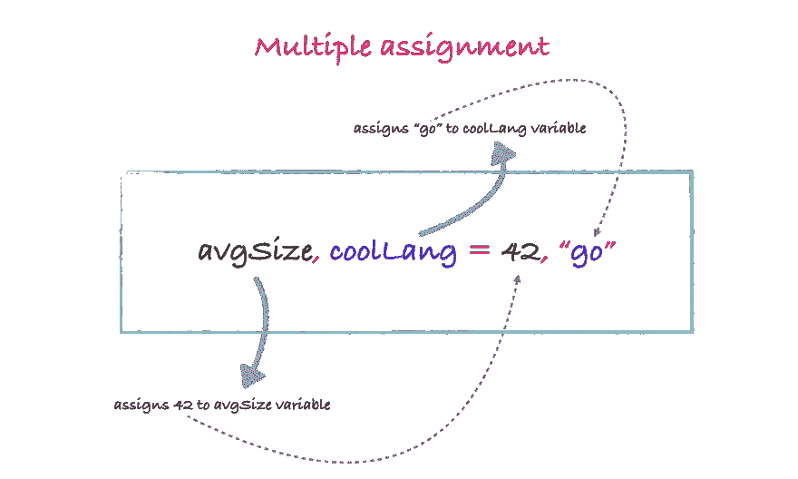T2】](https://res.cloudinary.com/practicaldev/image/fetch/s--IjAEETEb--/c_limit%2Cf_auto%2Cfl_progressive%2Cq_auto%2Cw_880/https://thepracticaldev.s3.amazonaws.com/i/danz3t9p3xkdvbl02xae.png)

当你想给一个变量赋一个错误的数据类型，Go 编译器会编译失败。

[T2】](https://res.cloudinary.com/practicaldev/image/fetch/s--4F5vafsX--/c_limit%2Cf_auto%2Cfl_progressive%2Cq_auto%2Cw_880/https://thepracticaldev.s3.amazonaws.com/i/5v1xqdko66luplfxp30l.png)

* * *

## ðÿ'我应该用哪种申报单？

当你不能预先知道存储什么数据时，使用长声明，否则，使用短声明。当您想要一起定义多个变量时，或者作为代码可读性的提示，这些变量将一起使用时，请使用多重声明。

你不能在包括 main 函数在内的函数之外使用短声明。或者:你会遇到这个错误:*“语法错误:函数体外非声明语句”*。

* * *

## 变量是如何存储的？

当我们声明一个整型变量时，内存中为该变量保留了 4 字节的存储空间。当数据不适合变量时，Go 编译器将终止。

但是， *int* 是软盘类型，它的容量可以改变。所以，我们不能简单地把宇宙的年龄存储在一个 int 变量中。我们应该用 *uint64* 来代替。一个 *int* 不能存储~ 140 亿年，它在 32 位机器上最多只能存储~ 40 亿年。或者会溢出，但是对于 64 位机器，编译是可以的。

[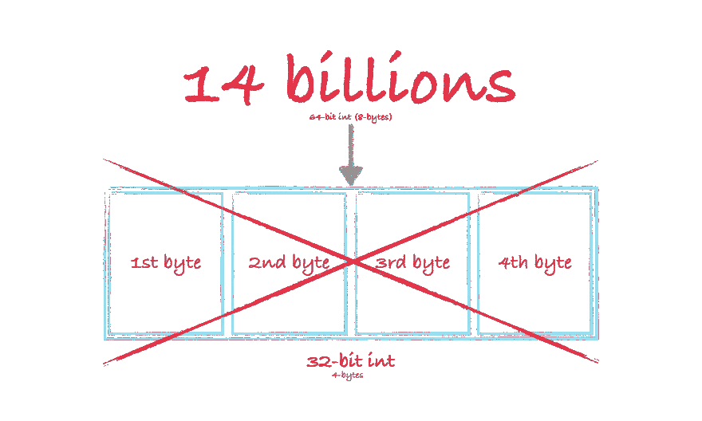T2】](https://res.cloudinary.com/practicaldev/image/fetch/s--0TFjtcdq--/c_limit%2Cf_auto%2Cfl_progressive%2Cq_auto%2Cw_880/https://thepracticaldev.s3.amazonaws.com/i/9e7yohlsrt6xnbrtvx3s.png)

你自己试试。

```
package main

import (
    "fmt"
    "unsafe"
)

func main() {
    var ageOfUniverse int
    reservedBytes := unsafe.Sizeof(ageOfUniverse)

    fmt.Printf("Number of bytes reserved for `ageOfUniverse` variable is %d bytes.\n",
        reservedBytes)
} 
```

Enter fullscreen mode Exit fullscreen mode

*[玩玩它](https://play.golang.org/p/SV95kReYNm):这个例子向你展示了 ageOfUniverse 变量可以存储多少字节。*

```
package main

import (
    "fmt"
)

// on 32-bit machines, it'll overflow
// on 64-bit machines, everything is fine
// use: uint64 instead.
func main() {
    var ageOfUniverse int = 14e9 // 14e9 = 14 and 9 zeros which is 14 billions

    fmt.Printf("`ageOfUniverse` is %d.\n", ageOfUniverse)
} 
```

Enter fullscreen mode Exit fullscreen mode

*代码不正确。[跑一趟看自己](https://play.golang.org/p/IOQjUKSIC1)。*

```
package main

import (
    "fmt"
)

func main() {
    // still not a good way to define a variable like this. we will see it.
    var ageOfUniverse uint64 = 14e9 // 14e9 = 14 and 9 zeros which is 14 billions

    fmt.Printf("`ageOfUniverse` is %d.\n", ageOfUniverse)
} 
```

Enter fullscreen mode Exit fullscreen mode

*正确的代码。[运行它](https://play.golang.org/p/q5fnpQCqxl)。*

* * *

## 使变量可被其他包访问

这叫做*导出*。要在包范围内定义变量，只能使用长声明或多重声明。之后，你需要大写它的第一个字母。

[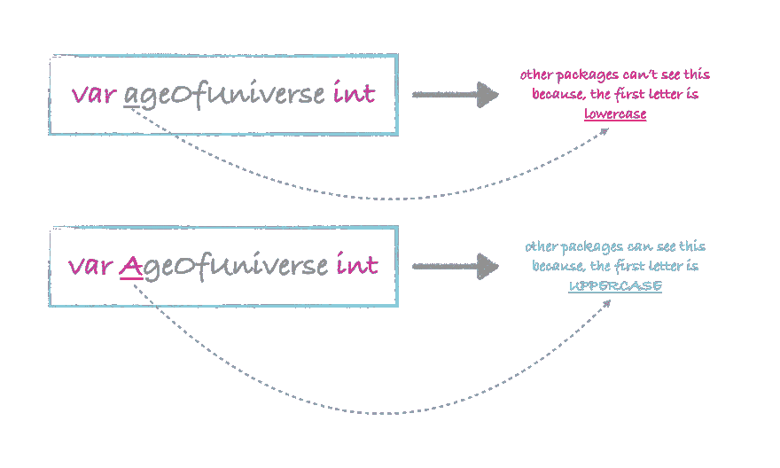T2】](https://res.cloudinary.com/practicaldev/image/fetch/s--0eHHV9CO--/c_limit%2Cf_auto%2Cfl_progressive%2Cq_auto%2Cw_880/https://thepracticaldev.s3.amazonaws.com/i/2674kaicaeuk1ypomz3b.png)

* * *

ðÿ"**我正在创建一个在线围棋课程:[加入我的简讯](http://eepurl.com/c4DMNX)** ！让我们每周保持联系，了解新的教程和我的在线围棋课程。

* * *

↓**[请在推特](http://bit.ly/golang-variables)** 上分享这篇帖子！

ðÿ:我主要是在推特上谈论围棋。

* * *

*本文最初在 [Learn Go 编程](https://blog.learngoprogramming.com)中发表为[Learn Go variables-A visual guide](https://blog.learngoprogramming.com/learn-go-lang-variables-visual-tutorial-and-ebook-9a061d29babe)。*

* * *

1.  [http://c-faq.com/decl/spiral.anderson.html](http://c-faq.com/decl/spiral.anderson.html)T2】↩