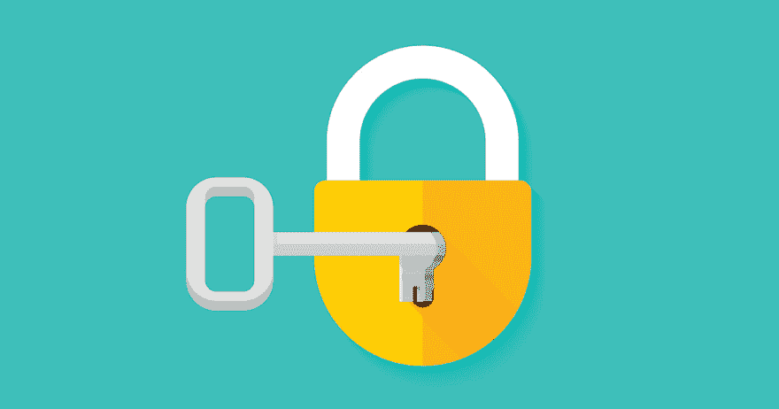

# 谷歌云平台与亚马逊网络服务

> 原文：<https://dev.to/bugfenderapp/google-cloud-platform-vs-amazon-web-services>

## 为什么我们要迁移到谷歌云平台

我们已经运行 [Bugfender](http://bugfender.com) 大约三年了。最初作为 [Mobile Jazz](https://mobilejazz.com) 内部项目调试我们的应用程序变成了一个被广泛采用的工具，在**全球超过 1000 万台设备上运行**。

随着时间的推移，我们的需求发生了变化，我们很快意识到，我们可以通过转向谷歌云平台来改善托管部门的情况。

我们目前正在与亚马逊网络服务合作，我们想让这一点变得非常清楚 **AWS 为我们提供了很好的服务**。但有一些令人信服的理由来证明这一举措的合理性。

**免责声明**:作为 AWS 客户，我们有丰富的经验。说到 GCP，我们只是通过一些实验触及了表面。我们渴望在迁移后继续关注这篇文章；我们可能会以买家反悔告终！

## 为什么要转向谷歌云平台？

这一变化有三个主要驱动因素:

*   成本:长期折扣
*   功能:隐私
*   特性:MySQL

让我们深入细节。

[T2】](https://res.cloudinary.com/practicaldev/image/fetch/s--xaU32tDQ--/c_limit%2Cf_auto%2Cfl_progressive%2Cq_auto%2Cw_880/https://bugfender.com/wp-content/uploads/2017/06/gc-vs-aws-savings.jpg)

### 成本:长期折扣

让我们谈谈现金。我们上次的亚马逊网络服务发票是 1300 美元。

对一些人来说，这个数字没什么可担心的。但是对于像我们这样一个不起眼的白手起家的公司来说，这是一大笔钱；我们并没有在风险投资中游泳。

我们相信*将*投资于增长，而不是*将*花费在固定成本上，这才是前进的方向。

虽然谷歌云平台和亚马逊网络服务提供非常相似的定价，但对我们来说，关键的区别在于它们的长期承诺折扣。

他们都提供 30%的折扣，当使用服务的时间延长。然而，有一个基本的区别:

*   对于 AWS，您需要提前承诺至少 1 年继续使用您选择的服务和机器类型。
*   另一方面，GCP 在使用一个月后可以获得同样的折扣，而且您不需要提前计划，因为折扣是追溯性的。

在提供的几十种机器类型和服务中，我们不可能知道一年后我们会使用哪一种。

我们基本上不能利用任何 AWS 的折扣，而有了 GCP，我们可以自由地更加精明地消费。结果。

这个小细节是如何产生如此大的影响的？

*   平台进化:我们不时地进行改进，以增加或减少机器的尺寸，将机器的任务一分为二，等等。只有当产品不再进化时，才可能提前进行规划。
*   **供应商锁定**:如果你预付一整年的服务费用，你基本上至少要在那里呆上一年。如果你承诺在一年内使用另一项服务，你就失去了折扣，甚至更多。更换主机供应商不是一件小事；不过，如果这种选择摆在桌面上，这是一件好事。
*   **现金流**:如果你想享受 AWS 提供的全额折扣，你需要提前付款。我们可以做到，但这并不理想。

[T2】](https://res.cloudinary.com/practicaldev/image/fetch/s--sqGoV_Hp--/c_limit%2Cf_auto%2Cfl_progressive%2Cq_auto%2Cw_880/https://bugfender.com/wp-content/uploads/2017/06/gc-vs-aws-security.jpg)

### 功能:隐私

#### **默认加密存储**

虽然在 Amazon EC2 中加密存储是一个选项，但在 AWS 提供的其他服务中并不总是如此。

例如，您可能会遇到像 Redis 这样的托管数据库类型，它不加密静态数据。相比之下，在谷歌云平台的所有服务中，静态数据的加密是标准的。你甚至不能手动禁用它。

Bugfender 客户信任我们提供他们的日志数据。我们致力于小心处理它，所以这是一个我们非常重视的功能。

#### **数据中心之间的加密网络流量**

GCP 和 AWS 都提供虚拟专用网来连接你的机器。但是，通过该网络的所有数据都是按原样发送的，在逻辑上与其他客户分开，仅此而已。

这意味着网络上的数据没有加密。您要么必须特别小心地对其进行适当加密，要么接受隐私得不到保证的风险。

这通常被认为是“可接受的风险，因为还有其他保护措施，如数据中心的物理安全措施以及员工的物理和虚拟访问控制。

也就是说，在数据中心间连接的情况下，数据穿过 AWS 和 GCP 无法控制的区域，这使得在技术上可以窃听他们的电缆并嗅探通过它们的数据。

听起来像是牵强的电影情节？这在现实生活中已经发生了。这也是谷歌云平台现在加密数据中心之间流量的原因。这不是所有的交通，但这是一个开始！

[T2】](https://res.cloudinary.com/practicaldev/image/fetch/s--g7hFoWZZ--/c_limit%2Cf_auto%2Cfl_progressive%2Cq_auto%2Cw_880/https://bugfender.com/wp-content/uploads/2017/06/gc-vs-aws-managed.jpg)

### 功能:MySQL

#### **托管 MySQL 功能**

任何使用过大型数据库的人都知道，保持数据库高速运行是一项艰巨的任务:设置、维护复制、监控、备份、性能调优...这样的例子不胜枚举。

这都占用了大量的时间。为此提供托管服务非常方便。

Bugfender 使用各种数据库来存储我们的平台信息。其中之一就是 MySQL，目前运行在亚马逊的关系数据库服务(RDS)中。

GCP 的对应产品 Google Cloud SQL 似乎更先进一些。它提供了一些额外的功能:

*   **复制数据库中的自动故障转移** : MySQL 通过使用复制允许几个数据库服务器协同工作。如果您的设置中有副本，而主服务器不可用，Google Cloud SQL 会自动切换到副本服务器，以确保连续性。相比之下，RDS 仅在其专有数据库 Aurora 中提供此功能。
*   **自动增加存储容量**:作为一个日志存储提供商，对于 Bugfender，我们需要在数据库中增加更多的空间是很常见的。RDS 允许您手动向正在运行的数据库添加磁盘空间，但我们不建议这样做。为什么？嗯，我们试过一次，性能损失非常大，导致服务完全中断了五个小时。相比之下，Google Cloud SQL 声称会在需要时自动提供磁盘空间。我们希望它能以更安全的方式做到这一点！
*   **静态数据加密**:这是 RDS 中的一个选项，如果您在不同的可用性区域有副本，这并不简单。GCP 默认这样做，不需要任何配置，所以非常简单方便。

**注**:亚马逊提供了一个兼容 MySQL 的专有数据库，名为 Aurora。也许 Aurora 会更好地对抗 Google Cloud SQL。我们试过一次，但从未更换，因为它的性能比我们正在使用的 RDS MySQL 差(与亚马逊在其营销页面上声称的 5 倍改善相反)。

## 结论

亚马逊网络服务和谷歌云平台都是成熟的托管平台，提供了大量的服务和功能。然而，我们只需要利用其中的几个，考虑到这一点，当涉及到适合我们的服务时，谷歌云平台将成为明显的赢家。

另外，我们正在省钱！

所以你有它。我们一定会报告我们的发现。

你有使用自动气象站和 GCP 的经验吗？你有什么看法？给我们留言吧！