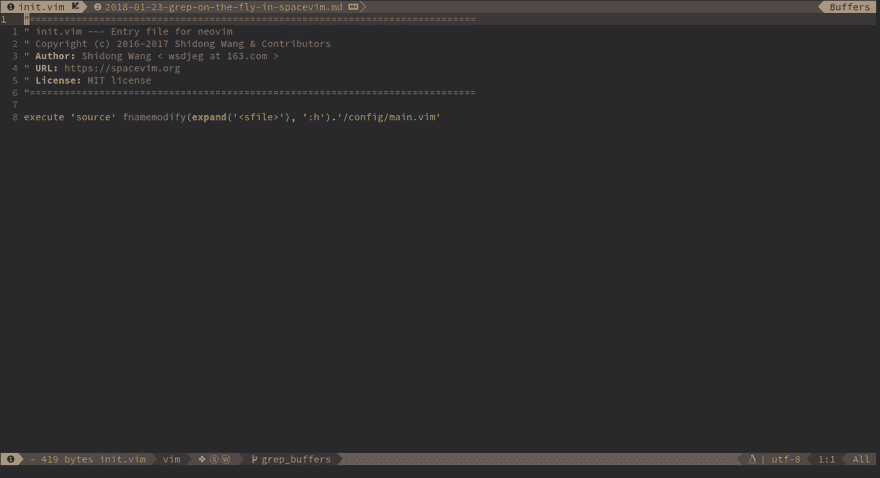
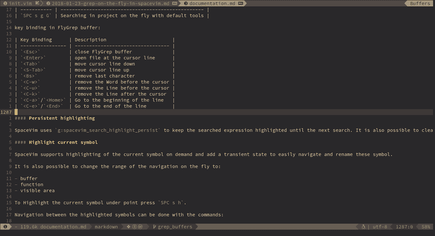

# SpaceVim 中的动态 Grep

> 原文：<https://dev.to/spacevim/grep-on-the-fly-in-spacevim-5aep>

# 动态异步 grep

FlyGrep 的意思是 **grep on the fly** ，它会在你输入的时候更新结果。当然，它是同步运行的。在使用此功能之前，您需要安装一个搜索工具。FlyGrep 通过搜索工具:`ag`、`rg`、`ack`、`pt`、`grep`，选择一个你喜欢的。

这是 SpaceVim 内置的插件，我们还分离了一个插件: [FlyGrep.vim](https://github.com/wsdjeg/FlyGrep.vim)

## 特性

*   **在项目中搜索**

在 SpaceVim 中，可以使用`SPC s p`或`SPC s /`在当前项目中进行搜索。

[T2】](https://res.cloudinary.com/practicaldev/image/fetch/s--_hBVvNTT--/c_limit%2Cf_auto%2Cfl_progressive%2Cq_66%2Cw_880/https://user-images.githubusercontent.com/13142418/35278709-7856ed62-0010-11e8-8b1e-e6cc6374b0dc.gif)

*   **在当前文件中搜索**

您可以使用`SPC s s`在当前文件中搜索。要在光标下搜索单词，可以按`SPC s S`。

[T2】](https://res.cloudinary.com/practicaldev/image/fetch/s--O8t4hKro--/c_limit%2Cf_auto%2Cfl_progressive%2Cq_66%2Cw_880/https://user-images.githubusercontent.com/13142418/35278847-e0032796-0010-11e8-911b-2ee8fd81aed2.gif)

*   **在所有加载的缓冲区中搜索**

要在所有加载的缓冲区中搜索，需要按`SPC s b`，也可以使用`SPC s B`在该点下搜索单词。

[T2】](https://res.cloudinary.com/practicaldev/image/fetch/s--A_FGsAkq--/c_limit%2Cf_auto%2Cfl_progressive%2Cq_66%2Cw_880/https://user-images.githubusercontent.com/13142418/35278996-518b8a34-0011-11e8-9a7a-613668398ee2.gif)

*   **在任意目录中搜索**

如果您想在不同的目录而不是当前目录中搜索，您可以使用`SPC s f`。然后插入任意目录的路径。

*   **在后台搜索项目**

如果需要后台搜索，可以按`SPC s j`，搜索完成后，索引会显示在 statusline 上。您可以使用`SPC s l`列出所有搜索结果。

## 按键绑定

SpaceVim 中的搜索命令在前缀`SPC s`下组织，下一个键是要使用的工具，最后一个键是范围。例如，`SPC s a b`将使用`ag`在所有打开的缓冲区中搜索。

如果最后一个键(确定范围)是大写的，那么光标下的当前单词被用作搜索的默认输入。例如，`SPC s a B`将在光标下搜索单词。

如果省略工具键，则会自动选择默认工具进行搜索。该工具对应于列表系统中的第一个工具`g:spacevim_search_tools`，默认调用顺序为`rg`、`ag`、`pt`、`ack`，然后是`grep`。例如，如果在系统中没有找到`rg`和`ag`，则`SPC s b`将使用`pt`在打开的缓冲区中进行搜索。

工具键包括:

| 工具 | 钥匙 |
| --- | --- |
| （对他人的话作出反应或表示生气、恼怒）唔，啊，哎呀 | a |
| 可做文件内的字符串查找 | g |
| 确认字符（acknowledgementcharacter） | k |
| 錀 | r |
| 元素铂的符号 | t |

可用的作用域和相应的键有:

| 范围 | 钥匙 |
| --- | --- |
| 打开的缓冲区 | b |
| 给定目录中的文件 | f |
| 当前项目 | p |

**在 FlyGrep 缓冲区内:**

| 按键绑定 | 描述 |
| --- | --- |
| `<Esc>` | close FlyGrep buffer |
| `<Enter>` | 在光标所在行打开文件 |
| `<Tab>` | 向下移动光标行 |
| `<C-j>` | 向下移动光标行 |
| `<S-Tab>` | 向上移动光标行 |
| `<C-k>` | 向上移动光标行 |
| `<Bs>` | 删除最后一个字符 |
| `<C-w>` | 删除光标前的单词 |
| `<C-u>` | 删除光标前的行 |
| `<C-k>` | 移除光标后的行 |
| `<C-a>` / `<Home>` | 转到行首 |
| `<C-e>` / `<End>` | 走到这条线的尽头 |