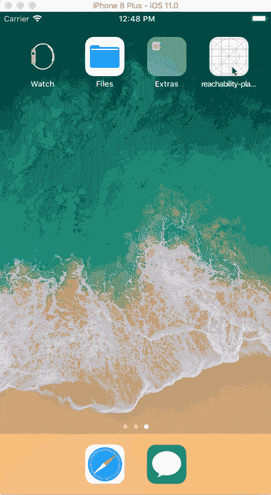
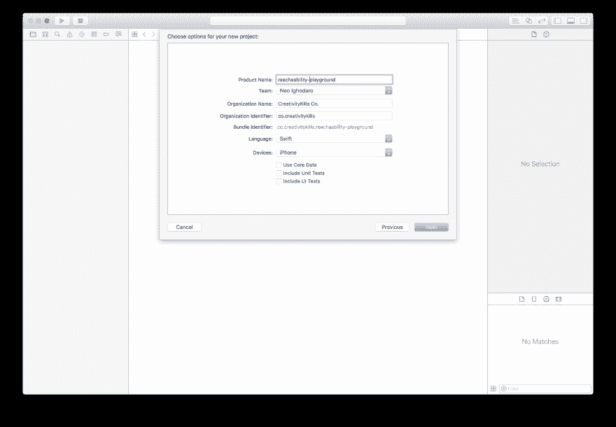
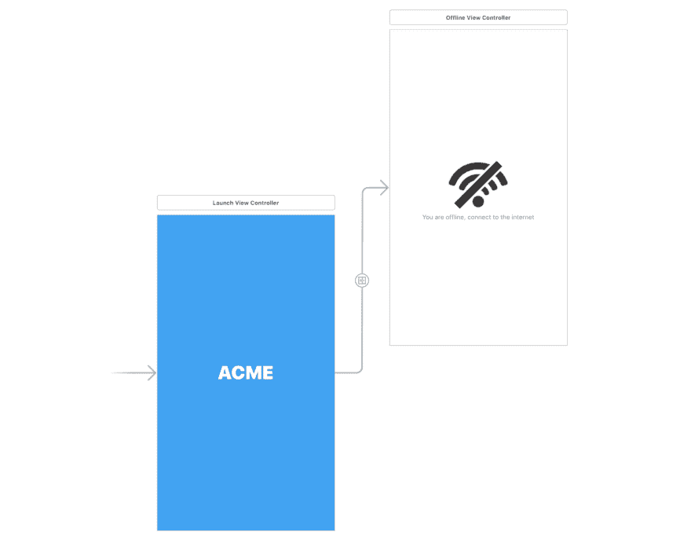
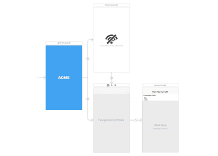

# 在 Swift 中处理互联网连接可达性

> 原文：<https://dev.to/neo/handling-internet-connection-reachability-in-swift-32j9>

通常情况下，移动应用程序需要活跃的互联网连接才能正常工作。然而，失去互联网连接是正常的。在这种情况下，开发人员需要想出一些方法让用户可以忍受这种体验，或者至少通知用户。

在本文中，我们将了解如何在 Swift 中检测互联网连接问题，以及我们可以处理这些问题的一些方法。

下面是我们将要构建的示例应用程序，以及它如何处理不同的互联网连接场景:

[T2】](https://res.cloudinary.com/practicaldev/image/fetch/s--SWqIWx-H--/c_limit%2Cf_auto%2Cfl_progressive%2Cq_66%2Cw_880/https://thepracticaldev.s3.amazonaws.com/i/pnid426vlzy09vx3pop2.gif)

## 要求

为了能够理解本文，您需要满足以下要求:

*   安装在您机器上的 Xcode 。
*   了解 Swift 编程语言。
*   安装在您机器上的 Cocoapods 。

当你有了以上要求，我们就一头扎进去吧。

## 设置我们的工作空间

在我们开始之前，我们将创建一个操场。这是我们将编写所有用例并处理它们的地方。

Swift 自带检测连接问题的可达性实现，但我们将使用第三方库。我们这样做是因为它比内置的更容易，API 更有表现力。

打开 Xcode 并设置一个新项目。

[T2】](https://res.cloudinary.com/practicaldev/image/fetch/s--ZjOwfht_--/c_limit%2Cf_auto%2Cfl_progressive%2Cq_auto%2Cw_880/https://thepracticaldev.s3.amazonaws.com/i/uh00z42465cnny3j16h1.png)

这个项目将是一个简单的游乐场，我们可以进行实验。

为了检测连接何时离线，我们将使用[**reachability . swift**](https://github.com/ashleymills/Reachability.swift)* * * *包。它是一个“用闭包来替代用 Swift 重写的苹果可达性”。

打开您的终端并运行下面的命令:

```
 $ pod init 
```

Enter fullscreen mode Exit fullscreen mode

这将创建一个新的`Podfile`，我们可以在其中声明 Cocoapods 依赖项。打开`Podfile`，用下面的代码替换内容:

```
 platform :ios, '9.0'

    target 'project_name' do
      use_frameworks!

      pod 'ReachabilitySwift'
      pod 'Alamofire'
    end 
```

Enter fullscreen mode Exit fullscreen mode

> **提示:** **你需要将** `**project_name**` **替换为你的项目名称。**

保存文件并运行下面的命令，将 pod 安装到您的项目中:

```
 $ pod install 
```

Enter fullscreen mode Exit fullscreen mode

安装完成后，打开项目根目录下的`*.xcworkspace`文件。这将启动 Xcode。

## 创建我们的网络可达性管理员

创建一个新的`NetworkManager`类。这个类将存储网络状态，并作为`Reachability`包的简单代理。在文件中，粘贴下面的代码:

```
 import Foundation
    import Reachability

    class NetworkManager: NSObject {

        var reachability: Reachability!

        // Create a singleton instance
        static let sharedInstance: NetworkManager = { return NetworkManager() }()

        override init() {
            super.init()

            // Initialise reachability
            reachability = Reachability()!

            // Register an observer for the network status
            NotificationCenter.default.addObserver(
                self,
                selector: #selector(networkStatusChanged(_:)),
                name: .reachabilityChanged,
                object: reachability
            )

            do {
                // Start the network status notifier
                try reachability.startNotifier()
            } catch {
                print("Unable to start notifier")
            }
        }

        @objc func networkStatusChanged(_ notification: Notification) {
            // Do something globally here!
        }

        static func stopNotifier() -> Void {
            do {
                // Stop the network status notifier
                try (NetworkManager.sharedInstance.reachability).startNotifier()
            } catch {
                print("Error stopping notifier")
            }
        }

        // Network is reachable
        static func isReachable(completed: @escaping (NetworkManager) -> Void) {
            if (NetworkManager.sharedInstance.reachability).connection != .none {
                completed(NetworkManager.sharedInstance)
            }
        }

        // Network is unreachable
        static func isUnreachable(completed: @escaping (NetworkManager) -> Void) {
            if (NetworkManager.sharedInstance.reachability).connection == .none {
                completed(NetworkManager.sharedInstance)
            }
        }

        // Network is reachable via WWAN/Cellular
        static func isReachableViaWWAN(completed: @escaping (NetworkManager) -> Void) {
            if (NetworkManager.sharedInstance.reachability).connection == .cellular {
                completed(NetworkManager.sharedInstance)
            }
        }

        // Network is reachable via WiFi
        static func isReachableViaWiFi(completed: @escaping (NetworkManager) -> Void) {
            if (NetworkManager.sharedInstance.reachability).connection == .wifi {
                completed(NetworkManager.sharedInstance)
            }
        }
    } 
```

Enter fullscreen mode Exit fullscreen mode

在上面的类中，我们已经定义了几个帮助函数，它们将帮助我们开始网络状态监控。我们有一个单独的`sharedInstance`，如果我们不想创建`NetworkManager`类的多个实例，我们可以调用它。

在`init`方法中，我们创建了一个`Reachability`的实例，然后我们使用`NotificationCenter`类注册了一个通知。现在，每次网络状态改变，就会调用`NotificationCenter`(也就是`networkStatusChanged`)指定的回调。我们可以用它来做一些全球性的事情，当网络不可达时，这些事情就会被激活。

我们已经定义了其他助手函数，这些函数通常会使根据我们的互联网连接状态运行代码变得轻而易举。我们有`*isReachable*`、`*isUnreachable*`、`*isReachableViaWWAN*`和`*isReachableViaWiFi*`。

其中一个助手的用法通常如下:

```
 NetworkManager.isReachable { networkManagerInstance in
      print("Network is available")
    }

    NetworkManager.isUnreachable { networkManagerInstance in
      print("Network is Unavailable")
    } 
```

Enter fullscreen mode Exit fullscreen mode

> **注意:** **这不是一个事件监听器，只会运行一次。要使用监听器实时获取网络变化，您需要使用** `**NetworkManager.sharedInstance.reachability.whenReachable**` **。我们将在本文后面展示一个例子。**

现在我们有了一个管理器类，让我们看看如何在应用程序中使用它。

## 应用启动时处理网络可用性

有时，您的应用程序严重依赖于互联网连接，您需要在启动时检测状态。让我们看看如何使用`NetworkManager`类来处理这个问题。

创建一个名为`LaunchViewController`的新控制器。我们将把故事板上的第一个控制器视图视为启动控制器。我们将尝试检测用户的设备是否在线，如果不在线，我们将创建一个离线页面来处理这个问题，这样用户就根本无法进入应用程序。

将`LaunchController`中的内容替换为以下代码:

```
 import UIKit

    class LaunchViewController: UIViewController {

        let network: NetworkManager = NetworkManager.sharedInstance

        override func viewDidLoad() {
            super.viewDidLoad()

            // If the network is unreachable show the offline page
            NetworkManager.isUnreachable { _ in
                self.showOfflinePage()
            }
        }

        private func showOfflinePage() -> Void {
            DispatchQueue.main.async {
                self.performSegue(withIdentifier: "NetworkUnavailable", sender: self)
            }
        }
    } 
```

Enter fullscreen mode Exit fullscreen mode

在这个类中，当网络不可用时，我们使用我们的`NetworkManager`的`*isUnreachable*`方法来触发`showOffline`方法。让我们创建视图控制器。创建一个名为`OfflineViewController`的新视图控制器。

打开`Main.storyboard`文件，将第一个视图的自定义类设置为`LaunchViewController`。

接下来，在故事板中创建一个新的视图控制器。将`OfflineViewController`设置为这个新视图控制器的定制类。现在在新的视图控制器和`LaunchViewController`之间创建一个名为`NetworkUnavailable`的手动序列。完成后，您应该看到类似于以下内容的内容:

[T2】](https://res.cloudinary.com/practicaldev/image/fetch/s--IICGTINv--/c_limit%2Cf_auto%2Cfl_progressive%2Cq_auto%2Cw_880/https://thepracticaldev.s3.amazonaws.com/i/4x6lo9arh8sgtdqs3ky7.png)

现在让我们运行应用程序。但是请注意，在运行应用程序之前，您的开发机器应该离线，因为 iOS 模拟器使用机器的互联网连接。当您运行应用程序时，您应该会看到我们创建的脱机页面。

现在让我们创建一个视图控制器，它在有连接时显示。

## 设备上线时处理事件

现在我们已经创建了一个脱机视图控制器，它在设备脱机时也能工作，让我们来处理设备重新联机时会发生什么。

在离线视图控制器下面的故事板上创建一个新的导航视图控制器。我们将创建一个显示最新 Reddit 帖子的控制器。创建一个名为`PostsTableViewController`的新视图控制器类。现在将它作为附加到导航视图控制器的视图控制器的定制类。

现在创建一个名为`MainController`的手动序列，从导航视图控制器到启动视图控制器和离线视图控制器。您应该有类似的东西:

[T2】](https://res.cloudinary.com/practicaldev/image/fetch/s--lSyLzhRN--/c_limit%2Cf_auto%2Cfl_progressive%2Cq_auto%2Cw_880/https://thepracticaldev.s3.amazonaws.com/i/k53p93t5270dcukujoys.png)

现在，打开`LaunchViewController`类，在`viewDidLoad`方法的底部添加以下内容:

```
 NetworkManager.isReachable { _ in
        self.showMainPage()
    } 
```

Enter fullscreen mode Exit fullscreen mode

然后将下面的方法添加到控制器:

```
 private func showMainPage() -> Void {
        DispatchQueue.main.async {
            self.performSegue(withIdentifier: "MainController", sender: self)
        }
    } 
```

Enter fullscreen mode Exit fullscreen mode

这将确保当应用程序启动时，它将检查连接，然后，如果连接可用，它将显示`PostsTableViewController`，否则它将显示`OfflineViewController`。

太好了！但是，当用户点击了`OfflineViewController`然后网络恢复在线时会发生什么呢？让我们来处理这种情况。

打开`OfflineViewController`，将代码替换为以下代码:

```
 import UIKit

    class OfflineViewController: UIViewController {

        let network = NetworkManager.sharedInstance

        override func viewDidLoad() {
            super.viewDidLoad()

            // If the network is reachable show the main controller
            network.reachability.whenReachable = { _ in
                self.showMainController()
            }
        }

        override func viewWillAppear(_ animated: Bool) {
            super.viewWillAppear(animated)

            // Hide the navigation bar
            navigationController?.setNavigationBarHidden(true, animated: animated)
        }

        override func viewWillDisappear(_ animated: Bool) {
            super.viewWillDisappear(animated)

            // Show the navigation bar
            navigationController?.setNavigationBarHidden(false, animated: animated)
        }

        private func showMainController() -> Void {
            DispatchQueue.main.async {
                self.performSegue(withIdentifier: "MainController", sender: self)
            }
        }
    } 
```

Enter fullscreen mode Exit fullscreen mode

在上面的控制器中，你可以看到，在`viewDidLoad`方法中，我们设置了`whenReachable`完成来显示主控制器。这意味着，只要它离线，你就可以观察设备何时恢复在线。当它出现时，呈现出`PostsTableViewController`。

我们还覆盖了`viewWillAppear`和`viewWillDisappear`方法，以确保导航栏不会显示在离线视图控制器上。

**在 Swift**
中从 Reddit API 获取帖子现在让我们添加从 Reddit 获取数据并显示在我们的`PostsTableViewController`上的逻辑。打开文件，用下面的代码替换内容:

```
 import UIKit
    import Alamofire

    struct RedditPost {
        let title: String!
        let subreddit: String!
    }

    class PostsTableViewController: UITableViewController {

        var posts = [RedditPost]()
        let network = NetworkManager.sharedInstance

        override func viewDidLoad() {
            super.viewDidLoad()

            navigationItem.title = "Latest Posts"

            // Fetch the posts and then reload the table
            fetchPosts { posts in
                self.posts = posts
                self.tableView.reloadData()
            }
        }

        private func fetchPosts(completion: @escaping (_ posts: [RedditPost]) -> Void) -> Void {
            // Send a request to the Reddit API
            Alamofire.request("https://api.reddit.com").validate().responseJSON { response in
                switch response.result {
                case .success(let JSON):
                    let data = JSON as! [String:AnyObject]

                    guard let children = data["data"]!["children"] as? [AnyObject] else { return }

                    var posts = [RedditPost]()

                    // Loop through the Reddit posts and then assign a post to the posts array
                    for child in 0...children.count-1 {
                        let post = children[child]["data"] as! [String: AnyObject]

                        posts.append(RedditPost(
                            title: post["title"] as! String,
                            subreddit: "/r/" + (post["subreddit"] as! String)
                        ))
                    }

                    DispatchQueue.main.async {
                        completion(posts)
                    }

                case .failure(let error):
                    print(error)
                }
            }
        }

        override func didReceiveMemoryWarning() {
            super.didReceiveMemoryWarning()
        }

        // MARK: - Table view data source

        override func numberOfSections(in tableView: UITableView) -> Int {
            return 1
        }

        // Return the number of posts available
        override func tableView(_ tableView: UITableView, numberOfRowsInSection section: Int) -> Int {
            return self.posts.count
        }

        override func tableView(_ tableView: UITableView, cellForRowAt indexPath: IndexPath) -> UITableViewCell {
            let cell = tableView.dequeueReusableCell(withIdentifier: "PostCell", for: indexPath)
            let post = posts[indexPath.row] as RedditPost

            cell.textLabel?.text = post.title
            cell.detailTextLabel?.text = post.subreddit

            return cell
        }
    } 
```

Enter fullscreen mode Exit fullscreen mode

在`fetchPosts`方法中，我们使用`Alamofire`向 Reddit API 发送 GET 请求。然后我们解析响应，并将其添加到我们在文件顶部创建的`RedditPost`结构中。这使得我们传递给`tableView`的数据是一致的。

## 当设备离线时处理事件

现在，让我们处理另一个场景。想象一下，在查看最新的 Reddit 帖子时，您失去了连接。会发生什么？发生这种情况时，让我们再次显示离线页面。

如前所述，从`PostsTableViewController`到`OfflineViewController`创建一个名为`NetworkUnavailable`的手动序列。现在将这段代码添加到`viewDidLoad`方法的底部:

```
 network.reachability.whenUnreachable = { reachability in
        self.showOfflinePage()
    } 
```

Enter fullscreen mode Exit fullscreen mode

现在将下面的方法添加到控制器:

```
 private func showOfflinePage() -> Void {
        DispatchQueue.main.async {
            self.performSegue(withIdentifier: "NetworkUnavailable", sender: self)
        }
    } 
```

Enter fullscreen mode Exit fullscreen mode

这将监听设备何时离线，如果发生，它将`showOfflinePage`。

仅此而已！我们已经能够使用 Swift 中的 NetworkManager 处理离线和在线事件。

## 结论

在本文中，我们考虑了如何确保您的应用程序在在线和离线事件发生时进行处理。您可以随时按照自己的意愿实现这一点。如果你有任何问题或反馈，请在下面的评论中留下。

这个游乐场的源代码可以在 GitHub 上找到。

这篇文章最初出现在 [Pusher 博客](https://blog.pusher.com/handling-internet-connection-reachability-swift/)上。