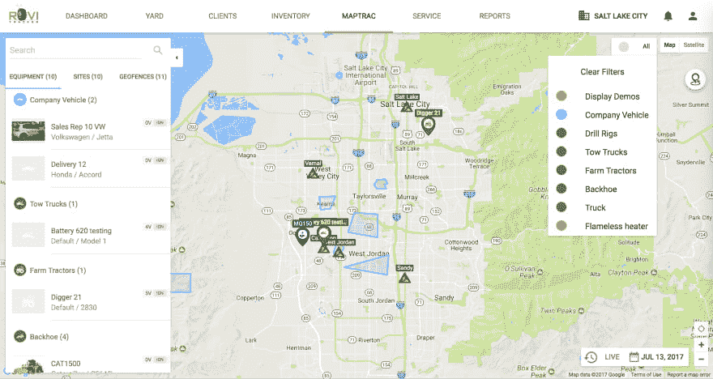

# 用 Redux-Saga 处理副作用

> 原文：<https://dev.to/derekbrimley/handling-side-effects-with-redux-saga>

## 为什么你应该在你的 Redux app 中使用传奇

我最近加入了一家很酷的软件初创公司，我们正在开发一款设备管理软件。应用程序的一部分是一个名为 MapTrac 的页面，这是一个单页、自动重新加载的客户端管理的设备的地图视图。该页面使用的数据在后台不断更新，因此很难让最终用户获得快速流畅的体验。在不停止应用程序其余部分运行的情况下继续获取新数据也很棘手。

[T2】](https://res.cloudinary.com/practicaldev/image/fetch/s--IJTrMAxv--/c_limit%2Cf_auto%2Cfl_progressive%2Cq_auto%2Cw_880/https://thepracticaldev.s3.amazonaws.com/i/4oijf5lpvxqf3uw6p8tv.png)

为了帮助解决这些问题，我们使用了一个很酷的开源库 Redux-Saga。很明显，这个库是依靠 Redux 来工作的(它是一个 Redux 中间件)。正如我所说的，我是公司的新人，所以我自己并不完全了解这个库，这也是我写这篇文章的原因。希望到最后我能更好地理解它！

## Redux？

首先，Redux 是什么？据我所知，Redux 是一个工具，有助于保持您的应用程序，特别是它使用的数据的可靠性。Redux 背后的理念是，您的应用程序只有一个“真实”来源，即您的应用程序的状态。这种状态(或者用 Redux-speak 的说法是 store)是只读的，这意味着它只能通过调用一个动作来更新。动作基本上是告诉你的应用程序发生了一些事情的对象:用户点击了一个按钮，收到了数据，或者其他任何可能影响你的应用程序状态的事情。

这个动作反过来调用一个 reducer，这是一个纯函数。如果你不确定什么是纯函数，你可以去[这里](https://medium.com/r/?url=http%3A%2F%2Fwww.nicoespeon.com%2Fen%2F2015%2F01%2Fpure-functions-javascript%2F)了解更多。基本上，它是一个不更新其范围之外的任何内容的函数。对于一个 reducer 来说，这意味着它根据动作告诉它的内容创建一个新的状态，而不是更新旧的状态。然后，它返回新状态，替换旧状态。这可能看起来很乏味，但它有助于您的应用程序行为一致，并保持对您的状态的控制。Redux 强迫你经历这个过程，这样你总是可以很容易地知道你的状态为什么改变了。[使用 Redux](http://redux.js.org/docs/introduction/Motivation.html) 还有其他原因，但这是主要原因:如果你担心拥有一个庞大、复杂、频繁更新的数据存储，那么 Redux 可以帮助你管理它。

[T2】](https://res.cloudinary.com/practicaldev/image/fetch/s--s29xnwoE--/c_limit%2Cf_auto%2Cfl_progressive%2Cq_auto%2Cw_880/https://thepracticaldev.s3.amazonaws.com/i/481drb5xrksyvr4t4jl5.png)

## Sagas 解决了什么问题？

在 Redux-land 不全是彩虹和独角兽。虽然 Redux 在减少可能影响状态的副作用方面做了很多工作，但是像从服务器获取数据这样的异步任务对于普通 Redux 来说仍然是一个难题。Sagas 是一个 Redux 中间件，它使处理这些情况变得更容易、更纯粹。我们稍后会谈到它是如何做到这一点的，但是首先，让我们回顾一下异步编程背后的基本概念。

### 怎么处理 async？

谈论同步和异步函数之间的区别可能会非常令人困惑，因为这似乎与您的预期相反。在日常用语中，同步意味着两个事物同时存在(即它们“同步”)，而异步意味着两个事物不同时存在。用计算机语言来说，这是颠倒的。如果一个进程或任务在 Javascript 中是同步的，这意味着它在某种程度上依赖于另一个进程。通常，这意味着一个过程在另一个过程完成后才能开始。另一方面，异步任务不依赖于任何其他任务，因此可以独立运行。

通常，这个主题与线程的概念相混淆，虽然它们是相互关联的，但它们并不相同。同步和异步流程都可以在单线程或多线程中运行。直观的例子，[请看这个优秀的 StackOverflow 回答](https://stackoverflow.com/questions/748175/asynchronous-vs-synchronous-execution-what-does-it-really-mean/748235#748235)。关于 StackOverflow 问题的另一个回答提供了一个有用的比喻来记住异步和同步任务之间的区别:

> 你在排队买电影票。除非你前面的每个人都拿到了，否则你是拿不到的，这同样适用于排在你后面的人。
> 
> 你和许多其他人在一家餐馆里。你点你的食物。其他人也可以点他们的食物，他们不必等你的食物做好并端给你后再点。在厨房餐厅里，工人们不停地烹饪、上菜和点菜。食物一做好，人们就会得到服务。

### 这和传奇有什么关系？

好问题！正如我之前提到的，Sagas 用于使管理异步(独立)任务变得更容易，特别是当它们对应用程序的状态产生影响时。虽然使用异步任务有很多好处(例如删除昂贵的 I/O 阻塞调用)，但是众所周知，它们很难管理。它们比同步任务更难预测，所以你不能指望它们及时返回值供其他代码块使用。

Sagas 将不同种类的代码分开，这允许您从异步任务中受益，同时不会阻止应用程序的其余部分运行。实际上，Sagas 运行在自己的线程上，这使得两个代码块不会互相干扰。例如，考虑一个应用程序，它需要在每次调用特定的 Redux 动作时从数据库中获取数据。仅使用同步代码，应用程序会在每次调用该动作时停止。使用 Sagas，可以在应用程序继续运行的同时，在后台调用这些数据库。获取数据，并更新状态，而不会中断应用程序的流程。

这只是“传说可以帮助解决的副作用”的一个例子。请记住，当一个过程影响到它范围之外的东西时，就会产生副作用。其他长时间运行或“不纯”的任务(如与浏览器缓存的交互)可以通过将它们转移到传奇中来改进。

## 什么时候应该使用传说？

Sagas 是一个强大的工具，像所有工具一样，您应该仔细考虑它是否适合您的用例。这些考虑因素包括:

*   它会简化你的代码吗？
*   它会改善最终用户的体验吗？
*   你的应用程序依赖异步任务吗？
*   引入传奇值得额外的复杂性吗？

虽然我们在公司使用传奇故事，但它并不是在所有情况下都有意义。事实上，我们最近重新考虑了使用这项技术的价值。尽管我们认为目前继续依赖它是有意义的，但情况可能并不总是如此。你不应该仅仅因为某项技术能给你带来好处就使用它。你应该权衡利弊，如果利大于弊，就使用传说，减去实现它所需的时间、精力和金钱的机会成本。在我看来，以下是一些利弊:

### 优点

*   可以显著提高应用程序的速度，尤其是那些依赖于定期获取新数据的应用程序(比如单页应用程序)。
*   将 UI 组件从业务逻辑中分离出来，这可以使您的代码更有组织性和可理解性。
*   Sagas 非常适合进行自动化测试，因为它们使用了[生成器函数](https://developer.mozilla.org/en-US/docs/Web/JavaScript/Reference/Global_Objects/Generator)。

### 弊

*   尽管我在上面写了这些，Sagas 还是引入了很多复杂性，这会妨碍理解。
*   仅仅因为你是在后台做，你仍然可以用太多的请求来减慢你的应用程序。

## 结论

如果你知道如何使用，传奇会是一个非常有用的工具。它可以帮助您和您的组织利用新技术，使您的应用程序更好地组织、更容易维护，并为最终用户提供更流畅的体验。要继续了解更多信息，下面是一些有用的链接。此外，我还在学习，所以如果我做错了什么，或者我错过了一些重要的东西，请让我知道！我很想得到一些反馈。

感谢阅读！

## 了解更多

[Sagas Docs](https://redux-saga.js.org/)
[发电机功能](https://developer.mozilla.org/en-US/docs/Web/JavaScript/Reference/Global_Objects/Generator)