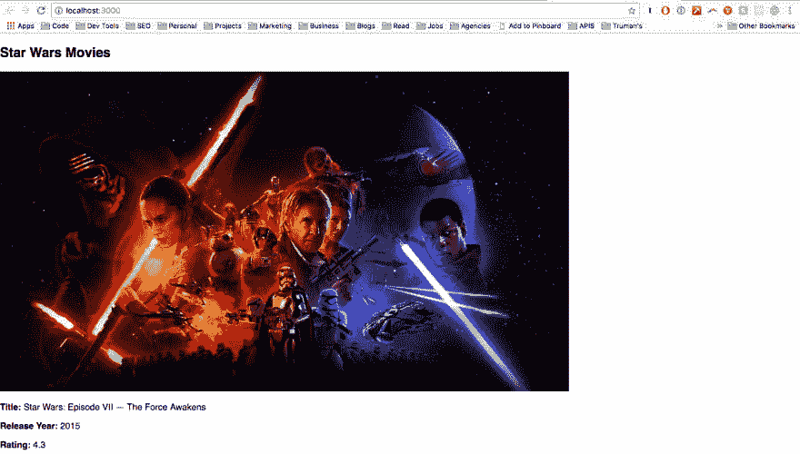
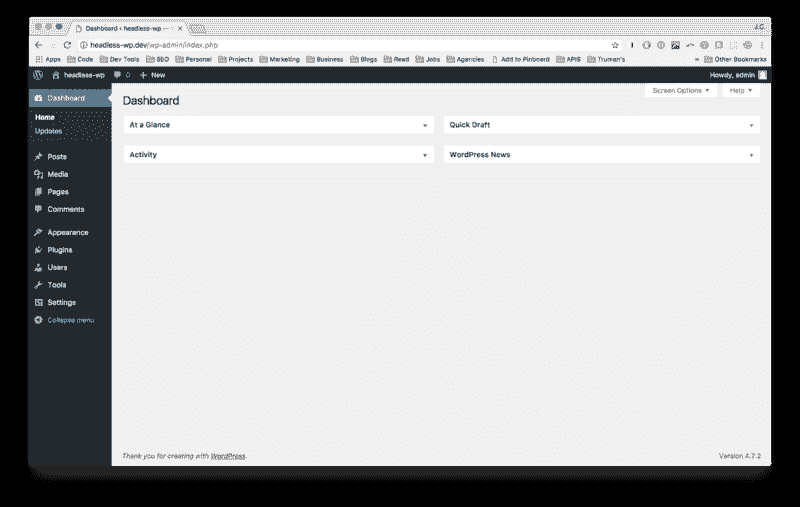
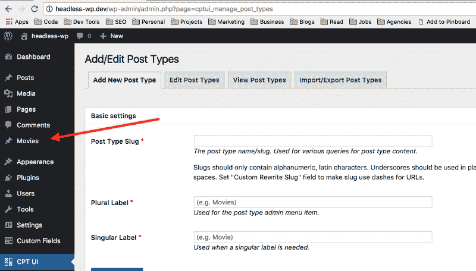
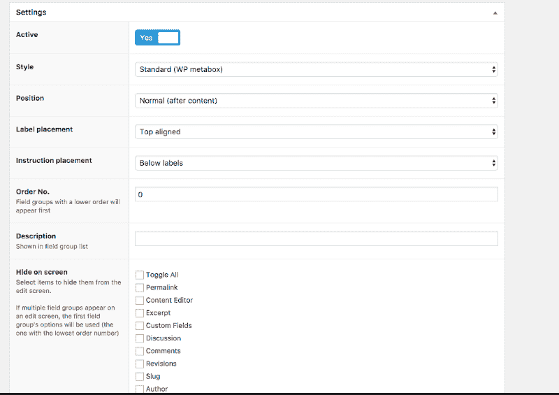
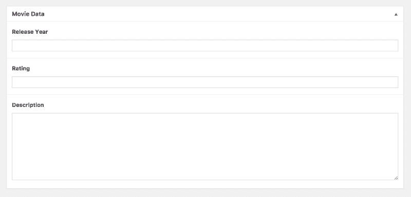
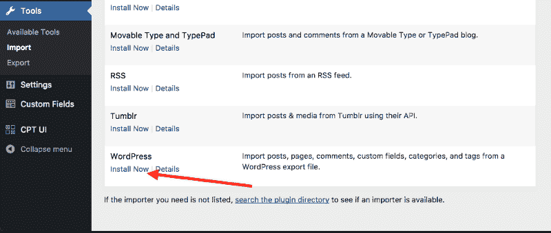
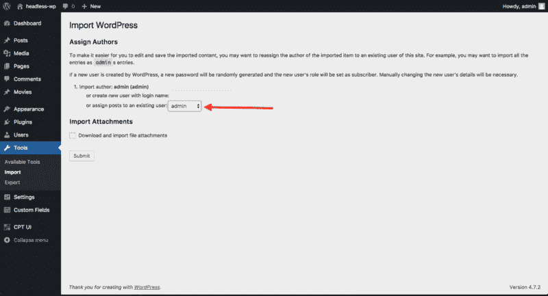
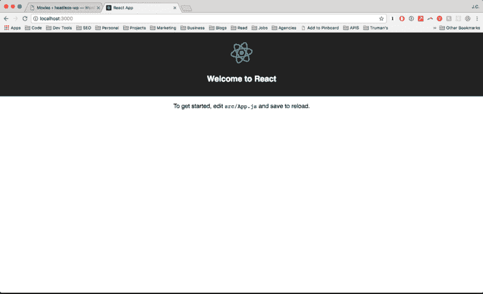
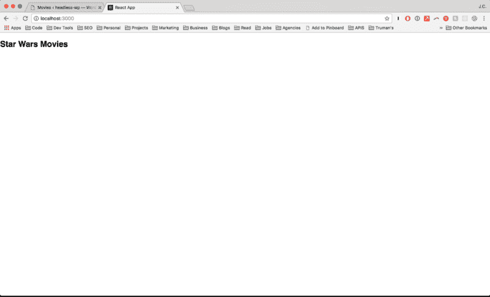
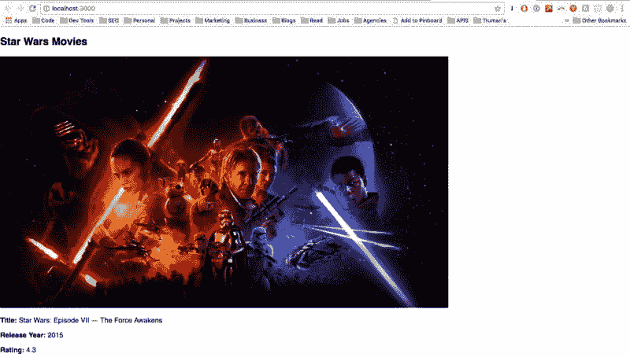

# 带 React 的无头 WordPress

> 原文：<https://dev.to/jchiatt/headless-wordpress-with-react>

[T2】](https://res.cloudinary.com/practicaldev/image/fetch/s--njYGBrLN--/c_limit%2Cf_auto%2Cfl_progressive%2Cq_auto%2Cw_880/https://cdn-images-1.medium.com/max/2000/1%2AXbuZMvyieZQen4Cmk6QbUA.png)

## 介绍使用 WordPress REST API 和 Create React App 构建基于 WordPress 的去耦网站

最近几个月，我对 WordPress REST API(以下简称 WP-API)和 React 产生了浓厚的兴趣。我一直在写 WP-API 的介绍性系列文章，但决定停下来写一篇更完整、更详细的文章。

这篇文章将概述如何开始用 Create React App 和 WP-API 构建解耦(或“无头”)WordPress web 应用程序。虽然这篇文章主要关注前端的 React，但是如果你想用 Angular、Rx、Ember 或 Vue 之类的东西来构建你的前端，一些通用的概念仍然适用。

你不必停止使用 web 应用程序。您不仅可以使用 WP-API 来支持 web 应用程序，还可以同时支持移动应用程序、游戏控制台应用程序等等。

在开始之前，请随意为这个演示克隆存储库[。](https://github.com/jchiatt/headless-wp)

## 为什么？

### 为什么是 WordPress？

你的第一个问题可能是“我为什么要关心 WordPress 有 API？”我已经在另一篇文章中写了一些关于这个的内容，但是如果你不准备打开另一个标签，这里有一些亮点:

1.  截至 11 月份， [WordPress 现在拥有超过 27%的网站](https://wptavern.com/wordpress-passes-27-market-share-banks-on-customizer-for-continued-success) 。从几个月前发布的 4.7 版本开始，WP-API 的所有内容端点现在都包含在 WordPress core 中，所以数百万个新的 API 刚刚上线。

2.  WordPress 超级用户友好。这可能是 WordPress 被如此广泛采用的最大原因。它允许任何人，甚至非技术人员，创建和编辑网站。没有其他工具像 WordPress 一样拥有如此多的功能和支持。

3.  WordPress 是一个强大的内容管理平台。一些从未使用过 WordPress(或者已经很久没有使用过)的开发者有一个普遍的误解，认为 WordPress 仅仅是用来写博客的。虽然这对于写博客来说很棒，但是对于通过[自定义帖子类型](https://codex.wordpress.org/Post_Types#Custom_Post_Types)有效管理自定义内容来说，这确实很棒。

### 为什么要创建 React App？

除非你一直生活在 web 开发世界的岩石下，否则你现在肯定听说过 [React](https://facebook.github.io/react/) 。了解 React 的背景超出了本文的范围，但是我想向您介绍[创建 React 应用](https://github.com/facebookincubator/create-react-app)，这是开始使用 React 的最简单的方法。

React 本身很容易上手。现在，您可以将 React 和 ReactDOM 放入您的应用程序中:

```
<script src="https://unpkg.com/react@15/dist/react.js"></script>
<script src="https://unpkg.com/react-dom@15/dist/react-dom.js"></script> 
```

但是，如果您打算在应用程序的多个小部分上使用 React，兔子洞的深度会很快变得难以承受。想要深入学习 React 通常会导致过多的东西需要学习:ES6、JSX、Babel、Webpack 等等——这些都需要大量的时间投入才能真正理解。

然后，即使在获得了这些主题的深入知识之后，您仍然会在大多数重要项目的配置上花费大量的时间。但是如果你只是想试试 React 本身呢？或者，如果您想从一组默认配置开始，然后在进行过程中修改这些默认配置，该怎么办？

嗯，有希望:创建 React 应用程序。

去年夏天，脸书发布了 Create React App，这是一个样板工具，具有一套合理的配置标准，因此您可以快速开始使用 React 本身，然后按照自己的速度进入兔子洞。

Create React App 捆绑了 Webpack、ESLint、Babel、Autoprefixer、Jest 和社区中其他优秀的工具。

### 为什么无头 WordPress？

好吧，WordPress 很棒。React 很棒。那么为什么要把两者结合起来呢？

1.  JavaScript 是 WordPress 的未来。2015 年末，WordPress 背后的公司 Automattic 用 JavaScript 重新编写了他们的整个管理应用程序([代号“Calypso”](https://developer.wordpress.com/calypso/))。几周后，Automattic 的 CEO 马特·莫楞威格给所有 WordPress 开发者布置了一个大作业:“[深入学习 JavaScript，](http://wesbos.com/learn-javascript/)”

2.  **因为前端/后端分离对用户和开发者都有好处**。更好的用户体验是可能的。维护大型代码库效率更高。更好的性能。

3.  贵公司可以雇佣更多的专业人才。前端工程师不需要了解 WordPress，反之亦然。不要雇佣一个多面手 Wordpress 主题/插件开发者，你可以雇佣不同的角色，他们分别对前端工程和 WordPress 有深入的了解。

## 向前冲！

好了，现在我们已经确定了为什么这很重要，让我们开始吧！

### 我们将建造什么

在本教程中，我们将构建一个简单的应用程序来显示每部《星球大战》电影的数据。数据将由我们将要构建的 WordPress REST API 提供，我们将使用 Create React App 构建的 React 前端来使用它。

### 第一步:创建新的 WordPress 安装

我不会深入讨论这个问题，因为网上有成千上万的资源可以用来安装 WordPress。

如果这是你第一次钻研 WordPress，那么我假设你没有设置本地环境。有一些现成的解决方案，如 MAMP 和桌面服务器，它们非常适合快速启动。目前，我使用的是[流浪者与可变流浪者流浪者和可变 VVV](http://wpbeaches.com/setting-up-a-wordpress-vvv-vagrant-workflow/) 。

[T2】](https://res.cloudinary.com/practicaldev/image/fetch/s--Am4BQOSm--/c_limit%2Cf_auto%2Cfl_progressive%2Cq_auto%2Cw_880/https://cdn-images-1.medium.com/max/800/1%2AYrT0wVD89S07t0R-8vLQug.png)

一旦你有了新的 WordPress 安装设置，继续访问你的管理仪表板:`http://your-site.dev/wp-admin`

[T2】](https://res.cloudinary.com/practicaldev/image/fetch/s--7acnQx9C--/c_limit%2Cf_auto%2Cfl_progressive%2Cq_auto%2Cw_880/https://cdn-images-1.medium.com/max/800/1%2A0aC-EcmtvoinClX9nU6eSg.png)

### 第二步:安装 WordPress REST API 插件(可能不需要)

只有当你运行的 WordPress 版本低于 4.7 时，才需要这一步。你可以通过进入仪表板>更新查看你正在运行的 WordPress 的版本:

~ [](https://res.cloudinary.com/practicaldev/image/fetch/s--lxHePgIo--/c_limit%2Cf_auto%2Cfl_progressive%2Cq_auto%2Cw_880/https://cdn-images-1.medium.com/max/800/1%2AaFi-cQnBZaveO_iTzCuLpA.png)

从 WordPress 4.7 开始，WP-API[被集成到 WordPress 核心](https://developer.wordpress.org/rest-api/)中。因此，如果您运行的是 4.7 或更高版本，您就可以开始了。

否则，导航到插件>添加新的并搜索“WordPress REST API(版本 2)”。继续安装它，然后激活它。

### 第三步:卫生检查

启动你最喜欢的 API 请求工具(我喜欢用 Postman)或者终端窗口。

向`http://your-site.dev/wp-json/`发出 GET 请求。你应该得到一些 JSON，它包含了你的 WordPress 站点的所有资源和它们各自的端点。

要进行快速演示，请向`http://your-site.dev/wp-json/wp/v2/posts/1`发送 GET 请求——您应该会得到 JSON，其中包含关于“Hello World！”的信息默认情况下，所有新安装的 WordPress 都会提供测试文章。如果你已经删除了测试帖子，你不会得到任何东西回来。

### 第四步:为这个项目安装插件

接下来要做的是安装这个演示项目所需的插件。继续安装它们，然后回来解释每一个(除非另有说明，每一个都可以通过插件>添加新插件来搜索和安装)。

### [【CPT ui】](https://wordpress.org/plugins/custom-post-type-ui/)

自定义文章类型(CPTs)是 WordPress 最强大的功能之一。它允许你创建自定义内容类型，超越 WordPress 自带的默认文章和页面。

虽然通过 PHP 创建 CPT 肯定是可能的(而且相当简单),但我真的很喜欢 CPT UI 的易用性。另外，如果你在阅读这篇文章之前没有 WordPress 的经验，我希望你能够关注 WP-API 本身，而不是 WordPress 和 PHP。

对于我们的演示，我们将创建一个名为 Movies 的 CPT。

我将介绍如何手动添加电影 CPT，但如果您想跳过这一步，只导入数据，请转到 CPT UI >工具并粘贴以下内容:

```
{
"movies": {
"name": "movies",
"label": "Movies",
"singular_label": "Movie",
"description": "",
"public": "true",
"publicly_queryable": "true",
"show_ui": "true",
"show_in_nav_menus": "true",
"show_in_rest": "true",
"rest_base": "movies",
"has_archive": "false",
"has_archive_string": "",
"exclude_from_search": "false",
"capability_type": "post",
"hierarchical": "false",
"rewrite": "true",
"rewrite_slug": "",
"rewrite_withfront": "true",
"query_var": "true",
"query_var_slug": "",
"menu_position": "",
"show_in_menu": "true",
"show_in_menu_string": "",
"menu_icon": "",
"supports": [
"title",
"editor",
"thumbnail"
],
"taxonomies": [],
"labels": {
"menu_name": "",
"all_items": "",
"add_new": "",
"add_new_item": "",
"edit_item": "",
"new_item": "",
"view_item": "",
"search_items": "",
"not_found": "",
"not_found_in_trash": "",
"parent_item_colon": "",
"featured_image": "",
"set_featured_image": "",
"remove_featured_image": "",
"use_featured_image": "",
"archives": "",
"insert_into_item": "",
"uploaded_to_this_item": "",
"filter_items_list": "",
"items_list_navigation": "",
"items_list": ""
},
"custom_supports": ""
}
} 
```

现在是手动过程:

1.  转到 CPT UI >添加/编辑文章类型

2.  对于文章类型 Slug，输入`movies`——这是 WordPress 将使用的 URL slug。

3.  对于复数标签，输入`Movies`

4.  对于单数标签，输入`Movie`

5.  **重要提示:**向下滚动到设置区，找到“在 REST API 中显示”选项。默认情况下，该值设置为 False。如果不将其改为 True，您将无法使用 WP-API 查询这个 CPT。在该选项的正下方，您应该看到“REST API base slug”选项——您可以在这里输入`movies`。

6.  向下滚动并点击添加文章类型。

您应该会在边栏中看到一个新的“影片”选项:

[T2】](https://res.cloudinary.com/practicaldev/image/fetch/s--NktIDpkf--/c_limit%2Cf_auto%2Cfl_progressive%2Cq_auto%2Cw_880/https://cdn-images-1.medium.com/max/800/1%2AnC3WA7xPEN6VTGiuRf-SZw.png)

#### [高级自定义字段](https://wordpress.org/plugins/advanced-custom-fields/)

用数据库术语来说，如果 CPT 是表，那么定制字段就是列。这实际上并不是 WordPress 在数据库中存储 CPT 和自定义字段的方式，但是我发现这个例子对那些没有 WordPress 经验的人很有帮助。CPT 是资源(即“电影”)，定制字段是关于该资源的元数据(即“发行年份、分级、描述”)。

高级自定义域(ACF)是 WordPress 自定义域的插件。当然，您可以用 PHP 创建自定义字段(就像 CPTs 一样)，但是 ACF 是一个非常省时的工具(而且使用起来很愉快)。

你可以从 Plugins>Add New 中得到这个，但是如果你想使用 import 函数来导入我的样本数据，你需要 Pro 版本，[，你可以在这里找到](https://www.advancedcustomfields.com/pro/)。

如果你有专业版，激活插件后进入自定义字段>工具。然后，您可以粘贴这个 JSON 来导入您需要的字段:

```
[
{
"key": "group_582cf1d1ea6ee",
"title": "Movie Data",
"fields": [
{
"key": "field_582cf1d9956d7",
"label": "Release Year",
"name": "release_year",
"type": "number",
"instructions": "",
"required": 0,
"conditional_logic": 0,
"wrapper": {
"width": "",
"class": "",
"id": ""
},
"default_value": "",
"placeholder": "",
"prepend": "",
"append": "",
"min": "",
"max": "",
"step": ""
},
{
"key": "field_582cf1fc956d8",
"label": "Rating",
"name": "rating",
"type": "number",
"instructions": "",
"required": 0,
"conditional_logic": 0,
"wrapper": {
"width": "",
"class": "",
"id": ""
},
"default_value": "",
"placeholder": "",
"prepend": "",
"append": "",
"min": "",
"max": "",
"step": ""
},
{
"key": "field_5834d24ad82ad",
"label": "Description",
"name": "description",
"type": "textarea",
"instructions": "",
"required": 0,
"conditional_logic": 0,
"wrapper": {
"width": "",
"class": "",
"id": ""
},
"default_value": "",
"placeholder": "",
"maxlength": "",
"rows": "",
"new_lines": "wpautop"
}
],
"location": [
[
{
"param": "post_type",
"operator": "==",
"value": "movies"
}
]
],
"menu_order": 0,
"position": "normal",
"style": "default",
"label_placement": "top",
"instruction_placement": "label",
"hide_on_screen": "",
"active": 1,
"description": ""
}
] 
```

如果您没有专业版，以下是设置自定义字段的方法:

##### 创建字段组

ACF 在字段组中组织自定义字段的集合。这是特定于 ACF 的域。这就是目前您真正需要了解的关于字段组的全部内容。

1.转到自定义字段>字段组

1.  单击“添加新项”

2.  对于字段组标题，输入“电影数据”

3.  向下滚动，直到看到位置元框。将此字段组设置为仅在文章类型等于电影时显示:

[T2】](https://res.cloudinary.com/practicaldev/image/fetch/s--vXEd2G75--/c_limit%2Cf_auto%2Cfl_progressive%2Cq_auto%2Cw_880/https://cdn-images-1.medium.com/max/800/1%2A3m-RDPKxZ8Ob8zeJ9DT1iw.png)

然后，您可以向下滚动到设置元框。您应该可以将所有这些选项设置为默认值，但是您仍然可以通过与此屏幕截图进行比较来浏览一下:

[T2】](https://res.cloudinary.com/practicaldev/image/fetch/s--TERPem12--/c_limit%2Cf_auto%2Cfl_progressive%2Cq_auto%2Cw_880/https://cdn-images-1.medium.com/max/800/1%2AbT2V5DJ6L4wMrUbYmpFtNg.png)

之后，单击更新保存您的字段组设置。

##### 创建自定义字段

首先，创建发布年份字段:

```
Field Label: Release Year
Field Name: release_year
Field Type: Number
Required? No 
```

接下来是评级字段:

```
Field Label: Rating
Field Name: rating
Field Type: Number
Required? No 
```

最后，描述字段:

```
Field Label: Description
Field Name: description
Field Type: Text Area
Required? No 
```

不要忘记点击更新来保存您的新的自定义字段。

现在，如果您转至“电影”>“添加新项”,然后向下滚动一点，您应该会看到一个名为“电影数据”(您的字段组的名称)的元框，以及您在其中创建的每个自定义字段:

[T2】](https://res.cloudinary.com/practicaldev/image/fetch/s--SO2i3GVS--/c_limit%2Cf_auto%2Cfl_progressive%2Cq_auto%2Cw_880/https://cdn-images-1.medium.com/max/800/1%2Ac4XMim3_po5NMXwO3TQVUg.png)

#### [ACF 休息 API](https://wordpress.org/plugins/acf-to-rest-api/)

既然我们有了自定义字段，我们需要将它们暴露给 WP-API。ACF 目前不支持 WP-API，但是社区中有一个很棒的插件解决方案，叫做 ACF to REST API。你所要做的就是安装(你可以在插件>添加新项中搜索到)并激活它，它会立即将你的 ACF 自定义字段暴露给 API。

如果我们直接通过 PHP 创建自定义字段(不使用插件)，还有几个漂亮的函数可以将字段暴露给 API。[更多详情请点击此处](https://developer.wordpress.org/rest-api/extending-the-rest-api/modifying-responses/)。

### 第五步:过账数据导入

这是让我们的 WordPress 安装准备好为我们的星球大战数据服务的最后一步。

首先，我们需要导入所有的电影。幸运的是，我已经做了所有的手工工作，你所要做的就是导入一个漂亮的文件

转到工具>导入。在页面底部，你会看到一个从 WordPress 导入的选项，下面有一个立即安装链接:

[T2】](https://res.cloudinary.com/practicaldev/image/fetch/s--ha3BrT7d--/c_limit%2Cf_auto%2Cfl_progressive%2Cq_auto%2Cw_880/https://cdn-images-1.medium.com/max/800/1%2AEqc1XFQ9G9wjcop-FcCM5w.png)

WordPress 导入安装完成后，您应该会看到一个运行导入程序的链接。点击该按钮，[在下一个屏幕](https://gist.github.com/jchiatt/75b9d8218c09a8a881770399343da69a#file-movie-data-xml)导入该文件。

下一个屏幕将要求您将导入的帖子分配给一个作者。您可以将它们分配到您的默认管理员帐户，然后单击提交:

[T2】](https://res.cloudinary.com/practicaldev/image/fetch/s--shU7Itj0--/c_limit%2Cf_auto%2Cfl_progressive%2Cq_auto%2Cw_880/https://cdn-images-1.medium.com/max/800/1%2AgWmhR0zB7-SOVWcQErYjpQ.png)

最后，进入电影>所有电影。你应该会看到一个星球大战电影列表(第 1-7 集)。因为我是在本地环境中开发的，所以导入文件无法导入电影的特色图像(它无法从原始服务器获取这些图像)，所以您必须手动添加这些图像(只需要大约 30 秒)。

我的首选方法(也是最快的方法)是将鼠标悬停在所有电影页面上的每个帖子上，按住 Command(Windows 上的 Control)并单击每个帖子的编辑。这将为每部电影打开一个标签。

在每个编辑页面的右侧栏中，找到特色图像元框，然后单击设置特色图像。[这里有一个 ZIP 文件，里面有你需要的每张图片](http://files.builtbygood.co/B8Ej/1YcE71CU)。或者你可以使用你喜欢的任何其他图像。

对于第一种方法，最简单的方法是将所有图像上传到您单击“设置特色图像”时看到的图像模式，然后只选择您需要的第一部电影的图像(这将节省您在所有电影中分别上传每个图像的时间):

如果这看起来不清楚，[这里有一个 GIF](http://files.builtbygood.co/2z0c/5gaJ5HKh) ,希望比我拙劣的解释更有意义。

对于每部电影，请确保在选择特色图像后单击更新。

现在你可以走了！现在让你的 WordPress 服务器保持运行，让我们继续。

### 步骤六:安装 Create React App

假设您的计算机上已经安装了 Node 和 npm，只需运行以下命令:

```
npm install -g create-react-app 
```

就是这样！您已经准备好使用 Create React 应用程序。

### 第七步:创建 App

进入你想要创建前端的目录(这个目录不必(也不应该)与你的 WordPress 安装目录相同)。然后运行:

```
create-react-app headless-wp 
```

这个过程需要几分钟，但是一旦完成，您应该能够 cd 进入新创建的`headless-wp`目录。从那里，运行:

```
npm start 
```

这个命令引发了很多事情，但是现在您需要知道的是它将启动一个 Webpack dev 服务器。您的浏览器应该会自动打开到`http://localhost:3000`:

[T2】](https://res.cloudinary.com/practicaldev/image/fetch/s--AlUJNsKu--/c_limit%2Cf_auto%2Cfl_progressive%2Cq_auto%2Cw_880/https://cdn-images-1.medium.com/max/800/1%2ArunBBJVfSbKfNcl1fsi-Fg.png)

您可以让服务器在您的 shell 中运行。每次保存文件时，热重装将自动刷新您的网页。

### 第八步:创建你的组件

由于这个演示应用程序非常简单，我们将只使用一个组件。我们可以很容易地创建另一个组件(就像创建另一个`ComponentName.js`文件并将其导入其父组件一样简单)，但是我们将改为编辑我们的`App.js`组件。

打开`App.js`。您可以删除该文件中除第一行和最后一行之外的所有现有代码。

此时，`App.js`应该是这样的:

```
import React, { Component } from 'react';
export default App; 
```

接下来，为这个组件创建`render()`函数。这个函数在每次状态改变时被调用。如果你不确定这意味着什么，请耐心等待。很快就说得通了。

`App.js`现在应该是这样的:

```
import React, { Component } from 'react';
class App extends Component {
  render() {
    return (
      <div>
        <h2>Star Wars Movies</h2>
      </div>
    )
  }
}
export default App; 
```

无论`render()`返回什么，都会被绘制在 DOM 上。如果您保存该文件并返回到您的浏览器，它应该会自动重新加载，您应该会看到我们创建的这个`h2`:

[T2】](https://res.cloudinary.com/practicaldev/image/fetch/s--f3T5JthN--/c_limit%2Cf_auto%2Cfl_progressive%2Cq_auto%2Cw_880/https://cdn-images-1.medium.com/max/800/1%2AFxZzfD4dJynhMAx7ESVWkg.png)

这很棒，但是我们存储在 WordPress 中的关于星球大战电影的数据呢？是时候获取数据了！

更新`App.js`像这样:

```
import React, { Component } from 'react';
class App extends Component {
  constructor() {
    super();
    this.state = {
      movies: []
    }
  }
componentDidMount() {
    let dataURL = "http://headless-wp.dev/wp-json/wp/v2/movies?_embed";
    fetch(dataURL)
      .then(res => res.json())
      .then(res => {
        this.setState({
          movies: res
        })
      })
  }
render() {
return (
      <div>
        <h2>Star Wars Movies</h2>
      </div>
    )
  }
}
export default App; 
```

我们刚刚在我们的`render()`函数中添加了两个新函数:`constructor()`和`componentDidMount()`。

`constructor()`函数是我们初始化状态的地方。因为我们只处理一些关于我们电影的 JSON，所以我们的状态会非常简单。我们的初始状态将只是一个空的`movies`数组，因为我们期望得到那个 JSON。

在组件挂载后触发`componentDidMount()`函数。这是进行外部 API 调用的最佳位置，所以我们在这里添加了代码，使用[获取 API](https://developer.mozilla.org/en-US/docs/Web/API/Fetch_API) 从我们的 WordPress API 获取所有电影(确保更新 URL 以反映您自己的 URL！).然后，我们获取响应，将其解析为 JSON，然后将其推入我们的状态对象。

一旦响应被推入我们的状态，组件将通过触发`render()`函数重新呈现，因为状态已经改变。但是现在这并不重要，因为目前我们的`render()`函数仍然只返回一个内部有`h2`的 div。

让我们解决这个问题。

我们现在要给我们的`render()`函数添加一点额外的代码，它将把我们状态中的 JSON(当前存储在`this.state.movies`中)和`map`每部电影及其数据放入`div`中。

`App.js`现在应该是这样的:

```
import React, { Component } from 'react';
class App extends Component {
  constructor() {
    super();
    this.state = {
      movies: []
    }
  }
componentDidMount() {
    let dataURL = "http://headless-wp.dev/wp-json/wp/v2/movies?_embed";
    fetch(dataURL)
      .then(res => res.json())
      .then(res => {
        this.setState({
          movies: res
        })
      })
  }
render() {
    let movies = this.state.movies.map((movie, index) => {
      return <div key={index}>
      
      <p><strong>Title:</strong> {movie.title.rendered}</p>
      <p><strong>Release Year:</strong> {movie.acf.release_year}</p>
      <p><strong>Rating:</strong> {movie.acf.rating}</p>
      <div><strong>Description:</strong><div dangerouslySetInnerHTML={ {__html: movie.acf.description} } /></div>
      </div>
    });
return (
      <div>
        <h2>Star Wars Movies</h2>
      </div>
    )
  }
}
export default App; 
```

如果您保存文件，页面将重新加载，但您仍然不会在页面上看到星球大战电影数据加载。那是因为还有最后一件事要补充。我们将我们的每部电影映射到它们各自的 div，然后将所有这些电影存储在我们的`render()`函数的`movies`变量中。现在我们只需要告诉我们的`render()`函数通过在我们的`h2`下面添加`{movies}`来返回我们的`movies`变量。

已完成`App.js`:

```
import React, { Component } from 'react';
class App extends Component {
  constructor() {
    super();
    this.state = {
      movies: []
    }
  }
componentDidMount() {
    let dataURL = "http://headless-wp.dev/wp-json/wp/v2/movies?_embed";
    fetch(dataURL)
      .then(res => res.json())
      .then(res => {
        this.setState({
          movies: res
        })
      })
  }
render() {
    let movies = this.state.movies.map((movie, index) => {
      return <div key={index}>
      
      <p><strong>Title:</strong> {movie.title.rendered}</p>
      <p><strong>Release Year:</strong> {movie.acf.release_year}</p>
      <p><strong>Rating:</strong> {movie.acf.rating}</p>
      <div><strong>Description:</strong><div dangerouslySetInnerHTML={ {__html: movie.acf.description} } /></div>
      </div>
    });
return (
      <div>
        <h2>Star Wars Movies</h2>
        {movies}
      </div>
    )
  }
}
export default App; 
```

切换回你的浏览器窗口，你应该在页面重新加载后看到星球大战的数据:

[T2】](https://res.cloudinary.com/practicaldev/image/fetch/s--HiWcbnnx--/c_limit%2Cf_auto%2Cfl_progressive%2Cq_auto%2Cw_880/https://cdn-images-1.medium.com/max/800/1%2AXbuZMvyieZQen4Cmk6QbUA.png)

## 更进一步

这仅仅是你能用 WP-API 和 React 做些什么的开始。两者都有许多其他特征，都有巨大的社区。

通过学习身份验证和 POST 请求、自定义端点和更复杂的查询，您可以进一步了解 WP-API。

正如我前面所说，Create React 应用程序是为您量身打造的。当你准备好学习更多内容时，你可以学习更多关于 Redux、ES6、Webpack、React Native 等东西。

我将在以后的文章中讨论这些话题，所以一定要回来看看。或者，如果你喜欢将这些帖子直接发送到你的收件箱，[给我发电子邮件](mailto:jc@builtbygood.co)，我会将你添加到我的邮件列表中。

## 提问？

我很乐意帮忙！在下面留下评论是最快得到回复的方式(另外，它还能帮助其他有同样问题的人！).否则，[在 Twitter 上给我留言](https://twitter.com/jchiatt)或[给我发电子邮件](mailto:jc@builtbygood.co)，我会尽我所能提供帮助！