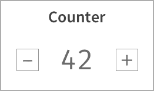

# Redux 是如何工作的？

> 原文：<https://dev.to/dceddia/how-does-redux-work-cal>

在学习了一点 React 和进入 Redux 之后，真的很困惑它是如何工作的。

动作，减少器，动作创建器，中间件，纯函数，不变性...

这些术语中的大多数似乎完全陌生。

所以在这篇文章中，我们将通过一个简单的例子来揭开*Redux 是如何工作的。就像在[的上一篇文章](https://dev.to/dceddia/whats-redux-and-when-should-you-use-it-d7f)中一样，在处理术语之前，我会试着用简单的术语解释 Redux。*

如果你还不确定的 Redux 是什么，或者为什么你应该使用它，请先阅读[这篇文章](https://dev.to/dceddia/whats-redux-and-when-should-you-use-it-d7f)，然后回到这里。

## 第一:平淡无奇的状态

我们将从一个普通的旧 React 状态的例子开始，然后一点一点地添加 Redux。

这里有一个计数器:

[T2】](https://res.cloudinary.com/practicaldev/image/fetch/s--6eijSHH3--/c_limit%2Cf_auto%2Cfl_progressive%2Cq_auto%2Cw_880/https://daveceddia.cimg/counter-plain.png)

下面是代码(为了简单起见，我省略了 CSS，所以它不会像图片一样漂亮):

```
import React from 'react';

class Counter extends React.Component {
  state = { count: 0 }

  increment = () => {
    this.setState({
      count: this.state.count + 1
    });
  }

  decrement = () => {
    this.setState({
      count: this.state.count - 1
    });
  }

  render() {
    return (
      <div>
        <h2>Counter</h2>
        <div>
          <button onClick={this.decrement}>-</button>
          <span>{this.state.count}</span>
          <button onClick={this.increment}>+</button>
        </div>
      </div>
    )
  }
}

export default Counter; 
```

Enter fullscreen mode Exit fullscreen mode

快速回顾一下，这是如何工作的:

*   `count`状态存储在顶层`Counter`组件中
*   当用户点击“+”时，按钮的`onClick`处理程序被调用，它被绑定到`Counter`组件中的`increment`函数。
*   `increment`函数用新的计数更新状态。
*   因为状态被更改，React 重新呈现了`Counter`组件(及其子组件)，并且显示了新的计数器值。

如果你需要更多关于状态改变如何工作的细节，去阅读[React](https://daveceddia.com/visual-guide-to-state-in-react/)中状态的可视化指南，然后回到这里。说真的:如果上面的*不是*给你的复习，你需要在学习 Redux 之前学习 React state 如何工作*。*

#### 快速设置

如果您想跟随代码，现在就创建一个项目:

*   没有的话安装 create-react-app(`npm install -g create-react-app`)
*   创建项目:`create-react-app redux-intro`
*   打开`src/index.js`并将其替换为:

```
import React from 'react';
import { render } from 'react-dom';
import Counter from './Counter';

const App = () => (
  <div>
    <Counter />
  </div>
);

render(<App />, document.getElementById('root')); 
```

Enter fullscreen mode Exit fullscreen mode

*   用上面计数器示例中的代码创建一个`src/Counter.js`。

## 现在:添加 Redux

正如在第 1 部分中讨论的[，Redux 将你的应用的**状态**保存在一个单独的**商店**。然后，您可以提取该状态的一部分，并将其作为道具插入到组件中。这让你可以将数据保存在一个全局的地方(商店),并将其直接提供给应用程序中的任何组件，而无需层层传递。](https://dev.to/dceddia/whats-redux-and-when-should-you-use-it-d7f)

旁注:你会经常看到“state”和“store”这两个词互换使用。从技术上讲，**状态**是数据，而**存储**是保存数据的地方。

当我们完成下面的步骤时，请跟随您的编辑器！它将帮助您理解这是如何工作的(我们将一起解决一些错误)。

将 Redux 添加到项目:

```
$ yarn add redux react-redux 
```

Enter fullscreen mode Exit fullscreen mode

#### redux vs react-redux

等等，两个图书馆？你说什么是 react-redux？嗯，我一直在对你撒谎(对不起)。

看，`redux`给你一个存储，让你在里面保存状态，取出状态，并在状态改变时作出响应。但这就是它的全部功能。实际上是`react-redux`让您将状态片段连接到反应组件。没错:`redux`对反应*一无所知*。

这些图书馆就像一个豆荚里的两颗豌豆。99.999%的时候，当任何人在 React 的上下文中提到“Redux”时，他们指的是这两个库。因此，当你在 StackOverflow、Reddit 或其他地方的看到 Redux 时，请记住这一点。

## 最后的事情先做

大多数教程都是从创建一个商店、设置 Redux、编写一个 reducer 等等开始的。在屏幕上出现任何东西之前，必须发生很多事情。

我将采用一种向后的方法，这将需要同样多的代码来使事情出现在屏幕上，但希望每一步背后的动机会更清楚。

回到计数器应用程序，让我们想象一下，我们将组件的状态移动到 Redux 中。

我们将从组件中删除状态，因为我们很快就会从 Redux 中得到它:

```
import React from 'react';

class Counter extends React.Component {
  increment = () => {
    // fill in later
  }

  decrement = () => {
    // fill in later
  }

  render() {
    return (
      <div>
        <h2>Counter</h2>
        <div>
          <button onClick={this.decrement}>-</button>
          <span>{this.props.count}</span>
          <button onClick={this.increment}>+</button>
        </div>
      </div>
    )
  }
}

export default Counter; 
```

Enter fullscreen mode Exit fullscreen mode

## 给计数器接线

注意`{this.state.count}`变成了`{this.props.count}`。当然，这还不行，因为计数器没有收到`count`道具。我们要用 Redux 注射进去。

为了得到 Redux 的计数，我们首先需要在顶部导入`connect`函数:

```
import { connect } from 'react-redux'; 
```

Enter fullscreen mode Exit fullscreen mode

然后我们需要将计数器组件“连接”到底部的 Redux:

```
// Add this function:
function mapStateToProps(state) {
  return {
    count: state.count
  };
}

// Then replace this:
// export default Counter;

// With this:
export default connect(mapStateToProps)(Counter); 
```

Enter fullscreen mode Exit fullscreen mode

这将失败，并出现一个错误(稍后将详细介绍)。

以前我们导出组件本身，现在我们用这个`connect`函数调用包装它。

#### 什么是`connect`？

你可能会注意到这个电话看起来有点…奇怪。为什么是`connect(mapStateToProps)(Counter)`而不是`connect(mapStateToProps, Counter)`或者`connect(Counter, mapStateToProps)`？那是在干什么？

这样写是因为`connect`是一个*高阶函数*，这是一种当你调用它时返回一个函数的奇特说法。然后用一个组件调用*那个*函数返回一个新的(包装的)组件。

另一个名称是高阶组件*(又名“HOC”)。HOCs 最近受到了一些负面报道，但它们仍然非常有用，而`connect`就是一个有用的例子。*

 *`connect`所做的是挂钩到 Redux，取出整个状态，并通过您提供的`mapStateToProps`函数传递它。这需要一个自定义函数，因为只有*你*会知道 Redux 中的状态的“形状”。

经过整个州，好像在说，“嘿，告诉我你需要什么来摆脱这一团乱麻。”

从`mapStateToProps`返回的对象作为道具被输入到组件中。上面的例子将传递`state.count`作为`count`道具的值:对象中的关键点成为道具名，它们对应的值成为道具的值。所以你看，这个函数字面上*定义了从状态到道具*的映射。

## 错误意味着进步！

如果您继续操作，您将在控制台中看到如下错误:

> 在“连接(计数器)”的上下文或属性中找不到“存储”。要么将根组件包装在中，要么将“store”作为道具显式传递给“Connect(Counter)”。

由于`connect`从 Redux 商店中提取数据，并且我们还没有建立商店或告诉应用程序如何找到它，这个错误是非常合乎逻辑的。Redux 根本不知道现在发生了什么。

## 提供商店

Redux 保存整个应用程序的全局状态，通过用来自`react-redux`、*的`Provider`组件包装整个应用程序，应用程序树中的每个组件*将能够使用`connect`来访问 Redux 商店。

这意味着`App`，和`App`的孩子(像`Counter`)，以及他们孩子的孩子，等等——他们现在都可以访问 Redux 存储，但是只有当他们被对`connect`的调用显式包装时。

我并不是说真的要这么做——【to】整合每一个组件都是一个坏主意(混乱的设计，而且太慢)。

这件事现在看起来似乎完全是魔法。是有一点；它实际上使用了 React 的“上下文”功能。

这就像一个秘密通道连接到每个组件，使用`connect`打开通道的门。

想象一下把糖浆倒在一堆薄煎饼上，即使你只是把它倒在最上面的一个薄煎饼上，它是如何设法进入所有的薄煎饼的。`Provider`这样做是为了 Redux。

在`src/index.js`中，导入`Provider`并包裹

```
import { Provider } from 'react-redux';

...

const App = () => (
  <Provider>
    <Counter/>
  </Provider>
); 
```

Enter fullscreen mode Exit fullscreen mode

尽管如此，我们仍然会遇到这个错误——这是因为`Provider`需要一个商店来处理。它将商店作为道具，但我们需要先创建一个。

## 创建商店

Redux 附带了一个创建商店的便利功能，它被称为`createStore`。没错。让我们创建一个商店并将其传递给提供者:

```
import { createStore } from 'redux';

const store = createStore();

const App = () => (
  <Provider store={store}>
    <Counter/>
  </Provider>
); 
```

Enter fullscreen mode Exit fullscreen mode

另一个错误，但这次不同:

> 期望缩减器是一个函数。

所以，Redux 的问题是:它不是很聪明。您可能希望通过创建一个存储，为存储中的状态提供一个很好的默认值。也许是一个空的物体？

但是不:Redux 对你的状态没有任何 T2 假设。看你的了！它可以是一个对象，或者一个数字，或者一个字符串，或者任何你需要的东西。所以我们必须提供一个返回状态的函数。这个功能被称为**减速器**(我们一会儿就知道为什么)。所以让我们做一个可能的最简单的，传入`createStore`，看看会发生什么:

```
function reducer() {
  // just gonna leave this blank for now
  // which is the same as `return undefined;`
}

const store = createStore(reducer); 
```

Enter fullscreen mode Exit fullscreen mode

## 减速器应该总是返回一些东西

现在错误不同了:

> 无法读取未定义的属性“count”

它中断是因为我们试图访问`state.count`，但是`state`是未定义的。Redux 期望我们的`reducer`函数为`state`返回值，除了它(隐式地)返回了`undefined`。东西理所当然地坏掉了。

预计减速器将返回状态。它实际上应该采用*当前*状态并返回*新*状态，但是没关系；我们会回来的。

让我们让 reducer 返回与我们需要的形状相匹配的东西:一个具有`count`属性的对象。

```
function reducer() {
  return {
    count: 42
  };
} 
```

Enter fullscreen mode Exit fullscreen mode

嘿！有用！计数现在显示为“42”。太棒了。

不过有一点:人数永远停留在 42 人。

## 故事到此为止

在我们开始讨论如何真正地*更新*计数器之前，让我们看看到目前为止我们已经做了什么:

*   我们编写了一个`mapStateToProps`函数，顾名思义:将 Redux 状态转换成包含道具的对象。
*   我们用来自`react-redux`的`connect`函数将 Redux store 连接到我们的`Counter`组件，使用`mapStateToProps`函数来配置连接如何工作。
*   我们创建了一个`reducer`函数来告诉 Redux 我们的状态应该是什么样子。
*   我们使用巧妙命名的`createStore`函数来创建一个商店，并传递给它`reducer`。
*   我们将整个应用程序包装在`react-redux`附带的`Provider`组件中，并将其作为道具传递给我们的商店。
*   这个应用程序运行完美，除了计数器停留在 42 这个事实。

跟我到目前为止？

## 交互性(使其发挥作用)

我知道，到目前为止，这是相当蹩脚的。你本可以在 60 秒内编写一个带有数字“42”和 2 个坏按钮的静态 HTML 页面，但现在你却在这里，阅读如何用 React 和 Redux 以及谁知道还有什么使同样的事情变得过于复杂。

我保证接下来的部分会让一切都变得值得。

实际上，不。我收回那句话。一个简单的计数器应用程序是一个很好的教学工具，但 Redux 对于这样的东西来说绝对是大材小用。对于如此简单的东西，反应状态是非常好的。见鬼，即使是普通的 JS 也会工作得很好。为工作选择合适的工具。Redux 并不总是那个工具。但是我跑题了。

## 初始状态

所以我们需要一种方法来告诉 Redux 改变计数器。

还记得我们写的`reducer`函数吗？(你当然知道，那是 2 分钟前)

还记得我提到过它获取当前状态并返回新状态的情况吗？好吧，我又撒谎了。它实际上接受当前状态和一个*动作*，然后返回新状态。我们应该这样写:

```
function reducer(state, action) {
  return {
    count: 42
  };
} 
```

Enter fullscreen mode Exit fullscreen mode

Redux 第一次调用这个函数时，它会将`undefined`作为`state`传递。这是提示你回到*初始状态*。对我们来说，那可能是一个`count`为 0 的物体。

通常将初始状态写在 reducer 之上，并使用 ES6 的默认参数特性为未定义的参数`state`提供一个值。

```
const initialState = {
  count: 0
};

function reducer(state = initialState, action) {
  return state;
} 
```

Enter fullscreen mode Exit fullscreen mode

试试这个。它应该还能工作，除了现在计数器停留在 0 而不是 42。太棒了。

## 动作

我们终于准备好讨论`action`参数了。这是什么？它从哪里来？我们怎么用它来改变该死的计数器？

一个“动作”是一个 JS 对象，它描述了我们想要做出的改变。唯一的要求是对象需要有一个`type`属性，它的值应该是一个字符串。下面是一个动作的例子:

```
{
  type: "INCREMENT"
} 
```

Enter fullscreen mode Exit fullscreen mode

这里还有一个:

```
{
  type: "DECREMENT"
} 
```

Enter fullscreen mode Exit fullscreen mode

你脑子里的齿轮在转动吗？你知道我们下一步要做什么吗？

## 响应动作

请记住，减速器的工作是获取*当前状态*和*动作*，并计算出新状态。因此，如果 reducer 接收到一个类似于`{ type: "INCREMENT" }`的动作，您可能希望返回什么作为新状态呢？

如果你回答了这样的问题，你就对了:

```
function reducer(state = initialState, action) {
  if(action.type === "INCREMENT") {
    return {
      count: state.count + 1
    };
  }

  return state;
} 
```

Enter fullscreen mode Exit fullscreen mode

对于您想要处理的每个动作，通常使用带有`case` s 的`switch`语句。把你的减速器改成这样:

```
function reducer(state = initialState, action) {
  switch(action.type) {
    case 'INCREMENT':
      return {
        count: state.count + 1
      };
    case 'DECREMENT':
      return {
        count: state.count - 1
      };
    default:
      return state;
  }
} 
```

Enter fullscreen mode Exit fullscreen mode

#### 总是返回一个状态

你会注意到总有*回退*的情况，它所做的只是`return state`。这一点很重要，因为 Redux 可以(将会)用它不知道如何处理的动作调用你的 reducer。事实上，您将收到的第一个动作是`{ type: "@@redux/INIT" }`。试着在`switch`上面放一个`console.log(action)`看看。

请记住，缩减器的工作是返回一个新的状态，即使该状态与当前状态没有变化。你永远不想从“有状态”变成“状态=未定义”，对吧？如果你不去管这个案子，就会发生这种事。不要那样做。

#### 永不改变状态

还有一件事千万不要做:不要让*变异*`state`。状态是不可变的。你绝不能改变它。那就是说你不能这么做:

```
function brokenReducer(state = initialState, action) {
  switch(action.type) {
    case 'INCREMENT':
      // NO! BAD: this is changing state!
      state.count++;
      return state;

    case 'DECREMENT':
      // NO! BAD: this is changing state too!
      state.count--;
      return state;

    default:
      // this is fine.
      return state;
  }
} 
```

Enter fullscreen mode Exit fullscreen mode

你也不能做像`state.foo = 7`，或者`state.items.push(newItem)`，或者`delete state.something`这样的事情。

把它想象成一个游戏，你唯一能做的就是`return { ... }`。这是一个有趣的游戏。一开始让人抓狂。但是通过练习你会做得更好。

#### 所有这些规则…

总是返回一个状态，从不改变状态，不要连接每一个组件，吃你的西兰花，不要在外面呆到 11 点以后…太累人了。这就像一个规则工厂，我甚至不知道那是什么。

是啊，Redux 可以像一个霸道的家长。但它来自一个充满爱的地方。函数式编程爱好。

Redux 建立在不变性的思想上，因为改变全局状态是走向毁灭的道路。

你有没有保存过一个全局对象并用它在应用程序中传递状态？一开始效果很好。很好很容易。然后状态开始以不可预测的方式改变，并且不可能找到改变它的代码。

Redux 通过一些简单的规则避免了这些问题。状态是只读的，操作是修改它的唯一方式。变化以一种方式发生，而且只有一种方式:动作->减少->新状态。reducer 函数必须是“纯的”——它不能修改它的参数。

甚至有插件包可以让你记录每一个动作，倒带和回放，以及任何你能想象到的事情。时间旅行调试是创建 Redux 的最初动机之一。

## 动作从何而来？

这个难题的一部分仍然存在:我们需要一种方法将一个动作输入到我们的 reducer 函数中，以便我们可以递增和递减计数器。

动作不是天生的，但是*是* **派遣的**，有一个得心应手的功能叫`dispatch`。

`dispatch`函数由 Redux store 的实例提供。也就是说，你不能只是`import { dispatch }`就上路了。您可以调用`store.dispatch(someAction)`，但是这不是很方便，因为`store`实例只在一个文件中可用。

幸运的是，`connect`函数支持我们。除了注入`mapStateToProps`的结果作为道具，`connect` *还*注入了`dispatch`的功能作为道具。有了这些知识，我们终于可以让计数器重新工作了。

这是它最辉煌的最后一部分。如果你一直跟着做，唯一改变的是`increment`和`decrement`的实现:它们现在调用`dispatch`道具，传递给它一个动作。

```
import React from 'react';
import { connect } from 'react-redux';

class Counter extends React.Component {
  increment = () => {
    this.props.dispatch({ type: 'INCREMENT' });
  }

  decrement = () => {
    this.props.dispatch({ type: 'DECREMENT' });
  }

  render() {
    return (
      <div>
        <h2>Counter</h2>
        <div>
          <button onClick={this.decrement}>-</button>
          <span>{this.props.count}</span>
          <button onClick={this.increment}>+</button>
        </div>
      </div>
    )
  }
}

function mapStateToProps(state) {
  return {
    count: state.count
  };
}

export default connect(mapStateToProps)(Counter); 
```

Enter fullscreen mode Exit fullscreen mode

整个项目的代码(全部两个文件)可以在 Github 上找到[。](https://github.com/dceddia/redux-intro)

## 现在怎么办？

有了 Counter 应用程序，您就可以更好地了解 Redux。

> “什么？！还有吗？!"

这里还有很多我没有涉及的内容，希望让这个指南容易理解——动作常量、动作创建器、中间件、thunks 和异步调用、选择器等等。有很多。 [Redux docs](https://redux.js.org/) 写得很好，涵盖了所有这些甚至更多。

但是你现在已经有了基本的概念。希望你能理解 Redux ( `dispatch(action) -> reducer -> new state -> re-render`)中的数据流，reducer 做什么，什么是动作，以及这些是如何结合在一起的。

我正在整理一门新课程，将涵盖所有这些内容，甚至更多。如果你想知道什么时候有空，把你的电子邮件投到下面的盒子里，我会给你打电话的。

【Redux 是如何工作的？最初由戴夫·塞迪亚于 2017 年 10 月 29 日在[戴夫·塞迪亚](https://daveceddia.com)发布。*