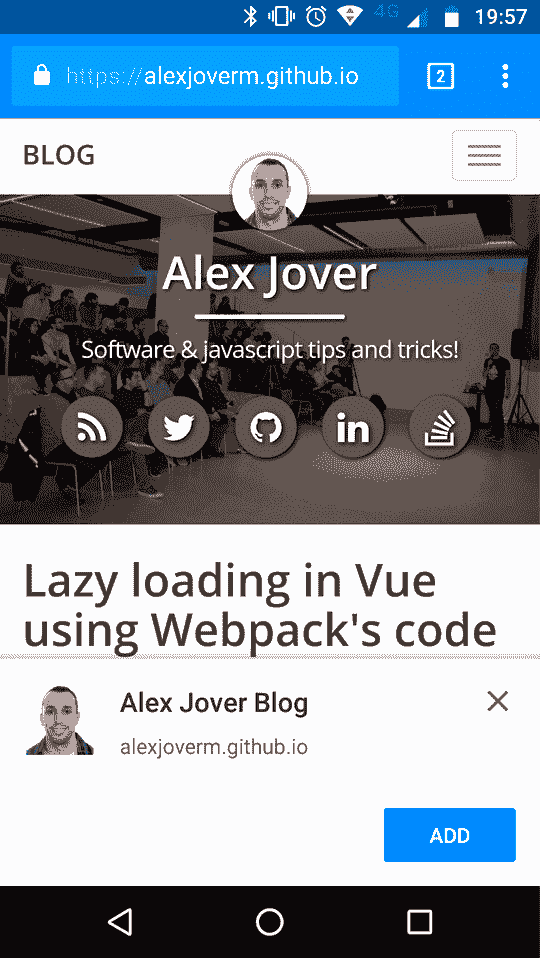

# 我如何用我的博客制作一个进步的网络应用程序

> 原文：<https://dev.to/alexjoverm/how-i-made-a-progressive-web-app-out-of-my-blog>

*原载于[alexjoverm . github . io](https://alexjoverm.github.io/2017/08/07/How-I-made-a-Progressive-Web-App-out-of-my-Blog/?utm_source=devto)2017 年 8 月 7 日。*

有一天，我想了解 PWA(渐进式网络应用),所以我想:有什么比用我自己的博客来做更好的呢？

我认为这是开发人员做的事情:当我们想学习一些东西时，我们就去弄脏我们的手，对吗？

我想做的第一件事是在博客上发布**指标和见解**。为此，我在 Chrome 扩展版本中使用了 [Lighthouse](https://github.com/GoogleChrome/lighthouse) 。

[T2】](https://res.cloudinary.com/practicaldev/image/fetch/s--ozzgY9cZ--/c_limit%2Cf_auto%2Cfl_progressive%2Cq_auto%2Cw_880/https://thepracticaldev.s3.amazonaws.com/i/dfedz5ukvxi18l7bvfj2.png)

默认情况下，性能统计非常好。我并不感到惊讶:我的博客运行在一个名为 [Hexo](https://hexo.io/) 的 NodeJS 静态站点生成器上，我非常喜欢它，因为它速度极快，易于部署，并且熟悉 NodeJS 及其生态系统。

对于 PWA 指标，这是一个中间值，我从来没有注意过。让我们看看我做了哪些步骤来使它 100%成为一个进步的 Web 应用程序。

## 1。创建 Web 应用程序清单和图标

Web 应用清单是一个 JSON 文件，用来描述 Web 应用。这是我 [`manifest.json`](https://github.com/alexjoverm/blog/blob/master/themes/beautiful-hexo/source/manifest.json) :
的节选

```
{  "name":  "Alex Jover Blog",  "short_name":  "AlexJ Blog",  "theme_color":  "#008aff",  "background_color":  "#ffffff",  "display":  "standalone",  "icons":  [  {  "src":  "images/icons/icon-72x72.png",  "sizes":  "72x72",  "type":  "image/png"  },  ... 
```

Enter fullscreen mode Exit fullscreen mode

我认为名字本身就很能说明问题。确保至少添加了`name`、`short_name`和`icons`字段。

其他一些你可能感兴趣的字段是 [`start_url`](https://developer.mozilla.org/es/docs/Web/Manifest#start_urlhttps://developer.mozilla.org/es/docs/Web/Manifest#start_url) 和 [`scope`](https://developer.mozilla.org/es/docs/Web/Manifest#scope) 。

根据**图标**，你需要生成几种尺寸的图标。为此，我使用了[这个 Web 应用清单生成器](https://app-manifest.firebaseapp.com/)，它也可以帮助你创建`manifest.json`文件。我已经从网上下载了 zip 文件，解压后把文件放到了它们应该在的地方。然后根据需要更新了`icons`数组的`src`属性。

最后，你必须在 HTML 的[头中包含一个`meta`标签(你会看到我的例子是用 Jade/Pug 写的，但我在这里用纯 HTML 写):](https://github.com/alexjoverm/blog/blob/master/themes/beautiful-hexo/layout/partial/head.jade) 

```
<link rel="manifest" href="/manifest.json"> 
```

Enter fullscreen mode Exit fullscreen mode

## 2。添加元标签

你需要添加[一些元标签](https://developers.google.com/web/fundamentals/design-and-ui/browser-customization/)，这样所有受支持的浏览器都会适当地将其理解为一个渐进式网络应用。我加的的[标签是:](https://github.com/alexjoverm/blog/blob/master/themes/beautiful-hexo/layout/partial/head.jade#L13-L23) 

```
<link rel="icon" hrefimg/icons/icon-152x152.png">
<!-- theme-color defines the top bar color (blue in my case)-->
<meta name="theme-color" content="#008aff"/>

<!-- Add to home screen for Safari on iOS-->
<meta name="apple-mobile-web-app-capable" content="yes"/>
<meta name="apple-mobile-web-app-status-bar-style" content="default"/>
<meta name="apple-mobile-web-app-title" content="Alex Jover Blog"/>
<link rel="apple-touch-icon" hrefimg/icons/icon-152x152.png"/>

<!-- Add to home screen for Windows-->
<meta name="msapplication-TileImage" contentimg/icons/icon-152x152.png"/>
<meta name="msapplication-TileColor" content="#000000"/> 
```

Enter fullscreen mode Exit fullscreen mode

如你所见，一些平台有自己的元标签。

## 3。创建预缓存服务工作线程

创建一个[服务人员](https://developers.google.com/web/fundamentals/getting-started/primers/service-workers)可能是一项非常乏味的工作，他们非常灵活，可以做很多事情。

在大多数情况下，我们想用它们来缓存所有的静态文件，这样我们的应用程序就可以离线工作。有不同的策略可以做到这一点，它们都在谷歌的[杰克·阿奇博尔德](https://twitter.com/jaffathecake)写的[离线食谱](https://developers.google.com/web/fundamentals/instant-and-offline/offline-cookbook/)中有很好的解释。另一个值得查看的资源是[。](https://serviceworke.rs/)

尽管如此，为这个目的和每个项目创建和维护一个服务人员还是需要做一些工作。这就是 [sw-precache](https://github.com/GoogleChrome/sw-precache) 派上用场的地方，这个工具使用[缓存优先](https://developers.google.com/web/fundamentals/instant-and-offline/offline-cookbook/#cache-falling-back-to-network)策略，自动为一组静态资产创建预缓存服务工作器。

如果你在你的项目中使用 Webpack，你很幸运有一个 [sw-precache 插件](https://github.com/goldhand/sw-precache-webpack-plugin)，你可以插入你的 conf 来为你的捆绑资产自动创建一个服务工作者。

在我的情况下，我没有使用 webpack，gulp 或任何东西。只是一个修改版本的[美丽的 Hexo](https://github.com/twoyao/beautiful-hexo) 主题与普通的 css，js 和图像。

但那没问题。您可以使用 **sw-precache 命令行实用程序**。为此，我首先创建了一个 [sw-config.js](https://github.com/alexjoverm/blog/blob/master/sw-config.js) 文件，指出要缓存的资产和要去掉的前缀，因为服务工作者也将位于公共文件夹下:

```
module.exports = {
  staticFileGlobs: [
    'public/css/**.css',
    'public/**/**.html',
    'public/**/**.jpg',
    'public/**/**.png',
    'public/js/**.js'
  ],
  stripPrefix: 'public',
} 
```

Enter fullscreen mode Exit fullscreen mode

然后简单地运行`sw-precache --config sw-config.js`，它创建一个 [service-worker.js](https://github.com/alexjoverm/blog/blob/master/service-worker.js) 文件准备使用。

*注意:记住服务工作者只在本地主机或 HTTPS url 中运行*

## 4。登记服务人员

一旦创建了一个`service-worker.js`文件，你需要在你的应用中注册它。为此，我使用了位于 sw-precache repo 上的一个经过实战检验的 service-worker-registration.js 文件。

然后我简单地将它复制到主题的 js 文件所在的 repo 中。

## 5。把所有东西粘在一起

到目前为止，我已经需要建立一个离线就绪和可安装的渐进式网络应用程序:

*   有一个带图标的`manifest.json`
*   添加`meta`标签
*   为预缓存创建一个服务工作者
*   跑进 HTTPS(我用的是 Github 页面)

唯一的问题是，每次我发布或更改主题的任何内容，我都必须重新创建 precache 服务工作者文件，这有点重复。

这就是为什么我写了一个极其简单的脚本 :

```
hexo generate -f # re-generates the static assets
sw-precache --config sw-config.js # creates the service worker
cp service-worker.js public # copies it to the static site folder
hexo deploy # deploys it to github pages 
```

Enter fullscreen mode Exit fullscreen mode

因此，和以前一样，我只需要做`hexo deploy -g`，它生成`public`文件夹并部署它，现在我必须在中间添加 2 个步骤来创建服务工作者，使用这个脚本做起来非常舒服。

## 退房

再次运行 Lighthouse 审计，我发现这是为了获得 100 个 PWA 指标，以及我所做的一些额外的性能和可访问性改进:

[T2】](https://res.cloudinary.com/practicaldev/image/fetch/s--ceHexa0J--/c_limit%2Cf_auto%2Cfl_progressive%2Cq_auto%2Cw_880/https://thepracticaldev.s3.amazonaws.com/i/wtbxpbrwkhjfn22a2w0u.png)

当我在 Chrome 上打开我的 Android 手机时，我看到了*“添加到主页”*的横幅，这让我非常高兴地看到我的博客被**安装了这样一个原生应用**:

[T2】](https://res.cloudinary.com/practicaldev/image/fetch/s--XhuCymI1--/c_limit%2Cf_auto%2Cfl_progressive%2Cq_auto%2Cw_880/https://thepracticaldev.s3.amazonaws.com/i/si4odlya1s8l9k7348xc.png)

最棒的是，博客是完全离线工作的，所以试着关掉你的网络连接，看看一个工作的渐进式网络应用的魔力:)

## 结论

学习新的东西是令人惊奇的，特别是像渐进式网络应用这样的早期技术，但是通过将它应用到你自己的真实项目中来学习更好！