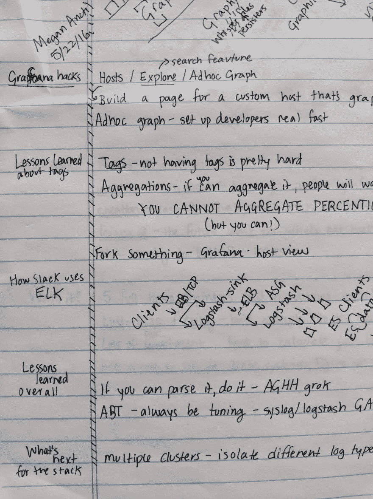

# 我如何记笔记

> 原文：<https://dev.to/logan/how-i-take-notes-ag1>

上个月，我在布鲁克林当了两周的陪审员。我学到了很多。然而，陪审团的职责并不在于所宣称的事情的真实性，而仅仅是为了说明是什么导致了这篇博文。抱歉，法律术语，我和律师混得太多了！

无论如何，在陪审团值班时，我们有很多空闲时间，被困在没有无线网络的法庭里，只是等待指示。我决定花时间学点东西！我下载了 Rust 编程语言 TRPL，拿起我最喜欢的笔记本，在过去的两周里每天都带着它们去法庭。课间休息时，我会阅读书中的章节，并做笔记。

## 为什么要做笔记

记笔记并不适用于每个人，但我发现它对于保留知识是绝对必要的。笔记可以有很多不同的方式，找到最适合你的方式很重要。特别是，我特别注意手写我的大部分笔记。为手写笔记编制索引有一种发自内心的触觉，可以帮助我更好地记住主题。我的同事开玩笑说，当我第一次在 Kickstarter 面试时，我带了一个大笔记本，在所有的面试中都做了大量的笔记。我在很多不同的情况下做笔记，但也就是当我在工作中学习新东西时，当我在开会时，或者当我主要关注别人说话/写作时。

我发现记笔记有几个好处。首先，它给了我一份我所学一切的书面记录。如果我给它打上了时间戳(我通常除了日期还会加上小时和分钟！)我可以记录我的进步。第二，做好笔记的行为有助于我记住我所学的内容。

现在，让我们讨论一下记笔记“好”是什么意思。

## 科内尔法

我认为我们讨厌做笔记的部分原因是因为在整个学校被迫做笔记浪费了很多时间。就我个人而言，我一直喜欢手写笔记。然而，关于它对记忆保持的实际影响，有相互矛盾的研究。不管你记的是数字笔记还是手写笔记，都有一些技巧可以让你的笔记更有效。

这些年来我喜欢的一个方法是康奈尔方法。康奈尔笔记背后的想法是，当你浏览材料时，沿着一边保留笔记主体的“线索”。我一直喜欢康奈尔笔记的原因是，你可以找到任何有助于你最好地记住材料的线索，而不一定是教科书或讲师给出的关键词。例如，我为我的 Rust 笔记提供了一个提示，它引用了我更熟悉的 Ruby API 中的内容，所以我可以对不同的 Cargo 命令说“比如 Bundler ”,这提示我记住笔记的上下文。

以下是我在 [Megan Anctil 的](https://twitter.com/megsa_) 2016 Monitorama 演讲笔记中的一些提示，例如:

[T2】](https://res.cloudinary.com/practicaldev/image/fetch/s--w4Vcg4NQ--/c_limit%2Cf_auto%2Cfl_progressive%2Cq_auto%2Cw_880/https://i.imgur.com/Xn2qSWg.jpg)

## 学习科学的教训

### 强化回忆

我喜欢康奈尔笔记的提示方法的一个原因是，它有助于一种叫做回忆的学习科学的实践。回忆背后的想法是，重读笔记或教科书中的信息被证明对该材料中概念的长期记忆几乎没有影响。然而，强迫自己用抽认卡或线索回忆信息确实有助于 T1。此外，间隔你的研究材料已被证明是有帮助的。这被称为“延迟检索”。当我们在线索的帮助下强迫我们的大脑去寻找过去的信息时，我们就强化了对这些信息的记忆。

### 低赌注测试

另一个被证明有助于学习的与记笔记相关的概念是[低风险测试](http://insideteaching.grad.msu.edu/a-case-for-more-testing-the-benefits-of-frequent-low-stakes-assessments/)。频繁的、低风险的测试允许我们在没有现场测试压力的情况下练习记忆。它给我们空间来反思我们的错误，并修正我们记忆中某些内容的错误之处。如果我们仔细记下我们的笔记(即线索)，我们可以用这些来测试自己，这是非常有用的！我所做的就是每隔几天就回到我的笔记上，用冗长的笔记盖住纸的一边，强迫自己只根据提示记住概念。

## 建模

最后，我非常喜欢利用不同种类的模式来为我笔记中的主题之间的复杂关系建模。对我来说不幸的是，我不是一个伟大的艺术家，所以通常这些出来的是弯曲的斑点画。我受到启发，开始在我的笔记中绘制更多的图表(和拉动请求！)由我的同事莎拉拍摄。她在 [dev diagrams](https://www.youtube.com/watch?v=jHgrdiy4FnE) 上做了一次精彩的演讲。强迫自己为你认为不同概念之间的联系建立模型，会让你走上构建强大的心智模型的道路，以便在未来依靠这些概念。

好的图是美好的东西，但在我看来一系列糟糕的图一样酷。我喜欢在我的笔记中画出我认为一个系统是如何工作的，只是为了以后发现它，然后像这样，“哇，根本不是这样。”这也是做笔记的美妙之处。它不仅仅是你学习的日志。这是你过去错误的记录。它很强大，因为它不仅是信息的来源。这是你寻找信息的旅程的一个来源。

## 你做笔记的风格是什么？

总之，我知道这并不适合所有人，但是学习如何记笔记帮助我改善了学习方式，这使我成为一名更好的开发人员。你做笔记吗？很想听听你的笔记风格！