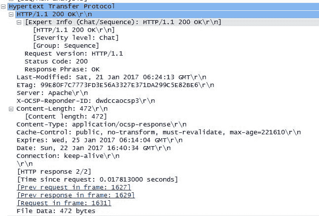

# 如何不搞砸你的 DevOps 面试

> 原文：<https://dev.to/georgeoffley/how-not-to-screw-up-your-devops-interview>

我搞砸了一点点。我毫无准备地参加了面试。更糟糕的是，我对我应该了解的部分毫无准备。技术部分。

无可否认，它没有我想象的那么糟糕。我想我至少知道了一些有趣的问题。总是给人一种你在关注面试官的印象。然而，在 DevOps 领域有一些基本的主题，我并不像我认为的那样精通。因此，在我能提供的答案中有一些明显的缺口。

值得一提的是，我的面试官都是很棒的人，他们在技术领域已经工作了将近 20 年。他们非常了解自己的工作，能够向我介绍一些关于 web 应用基础设施和管理的基础知识。快速提示如果你不知道一个问题的答案，尽管听起来很奇怪；我确实认为处理这个问题最好方法是问一问答案是什么。然而，就经验和知识而言，你可能不是他们想要的，只是问“我不确定，你到底在问什么？”对我来说不是犯罪。当然，我不是那种经常采访人的人，但是在科技领域(以及生活中)最重要的事情之一就是好奇。知道了他们问的问题，你就可以做些功课，为下一次面试做好更多的准备。

我的面试官向我介绍了一个 web 应用程序是如何分布在多个服务器上的。我想写一点关于这个主题的东西，所以也许你们中的一些人会为你的 DevOps 面试做好准备。

对一个基于互联网的企业来说，最重要的是时间。对于互联网来说，面临业务停机可能意味着真正的金钱飞逝。他们的特权是确保网站始终处于运行状态(或至少 99.99999%的时间)。每当潜在客户访问该网站并发现问题时，他们就不再是客户了。因此，网站尽可能高效地运行是至关重要的。下面是一些可以实现的方法。

**HTTP 请求和负载平衡**

当你在网络浏览器中输入一个网址时，会发生什么？你输入一个 URL，你点击回车一个 HTTP 请求被发送到 DNS 服务器。请参阅本教程，了解如何用主机名解析域名。当客户端找到要查询的 IP 地址时，客户端向 web 服务器发送一个 HTTP 请求(通常在端口 80 上，这是 web 流量的默认端口。然而，现在大多数好网站都在使用一些加密技术，所以他们会使用端口 443(用于安全套接字层通信),包含客户端信息、IP 地址信息和远程服务器信息。这里您可以看到一个标题示例:

在一个常规的 WordPress 站点上，比如 Apache，或者你的服务器正在使用的任何一个 web 服务器软件，都会从服务器上的客户端发送一个包含一些信息的响应。具体来说，响应代码告诉我们它们还活着，并将向客户端发送 HTML(响应代码 200 是来自 web 服务器的默认消息，表示请求成功)。下面是一个响应示例:

该网站的代码是使用几种不同的策略传输的。但是，您可以参考 HTTP 处理程序来了解它是如何完成的。默认处理程序将只发送位于指定目录中的静态代码。通常一个 http://www.example.com 的地址将从内部 var/www/web/或类似的地方提供服务。如今，大多数 web 应用程序都以编程方式或动态方式处理一切。例如，Ruby on Rails 应用程序将引用路由脚本来返回 HTTP 处理程序。

您也将从负载平衡器服务器上运行的服务器获得相同的响应，但是来自该服务器的内部流量略有不同。对于一个普通的服务器，它将服务于 HTML。当您使用负载均衡器时，它就像一个流量警察，将连接代理到服务器群集中的不同服务器。

这解决了几个问题。这是一种让多台服务器为一个主机名和一个 IP 地址服务的方式。这也是一种能够路由数百万个请求并最大化网站运行时间的方法。

有两种类型的负载平衡器基于软件和硬件。基于硬件的单元由所有者构建和加载。它们由专门的硬件构建而成，旨在处理大量的传入流量。软件负载平衡器更加灵活，可以安装在常规硬件上。据我所知，在工作机会中出现的一个例子提到了 NGINX 这样的软件。我也看过坎普和禅宗的其他版本。Windows Server 也有自己的负载平衡器。

当设置负载均衡器时，有一些算法用于决定流量的去向。

**循环调度**–当负载平衡器按顺序发送流量时

**最少连接数**–当负载平衡器向当前连接数最少的单元发送流量时。

**IP 哈希**–当客户端的 IP 地址希望进行哈希处理，并被路由到为该哈希选择的服务器时。

**历史分析**–当平衡器根据打开的连接数和节点的响应时间发送流量时。

现在，如果你只有一台服务器在路由流量，那么一旦那台服务器出现故障，你就制造了一个严重的瓶颈。因此，传统上，您会希望运行备份以实现冗余。

**虚拟 IP**

因此，当 DNS 将主机名解析为 IP 地址时，该网站只能获得一个 IP 地址，那么当您只有一个 IP 地址可供分配时，我们如何能够将负载分散到不同的服务器上呢？虚拟 IP 是负载平衡器可以用来对进入的流量进行分类的东西。有了虚拟 IP，负载平衡器就可以使用公共地址为集群中的每台服务器分配地址。与子网划分类似，网络地址转换允许群集中的每个节点拥有自己的内部 IP 地址，而客户端只能看到它开始寻找的主机名的 IP 地址。

有几种方法可以实现这一点。一种方法是使用 CARP 或公共地址冗余协议。它的工作原理是让一组主机运行一组 IP 地址。这有助于确保冗余。如果一台主机发生故障，另一台主机可以接管，而服务使用主机不会察觉。另一种实现是使用代理 ARP。它本质上使用隧道来代理传入流量。

**结论**

DevOps 是系统和开发的结合。这里所涉及的只是这项工作所涉及的职责范围的一小部分。我只报道了那些我无法解释的事情，而我采访过的人也很友好地帮助了我。

我们研究了无数的技术和程序。其中很多可以在我下面列出的各种面试问题文章中找到。我很高兴我能够在面试结束时比进来时知道得更多。和我交谈过的人都很随和。我不知道他们是否会继续支持我。不过，我确实掌握了一些知识，所以如果这些问题再次出现，我会有所准备。

**DevOps 面试问题**

https://www . quora . com/What-is-some-good-interview-questions-for-a-devo PS-position

[https://github.com/spikenode/DevOps-Interview-Questions](https://github.com/spikenode/DevOps-Interview-Questions)

[https://www . edu reka . co/blog/interview-questions/top-devo PS-interview-questions-2016/](https://www.edureka.co/blog/interview-questions/top-devops-interview-questions-2016/)

**延伸阅读**

[https://dev central . F5 . com/articles/back-to-basics-least-connections-is-not-least-loaded](https://devcentral.f5.com/articles/back-to-basics-least-connections-is-not-least-loaded)

[https://www.nginx.com/resources/glossary/load-balancing/](https://www.nginx.com/resources/glossary/load-balancing/)

[https://www.liquidweb.com/kb/understanding-load-balancing/](https://www.liquidweb.com/kb/understanding-load-balancing/)

[https://doc . pf sense . org/index . PHP/What _ are _ Virtual _ IP _ Addresses](https://doc.pfsense.org/index.php/What_are_Virtual_IP_Addresses)

[https://en.wikipedia.org/wiki/Proxy_ARP](https://en.wikipedia.org/wiki/Proxy_ARP)

[https://en . Wikipedia . org/wiki/Common _ Address _ Redundancy _ Protocol](https://en.wikipedia.org/wiki/Common_Address_Redundancy_Protocol)

[https://en.wikipedia.org/wiki/Virtual_IP_address](https://en.wikipedia.org/wiki/Virtual_IP_address)

[http://www.doesconsulting.com/faq.shtml](http://www.doesconsulting.com/faq.shtml)