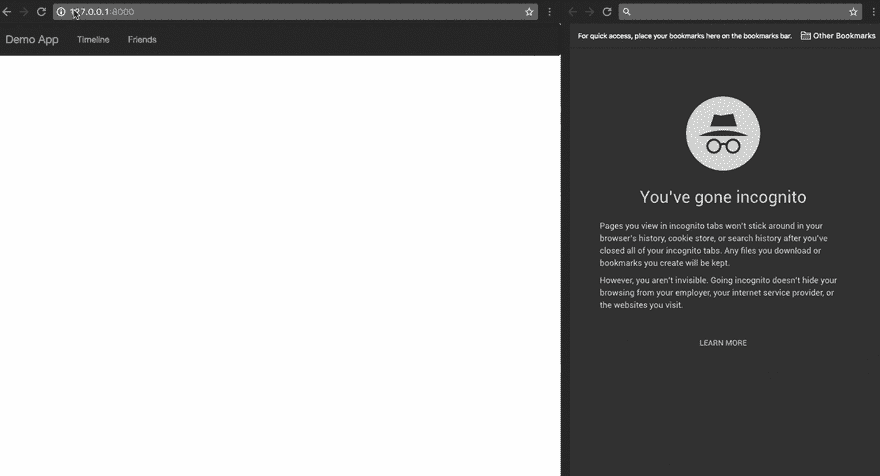

# 如何使用 Laravel 和 Pusher 创建基于 web 的通知

> 原文：<https://dev.to/neo/how-to-create-web-notifications-using-laravel-and-pusher-3b81>

在构建 web 应用程序时，经常会发现一些应用程序内通知系统，当有人执行与您或您的帐户相关的操作时，它会立即通知您。在脸书上，当有人喜欢你的状态或有人对你的个人资料发表评论时，你会收到通知。我们将通过使用 [Laravel](https://laravel.com) 和 [Pusher](https://pusher.com) 创建一个 web 通知系统来复制这个特性。

## 我们会建造什么

在本教程之后，我们将演示如何使用 Laravel 和 Pusher 让一个小的 web 应用程序显示通知。这类似于脸书等网站显示通知的方式。这是我们将要建造的东西的预览:

[T2】](https://res.cloudinary.com/practicaldev/image/fetch/s--GSpK4KVW--/c_limit%2Cf_auto%2Cfl_progressive%2Cq_66%2Cw_880/https://thepracticaldev.s3.amazonaws.com/i/wt94na32cl86revcqjhz.gif)

## 设置 Pusher 应用程序

创建一个[卖家账户](https://pusher.com)，如果你还没有的话，然后设置你的应用程序，如下图所示。

[T2】](https://res.cloudinary.com/practicaldev/image/fetch/s--AGe7_w1e--/c_limit%2Cf_auto%2Cfl_progressive%2Cq_auto%2Cw_880/https://thepracticaldev.s3.amazonaws.com/i/56xn68r68wrf9f4erxx2.png)

## 设置您的 Laravel 应用

您可以通过在终端中运行以下命令来创建一个新的 Laravel 应用程序:

```
laravel new laravel-web-notifications 
```

Enter fullscreen mode Exit fullscreen mode

之后，我们将需要安装 Pusher PHP SDK，您可以通过运行下面的命令使用 Composer 来完成这个任务:

```
composer require pusher/pusher-php-server 
```

Enter fullscreen mode Exit fullscreen mode

当 Composer 完成后，我们需要配置 Laravel 使用 Pusher 作为它的广播驱动程序，为此，打开 Laravel 安装根目录下的`.env`文件。根据以下配置更新数值:

```
PUSHER_APP_ID=322700
BROADCAST_DRIVER=pusher

// Get the credentials from your pusher dashboard
PUSHER_APP_ID=XXXXX
PUSHER_APP_KEY=XXXXXXX
PUSHER_APP_SECRET=XXXXXXX 
```

Enter fullscreen mode Exit fullscreen mode

> **重要提示:**如果您使用 EU 或 AP 集群，请确保更新您的`config/broadcasting.php`配置中的选项数组，因为 Laravel 默认使用美国服务器。您可以使用 Pusher PHP 库支持的所有选项。

打开`config/app.php`并取消对`App\Providers\BroadcastServiceProvider::class`的注释。

### 创建我们的 Laravel 和 Pusher 应用

现在我们已经完成了配置，让我们创建我们的应用程序。首先，我们将创建一个`Event`类，它将从我们的 Laravel 应用程序广播到 Pusher。事件可以从应用程序中的任何地方触发。

```
php artisan make:event StatusLiked 
```

Enter fullscreen mode Exit fullscreen mode

这将在`app/Events`目录中创建一个新的`StatusLiked`类。打开文件的内容并更新到下面:

```
<?php

namespace App\Events;

use Illuminate\Queue\SerializesModels;
use Illuminate\Foundation\Events\Dispatchable;
use Illuminate\Broadcasting\InteractsWithSockets;
use Illuminate\Contracts\Broadcasting\ShouldBroadcast;

class StatusLiked implements ShouldBroadcast
{
    use Dispatchable, InteractsWithSockets, SerializesModels;

    public $username;

    public $message;

    /**
     * Create a new event instance.
     *
     * @return void
     */
    public function __construct($username)
    {
        $this->username = $username;
        $this->message  = "{$username} liked your status";
    }

    /**
     * Get the channels the event should broadcast on.
     *
     * @return Channel|array
     */
    public function broadcastOn()
    {
        return ['status-liked'];
    }
} 
```

Enter fullscreen mode Exit fullscreen mode

上面，我们已经实现了`ShouldBroadcast`接口，这告诉 Laravel 应该使用我们在配置文件中设置的任何驱动程序来广播这个事件。

我们还有一个接受两个参数的构造函数，用户名和动词。我们稍后将回到这一点。我们将这些变量分配给以同样方式命名的类属性。将属性的可见性设置为 **public** 很重要；如果不这样做，该属性将被忽略。

最后，我们设置要广播的频道名称。

### 创建应用视图

我们将保持简单，并创建一个单一的视图，您可以看到一个带有通知图标的导航栏。当有新的通知可用时，图标将被更新，而无需刷新页面。按照设计，本教程中的通知是短暂的；如果您愿意，您可以扩展该功能，使其在页面重新加载后持续更长时间。

打开`welcome.blade.php`文件，用下面的 HTML 替换它。

```
<!DOCTYPE html>
<html lang="en">
  <head>
    <meta charset="utf-8">
    <meta http-equiv="X-UA-Compatible" content="IE=edge">
    <meta name="viewport" content="width=device-width, initial-scale=1">
    Demo Application
    <link rel="stylesheet" href="//maxcdn.bootstrapcdn.com/bootstrap/3.3.7/css/bootstrap.min.css" integrity="sha384-BVYiiSIFeK1dGmJRAkycuHAHRg32OmUcww7on3RYdg4Va+PmSTsz/K68vbdEjh4u" crossorigin="anonymous">
    <link rel="stylesheet" type="text/css" href="/css/bootstrap-notifications.min.css">
    <!--[if lt IE 9]>
      <script src="https://oss.maxcdn.com/html5shiv/3.7.3/html5shiv.min.js"></script>
      <script src="https://oss.maxcdn.com/respond/1.4.2/respond.min.js"></script>
    <![endif]-->
  </head>
  <body>
    <nav class="navbar navbar-inverse">
      <div class="container-fluid">
        <div class="navbar-header">
          <button type="button" class="navbar-toggle collapsed" data-toggle="collapse" data-target="#bs-example-navbar-collapse-9" aria-expanded="false">
            <span class="sr-only">Toggle navigation</span>
            <span class="icon-bar"></span>
            <span class="icon-bar"></span>
            <span class="icon-bar"></span>
          </button>
          <a class="navbar-brand" href="#">Demo App</a>
        </div>

        <div class="collapse navbar-collapse">
          <ul class="nav navbar-nav">
            <li class="dropdown dropdown-notifications">
              <a href="#notifications-panel" class="dropdown-toggle" data-toggle="dropdown">
                <i data-count="0" class="glyphicon glyphicon-bell notification-icon"></i>
              </a>

              <div class="dropdown-container">
                <div class="dropdown-toolbar">
                  <div class="dropdown-toolbar-actions">
                    <a href="#">Mark all as read</a>
                  </div>
                  <h3 class="dropdown-toolbar-title">Notifications (<span class="notif-count">0</span>)</h3>
                </div>
                <ul class="dropdown-menu">
                </ul>
                <div class="dropdown-footer text-center">
                  <a href="#">View All</a>
                </div>
              </div>
            </li>
            <li><a href="#">Timeline</a></li>
            <li><a href="#">Friends</a></li>
          </ul>
        </div>
      </div>
    </nav>

    <script src="//cdnjs.cloudflare.com/ajax/libs/jquery/2.1.4/jquery.min.js"></script>
    <script src="//js.pusher.com/3.1/pusher.min.js"></script>
    <script src="//maxcdn.bootstrapcdn.com/bootstrap/3.3.7/js/bootstrap.min.js" integrity="sha384-Tc5IQib027qvyjSMfHjOMaLkfuWVxZxUPnCJA7l2mCWNIpG9mGCD8wGNIcPD7Txa" crossorigin="anonymous"></script>

    <script type="text/javascript">
      var notificationsWrapper   = $('.dropdown-notifications');
      var notificationsToggle    = notificationsWrapper.find('a[data-toggle]');
      var notificationsCountElem = notificationsToggle.find('i[data-count]');
      var notificationsCount     = parseInt(notificationsCountElem.data('count'));
      var notifications          = notificationsWrapper.find('ul.dropdown-menu');

      if (notificationsCount <= 0) {
        notificationsWrapper.hide();
      }

      // Enable pusher logging - don't include this in production
      // Pusher.logToConsole = true;

      var pusher = new Pusher('API_KEY_HERE', {
        encrypted: true
      });

      // Subscribe to the channel we specified in our Laravel Event
      var channel = pusher.subscribe('status-liked');

      // Bind a function to a Event (the full Laravel class)
      channel.bind('App\\Events\\StatusLiked', function(data) {
        var existingNotifications = notifications.html();
        var avatar = Math.floor(Math.random() * (71 - 20 + 1)) + 20;
        var newNotificationHtml = `
          <li class="notification active">
              <div class="media">
                <div class="media-left">
                  <div class="media-object">
                    
                  </div>
                </div>
                <div class="media-body">
                  <strong class="notification-title">`+data.message+`</strong>
                  <!--p class="notification-desc">Extra description can go here</p-->
                  <div class="notification-meta">
                    <small class="timestamp">about a minute ago</small>
                  </div>
                </div>
              </div>
          </li>
        `;
        notifications.html(newNotificationHtml + existingNotifications);

        notificationsCount += 1;
        notificationsCountElem.attr('data-count', notificationsCount);
        notificationsWrapper.find('.notif-count').text(notificationsCount);
        notificationsWrapper.show();
      });
    </script>
  </body>
</html> 
```

Enter fullscreen mode Exit fullscreen mode

这主要是大量的引导噪声，所以我们将分离出重要的部分，主要是 Javascript。我们包括了 [Pusher javascript 库](http://js.pusher.com/3.1/pusher.min.js)，然后我们添加了具有魔力的 javascript 块。让我们来看看 javascript 代码块的一些片段:

```
// Enable pusher logging - don't include this in production
// Pusher.logToConsole = true;

// Initiate the Pusher JS library
var pusher = new Pusher('API_KEY_HERE', {
    encrypted: true
});

// Subscribe to the channel we specified in our Laravel Event
var channel = pusher.subscribe('status-liked');

// Bind a function to a Event (the full Laravel class)
channel.bind('App\\Events\\StatusLiked', function(data) {
    // this is called when the event notification is received...
}); 
```

Enter fullscreen mode Exit fullscreen mode

> **PROTIP** :默认情况下，Laravel 会使用事件的类名来广播事件。但是，您可以通过在事件上定义 broadcastAs 方法来自定义广播名称:
> 
> 公共函数 broadcastAs() {
> 
> 返回“事件名称”；
> 
> }

上面的代码只是初始化 Pusher JS 库并订阅一个通道。然后，当在该通道上接收到广播的事件时，它设置一个回调来调用。

### 测试我们的设置

最后，为了测试我们的设置，我们将创建一个手动调用事件的路由。如果一切按预期进行，我们会在任何时候收到新的通知。让我们添加新路线:

```
Route::get('test', function () {
    event(new App\Events\StatusLiked('Someone'));
    return "Event has been sent!";
}); 
```

Enter fullscreen mode Exit fullscreen mode

现在我们可以使用 Laravel 启动一个 PHP 服务器，这样我们就可以测试我们的代码，看看它是否工作。

```
$ php artisan serve 
```

Enter fullscreen mode Exit fullscreen mode

## 结论

在这篇文章中，我们已经能够利用 Pusher 的强大功能来创建一个现代化的 web 通知系统，而且非常容易。这仅仅是使用 Pusher 真正能做的事情的皮毛。这个例子只是向你展示可能性。

代码可以在 GitHub 上找到，你可以用它来启动、分叉和玩。你打算如何使用 Laravel 和 Pusher？你能想到什么高级用例吗？它们是什么？请在评论中告诉我们！

这篇博文最早出现在推手[博客](https://blog.pusher.com/create-web-notifications-using-laravel-pusher/)上