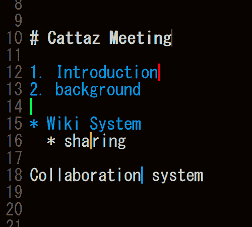

# 如何用 CodeMirror 显示其他客户端的光标位置

> 原文：<https://dev.to/yoheiseki/how-to-display-the-position-of-the-cursor-caret-of-another-client-with-codemirror-6p8>

我将解释如何用[“code mirror”](http://codemirror.net/)实时显示正在编辑的其他人(其他客户端)的光标(插入符号)位置。

按照本文中解释的过程，也可以用各种颜色显示其他客户的客户错误位置，如下所示。

[T2】](https://res.cloudinary.com/practicaldev/image/fetch/s--Rccpg1UM--/c_limit%2Cf_auto%2Cfl_progressive%2Cq_auto%2Cw_880/https://thepracticaldev.s3.amazonaws.com/i/vkir2vkyyr2ut8z3prmv.png)

该功能在富士通实验室 OSS 的基于 Markdown 的协作工具**“Cattaz”**中实现。

[Cattaz](http://cattaz.io/)

[GitHub - Cattaz](https://github.com/FujitsuLaboratories/cattaz)

# 简介

由于本文关注的是光标显示的部分，所以省略了下面的解释。

*   获取 CodeMirror 编辑器的输入事件
*   CodeMirror 编辑器之间的通信

# 法

它使用以下 CodeMirror API。

[设置书签](http://codemirror.net/doc/manual.html#setBookmark)

通过使用这个 API，您可以在编辑器中的指定位置插入生成的 DOM 节点(您想要显示的标记/设计)。

简而言之，您可以将 DOM 节点装饰样式添加到从另一个客户端发送的光标位置。

通过这样做，您可以显示其他客户端的光标位置。

下面是一个代码示例，它创建一个 DOM 节点，并在指定的编辑器位置将 DOM 节点设置为“setBookmark”。

(在 ES 2015 (ES6)中编写代码时描述)

```
// cm: CodeMirror instance
// cursorPos: The position of the cursor sent from another client ({line, ch} about CodeMirror)

// Generate DOM node (marker / design you want to display)
const cursorCoords = cm.cursorCoords(cursorPos);
const cursorElement = document.createElement('span');
cursorElement.style.borderLeftStyle = 'solid';
cursorElement.style.borderLeftWidth = '2px';
cursorElement.style.borderLeftColor = '#ff0000';
cursorElement.style.height = `${(cursorCoords.bottom - cursorCoords.top)}px`;
cursorElement.style.padding = 0;
cursorElement.style.zIndex = 0;

// Set the generated DOM node at the position of the cursor sent from another client
// setBookmark first argument: The position of the cursor sent from another client
// Second argument widget: Generated DOM node
marker = cm.setBookmark(cursorPos, { widget: cursorElement }); 
```

Enter fullscreen mode Exit fullscreen mode

您可以通过使用不同的 DOM 节点样式来进行酷显示。

上面的例子是像普通光标一样的竖线设计。

用 setBookmark 添加的 DOM 节点将保留在编辑器中的插入位置。

因此，每当从另一个客户机发送光标位置时，最好用 setBookmark 的 clear()方法删除一次插入的 DOM 节点，然后像下面这样再次插入新的 DOM 节点。

```
// Clear the inserted DOM node
// marker: setBookmark instance
marker.clear(); 
```

Enter fullscreen mode Exit fullscreen mode

## 按部就班的流动

一步一步的流程示例如下。

1.  从 CodeMirror 编辑器的输入事件中获取光标位置
2.  使用 Websocket 通信等将光标的位置发送给其他客户端。
3.  接收到从其他客户端发送的光标位置的客户端删除先前用 setBookmark 插入的 DOM 节点(如果它仍然存在)
4.  将 DOM 节点作为标记插入，setBookmark 位于接收到的光标的位置

此外，如果您管理为每个客户端接收的光标位置，您可以同时显示多个客户端的光标

# 总结

这样就可以利用 CodeMirror 的 API 的**“set bookmark”**来显示其他客户端的光标位置。

由于这个函数也在[【Cattaz】](http://cattaz.io/)(截止 2018 年 1 月 9 日)中实现，其源代码可能会有所帮助。

[GitHub - Cattaz](https://github.com/FujitsuLaboratories/cattaz)