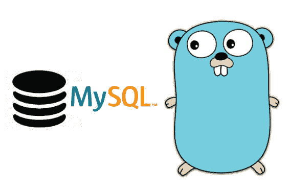

# 如何在 MySQL 数据库中使用 Golang 获得结果

> 原文：<https://dev.to/nexwebsites/how-to-get-results-using-golang-with-mysql-database-2o1>

[T2】](https://res.cloudinary.com/practicaldev/image/fetch/s--c3PO1aYv--/c_limit%2Cf_auto%2Cfl_progressive%2Cq_auto%2Cw_880/https://thepracticaldev.s3.amazonaws.com/i/rv1of10dgk0c4wcph7bi.jpg)

## 如何通过 MySQL 数据库使用 Golang 获得结果

Golang 通过标准的 Go-SQL 驱动程序包对 MySQL 等关系数据库以及 MongoDB 和 Redis 等 NoSQL 数据库提供了出色的支持。

使用标准的 Go SQL 驱动程序包，您可以轻松地与数据库通信，包括 MySQL、MongoDB 或 [Golang 数据库驱动程序](https://github.com/golang/go/wiki/SQLDrivers)列表中的任何其他数据库。

SQL 标准包提供了一个通用接口，该接口公开了许多可用于访问和处理数据库的通用方法和接口。

数据库包包含一个连接池，如果使用正确，它是线程安全的。数据库包必须与支持特定数据库的驱动程序包结合使用。

### 连接 MySQL

例如，如果您需要连接到 MySQL，那么您将使用 Golang 标准库中存在的通用 SQL 包，以及使用标准库包方法和接口的 MySQL 特定包。

用 Golang 编写 SQL 数据库驱动程序的人通常通过数据库 SQL 包公开他们的驱动程序。入口点代码存在于 SQL 驱动程序 Go 文件中。

基本上，它所做的是在包中的任何东西之前执行注册函数代码，在 init()函数中，另一个来自 sql 包的函数叫做 SQL。Register()，它接受两个参数。第一个参数是一个字符串，表示您想要使用的驱动程序类型，在本例中为“mysql ”,第二个参数是一个对象，表示与数据库交互并处理特定数据库功能的实际驱动程序。

```
 sql.Register("mysql", &MySQLDriver{}) 
```

Enter fullscreen mode Exit fullscreen mode

SQL 包是存在于 Go 标准库中的标准数据库 SQL 包。因为 init()函数在其他任何事情之前被执行，所以您可以肯定地知道，无论何时您在代码中包含包 MySQL，这段代码都会被立即执行。

```
 import (
"database/sql"
"fmt"
_ "github.com/go-sql-driver/mysql"
   ) 
```

Enter fullscreen mode Exit fullscreen mode

在 import
语句中，下划线符号`_`是一种静默加载包的方式，这意味着您加载了包，但同时您指出方法不会从这个包中直接调用。如果没有下划线`_`，你将得到一个导入但未使用的错误信息。

加载包的动作，即使是无声的，也会调用包的`init()`函数。MySQL 驱动程序的`init()`函数将向数据库 SQL 包
注册 MySQL 驱动程序对象，这将使您能够在代码中直接使用数据库 SQL 包函数和方法，然后将代码转化为 MySQL 驱动程序包中的具体实现。

### 重用数据库处理程序

将 db 声明为指向数据库处理程序的指针，可以在需要时重用数据库处理程序，而不必创建新的处理程序。

```
var db *sql.DB 
```

Enter fullscreen mode Exit fullscreen mode

使用数据库时首先要使用的函数之一是`sql.Open()`，它用于获取数据库对象，数据库对象是您用来对数据库执行查询和命令的对象。sql 的第一个参数。Open()是您试图加载的数据库驱动程序。在这种情况下，驱动程序的名称是“mysql”，第二个参数是我们用来连接数据库的连接字符串。

```
db, err = sql.Open("mysql", "user:password@tcp(127.0.0.1:3306)/dbname") 
```

Enter fullscreen mode Exit fullscreen mode

`sql.Open()`函数将返回一个处理程序到我们的数据库连接，然后您可以使用它向您的数据库发出查询和命令。

`sql.Open()`函数也将返回一个错误对象，如果没有观察到错误，该对象将为零。

在 [MySQL 驱动 Github 页面](https://github.com/golang/go/wiki/SQLDrivers)上，你可以找到连接字符串的完整描述，你可以用它作为`sql.Open()`函数的参数。

它需要一个用户名，后跟密码，然后是您将用于连接的协议，最后是数据库名称。

现在你已经准备好享受 Golang 和 MySQL 的乐趣了。

要使用标准数据库 SQL 包读取数据，您将使用`Query()`方法来检索多行的结果集，而如果您只需要从查询中检索一行，您将使用`QueryRow()`方法。

`Query()`方法返回一个指针，指向一个名为 Rows 的对象类型，这基本上是一个支持一些有用方法的结构，Rows 对象类型可以用来扫描和迭代查询返回的数据。

对于这个基本示例，在您的代码中，您将创建一个结构，该结构将保存从查询返回的数据。

```
type Product struct {
ProductCode, Name, Description, ImgURL string
Weight, Price                          float64
Stock                                  int
  } 
```

Enter fullscreen mode Exit fullscreen mode

您可以通过使用适当的参数调用`sql.Open()`来获取数据库处理程序。

```
db, err = sql.Open("mysql", "user:password@tcp(127.0.0.1:3306)/dbname"). 
```

Enter fullscreen mode Exit fullscreen mode

使用 defer `db.Close()`，以确保您的数据库连接关闭。

当调用`sql.Open()`时，还有一个包含 parseTime=true 参数的选项，它可以将数据库中的日期和日期/时间字段转换为 Golang time 对象类型。使用 parseTime=true 参数将日期和日期时间值的输出类型更改为`time.Time`而不是`[]byte / string`。
本质上，您将告诉 MySQL 驱动程序，您想要通过将 parseTime equals true 作为属性附加到您的连接字符串来将任何 MySQL 日期或日期/时间字段转换为 Golang 时间对象。

现在您可以创建一个函数来检索产品信息并将结果扫描到您的`Product`结构中。

```
func getProduct(productCode string) (err error){
...
var p Product
err := db.QueryRow("select productCode, name, description, imageURL, stock, weight, price from products WHERE productCode = ?", productCode).Scan(&p.ProductCode, &p.Name, &p.Description, &p.ImgURL, &p.Stock, &p.Weight, &p.Price)
... 
```

Enter fullscreen mode Exit fullscreen mode

`QueryRow()`执行预期最多返回一行的查询。`QueryRow()`总是返回非零值。在调用 Row 的 Scan 方法之前，不会出现错误。

在上面的 SQL 语句中，“？”在参数化查询中用于替换`ProductCode`变量。

接下来，对于这个简单的例子，剩下要做的就是打印出我们的查询结果:

```
fmt.Printf("Product Code: %s\n Image URL: %s\n Product Name: %s\n Price: $%.2f\n Weight: %.2f\n Number in stock: %d\n", p.ProductCode, p.ImgURL, p.Name, p.Price, p.Weight, p.Stock) 
```

Enter fullscreen mode Exit fullscreen mode

我们的`getProduct()`函数接受一个字符串`productCode`并返回一个错误，当没有错误时，这个错误为零。

例如，当您调用`getProduct("g43")`时，数据库查询被执行，寻找 productCode = to "g43 "并返回结果...

[T2】](https://res.cloudinary.com/practicaldev/image/fetch/s--YhzPQhLo--/c_limit%2Cf_auto%2Cfl_progressive%2Cq_auto%2Cw_880/https://storage.googleapis.com/golangme.com/static/img/golang-with-mysql-results.jpg)

[Golang 与 MySQL 代码清单](https://golangme.com/blog/golang-with-myslq/)

希望这个简单的例子足以帮助您理解如何在 Golang 中使用数据库。