# 如何免费托管轻量级应用

> 原文：<https://dev.to/pubs12/how-to-host-lightweight-apps-for-free>

当你寻找虚拟主机服务时，有许多免费的选择。但是，没有多少地方可以托管涉及 API、CGI 或 AJAX 后端查询的全栈 web 应用程序——尤其是如果您想使用 PHP 之外的东西。

这篇文章是一篇简单但有意义的“运行之前的行走”指南，介绍如何开始在云服务器上托管脚本。

### **何时使用云应用平台**

云应用程序平台在需要一点代码在服务器上运行的场景中工作得很好。这些平台中的许多都提供了一系列基于 Linux 的应用程序容器(看起来像虚拟机)，您可以在本地计算机上使用一组命令行关键字部署您开发的代码。

Heroku 就是这样一个服务，你可以用它来相对容易地托管你的代码(各种语言)。它提供了一个免费增值模式，让你免费使用大约 500 小时的计算时间(他们的全价是[这里是](https://www.heroku.com/pricing))。

[](https://res.cloudinary.com/practicaldev/image/fetch/s--HpBdbK9y--/c_limit%2Cf_auto%2Cfl_progressive%2Cq_auto%2Cw_880/https://cdn-images-1.medium.com/max/1024/1%2A5r9A_yT2n4zTeBVXAJRD_w.png) 

<figcaption>截至 2017 年 5 月，您可以在 Heroku</figcaption>

下托管的编程语言

一旦在本地桌面上编写了代码，就可以执行命令将代码部署到 Heroku 中的工作区。然后，代码根据触发器执行。触发器可以是计划的作业、通过网页请求触发的 web 服务器，或者是持续运行并处理数据的东西——这可能会非常昂贵。

真正的好处是您不必担心操作系统(内存、存储、CPU、安全补丁),因为所有这些都是为您管理的——但同时这也意味着您的灵活性有限，因为您不能直接分配资源。

Heroku 可以很好地为您工作的一些具体例子:

*   托管你自己的网站，你想写你自己的网络服务器
*   定期从网站上抓取数据，然后存储在数据库中进行分析
*   为特定任务提供 API 服务器。比如提供天气数据，存储物联网传感器数据，或者对机器学习模型的 web 服务调用
*   数据库服务(尽管 Firebase 之类的服务可能更适合)

### **英雄建筑**

Heroku 为您提供了一个轻量级虚拟机(VM)来部署您的代码。请注意，在免费选项下，您最多可以部署 5 个被视为 5 个轻量级虚拟机的应用程序。对于您的实际应用，Heroku 下为您提供了一个单独的 URL 子域。因此，您的项目名称需要是唯一的。

这些工作区有自己的组件空间，例如:代码和资源文件(不是动态数据文件)、数据库(Postgres)和日志文件。

在您的本地桌面上，Heroku 使用您的目录名来定义您的项目，并且让 Heroku 了解您的上下文。因此，您可以在不同的目录中拥有多个项目，当您运行 Heroku 命令时，只需确保在正确的文件夹中运行即可。

您需要知道的一件关键事情是(这是我经过几个小时的调试才艰难地发现的——我希望我能更多地关注文档),一切都是从内存中运行的。没有持久存储。我再说一遍——你不能在文件服务器上存储任何文件！对于持久性，Heroku 提供了一个 postgress SQL 数据库，您可以根据需要添加记录。

### **一个简单的例子——“网站变更检测**

这里有一个分步指南，可以让你得到一个简单服务的工作示例，如果一个网站发生了变化，它会给你发电子邮件——基本上是 www.changedetection.com 的克隆。这将包括几个关键部分:

1.  一个数据库将存储:(a)电子邮件地址，以通知一个改变的网站；(b)要跟踪的网站；(c)网站的最后“副本”
2.  一段代码将从#1 (Python 脚本)中的数据库检查给定的网站
3.  将在#2 中运行程序的作业调度程序(相当于 cron 作业)
4.  一个网络用户界面，您可以在其中添加/删除网站，以监控#1 中提到的数据库
5.  发送电子邮件的机制

理解这些组件将使你具备做很多事情的技能。我通过多种渠道了解了所有这些事情，所以这是一篇综合文章。

### **假设**

以下指南做出了以下假设:

*   您有 GitHub 帐户——如果没有，请在此处创建一个[。你也应该读一下这个简单的](https://github.com/)[指南](http://readwrite.com/2013/09/30/understanding-github-a-journey-for-beginners-part-1/)。
*   您已经有一个 Heroku 帐户——如果您没有，请在此处创建一个。
*   您运行的是 Windows 机器——如果不是，也没关系，其他环境中的说明非常相似
*   您已经安装了 Python 如果没有，请转到[此处](https://www.continuum.io/downloads)进行安装
*   你已经可以用 Python 编程了——如果没有，那么我建议你先学习一些基础知识。有些导游是[这里](https://medium.mybridge.co/19-free-ebooks-to-learn-programming-with-python-8f6f0ad4a7f8)。
*   您知道 SQL 如果您不知道，请转到[这里](https://www.w3schools.com/sql/DEfaULT.asP)。

### **概述步骤**

我发现经历“先走后跑”的方法有助于学习过程。它也为你如何解决更大过程的每一部分提供了文档。这样，如果你未来的努力中出现了问题，你就有更好的机会找出问题出在哪里。

**步骤 1** :开发网络用户界面——首先构建 Hello World

**步骤 2** :持久化——创建一个数据库

**第三步**:检查网站变化

**第四步:**发送电子邮件通知

**第五步**:在网页上列出输出

**第六步:部署**

### **第一步:开发 web 用户界面——首先构建 Hello World】**

首先，让我们在 Heroku 上部署一个简单的程序来开始。该程序将是上述组件列表中 web 用户界面(第 4 项)的前身。为了提供一个页面，我们只需要一个 HTML 页面，但是我们需要一个 web 服务器来提供这个文件。换句话说，当你输入网站的 URL 时，程序需要解释请求，然后提供 HTML 文件的内容。你可以用 Flask Python 库创建你自己的迷你 web 服务器，这就是我们要做的。

*   创建一个名为 webchecker 的文件夹，并进入该目录(该目录名不必与 Heroku 应用程序名相同)
*   安装烧瓶库。输入命令:npm Flask
*   创建以下 Python 程序，并将其命名为 showchecks.py:

```
import os
from flask import Flask, request

app = Flask(__name__) #create an instance of the Flask library 
@app.route('/hello') #whenever this webserver is called with <hostname:port>/hello then this section is called def hello(): #The subroutine name that handles the call
    output = 'Hello World'
    return output #Whatever is returned from this subroutine is what is returned to the requester and is shown on the browser page 
if __name__ == '__main__':
    port = int(os.environ.get('PORT', 5000)) #The port to be listening to – hence, the URL must be <hostname>:<port>/ inorder to send the request to this program
    app.run(host='0.0.0.0', port=port)  #Start listening 
```

在部署到 Heroku 之前，测试它在本地 PC 上的工作情况。您可以通过以下步骤进行测试:

*   运行程序:python webchecker.com
*   在本地电脑上打开浏览器，打开页面:[http://localhost:5000/hello](http://localhost:5000/hello)

[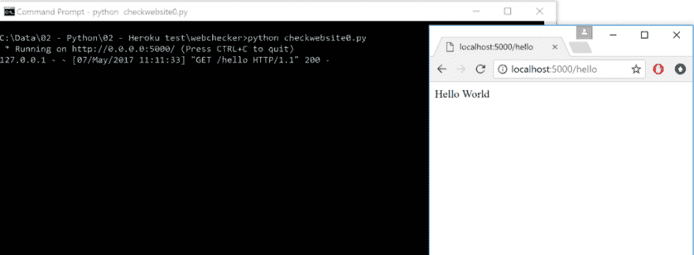](https://res.cloudinary.com/practicaldev/image/fetch/s--2KAAego3--/c_limit%2Cf_auto%2Cfl_progressive%2Cq_auto%2Cw_880/https://cdn-images-1.medium.com/max/1024/1%2AGXR1TOFAk6wIUCm_mVTWLQ.png) 

<figcaption>运行脚本将返回一个静态页面，输出为“hello world”</figcaption>

接下来，让我们将它部署到 Heroku。在部署之前，还需要包含一些文件来帮助 Heroku 更好地了解您的应用程序。

一、requirements.txt

```
Flask==0.12 
```

第二个文件告诉 Heroku 当发出一个 webrequest 时应该运行什么:

```
web: python showchecks.py 
```

最后，要使用的 Python 的运行时版本(默认为 2.7，但我们希望指定 Python 的最新版本):

```
python-3.6.1 
```

因此，您应该有四个文件:

1.  showchecker.py 哪个是代码
2.  requirements.txt 获取非标准库依赖项列表。每当您有不属于 Python 标准库的新库时——即，您需要使用“pip”等工具安装它们——然后在此处添加它们。您可以通过在命令行中运行命令:pip show Flask 来查找已安装库的版本，如 Flask
3.  Procfile 是调用网站时运行的实际 Python 脚本——如果更改 Python 文件，请确保更新该文件
4.  这是要使用的 python 的实际版本

您可以从命令行通过以下步骤进行部署:

1.  `heroku create webchecker01 – buildpack heroku/python`
2.  `git add \*.\*\*`
3.  `git status`
4.  `git commit -m "all files"`
5.  `git push heroku master`

[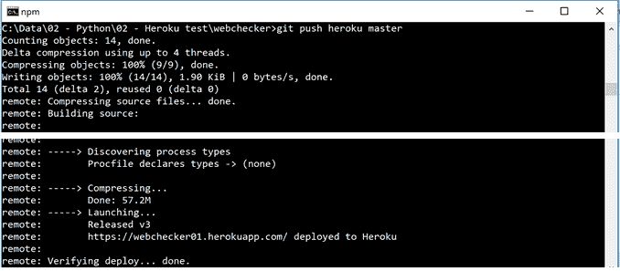](https://res.cloudinary.com/practicaldev/image/fetch/s--2qmweewv--/c_limit%2Cf_auto%2Cfl_progressive%2Cq_auto%2Cw_880/https://cdn-images-1.medium.com/max/678/1%2AnLcnlwU1UocIvqbiHhviXQ.png) 

<figcaption>一旦运行“git push heroku master”，就会显示部署日志，包括它部署的 URL</figcaption>

对于命令# 1(heroku create…),“webe checker 01”部分是您需要为应用程序名称提供的唯一名称。

对于命令#3 (git status ),这将告诉您哪些文件可以部署了。确保所有文件都在那里，如果没有，使用 git add <filename>添加它们。</filename>

现在你可以查看你的网站: <application name="">.herokuapp.com/hello</application>

[](https://res.cloudinary.com/practicaldev/image/fetch/s--_2PfdanI--/c_limit%2Cf_auto%2Cfl_progressive%2Cq_auto%2Cw_880/https://cdn-images-1.medium.com/max/1024/1%2AtSMmTHoxgA2-xXQ0RaTrHg.png) 

<figcaption>网络上运行的 hello world 程序</figcaption>

我们还要确保可以看到日志，因为这是查看应用服务器运行情况的好方法。在您的 PC 和 webchecker 目录中，运行命令:heroku logs

[](https://res.cloudinary.com/practicaldev/image/fetch/s--i9eNdzlr--/c_limit%2Cf_auto%2Cfl_progressive%2Cq_auto%2Cw_880/https://cdn-images-1.medium.com/max/1024/1%2AGQkthW50XPatw-J7fnrDlA.png) 

<figcaption>"heroku logs 是一个至关重要的命令，运行它可以查看您的应用服务器内发生了什么</figcaption>

您将看到最后的执行步骤。如果事情不像预期的那样运行，这是你寻找更多细节的第一站。

您也可以访问 Heroku 仪表盘查看您的消费情况:

[https://dashboard.heroku.com](https://dashboard.heroku.com)

### **第二步:持久性——创建数据库**

为了制作更有用的程序，你需要有一个各种各样的数据存储。这就是 Postgres 数据库服务发挥作用的地方。您首先需要部署 Heroku 数据库服务，然后创建您的表，最后能够从您的代码本地连接到数据库(用于测试)。

要部署数据库服务，首先使用以下命令创建它:

heroku 插件:创建 heroku-postgresql:爱好开发

接下来，从命令行访问数据库并创建您的表。数据库是在 Heroku 云服务上创建的，而不是在本地。但是，您可以通过命令行访问它。要通过控制台登录到数据库，运行命令 heroku pg:psql。请记住，您必须在您的 webchecker 文件夹中执行此操作，以便 Heroku 知道它是 webchecker 站点的数据库。

要查看表的列表，请键入命令\d

[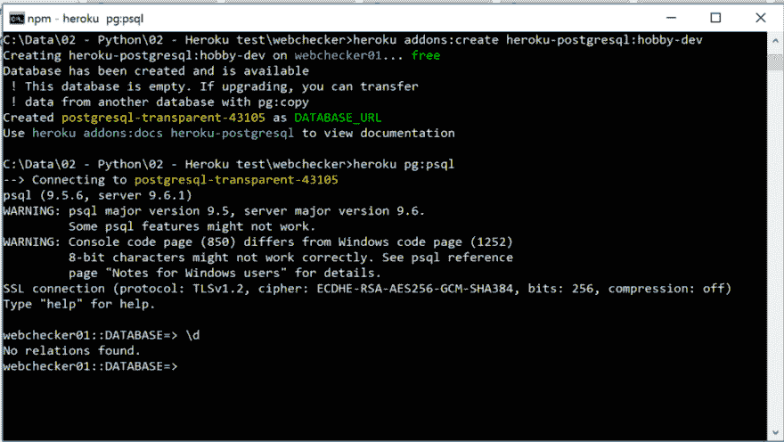T2】](https://res.cloudinary.com/practicaldev/image/fetch/s--fwcHGpFl--/c_limit%2Cf_auto%2Cfl_progressive%2Cq_auto%2Cw_880/https://cdn-images-1.medium.com/max/1024/1%2AsctwYakzP69ePN-W50Rezw.png)

要创建一个表，您需要使用普通的 SQL 语句。对于我们的 webchecker 程序，让我们创建一个包含以下各列的表格:

*   ID-为每个条目自动生成的 ID(这将是主键)。这是通过使用“串行”类型来完成的
*   网站——要监控的网站
*   电子邮件地址——发送变更通知的电子邮件地址
*   lasthashcode 我们不会存储整个网页的副本，而是根据页面的 HTML 生成一个哈希，然后每次都进行比较。这在存储方面效率更高，但不会告诉我们实际发生了什么变化
*   上次更改日期 web 上次更改的日期。因此，我们将让数据库默认为当前日期

要创建该表，请在 Heroku Postgres 数据库控制台中输入以下命令:

```
CREATE TABLE webcheckerdb (id serial, website varchar(250), emailaddress varchar(250), lasthashcode varchar(32), lastchangedate timestamp DEFAULT current_date ); 
```

(确保在末尾包含分号！)

[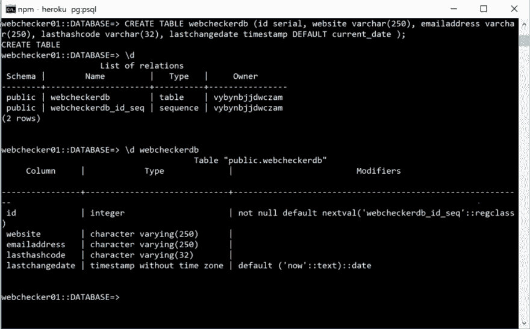](https://res.cloudinary.com/practicaldev/image/fetch/s--V5Jcp4HO--/c_limit%2Cf_auto%2Cfl_progressive%2Cq_auto%2Cw_880/https://cdn-images-1.medium.com/max/1024/1%2ADJFH7kef_tDJhIse7sazWA.png) 

<figcaption>创建数据库，然后使用\d 开关查看表列表，然后使用“\d webecheckerdb”查看列</figcaption>

接下来，让我们在数据库中插入一条记录，以确保在启动和运行我们的 web UI 之前有一些东西可以使用(您可以使用自己的电子邮件地址，以便将来可以使用):

```
INSERT into webcheckerdb values(DEFAULT, 'news.google.com', 'email@me.com', '', DEFAULT); 
```

(确保在末尾包含分号！)

[](https://res.cloudinary.com/practicaldev/image/fetch/s--YXzozzOa--/c_limit%2Cf_auto%2Cfl_progressive%2Cq_auto%2Cw_880/https://cdn-images-1.medium.com/max/1024/1%2AlzafM9Y_USmlAaY-FPIjGw.png) 

<figcaption>然后你可以做一个 select 语句(在末尾加上分号！)查看数据</figcaption>

可以用\q 退出。

### **第三步**:检查网站变化

首先，让我们获取一段代码，至少检查是否可以检索硬编码的站点(遵循先走后跑的概念)。

因此，第一步是看看我们是否可以检索一个网页，散列它，然后将其与硬编码的散列进行比较。创建一个名为 checkwebsite.py 的新 Python 文件。代码如下:

```
import http.client
import hashlib
import pprint

def getCurrentWebsiteHash(weburl):
    httpConn = http.client.HTTPSConnection(weburl)
    httpConn.request('GET', weburl)

    resp = httpConn.getresponse()
    data = resp.read()

    hash_object = hashlib.md5( data )
    print(hash_object.hexdigest())

    return hash_object.hexdigest()

def getWebList():
    webRecordList = [ {'website':'www.google.com', 'lasthashcode':'xxx'} ]
    return webRecordList

def checkWebList(weblist):
    for webrecord in weblist:
        pprint.pprint(webrecord)
        currWebHash = getCurrentWebsiteHash( webrecord['website'])
        if currWebHash != webrecord['lasthashcode']:
            print( 'Website ' + webrecord['website'] + ' has changed ')

if __name__ == "__main__":
    weblist = getWebList()
    checkWebList( weblist ) 
```

运行此命令将输出以下内容:

[T2】](https://res.cloudinary.com/practicaldev/image/fetch/s--hgzguqsp--/c_limit%2Cf_auto%2Cfl_progressive%2Cq_auto%2Cw_880/https://cdn-images-1.medium.com/max/1024/1%2AmnR-Yfax_dWTE3GeoffaaQ.png)

如果您有任何关于缺失库的错误，您可以通过命令行中的:pip install <library>来添加它们。</library>

接下来，让我们使用以下代码连接到数据库:

```
import http.client
import hashlib
import psycopg2
from psycopg2.extras import RealDictCursor
import traceback
import urllib.parse
import pprint
import os

urllib.parse.uses_netloc.append("postgres")
url = urllib.parse.urlparse(os.environ["DATABASE_URL"])
dbConn = psycopg2.connect( database=url.path[1:], user=url.username, password=url.password, host=url.hostname, port=url.port)
dbCur = dbConn.cursor(cursor_factory=RealDictCursor)

def getCurrentWebsiteHash(weburl):
    print("getting url:"+ weburl)
    httpConn = http.client.HTTPSConnection(weburl)  #Create connection object
    httpConn.request('GET', weburl) #Get the website 
    resp = httpConn.getresponse()   
    data = resp.read()              #Get the webdata into a string object 
    hash_object = hashlib.md5( data )   #Createa  hash code
    print(hash_object.hexdigest())      #print hash code 
    return hash_object.hexdigest()

def getWebList():
    rows = []
    try:
        dbCur.execute("select * from webcheckerdb" )    #Get all records from database
        rows = dbCur.fetchall()
    except:
        print ("error during select: " + str(traceback.format_exc()) )
    return rows

def checkWebList(weblist):
    for webrecord in weblist:   #Loop through each record in database
        pprint.pprint(webrecord)
        currWebHash = getCurrentWebsiteHash( webrecord['website'])  #Get the current websites latest hash code
        if currWebHash != webrecord['lasthashcode']:                
            print( 'Website ' + webrecord['website'] + ' has changed ')
            try:
                #If there is a change, print out the change, but also update the database so that next time
                #the message wont get triggered again
                dbCur.execute("update webcheckerdb set lasthashcode ='" + str(currWebHash) + "' where id = '" + str(webrecord['id']) +"'" )
                dbConn.commit()
                print( 'Website hash updated for next time')
            except:
                print ("error during update: " + str(traceback.format_exc()) )

if __name__ == "__main__":
    weblist = getWebList()
    checkWebList( weblist ) 
```

当您尝试运行此代码时，您可能会得到一个形式为 key error:DATABASE _ URL 的错误。这是因为您的 Python 代码试图定位 Heroku 上托管的 Postgres 数据库的网址。这将自动更新到 Heroku 服务器中的环境变量 DATABASE_URL。但是，在您的本地 PC 上，您必须手动执行此操作:

1.  heroku 配置
2.  set DATABASE_URL=<the database="" string="" listed="" from="" config=""></the>

[](https://res.cloudinary.com/practicaldev/image/fetch/s--PkWWlFot--/c_limit%2Cf_auto%2Cfl_progressive%2Cq_auto%2Cw_880/https://cdn-images-1.medium.com/max/1024/1%2AQ4i73mFPaKPuDobdX9G_ZA.png) 

<figcaption>如果得到 DATABASE_URL 错误，那么设置环境变量</figcaption>

### 第四步:发送电子邮件通知

最后一步是发送电子邮件。为此，你需要安装一个能够发送电子邮件的插件——你可以通过 Heroku marketplace 找到这些插件:[https://elements.heroku.com/addons](https://elements.heroku.com/addons)

在这里，有一个插件叫做 send grid:[https://elements.heroku.com/addons/sendgrid](https://elements.heroku.com/addons/sendgrid)

您可以通过在命令行中键入以下命令将 SendGrid 添加到您的应用程序中:

heroku 插件:创建 sendgrid:starter

当你进入你的仪表板时，你可以在资源部分看到新的插件:

[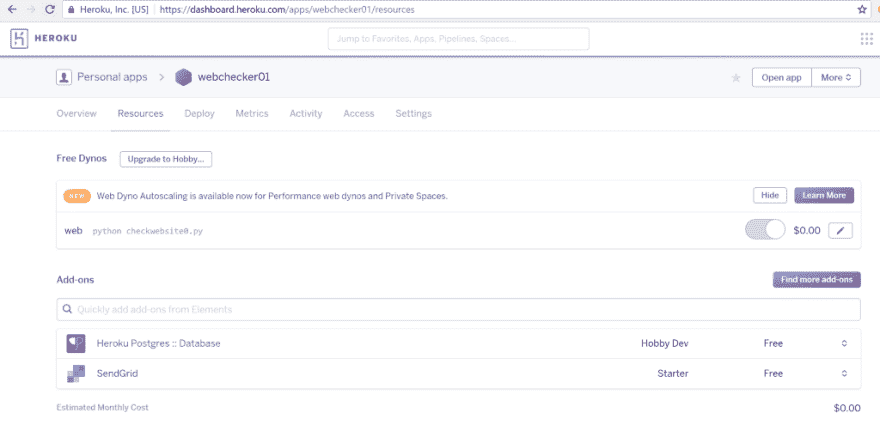](https://res.cloudinary.com/practicaldev/image/fetch/s--KwRhFWGW--/c_limit%2Cf_auto%2Cfl_progressive%2Cq_auto%2Cw_880/https://cdn-images-1.medium.com/max/1024/1%2Ac15ERSHkLS2tpByYFEJM1g.png) 

<figcaption>可以发送邮件的 SendGrid 插件会在底部</figcaption>

在使用它之前，您需要创建一个 API 密钥。双击上面的 SendGrid 组件，进入设置->API 密钥->创建密钥(右上角的蓝色按钮)。

[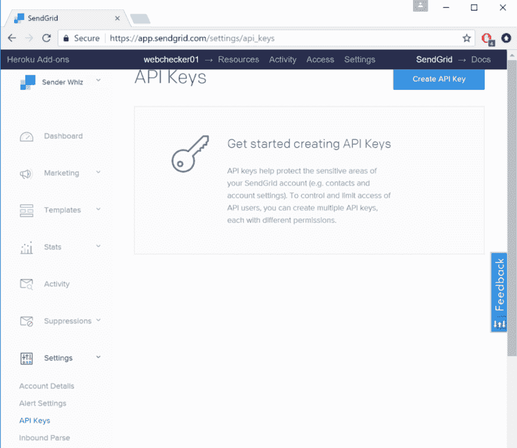](https://res.cloudinary.com/practicaldev/image/fetch/s--DQ0U8bb3--/c_limit%2Cf_auto%2Cfl_progressive%2Cq_auto%2Cw_880/https://cdn-images-1.medium.com/max/1024/1%2ADENX5_vY3u5ibFsMNW0Dug.png) 

<figcaption>点击右上角的创建关键点按钮</figcaption>

创建密钥后，复制它并返回到命令提示符并输入:

heroku 配置:设置 SENDGRID_API_KEY=

这将仅在服务器上注册它，您需要使用以下命令将其本地添加到您的桌面:

set SENDGRID_API_KEY=

完成后，您可以在名为 sendmail.py 的新 Python 脚本中测试您的代码。

```
import sendgrid
import os
from sendgrid.helpers.mail import *

def sendemail(recipient, emailSubject, body):
    sg = sendgrid.SendGridAPIClient(apikey=os.environ.get('SENDGRID_API_KEY'))
    from_email = Email("heroku@myapp.com")
    to_email = Email(recipient)
    content = Content("text/plain", body)
    mail = Mail(from_email, emailSubject, to_email, content)
    response = sg.client.mail.send.post(request_body=mail.get())

    print("### Email sent to: "+ recipient + " ###")
    print(response.status_code)
    print(response.body)
    print(response.headers)

if __name__ == "__main__":
    sendemail('email@me.com', "hello world", "you have mail!") 
```

要确认电子邮件已发送并送达，您可以返回 SendGrid 仪表板并查看统计信息概览屏幕:

[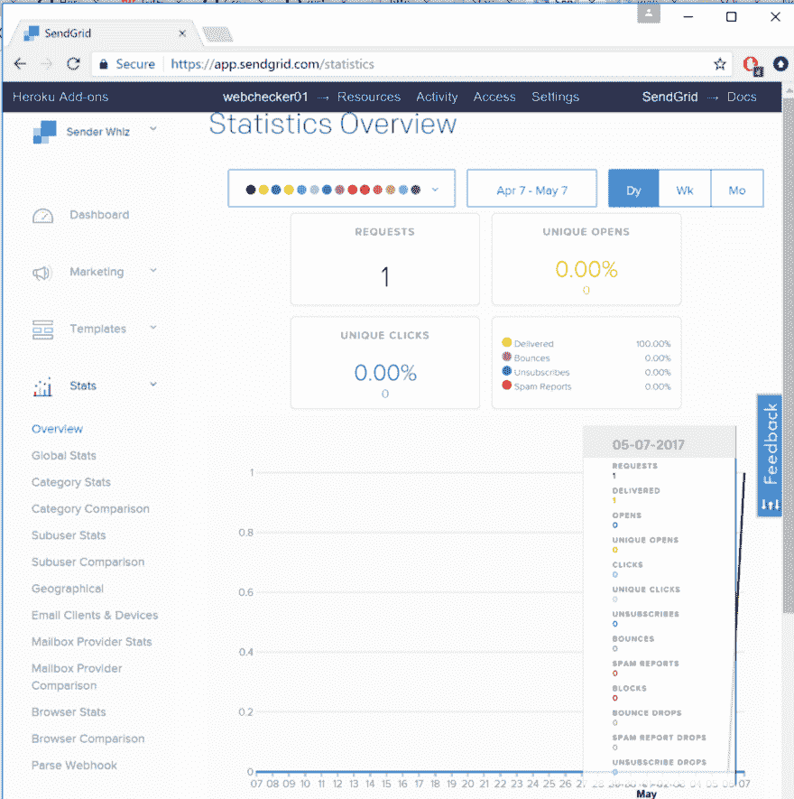T2】](https://res.cloudinary.com/practicaldev/image/fetch/s--pv3lG6Gh--/c_limit%2Cf_auto%2Cfl_progressive%2Cq_auto%2Cw_880/https://cdn-images-1.medium.com/max/1024/1%2Ai3v-OiFWlQhSEY_1y2VNoQ.png)

当检查你的电子邮件时，记得检查你的垃圾邮件。

一旦它开始工作，您只需要将两行代码添加到您的主 checkwebsite.py 脚本中。它是:

```
import sendmail #import the send email subroutine you wrote above

...

#call the subroutine after find the hashcode has changed
sendmail.sendemail(webrecord['emailaddress'], 'Website changed', webrecord['website'] + ' changed') 
```

完整的代码在这里:

```
import http.client
import hashlib
import psycopg2
from psycopg2.extras import RealDictCursor
import traceback
import urllib.parse
import pprint
import os
import sendmail  #import the send email subroutine 
urllib.parse.uses_netloc.append("postgres")
url = urllib.parse.urlparse(os.environ["DATABASE_URL"])
dbConn = psycopg2.connect( database=url.path[1:], user=url.username, password=url.password, host=url.hostname, port=url.port)
dbCur = dbConn.cursor(cursor_factory=RealDictCursor)

def getCurrentWebsiteHash(weburl):
    print("getting url:"+ weburl)
    httpConn = http.client.HTTPSConnection(weburl)  #Create connection object
    httpConn.request('GET', weburl) #Get the website 
    resp = httpConn.getresponse()   
    data = resp.read()              #Get the webdata into a string object 
    hash_object = hashlib.md5( data )   #Createa  hash code
    print(hash_object.hexdigest())      #print hash code 
    return hash_object.hexdigest()

def getWebList():
    rows = []
    try:
        dbCur.execute("select * from webcheckerdb" )    #Get all records from database
        rows = dbCur.fetchall()
    except:
        print ("error during select: " + str(traceback.format_exc()) )
    return rows

def checkWebList(weblist):
    for webrecord in weblist:   #Loop through each record in database
        pprint.pprint(webrecord)
        currWebHash = getCurrentWebsiteHash( webrecord['website'])  #Get the current websites latest hash code
        if currWebHash != webrecord['lasthashcode']:        
            print( 'Website ' + webrecord['website'] + ' has changed email to ' + webrecord['emailaddress'])
            #call the subroutine after find the hashcode has changed
            sendmail.sendemail(webrecord['emailaddress'], 'Website changed',  webrecord['website'] + ' changed')
            try:
                #If there is a change, print out the change, but also update the database so that next time
                #the message wont get triggered again
                dbCur.execute("update webcheckerdb set lasthashcode ='" + str(currWebHash) + "' where id = '" + str(webrecord['id']) +"'" )
                dbConn.commit()
                print( 'Website hash updated for next time')
            except:
                print ("error during update: " + str(traceback.format_exc()) )

if __name__ == "__main__":
    weblist = getWebList()
    checkWebList( weblist ) 
```

### **第五步**:在网页上列出输出，调度作业

下一步是在网页上列出输出。

这包括查询数据库，然后在屏幕上循环显示数据。因此，它采用上面的“Hello World”代码，并进行修改。我还为此创建了一个不同的路径，所以为了测试这个，你需要转到 URL:[http://localhost:5000/list](http://localhost:5000/list)

```
import os
from flask import Flask, request
import hashlib
import psycopg2
from psycopg2.extras import RealDictCursor
import traceback
import urllib.parse
import pprint 

app = Flask(__name__) #create an instance of the Flask library urllib.parse.uses_netloc.append("postgres")
url = urllib.parse.urlparse(os.environ["DATABASE_URL"])
dbConn = psycopg2.connect( database=url.path[1:], user=url.username, password=url.password, host=url.hostname, port=url.port)
dbCur = dbConn.cursor(cursor_factory=RealDictCursor)

@app.route('/list') #whenever this webserver is called with <hostname:port>/hello then this section is called def list(): #The subroutine name that handles the call
    output = 'Check status:'
    rows = []
    try:
        dbCur.execute("select * from webcheckerdb" )    #Get all records from database
        rows = dbCur.fetchall()
        for webrecord in rows:  #Loop through each record in database
            output = output + '<BR> ' + pprint.pformat(webrecord)
    except:
        output = "error during select: " + str(traceback.format_exc())

    return output #Whatever is returned from this subroutine is what is returned to the requester and is shown on the browser page 

@app.route('/hello') #whenever this webserver is called with <hostname:port>/hello then this section is called def hello(): #The subroutine name that handles the call
    output = 'Hello World'
    return output #Whatever is returned from this subroutine is what is returned to the requester and is shown on the browser page 
if __name__ == '__main__':
    port = int(os.environ.get('PORT', 5000)) #The port to be listening to – hence, the URL must be <hostname>:<port>/ inorder to send the request to this program
    app.run(host='0.0.0.0', port=port)  #Start listening 
```

这是输出结果:

[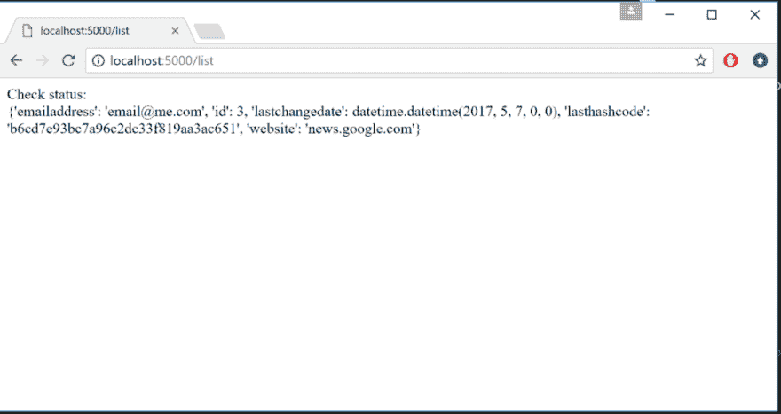T2】](https://res.cloudinary.com/practicaldev/image/fetch/s--Dn123SEK--/c_limit%2Cf_auto%2Cfl_progressive%2Cq_auto%2Cw_880/https://cdn-images-1.medium.com/max/1024/1%2ACr3hYo0DKRwBiXhfgVLE0g.png)

### 第六步:部署

最后一步是将所有东西都部署到 Heroku，然后调度作业，让它检查电子邮件。

您应该有以下文件:

1.  轮廓
2.  requirements.txt 包含库依赖关系的文件
3.  runtime . txt–python 的版本
4.  showchecker.py 通过 <your appname="">.herokuapp.com/list 在 web 上显示数据库输出的 python 代码</your>
5.  checkwebsite.py 用于检查网站上的任何更改的 python 代码

对于 requirements.txt，您需要进行修改以添加最新的库:

```
Flask==0.12
psycopg2==2.6.2
sendgrid==3.6.3 
```

将这些全部部署到 Heroku:

1.  `git add \*.\*\*`
2.  `git commit -m "deployment"`
3.  `git push heroku master`

测试每个组件:

1.  前往 <your app="" name="">.herokuapp.com/hello</your>
2.  前往 <your app="" name="">.herokuapp.com/list</your>

如果有任何错误，那么在命令行中运行 heroku 日志，看看发生了什么。

接下来，直接在 Heroku 上运行 checkwebsite.py，确保没有问题。为此，您可以键入:

heroku 运行 python checkwebsite.py

[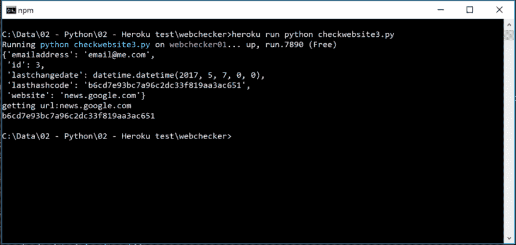](https://res.cloudinary.com/practicaldev/image/fetch/s--C9nFS8iQ--/c_limit%2Cf_auto%2Cfl_progressive%2Cq_auto%2Cw_880/https://cdn-images-1.medium.com/max/1024/1%2AeTeK6EvsZjWvMw-IYnDGuA.png) 

<figcaption>这是确保你的代码在 heroku 云上和本地一样运行的好方法</figcaption>

最后，您现在可以安排您的工作。同样，你需要包括一个插件来做到这一点。

heroku 插件:创建调度程序:标准

[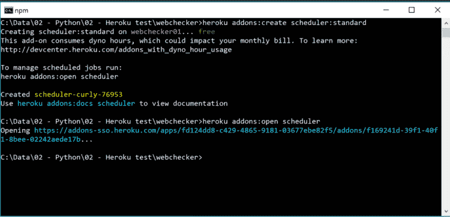T2】](https://res.cloudinary.com/practicaldev/image/fetch/s--1sYCekvw--/c_limit%2Cf_auto%2Cfl_progressive%2Cq_auto%2Cw_880/https://cdn-images-1.medium.com/max/1024/1%2A6O4ealFi6wtJ2OuE-wXa8w.png)

您应该能够在您的资源页面中看到调度程序:

[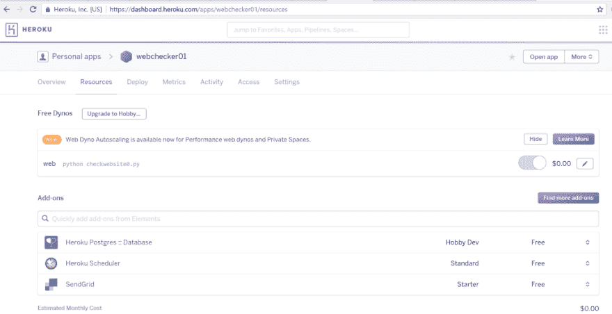](https://res.cloudinary.com/practicaldev/image/fetch/s--5lGU26dt--/c_limit%2Cf_auto%2Cfl_progressive%2Cq_auto%2Cw_880/https://cdn-images-1.medium.com/max/1024/1%2ARG3zOR_MfVjM2fjHStyZmg.png)

您可以简单地使用命令行来运行程序，在我们的例子中是:python checkwebsite.py(这与我们上面用 heroku run 命令测试的一样)。

[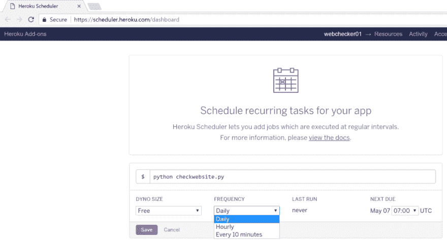](https://res.cloudinary.com/practicaldev/image/fetch/s--E6kxnxde--/c_limit%2Cf_auto%2Cfl_progressive%2Cq_auto%2Cw_880/https://cdn-images-1.medium.com/max/1024/1%2AzfwYHHgSwOl4WHIcY1DJTw.png) 

<figcaption>你可以用几个选项来安排。</figcaption>

### 总结

就是这样…第一次有点复杂，但希望上面的渐进步骤能帮助你理解引擎盖下发生了什么。Heroku 上有更多的资源，还有大量关于 T2 堆栈溢出的信息。在经历了以上这些之后，这些资源应该会变得更有意义。

祝你好运！

*感谢阅读！如果你喜欢你所读的，分享它，这样其他人也可以找到它(你也可以在 [Twitter](http://www.twitter.com/pubs12) 上找到我)*

* * *

*本帖最初发表于[medium.com](https://medium.freecodecamp.com/how-to-host-lightweight-apps-for-free-a29773e5f39e)T3】*