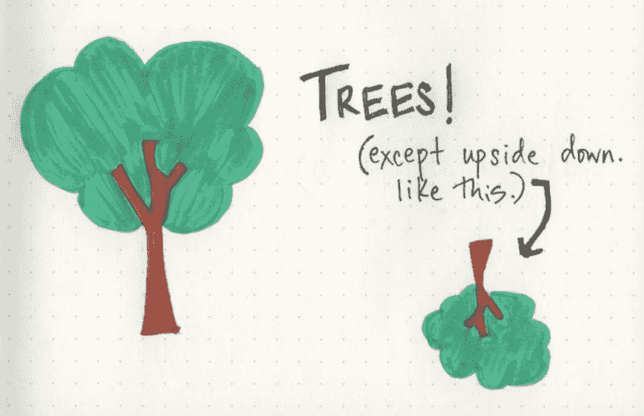
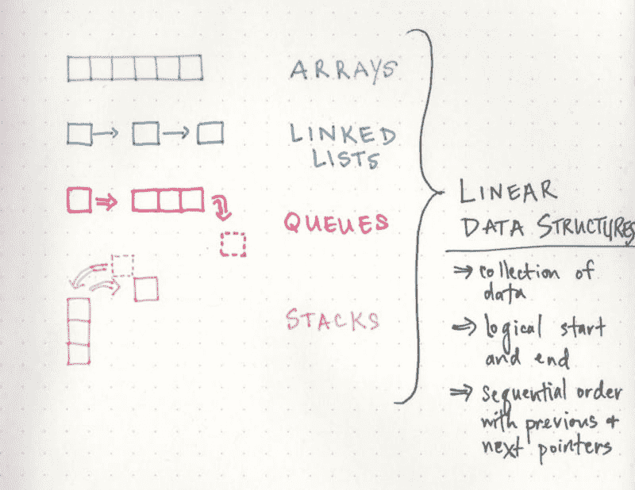
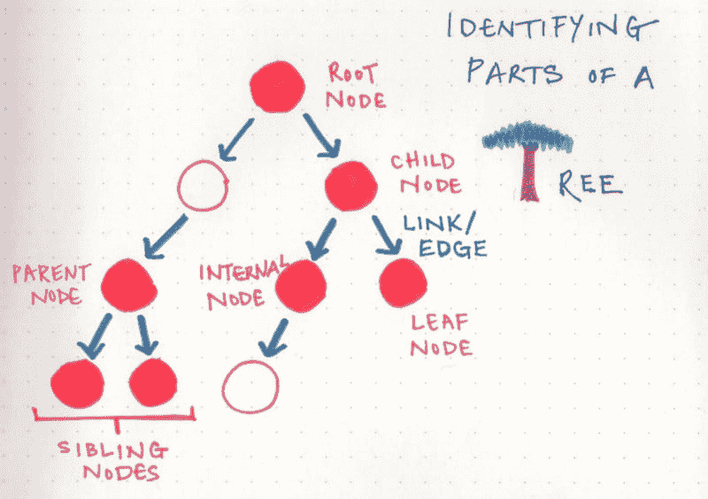
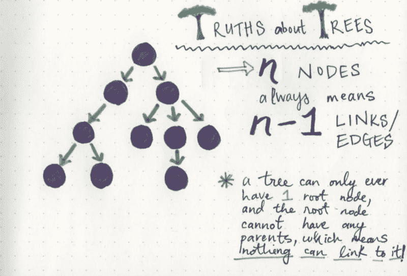
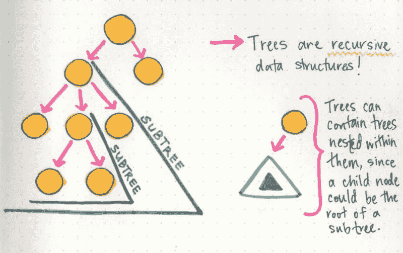
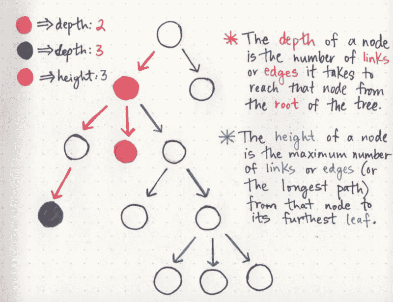
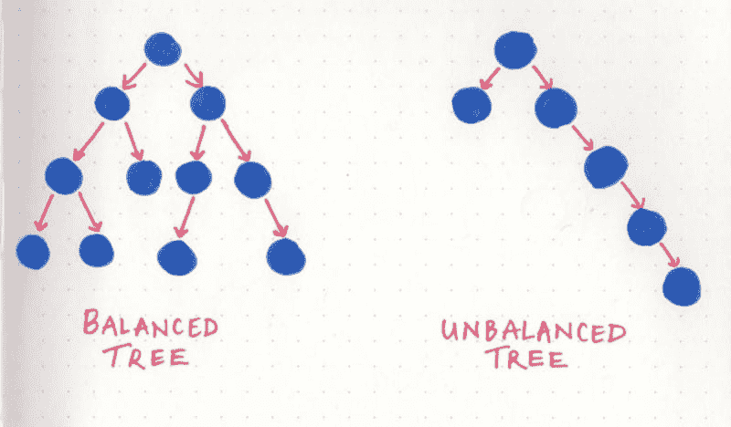
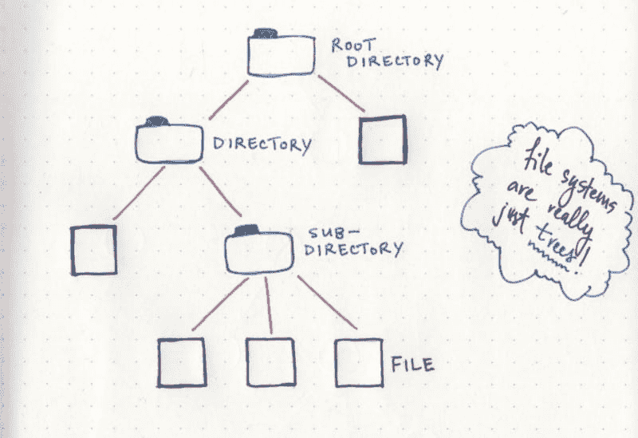

# 如何不被树难倒

> 原文：<https://dev.to/vaidehijoshi/how-to-not-be-stumped-by-trees>

[T2】](https://res.cloudinary.com/practicaldev/image/fetch/s--t7KC-23N--/c_limit%2Cf_auto%2Cfl_progressive%2Cq_auto%2Cw_880/https://cdn-images-1.medium.com/max/800/1%2Aevr_JXpu9Gg1ImI4gPgdJg.jpeg)

一旦你头脑中的数据结构灯泡熄灭，你就很难*而不是*从各个角度看数据结构！或者…也许这只是我。

几周前，我发现了[链表](https://dev.to/vaidehijoshi/whats-a-linked-list-anyway)的乐趣，以及[许多](https://dev.to/vaidehijoshi/stacks-and-overflows) [不同的](https://dev.to/vaidehijoshi/to-queue-or-not-to-queue)抽象数据类型，我们可以通过使用它们来构建它们！当我意识到这些简单的数据结构实际上隐藏在我每天工作和生活中使用的许多东西的表面之下时，我有点吃惊。但是，事实证明，这只是数据结构的冰山一角！因为*当然是*。毕竟，这是计算机科学，在这里问题可以用许多不同的方法来解决！数据也是如此，数据可以用不同的方式组织。

到目前为止，我们主要只处理了一种数据结构。但是今天，我们要变得有点疯狂，把我们的数据摇得乱七八糟！这是因为我们终于要深入非线性数据结构了，从我个人最喜欢的开始:树！

### 想种什么树枝就种什么树枝！

您可能还记得有许多不同的方法来对数据结构进行分类。我们可以如何存储数据的一个更广泛的类别是我们的数据是否是线性的——也就是说，我们的数据是如何构造和遍历的，是否有一个序列和顺序。在**中，线性数据结构——**,如数组或链表——数据是有序的，这种有序很重要；您遍历线性数据结构的方式与其顺序直接相关，因为线性数据结构中的元素只能按顺序*遍历*。

[T2】](https://res.cloudinary.com/practicaldev/image/fetch/s--xwTaPQ_N--/c_limit%2Cf_auto%2Cfl_progressive%2Cq_auto%2Cw_880/https://cdn-images-1.medium.com/max/800/1%2AnmZLYB-okKgvscMuhr7mFg.jpeg)

但是正如我们现在所知道的，还有非线性数据结构！我读的越多，了解的越多，它们看起来就越酷。但是，它们也可能有点棘手和笨拙，这就是为什么首先很好地处理线性数据结构会很有帮助，这样我们就可以从一开始就理解它们之间的根本区别。

在**非线性数据结构**中，数据并不真正遵循顺序——至少不是明显的数字顺序，像数组或链表。因为数据不一定需要按照特定的顺序排列，所以以一种*无序*的方式遍历一个非线性数据结构很容易(实际上也很常见)。

非线性数据结构的一个重要类型是树。如果我们想了解树以及如何谈论它们，我们需要能够识别树的各个部分！然而，尽管它们看起来与我们迄今为止讨论过的结构非常不同，但它们实际上是由相同的物质组成的。

> 树——像链表一样——由节点和链接组成。

所有的树，不管是橡树、枫树还是银杏树，都开始长出坚实的根。在树形数据结构中，你也必须有一个根，即使你没有其他的东西。事实上，如果我们只有一个根，我们就只有一个节点。但是，有趣的是:一个根节点可以链接到*多个*其他节点。*这里的*是我们到目前为止看到的线性结构和我们现在正在学习的树之间的根本区别。一个节点可以连接到许多其他节点，这意味着树可以以不同的形状和方式生长。

[T2】](https://res.cloudinary.com/practicaldev/image/fetch/s--tIc_Ffby--/c_limit%2Cf_auto%2Cfl_progressive%2Cq_auto%2Cw_880/https://cdn-images-1.medium.com/max/800/1%2AZTtVCoVYVEzesXc5dAegkw.jpeg)

这里有一些谈论树木时要知道的好术语:

*   **根**:树的最顶端节点，它从来没有任何链接或边与之相连
*   **Link/Edge** :父节点包含的引用，告诉它它的子节点是什么
*   **子节点**:任何有父节点链接的节点
*   **父节点**:具有到另一个节点的引用或*链接*的任何节点
*   **兄弟节点**:是同一节点的子节点的任何节点组
*   **内部**:任何有子节点的节点(基本上都是父节点)
*   **叶**:树中没有子节点的任何节点

如果这些术语让人感到不知所措，我发现把树状数据结构想象成一个家谱，甚至是一个公司的阶梯是很有帮助的。数据总是分层的。你将在顶部有一个人(*根节点*)，他将委托给一些其他节点(*父节点*)，这些节点可能或可能有其他人向他们报告(*子节点*)。或者你有一个庞大的家族，有父节点，子节点，都可以追溯到一个祖先根节点。

只要你能记住 ***数据在本质上是分层的*** ，术语就不那么令人担忧了。

### 说出你的(树)道理

不管一棵树长什么样，它有多少枝叶，或者它长得有多大，都有一些不言而喻的普遍“树的真理”。

我发现当我们将它们形象化时，它们更容易理解，所以我们将在这里依靠一些例子。让我们看看下面的这棵树。它总共有 10 个节点，包括根节点。

[T2】](https://res.cloudinary.com/practicaldev/image/fetch/s--yazmRrVl--/c_limit%2Cf_auto%2Cfl_progressive%2Cq_auto%2Cw_880/https://cdn-images-1.medium.com/max/800/1%2A6Y-RQcOTx5WsYg2bgJ_3zA.jpeg)

关于这棵树有趣的事实是，它有 10 个节点，但有 9 个链接或边。这里有一个关系，无论节点数量多少都成立，我们可以记住一个简单的经验法则:

> 如果一棵树有 n 个节点，它总是少一个边(n-1)。

如果我们看看这棵树，就会明白为什么会这样。根节点是永远没有父节点的节点。因此，它不能有任何引用它的内容。如果每个节点必须有一个通过链接/边引用它的其他节点(除了根节点)，那么当 *n* 是树中节点的总数时，我们总是可以确定我们的树将有 *n-1* 个链接。多么酷(而且强大！)是不是我们不用遍历树就可以这么容易的知道那个信息？！

但是等等——还有另一个事实可能*甚至*更酷:树里面实际上包含了树！

[T2】](https://res.cloudinary.com/practicaldev/image/fetch/s--BRW14b7o--/c_limit%2Cf_auto%2Cfl_progressive%2Cq_auto%2Cw_880/https://cdn-images-1.medium.com/max/800/1%2APWwQAA310nefA43Sk6gWig.jpeg)

树是**递归数据结构**,因为树通常由更小的树组成——通常被称为内部的*子树*。树中一个节点的子节点很可能是另一棵树的父节点(使其成为子树的根节点)。这在编写遍历或搜索树的算法时非常有趣，因为树的嵌套有时会导致我们编写递归搜索算法。

但是我们现在还不会进入树遍历。相反，我们先来看看一些更重要的东西:我们可以用不同的方法对树进行分类，这在以后会很方便。

### 你的树有多高？

因为树可以有许多不同的形状和大小，所以能够识别和理解你正在处理的树的类型和数据的样子是非常重要的。为此，有两个属性是最重要的，当涉及到要处理什么类型的树，以及数据在树中的位置时，就要讨论这两个属性。

> 在大多数情况下，我们最关心的两个属性是节点的深度或高度。

考虑节点深度的一个简单方法是回答这个问题:*节点离树根有多远？*

但是在这种情况下，我们怎么知道*离*有多远呢？好吧，尽管我们还没有涉及到树遍历的所有复杂性，但是只有一种方法可以遍历或搜索一棵树:创建一条路径，沿着边/链接从根节点向下。因此，我们可以通过计算从根节点到该节点的链路数量来确定节点离根节点有多远*。*

 *在这里显示的例子中，粉红色节点的深度是 2，因为正好有 2 个链接将根节点连接到粉红色节点。然而，紫色节点的深度是 3，因为从根节点向下遍历到紫色节点需要 3 个链接。

[T2】](https://res.cloudinary.com/practicaldev/image/fetch/s--uCmGvzA_--/c_limit%2Cf_auto%2Cfl_progressive%2Cq_auto%2Cw_880/https://cdn-images-1.medium.com/max/800/1%2AsxEBE8JC4UTR38FX-7RSfw.jpeg)

既然我们知道了深度是如何工作的，那么第二个属性就容易一点了。一个节点的高度可以简化为这样一个问题:*这个节点离它最远的叶子有多远？*(记住:我们正在计算机的野蛮世界里把树倒过来，这就是高度以这种方式确定的原因！)

因此，我们可以通过找到节点最远的子叶，并计算到达该子叶的链接路径来找到节点的高度。在示例中，橙色节点的高度是 3，因为它最远的子节点离开了(实际上有三个！)距离橙色节点有三个链接。如果你能算出橙色节点的深度是多少，就会得到加分！

height 属性特别酷的一点是，根节点的高度自动就是整个树本身的高度。基本上，这意味着一旦我们找到了离根最远的叶节点，我们现在就知道了树中可能的最长路径，这告诉我们它实际上有多高！

深度和高度之所以如此重要，是因为它们能告诉我们很多关于一棵树的信息。关于树的事情(我相信现在我们都知道了)是它们看起来都不一样。一个简单的例子是**平衡树对不平衡树**。

[T2】](https://res.cloudinary.com/practicaldev/image/fetch/s--Mr1Hg-dj--/c_limit%2Cf_auto%2Cfl_progressive%2Cq_auto%2Cw_880/https://cdn-images-1.medium.com/max/800/1%2AzkYif_uQsOS80Zx7L0K9pg.jpeg)

如果任何两个兄弟子树的高度相差不超过一级，则认为树是**平衡的**。然而，如果两个兄弟子树在高度上显著不同(并且具有不止一级的差异深度)，则该树是**不平衡的**。

当我们谈到树操作，特别是遍历时，平衡树就出现了。这背后的想法是，如果我们能够遍历一棵树并减少一半的操作次数，我们将有一个性能更好的数据结构。然而，在一个不平衡的树中，情况肯定不是这样，因为一个子树可能比它的兄弟子树大得多。平衡树解决的许多操作效率问题实际上被称为**二叉树**——但下周会有更多内容！

### 挖掘树根

为了*真正*体会树的力量，我们必须在它们的应用背景下看待它们。换句话说:除非你在野外看到它们，否则它们可能没那么酷！

一个简单的例子存在于面向对象语言中:main `Object`是根节点，而从它继承的类是 main 类的子节点。仔细想想，这更有意义；事实上，它通常被称为“类层次结构”,非常适合于层次树数据结构。

[T2】](https://res.cloudinary.com/practicaldev/image/fetch/s--_pw15ojv--/c_limit%2Cf_auto%2Cfl_progressive%2Cq_auto%2Cw_880/https://cdn-images-1.medium.com/max/800/1%2Am8EunvqGXD7C0VIkXcH9cw.jpeg)

最明显的一个(可能到现在才明显！)是项目的文件结构，甚至是您电脑上的文件系统！如果我们仔细想想，所有重要的部分都已经存在了:一个根目录，带有可能是它们自己的子目录的子节点，或者以一个简单文件结束的树的叶子。所有这一切实际上只是一个层次树数据结构！

想想看，我们都在树荫下晒了这么久，却不知道。

### 资源

如果你是一个树木保护者，或者是一个树木爱好者，或者只是想多学一点，看看这些有用的链接吧！

1.  数据结构:树的介绍
2.  [数据结构:树](https://www.youtube.com/watch?v=oSWTXtMglKE)，HackerRank
3.  [树木](http://www.cs.jhu.edu/~cohen/CS226/Lectures/Trees.pdf)乔纳森·科恩教授
4.  [树形数据结构](http://people.cs.ksu.edu/~schmidt/300s05/Lectures/Week7b.html)，大卫·施密特教授
5.  平衡树木，r .克莱顿教授*