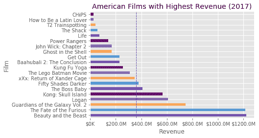
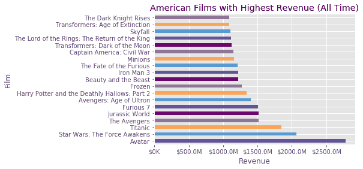
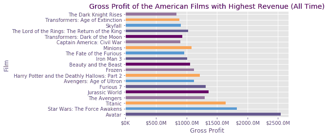
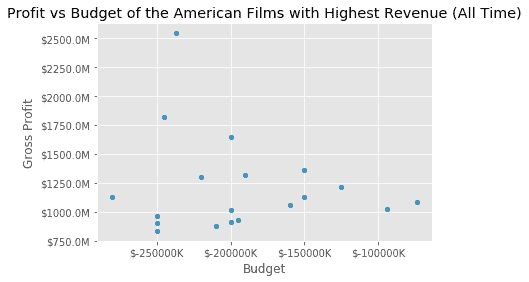

# 如何使用 TMDB API 查找收入最高的电影

> 原文：<https://dev.to/m0nica/how-to-use-the-tmdb-api-to-find-films-with-the-highest-revenue-82p>

[T2】](https://res.cloudinary.com/practicaldev/image/fetch/s--Em0UwflH--/c_limit%2Cf_auto%2Cfl_progressive%2Cq_auto%2Cw_880/https://thepracticaldev.s3.amazonaws.com/i/9upyzrcahwh20chcrkf4.png)

*滚出去*是 2017 年最受关注的电影之一，截至 2017 年 4 月[是历史上根据原创剧本改编的票房最高的电影](http://www.thefader.com/2017/04/04/get-out-original-screenplay-record)。我们想有计划地找出*如何在 2017 年其他美国电影中排名*，以及哪些电影在 2017 年获得了最多的收入。本教程假设大多数读者都具备 Python 的基础知识。

### 先决条件

*   安装以下 python 包，并在一个 [virtualenv](http://python-guide-pt-br.readthedocs.io/en/latest/dev/virtualenvs/) 中运行它们。

    *   配置
    *   要求
    *   现场
    *   熊猫
    *   matplotlib
*   除了安装上述依赖项，我们还需要从[电影数据库(TMDB)](https://www.themoviedb.org/) 请求一个 API 密钥。TMDB 有一个免费的 API 来编程访问电影信息。

    *   为了从 TMDB 请求 API 密钥:
        1.  [创建免费账户](https://www.themoviedb.org/account/signup)
        2.  检查您的电子邮件以验证您的帐户。
        3.  访问您的帐户设置中的 [API 设置页面](https://www.themoviedb.org/settings/api)并请求 API 密钥
        4.  您现在应该有一个 API 密匙了，可以开始使用了！

```
import config # to hide TMDB API keys import requests # to make TMDB API calls import locale # to format currency as USD locale.setlocale( locale.LC_ALL, '' )

import pandas as pd
import matplotlib
import matplotlib.pyplot as plt
from matplotlib.ticker import FuncFormatter # to format currency on charts axis 
api_key = config.tmdb_api_key # get TMDB API key from config.py file 
```

Enter fullscreen mode Exit fullscreen mode

如果你计划将你的项目提交给 GitHub 或其他公共库，并且需要帮助设置`config`，你应该阅读[这篇关于使用`config`隐藏 API 密钥的文章](https://medium.com/black-tech-diva/hide-your-api-keys-7635e181a06c)。

## 第一部分:确定 2017 年最高收入的美国电影

在本节中，我们将从 TMDB 请求 **2017** 数据，将我们作为`json`接收的数据存储到`dataframe`中，然后使用`matplotlib`来可视化我们的数据。

### 对 TMDB 进行 API 调用，返回感兴趣的数据

为了从 TMDB 获得最高收入的电影，需要构建一个 API 请求来返回 2017 年`primary_release_year`的电影，按收入降序排列。

```
response = requests.get('https://api.themoviedb.org/3/discover/movie?api_key=' +  api_key + '&primary_release_year=2017&sort_by=revenue.desc') 
```

Enter fullscreen mode Exit fullscreen mode

```
highest_revenue = response.json() # store parsed json response 
# uncomment the next line to get a peek at the highest_revenue json structure
# highest_revenue 
highest_revenue_films = highest_revenue['results'] 
```

Enter fullscreen mode Exit fullscreen mode

### 从 TMDB API 调用返回的 JSON 创建数据帧

让我们将 API 调用返回的 JSON 数据存储在一个 dataframe 中，以存储每部电影及其相关收入。

```
# define column names for our new dataframe columns = ['film', 'revenue']

# create dataframe with film and revenue columns df = pandas.DataFrame(columns=columns) 
```

Enter fullscreen mode Exit fullscreen mode

现在，要将数据添加到我们的数据帧中，我们需要循环遍历数据。

```
# for each of the highest revenue films make an api call for that specific movie to return the budget and revenue for film in highest_revenue_films:
    # print(film['title'])
    film_revenue = requests.get('https://api.themoviedb.org/3/movie/'+ str(film['id']) +'?api_key='+ api_key+'&language=en-US')
    film_revenue = film_revenue.json()
    #print(locale.currency(film_revenue['revenue'], grouping=True ))
    df.loc[len(df)]=[film['title'],film_revenue['revenue']] # store title and revenue in our dataframe 
```

Enter fullscreen mode Exit fullscreen mode

下面是数据帧`head`(前 5 行)在遍历我们的 API 调用返回的电影后的样子。

```
df.head() 
```

Enter fullscreen mode Exit fullscreen mode

```
.dataframe thead tr:only-child th {
    text-align: right;
}

.dataframe thead th {
    text-align: left;
}

.dataframe tbody tr th {
    vertical-align: top;
} 
```

Enter fullscreen mode Exit fullscreen mode

|  | 电影 | 税收 |
| --- | --- | --- |
| Zero | 《美女与野兽》 | One billion two hundred and twenty-one million seven hundred and eighty-two thousand and forty-nine |
| one | 狂怒者的命运 | One billion two hundred and twelve million five hundred and eighty-three thousand eight hundred and sixty-five |
| Two | 银河守护者第二卷 | Seven hundred and forty-four million seven hundred and eighty-four thousand seven hundred and twenty-two |
| three | 洛根 | Six hundred and eight million six hundred and seventy-four thousand one hundred |
| four | 孔:骷髅岛 | Five hundred and sixty-five million one hundred and fifty-one thousand three hundred and seven |

### 让我们实际上*用 matplotlib 查看*数据

我们将使用 matplotlib 创建一个水平条形图来显示每部电影的收入。

```
matplotlib.style.use('ggplot')
fig, ax = plt.subplots()
df.plot(kind="barh", y='revenue', color = ['#624ea7', '#599ad3', '#f9a65a', '#9e66ab', 'purple'], x=df['film'], ax=ax)

#format xaxis in terms of currency formatter = FuncFormatter(currency)
ax.xaxis.set_major_formatter(formatter)
ax.legend().set_visible(False)

avg = df['revenue'].mean()

# Add a line for the average ax.axvline(x=avg, color='b', label='Average', linestyle='--', linewidth=1)

ax.set(title='American Films with Highest Revenue (2017)', xlabel='Revenue', ylabel='Film') 
```

Enter fullscreen mode Exit fullscreen mode

```
[<matplotlib.text.Text at 0x111f8aba8>,
 <matplotlib.text.Text at 0x111f20978>,
 <matplotlib.text.Text at 0x111fad2e8>] 
```

Enter fullscreen mode Exit fullscreen mode

[T2】](https://res.cloudinary.com/practicaldev/image/fetch/s--7MMXqHzA--/c_limit%2Cf_auto%2Cfl_progressive%2Cq_auto%2Cw_880/https://thepracticaldev.s3.amazonaws.com/i/vnxcfw9fjq4ohagxfovz.png)

## 第二部分:确定有史以来收入最高的美国电影

在这一部分中，我们将从 TMDB 请求**全天**数据，将我们作为`json`接收的数据存储到`dataframe`中，然后使用`matplotlib`来可视化我们的数据。我们的 API 调用将与我们在上一节中使用的类似，但没有`&primary_release_year=2017`。

### 请求、格式化和存储 API 数据

```
response = requests.get('https://api.themoviedb.org/3/discover/movie?api_key=' +  api_key + '&sort_by=revenue.desc')
highest_revenue_ever = response.json()
highest_revenue_films_ever = highest_revenue_ever['results']

columns = ['film', 'revenue', 'budget', 'release_date']
highest_revenue_ever_df = pandas.DataFrame(columns=columns)

for film in highest_revenue_films_ever:
    # print(film['title']) 
    film_revenue = requests.get('https://api.themoviedb.org/3/movie/'+ str(film['id']) +'?api_key='+ api_key+'&language=en-US')
    film_revenue = film_revenue.json()
    # print(film_revenue) 
    # print(locale.currency(film_revenue['revenue'], grouping=True )) 
    # Lord of the Rings duplicate w/ bad data was being returned  https://www.themoviedb.org/movie/454499-the-lord-of-the-rings
    # It's budget was $281 which is way too low for a top-earning film. Therefore in order to be added to dataframe the film
    # budget must be greater than $281. 
    if film_revenue['budget'] > 281:
        # print(film_revenue['budget'])
        # add film title, revenue, budget and release date to the dataframe
        highest_revenue_ever_df.loc[len(highest_revenue_ever_df)]=[film['title'],film_revenue['revenue'], (film_revenue['budget'] * -1), film_revenue['release_date']]

highest_revenue_ever_df.head() 
```

Enter fullscreen mode Exit fullscreen mode

```
.dataframe thead tr:only-child th {
    text-align: right;
}

.dataframe thead th {
    text-align: left;
}

.dataframe tbody tr th {
    vertical-align: top;
} 
```

Enter fullscreen mode Exit fullscreen mode

|  | 电影 | 税收 | 预算 | 发布日期 |
| --- | --- | --- | --- | --- |
| Zero | 电影《阿凡达》 | Two billion seven hundred and eighty-one million five hundred and five thousand eight hundred and forty-seven | -237000000 | 2009-12-10 |
| one | 星球大战:原力觉醒 | Two billion sixty-eight million two hundred and twenty-three thousand six hundred and twenty-four | -245000000 | 2015-12-15 |
| Two | 泰坦尼克 | One billion eight hundred and forty-five million thirty-four thousand one hundred and eighty-eight | -200000000 | 1997-11-18 |
| three | 复仇者联盟 | One billion five hundred and nineteen million five hundred and fifty-seven thousand nine hundred and ten | -220000000 | 2012-04-25 |
| four | 侏罗纪世界 | One billion five hundred and thirteen million five hundred and twenty-eight thousand eight hundred and ten | -150000000 | 2015-06-09 |

### 计算毛利

我们可以通过从支出中减去总收入来计算毛利。之前，我们将预算值设为负值，因此我们需要将收入添加到(负)预算中，以获得实际上是减去的毛利。

```
highest_revenue_ever_df['gross'] = highest_revenue_ever_df['revenue'] + highest_revenue_ever_df['budget'] 
```

Enter fullscreen mode Exit fullscreen mode

数据帧现在看起来像什么？

```
highest_revenue_ever_df.head() 
```

Enter fullscreen mode Exit fullscreen mode

```
.dataframe thead tr:only-child th {
    text-align: right;
}

.dataframe thead th {
    text-align: left;
}

.dataframe tbody tr th {
    vertical-align: top;
} 
```

Enter fullscreen mode Exit fullscreen mode

|  | 电影 | 税收 | 预算 | 发布日期 | 总的 |
| --- | --- | --- | --- | --- | --- |
| Zero | 电影《阿凡达》 | Two billion seven hundred and eighty-one million five hundred and five thousand eight hundred and forty-seven | -237000000 | 2009-12-10 | Two billion five hundred and forty-four million five hundred and five thousand eight hundred and forty-seven |
| one | 星球大战:原力觉醒 | Two billion sixty-eight million two hundred and twenty-three thousand six hundred and twenty-four | -245000000 | 2015-12-15 | One billion eight hundred and twenty-three million two hundred and twenty-three thousand six hundred and twenty-four |
| Two | 泰坦尼克 | One billion eight hundred and forty-five million thirty-four thousand one hundred and eighty-eight | -200000000 | 1997-11-18 | One billion six hundred and forty-five million thirty-four thousand one hundred and eighty-eight |
| three | 复仇者联盟 | One billion five hundred and nineteen million five hundred and fifty-seven thousand nine hundred and ten | -220000000 | 2012-04-25 | One billion two hundred and ninety-nine million five hundred and fifty-seven thousand nine hundred and ten |
| four | 侏罗纪世界 | One billion five hundred and thirteen million five hundred and twenty-eight thousand eight hundred and ten | -150000000 | 2015-06-09 | One billion three hundred and sixty-three million five hundred and twenty-eight thousand eight hundred and ten |

### 用水平条形图和散点图在 matplotlib 中绘制数据

```
fig, ax = plt.subplots()
highest_revenue_ever_df.plot(kind="barh", y='revenue', color = ['#624ea7', '#599ad3', '#f9a65a', '#9e66ab', 'purple'], x=highest_revenue_ever_df['film'], ax=ax)
formatter = FuncFormatter(currency)
ax.xaxis.set_major_formatter(formatter)
ax.legend().set_visible(False)
ax.set(title='American Films with Highest Revenue (All Time)', xlabel='Revenue', ylabel='Film') 
```

Enter fullscreen mode Exit fullscreen mode

```
[<matplotlib.text.Text at 0x111c90e48>,
 <matplotlib.text.Text at 0x111f85588>,
 <matplotlib.text.Text at 0x1120f0e48>] 
```

Enter fullscreen mode Exit fullscreen mode

[](https://res.cloudinary.com/practicaldev/image/fetch/s--54xID2mu--/c_limit%2Cf_auto%2Cfl_progressive%2Cq_auto%2Cw_880/https://thepracticaldev.s3.amazonaws.com/i/4lk5dn0t37y6fuuod7u7.png)T3】

```
fig, ax = plt.subplots()
highest_revenue_ever_df.plot(kind="barh", y='gross', color = ['#624ea7', '#599ad3', '#f9a65a', '#9e66ab', 'purple'], x=highest_revenue_ever_df['film'], ax=ax)
formatter = FuncFormatter(currency)
ax.xaxis.set_major_formatter(formatter)
ax.legend().set_visible(False)
ax.set(title='Gross Profit of the American Films with Highest Revenue (All Time)', xlabel='Gross Profit', ylabel='Film') 
```

Enter fullscreen mode Exit fullscreen mode

```
[<matplotlib.text.Text at 0x112285cf8>,
 <matplotlib.text.Text at 0x1120bf198>,
 <matplotlib.text.Text at 0x11234de10>] 
```

Enter fullscreen mode Exit fullscreen mode

[](https://res.cloudinary.com/practicaldev/image/fetch/s--85Fdqc1g--/c_limit%2Cf_auto%2Cfl_progressive%2Cq_auto%2Cw_880/https://thepracticaldev.s3.amazonaws.com/i/5zgxk3bbojt5i2l81cv7.png)T3】

```
fig, ax = plt.subplots()
highest_revenue_ever_df.plot(kind='scatter', y='gross', x='budget', ax=ax)
formatter = FuncFormatter(currency)
ax.xaxis.set_major_formatter(formatter)
ax.yaxis.set_major_formatter(formatter)
ax.set(title='Profit vs Budget of the American Films with Highest Revenue (All Time)', xlabel='Budget', ylabel='Gross Profit') 
```

Enter fullscreen mode Exit fullscreen mode

```
[<matplotlib.text.Text at 0x112b67f98>,
 <matplotlib.text.Text at 0x112b29518>,
 <matplotlib.text.Text at 0x112b8e550>] 
```

Enter fullscreen mode Exit fullscreen mode

[](https://res.cloudinary.com/practicaldev/image/fetch/s--in37BBb5--/c_limit%2Cf_auto%2Cfl_progressive%2Cq_auto%2Cw_880/https://thepracticaldev.s3.amazonaws.com/i/fr1xwkvxa08ky9880ixi.png)T3】

```
# Adding release year to dataframe
# highest_revenue_ever_df['year'] = pd.DatetimeIndex(highest_revenue_ever_df['release_date']).year
# print(highest_revenue_ever_df) 
```

Enter fullscreen mode Exit fullscreen mode

### 局限性

上述数据和图表没有考虑通货膨胀(TMDB API 的回报是未经通货膨胀调整的收入),因此最近电影的收入比早期电影的收入更重要。当查看*所有时间*时，应调整数据膨胀，但是当查看更短的时间段时，可能没有必要调整膨胀。如果把通货膨胀考虑在内，老电影会出现在上面，就像现在一样，这个名单上最老的电影是 1997 年的《T2》和《泰坦尼克号》。

领衔主演是《逃出去》中的克里斯·华盛顿，由丹尼尔·卡卢亚饰演。环球影业

*本文的一个版本最初由 Monica Powell 于[www.datalogues.com](http://www.datalogues.com/using-tmdb-api)T3】发表*