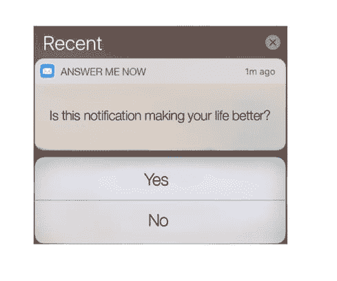

# 作为软件工程师，我们如何有所作为

> 原文：<https://dev.to/amandasopkin/how-we-can-make-a-difference-as-software-engineers-2di>

[T2】](https://res.cloudinary.com/practicaldev/image/fetch/s--dO3mI7k8--/c_limit%2Cf_auto%2Cfl_progressive%2Cq_auto%2Cw_880/https://thepracticaldev.s3.amazonaws.com/i/klspa1bw655jp38qyx9d.png)

随着假期又一次来临，在世界上做好事的想法一直在我的脑海里。小时候，我们很多人谈论改变世界。当我年轻的时候，在不同的年龄，我梦想着拜访新的星球，发现治疗癌症的新方法，发明新的谷物等等。

最终这些抱负变得更加具体，但即使在大学里，“做好事”的想法也很容易理解。无数的学校组织谈论通过年度筹款或项目来改善世界的方法。在一个普通的周四，人们会边喝啤酒边讨论如何让世界变得更美好。充满潜力，生活在一个充满新思想的环境中，行善的想法在当时似乎很容易。

[T2】](https://res.cloudinary.com/practicaldev/image/fetch/s--gVEzSurn--/c_limit%2Cf_auto%2Cfl_progressive%2Cq_66%2Cw_880/https://thepracticaldev.s3.amazonaws.com/i/48arrt6ma89df5x85mee.gif)

对一个典型的 7 岁孩子来说，似乎没有什么是力所不及的。
*来源:吉菲*

作为一个成年人，更难与这种思路保持联系。我们在日复一日的追逐升职、找房子和其他世俗的野心中迷失，很容易迷失我们最终的“做好事/有所作为”的目标。尽管如此，做好事还是有很多不同的方式——几乎不计其数。他们中的许多人可能不是最初会想到的。我将在这里讨论几种不同的心态。

你可能意识到志愿服务和捐钱是为社会做贡献的积极方式。这些实践的好处(个人的和社会的)是有据可查的。这篇文章将讨论如何在工作中有所作为——包括你发布的代码和你的个人互动。

### 做好代码(即使你没有为和平队编程)

Liquid error:内部 *Tweet 总结了在#Alterconf* 的一次演讲

随着科技行业的持续繁荣，软件行业越来越受欢迎。除了高薪和福利等显而易见的额外待遇，大多数科技公司都将“做好事”和“产生影响”的能力作为工作的一部分。这是一个有点新的概念。据《大西洋月刊》报道:当被问及第一份工作最关心的问题时，64%的婴儿潮一代美国人提到了挣更多钱或学习新技能的愿望。另一方面，年轻一代中有 57%的美国人表示渴望做一些他们觉得有趣的事情或改变社会。随着越来越多的公司开始关注他们的核心价值观，强调做好事的重要性，我们对工作场所的期望不仅仅是谋生的方式。

有时工作中的“影响”很容易被证明是正当的——就像一个团队正在帮助为和平队团队提供技术。但是对我们中的许多人来说，找到我们在工作中做的“好事”要复杂得多。大多数软件工程师使他们的产品迎合用户，并且大多数有实际用户的产品满足一些需求——所以有“目的”无论目的是帮助饥饿的游客找到一家好餐馆，还是提供一种方式让人们轻松地将第三间卧室出租给游客，都不难将这种“需要”转化为“目的”。作为一名房地产网站的软件工程师，我专注于为寻找公寓的人提供解决方案，我自己也会在这个过程中欣赏这种公寓。但这就够了吗？

当我们在网站和移动应用上工作时，我们经常发现自己在思考让人们使用我们开发的技术的最佳方式。定期通知，每日电子邮件，任何旨在将用户捆绑到设备上的东西。但是这些诱人的分心会让你开始觉得恶心。让我的用户每天多拿几十次手机真的是“做好事”吗这真的能改善他们的生活吗？这有关系吗？

设计师 Joshua Mauldin 在他的作品[“推送通知:好的，坏的，你能不能不要这样做”](https://medium.com/cardinal-solutions/push-notifications-the-good-the-bad-and-the-wtf-could-u-not-b73d6b2c4f90)中写了一些让推送通知对用户更好的方法。这是一个很好的例子，说明像真实的人一样思考用户可以帮助改善用户的体验和生活。通过这种方式，我们不仅改进了我们的产品，还对他人产生了积极的影响。双重打击！

> 罗布德莱尼@罗布德莱尼我今天午饭吃的卷饼刚刚给我发来了推送通知。02:28AM-03 Sep 2014

*No one likes getting pulled out of something for an irrelevant notification*

而像“我让我的用户生活得更好了吗？”可能令人难以置信，但我们可以通过小事来衡量我们的影响。例如，修复一个 bug 或者提供一个有用的调度特性，可以让你的用户的生活变得不那么复杂。即使你每周只为每个用户节省 1 分钟，对于成千上万的用户来说，在他们的一生中，这很容易转化为几个小时。我认为这是一个明显的积极影响。

虽然思考我们的工作及其影响是必不可少的，但除了关注用户之外，还有许多不同的方式来获得工作的满足感。

### 做好管理者

许多经理开始工作是为了让他们的团队体验更好，并帮助他们成长、获得成功和快乐。从中不难看出“好”的一面。即使是在一个小圈子里，你的影响力也是让他们在工作中快乐和满足的关键。

事实上，有一个好经理可能是员工工作快乐的最大因素。《哈佛商业评论》引用的盖洛普题为《美国经理的现状》的报告发现，好经理和坏经理之间的差异可以解释员工敬业度差异的 70%。每两个人中就有一个人离开工作岗位是为了逃避一个糟糕的经理。更糟糕的是，对经理的不满甚至会蔓延到现实生活中，让员工整体压力更大。

将一位经理简单地分为“好”或“坏”无疑总是过于简单化。研究发现，与员工对经理的满意度最密切相关的三种行为是沟通、绩效管理实践以及相关经理的个人优势或技能。这些将在完整报告[中进一步记录，此处](https://hbr.org/2015/04/what-great-managers-do-to-engage-employees)。

为你的团队每周工作 40 多个小时创造尽可能好的环境是一项崇高的事业，也是对他人产生直接影响的最佳方式之一。对于我们这些不是经理的人来说，还有其他方法可以改变我们同事的生活。

### 作为团队成员做好事

我们的行为比我们想象的更直接地转化到我们的网络中。《华盛顿邮报》记录的一份报告在 20 多年的时间里调查了 4700 多人，并监测他们以及与他们相关的人(家人、朋友、同事等)的快乐程度。).研究发现，一个人的人际网络中只有一部分人的幸福感增加，这个人幸福感增加的可能性就会增加 8%到 34%。虽然仅仅“快乐”不是可行的建议，但这清楚地表明我们都可以对我们的网络产生重大影响。

《哈佛商业评论》上一篇关于工作场所能量的文章发现，工作中的积极互动会导致办公室整体能量的增加。我们大多数人可能在工作中有过让我们在一段时间内感到沮丧或慌乱的互动，并经历过让我们感到兴奋和充满活力的赞美或积极的互动。

特别是对于软件工程师来说，有很多方法可以对你的同事产生直接影响。Nadia Odunayo 的这次演讲描述了如何调节我们的交流，并在这个过程中让我们的同事受益。它详细介绍了软件工程师工作中的几个相关例子，包括代码审查。

我们很容易陷入循环，对同事漫不经心。毕竟，我们会在最低谷的时候与他们互动(喝咖啡之前，在截止日期之前，等等)。).然而，付出额外的努力来检查我们在工作中的互动不仅有利于我们与工作相关的目标，而且以一种非常真实的方式为他们的幸福做出贡献。

 
*咖啡*
*之前很难成为你命中注定的那个人来源:Giphy*

### 在软件工程社区做好事

作为一个整体，为软件工程师社区做贡献有很多机会。我们可以抽出时间来帮助指导学生(在学校和代码营)。许多工程师通过向他人提供有用的建议和指导来影响他人。

例如，软件工程师、作家和演说家 Alaina Kafkes 撰写技术文章，并就技术主题发表演讲，旨在提高理解困难概念的能力。她的动机是“(1)记得当我第一次学习编码时，学习曲线是多么陡峭，以及(2)对向新人介绍我可以沉迷几天的话题感到兴奋。”她的一篇关于动态编程的文章就是一个很好的例子。

我们可能很容易觉得自己没有足够的经验或知识来写或谈论某个特定的技术问题，但通常最近才开始理解某个主题的人是谈论它的最佳人选，因为他们对是什么使该主题变得困难有清晰的记忆和理解。

Kafkes“以小的方式(例如，写文档，领导头脑风暴)回报她的团队，因为我已经可以看到我的队友的支持对我的成长有多大的帮助。“即使为我们团队的成员提供额外的支持，使某个特定的流程变得简单，或者记录一个复杂的问题，也能让其他人的生活变得更轻松。

### 冲击是日常练习

“每天有 1440 分钟。这意味着我们每天有 1440 次机会产生积极影响。”莱斯·布朗

 
*我们也许不能拯救今天的世界，但我们可以让它变得更好*
*来源:反而祝福*

没有一种方法可以回报社会，也没有一种方法可以衡量一个人的影响力。我认识到，即使有时间坐下来思考我可以回报的方式也是一种奢侈，不应该被轻视。经常思考寻找满足感和帮助他人可以帮助我们在自己的小圈子里找到让他人生活得更好的新方法。但特别是在 2017 年这样的一年，最重要的事情是尝试。