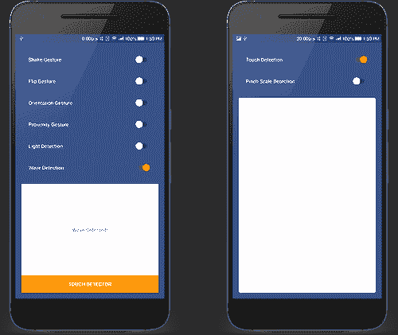

# 我找不到一个简单的手势检测 android 库，所以我建立了一个

> 原文：<https://dev.to/nisrulz/i-could-not-find-a-simple-gesture-detection-android-library-so-i-built-one>

*注:本帖原载于[媒体。](https://android.jlelse.eu/i-could-not-find-a-simple-gesture-detection-android-library-so-i-built-one-334c0a307c16)T3】*

在从事各种项目时，有时我不得不实现各种基于手势的事件。每次我不得不这样做的时候，我都不得不编写获取`SensorManager`和访问`SensorEvent`的完整代码，加上检测手势的额外逻辑。起初，这样做很好，因为那时我还是个初学者。然后很快我就厌倦了整个样板。大约在这个时候，我开始寻找一种类似 android 库的解决方案，它将帮助我避免所有的样板文件，并使我能够正确地维护我的代码。

### 问题

那么，手头的问题基本上是样板代码和维护您的代码的需要。跨项目复制代码并记住每个手势的逻辑注定会以某种形式的错误出现在其中一个项目中。毫无疑问，这是低效和重复的。我一直在寻找所有这些问题的解决方案，因为作为软件工程师，我们都在努力实现任务自动化或消除重复代码的需要。正如道格拉斯·克洛克福特所说

> "代码重用是软件工程的圣杯."

令人失望的是，现有的一切要么在实施方面过于复杂，要么非常有限。
**..就在那时，我决定编写自己的 Android 库，Sensey。**

[T2】](https://res.cloudinary.com/practicaldev/image/fetch/s--3Dku3o6V--/c_limit%2Cf_auto%2Cfl_progressive%2Cq_auto%2Cw_880/https://cdn-images-1.medium.com/max/2000/1%2AeQTvz7o0YIYTGgaW_VLOVA.png)

Sensey 诞生于一种需求，即能够让 android 中的手势检测尽可能简单。不是每个人都需要查 ***加速度计*** 的`x`、`y`、`z`值或者`Azimuth`、 ***方位传感器*** *的`Pitch`和`Roll`值。还有一些开发者只想检测某个手势是否被检测到(句号)。

因此，当我开始构建 **Sensey** 时，我有一个非常明确的心态，我希望它完全是那么“简单、干净”。
当我第一次写 Sensey 的时候，它并不完美。但它对我来说很有用。由于我无法在第一时间为自己找到解决方案，我猜测(或假设)社区中至少有几个开发人员会和我一样，因此从一开始我就肯定会让它开源([你可以在 Github](https://github.com/nisrulz/sensey) 上查看)。

[T2】](https://res.cloudinary.com/practicaldev/image/fetch/s--osqmXmk6--/c_limit%2Cf_auto%2Cfl_progressive%2Cq_auto%2Cw_880/https://cdn-images-1.medium.com/max/800/1%2A4dHLn1anDpZ_PKLulYI5dQ.png)

我最近发布了 **Sensey** 的版本`1.6.0`，你可以看出它已经比版本`1.0`有了很大的进步。让我们来看看集成 Sensey 的过程。将 Sensey 集成到您当前的 android 项目中非常简单。

只需将下面的代码添加到 build.gradle 文件

```
compile 'com.github.nisrulz:sensey:1.6.0' 
```

Enter fullscreen mode Exit fullscreen mode

..同步你的 gradle，然后在你的活动中初始化 Sensey

```
Sensey.getInstance().init(context); 
```

Enter fullscreen mode Exit fullscreen mode

就是这样！Sensey 在这一点上是集成到你的应用程序。现在，根据你想要检测的手势类型，你需要启动和停止 Sensey 提供的检测器。

举个简单的例子，如果我们想检测一个摇动手势。你需要做的就是

*   创建 ShakeListener 的实例

```
ShakeDetector.ShakeListener shakeListener=new ShakeDetector.ShakeListener() {
    @Override public void onShakeDetected() {
       // Shake detected, do something
   }
   @Override public void onShakeStopped() {
       // Shake stopped, do something
   }
}; 
```

Enter fullscreen mode Exit fullscreen mode

现在开始监听摇动手势，将实例`shakeListener`传递给`startShakeDetection()`函数

```
Sensey.getInstance().startShakeDetection(shakeListener); 
```

Enter fullscreen mode Exit fullscreen mode

要停止监听摇动手势，将实例`shakeListener`传递给`stopShakeDetection()`函数

```
Sensey.getInstance().stopShakeDetection(shakeListener); 
```

Enter fullscreen mode Exit fullscreen mode

是的，这就是知道一个摇动手势是否被执行以及何时停止的全部信息。

让我们来看看 Sensey 提供的手势检测器的完整列表

#### 翻转探测器

Sensey 可以检测您的设备是朝上还是朝下。点击查看实现[。](https://github.com/nisrulz/sensey/wiki/Usage#flip)

#### 光探测器

Sensey 可以检测您的设备是否处于接收光线的位置。点击查看实现

#### 方位探测器

Sensey 可以检测您的设备的顶部是向上还是底部向上。它可以告诉你的设备是左边朝上还是右边朝上。点击查看实现[。](https://github.com/nisrulz/sensey/wiki/Usage#orientation)

#### 近程探测器

Sensey 可以检测设备附近是否有物体，即物体离设备是远还是近。点击查看实现[。](https://github.com/nisrulz/sensey/wiki/Usage#proximity)

#### 摇动探测器

检测在设备上执行的摇动手势，以及手势停止的时间。点击查看实现[。](https://github.com/nisrulz/sensey/wiki/Usage#shake)

#### 检波器

这是一个简单的实现。它使用带有计时功能的接近传感器来检测设备屏幕前是否有手势。点击查看实现[。](https://github.com/nisrulz/sensey/wiki/Usage#wave)

#### 斩波检测器

在版本 1.6.0 中添加的这个是全新的。它允许您检测设备是否执行了斩击手势。点击查看实现[。](https://github.com/nisrulz/sensey/wiki/Usage#chop)

#### 手腕扭动检测器

在版本 1.6.0 中添加的这是另一个全新的检测器。这个可以让你在拿着设备的时候检测到手腕是否以环形方式扭曲。点击查看实现[。](https://github.com/nisrulz/sensey/wiki/Usage#wristtwist)

#### 运动探测器

另一个全新的检测器在版本 1.6.0 中添加，它允许您知道设备是否被移动过。一旦移动，它还将检测设备何时变得静止。点击查看实现[。](https://github.com/nisrulz/sensey/wiki/Usage#movement)

#### 声级计

版本 1.6.0 中添加了另一个全新的检测器，它允许您测量设备周围环境中的声音响度(以 dB 为单位计算，即分贝)。点击查看实现[。](https://github.com/nisrulz/sensey/wiki/Usage#soundlevel)

#### 捏秤检测器

Sensey 可以使用该检测器来了解用户是否正在触摸屏上执行缩放手势。它还能够检测缩放手势何时停止。点击查看实现[。](https://github.com/nisrulz/sensey/wiki/Usage#pinchscale)

#### 触摸式探测器

这个可以做很多事情，你可以选择用哪个或者不用哪个。当有人在设备屏幕上执行以下操作时，它可以进行检测:

*   单抽头
*   双击
*   双指敲击
*   三指轻敲
*   向上、向下、向左或向右滚动
*   向左或向右滑动
*   商标出版社

点击查看实现[。](https://github.com/nisrulz/sensey/wiki/Usage#touchtype)

唷！这是一个 android 库中包含的大量手势检测器。当更多的手势在未来的版本中实现时，这个列表还会继续增长。尽管核心焦点总是保持不变，

> 简单胜于复杂，易于使用。

### 是谁的

对于那些只想检测手势事件的人来说。

### 不为谁

对于任何希望获得更多进展并希望利用原始 SensorEvent 值的人。

也就是说，android 库并不完美，如果你能试用它并在 Github 上提交[问题](https://github.com/nisrulz/sensey/issues)以使它变得更好，我会很高兴。

[在 Github 上查看 Sensey(发现有用就开始回购)](https://github.com/nisrulz/sensey)

如果你有建议，请在评论区告诉我。

检查我的 [Github](https://github.com/nisrulz) 或者简单地在 [Twitter](https://twitter.com/nisrulz) 上关注我，继续粉碎代码！ðŸ " ðŸ˜