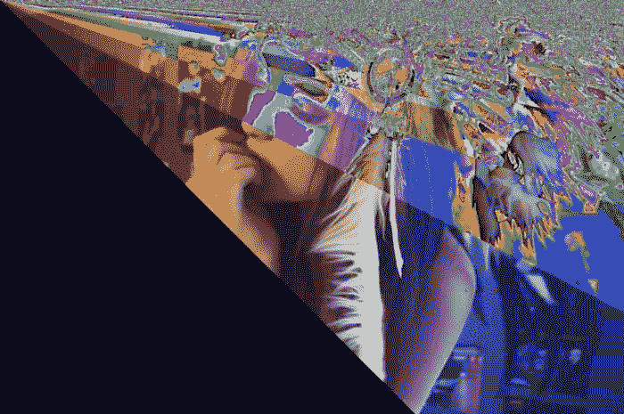
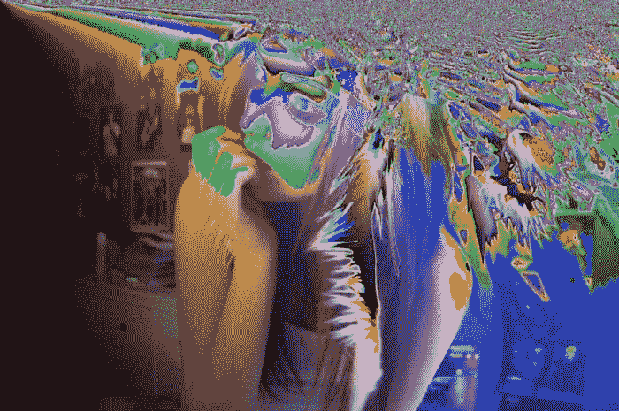
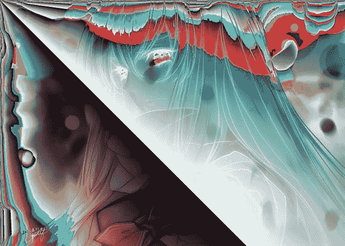
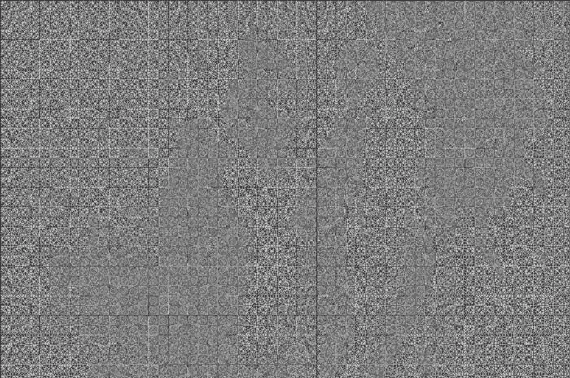
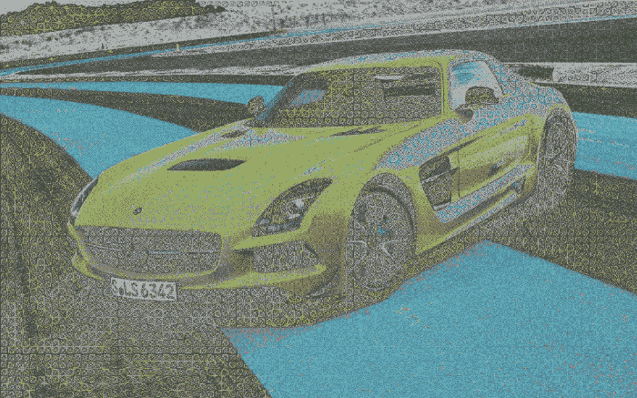

# 影像学实验#6

> 原文：<https://dev.to/senior_sigan/imagemagick-6-38m3>

今天是很长的一天。因此，为了保持自己的状态，我写了下面的照片失真剧本。很多“实物”转换又在等着你。我希望我能想出一个办法。所以，今天排队——将函数从坐标应用到信道饱和度。谁想看？我在里面弄了一个函数指针阵列。图片下面的描述。

# X/Y

通道值* (x/y)。只是这里没问题。我没有消化到 float，所以可以看到尖锐的分离界限。

<figure>

[T2】](https://res.cloudinary.com/practicaldev/image/fetch/s--ydijyJTF--/c_limit%2Cf_auto%2Cfl_progressive%2Cq_auto%2Cw_880/https://dev-to-uploads.s3.amazonaws.com/i/gn61wklfmmftg3ep5atf.jpeg)

<figcaption>(int)(x/y)</figcaption>

</figure>

现在顺利使用 x/y。

<figure>

[T2】](https://res.cloudinary.com/practicaldev/image/fetch/s--aOkdm6z_--/c_limit%2Cf_auto%2Cfl_progressive%2Cq_auto%2Cw_880/https://dev-to-uploads.s3.amazonaws.com/i/c342x0p7a7z3kc62s79p.jpeg)

<figcaption>(float)(x/y)</figcaption>

</figure>

# t0t 1 对数

坐标乘积的对数。在我看来，这是最有趣的结果。

<figure>

[T2】](https://res.cloudinary.com/practicaldev/image/fetch/s--mdNYH_9Y--/c_limit%2Cf_auto%2Cfl_progressive%2Cq_auto%2Cw_880/https://dev-to-uploads.s3.amazonaws.com/i/n6v3rsl1vvo00ji4oqf9.jpeg)

<figcaption>log(x*y)</figcaption>

</figure>

如果你拿的是 log(x/y)呢？

<figure>

[T2】](https://res.cloudinary.com/practicaldev/image/fetch/s--IQ1bviOi--/c_limit%2Cf_auto%2Cfl_progressive%2Cq_auto%2Cw_880/https://dev-to-uploads.s3.amazonaws.com/i/3gfyi9wnv7z6dwhif365.jpeg)

<figcaption>log(x/y)</figcaption>

</figure>

再来一份。(加入。时间——两年后，我记不起这是什么功能了。xyyx 文件的名称。）

<figure>

[T2】](https://res.cloudinary.com/practicaldev/image/fetch/s--uXvdzPyy--/c_limit%2Cf_auto%2Cfl_progressive%2Cq_auto%2Cw_880/https://dev-to-uploads.s3.amazonaws.com/i/0ndg0khoqxeudglswu9j.jpeg)

<figcaption>xyyx</figcaption>

</figure>

# 罪恶

Quant*sin(x*y)。建议打开原稿，拉近距离。表演很奇怪。

<figure>

[T2】](https://res.cloudinary.com/practicaldev/image/fetch/s--CUTSyfxx--/c_limit%2Cf_auto%2Cfl_progressive%2Cq_auto%2Cw_880/https://dev-to-uploads.s3.amazonaws.com/i/wjjzi8e8uo52qqic5yco.jpeg)

<figcaption>Quant*sin(x*y)</figcaption>

</figure>

也是正弦，但系数较弱。

[T2】](https://res.cloudinary.com/practicaldev/image/fetch/s--qlHYPpt5--/c_limit%2Cf_auto%2Cfl_progressive%2Cq_auto%2Cw_880/https://dev-to-uploads.s3.amazonaws.com/i/dv0ospy750vqf5vs8stp.jpeg)

在下一个系列中，我将展示如果不是改变像素的颜色，而是改变像素的位置会怎么样。

# t 0t 1 源

[https://github . com/senior-sigan/magick/blob/master/function . h](https://github.com/senior-sigan/magick/blob/master/function.h)