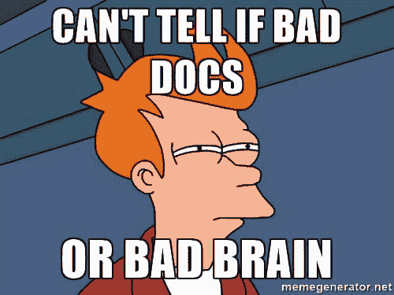

# 以防你错过:过去一周(2017 年 5 月 29 日至 6 月 4 日)最受欢迎的开发人员帖子

> 原文：<https://dev.to/thepracticaldev/in-case-you-missed-it-the-most-popular-dev-posts-from-the-past-week-may-29---june-4-2017>

每周一我们都会收集一些上周的热门帖子、评论和推文。如果您有任何反馈，请留下评论。安

# 感觉很疯狂

[T2】](https://i.giphy.com/media/ugTcpVtsc3gVa/giphy.gif)

For 循环是编程中的一个基本概念。许多开发人员可能记得在他们学习如何编码的最初几个小时里第一次遇到他们。但是我们总是以最有效的方式使用它们吗？丹·霍莫拉总结了如何在不同的场景下执行一个紧密的 for 循环:

 [## 不要支付循环税

### 丹霍莫拉 6 月 3 日 176 分钟阅读

#javascript #bestpractices #loops](/danhomola/dont-pay-the-for-looptax)

当然，这不是处理循环的唯一方法:

> The Practical Dev[@ thepractical Dev](https://dev.to/thepracticaldev)不要担心无限循环，程序最终会崩溃。2017 年 3 月 29 日下午 23:53

* * *

# 保存体力

[T2】](https://i.giphy.com/media/3o6Zt6g9GHo3Uxaotq/giphy.gif)

软件工程就像其他工作一样，很容易让你筋疲力尽。幸运的是，莫兰·达涅利·科恩有一些策略可以消除这种可怕的疲惫感。

 [## 软件工程师在工作中保持高能量水平的 3 种有效方法

### Moran Danieli-Cohen 2 月 6 日 174 分钟阅读

#softwaredevelopment #personaldevelopment](/msscohen/3-effective-ways-to-maintain-high-energy-levels-at-work-for-software-engineers)

有时候，解决办法很简单，只要确保你每天依赖的物品不会变得太破旧，就像评论中提到的那样:

 [ Mark Piffer ](/jasogamol) • [<time datetime="2017-05-29T15:22:39Z"> May 29 '17 </time>](https://dev.to/jasogamol/comment/8i0) 

有趣的是，你没有推荐最基本的工艺规则:检查(并在必要时更换)你使用的工具。我说的“工具”是指工具！你的键盘，你的鼠标，你的显示器，你的椅子，你的桌子。

虽然以上都不会给你一个突破，就像一个神照耀的超级多产的早晨一样，但它们的影响将会很小，但在一年中是恒定的，并且评估它们的适用性几乎不需要任何技术技能。只是愿意为质量买单——这也正是你想从顾客那里得到的。

* * *

# 机器学习学习

[T2】](https://i.giphy.com/media/EnGbOzsuBy2Ry/giphy.gif)

如今，除非你每天至少几次提到机器学习，否则你就不是真正的程序员。但是你真的了解现代预测建模的来龙去脉吗？Kasper Fredenslund 使用著名的 iris 数据集向我们展示了一些基础知识:

## 文章不再可用

* * *

# 死到临头

[T2】](https://i.giphy.com/media/3o7btYPy2NvzXX0ZmE/giphy.gif)

几乎每个公司都以某种形式使用截止日期来让员工专注于手头的任务。但是如果他们让程序员为了跟上进度而写糟糕的代码，那么他们真的是在伤害整个团队。Jolas Ladis Las 讨论:

## 文章不再可用

如果你要错过最后期限了，最好诚实和沟通:

 [ Abhilash Anandan ](/thewebappguy) • [<time datetime="2017-06-04T05:06:12Z"> Jun 4 '17 </time>](https://dev.to/thewebappguy/comment/940) 

错过截止日期是可以接受的，只要提前足够的时间与经理沟通以便采取措施。

* * *

# 至理名言

[T2】](https://i.giphy.com/media/3o7buekRiTqbCEMyis/giphy.gif)

人们如此强调将计算机科学嵌入到我们孩子的课程中，并确保下一代能够编码，以至于有时我们可能会忘记很多人已经做了一段时间的软件工程。Ben Hilburn 讨论了他所认为的“高级”工程师的职责:

 [## 论高级工程师

### 本·希尔伯恩 5 月 31 日 173 分钟阅读

#management #engineering #career](/bhilburn/on-senior-engineers)

他列出的十条核心原则广受欢迎，但也启发了评论者补充道:

 [ Antonio Cangiano ](/acangiano) • [<time datetime="2017-06-01T00:25:46Z"> Jun 1 '17 </time> • Edited  on <time datetime="2017-06-01T00:26:14Z"> Jun 1</time>](https://dev.to/acangiano/comment/8nk) 

与约翰的 9 和 10 有关:

11)成熟的工程师鼓励多元化。人、想法和观点。

* * *

# 少管闲事

[T2】](https://i.giphy.com/media/xTiTnJxChUjF4u958A/giphy.gif)

大多数 dev.to 帖子关注的是编写和部署优秀软件的实际机制，但是程序员的生活当然也有非技术性的方面，尤其是如果你想开一家公司的话。莫·比塔尔为那些想自己创业的人列出了一些关键的考虑因素:

 [## 2017 年以开发者身份创业

### 莫比塔尔 5 月 31 日 174 分钟阅读

#startup #marketing](/bitario/starting-a-business-as-a-developer-in-2017)

* * *

# 不要过度使用文档

[T2】](https://i.giphy.com/media/hYrwRki5WYoZW/giphy.gif)

文档并不是程序员职责中最令人兴奋的部分，但它肯定是 dev.to 社区经常涉及的一项重要任务。上周，Tanja Lichtensteiger 谈到了她在文档方面的极简主义方法:

 [## 不要淹没在文档中

### Tanja 最亮眼的君 4 ' 17 " 3 分钟读

#documentation #softwaredevelopment #bestpractice](/grappleshark/enough-with-documentation)

不管你是否同意她的立场，在起草你的文件时要小心。否则你的用户可能会有这样的感觉:

> 实用 Dev[@ thepracticaldev](https://dev.to/thepracticaldev)当我看不懂文档21:09PM-2016 年 11 月 18 日

我们的每周总结到此结束！请关注 Dev.to 本周的每日内容和讨论...如果您遗漏了任何内容，我们将在下周一进行回顾！