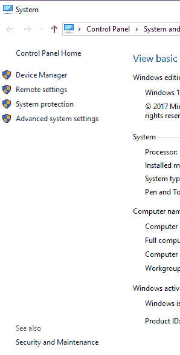
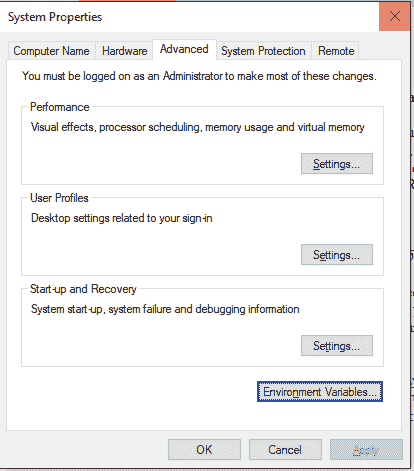
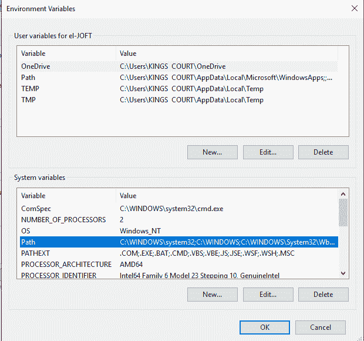
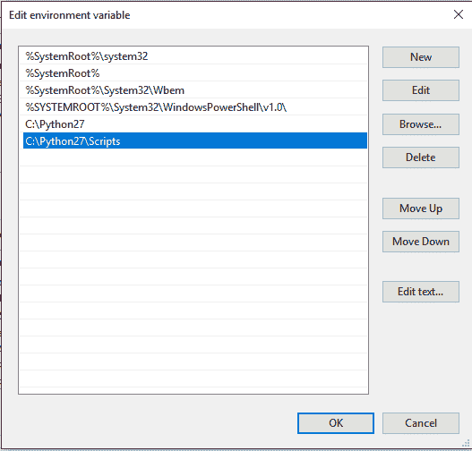

# 如何安装 pip 在 Windows 上安装 pip

> 原文：<https://dev.to/el_joft/installing-pip-on-windows>

**注意:**“python 的最新版本带有 pip，但旧版本必须由用户安装。”

在您的计算机上安装 pip 之前，请确保您的计算机上已经安装了 python。您可以通过在 windows 7 中使用搜索打开 Windows 上的命令提示符终端(CMD)来验证这一点。然后单击命令提示符搜索结果。

对于 Windows 8.1，切换到开始屏幕并键入 command 或 cmd。
在 Windows 10 中，可以使用 Cortana 进行搜索，并启动命令提示终端。在 Cortana 的搜索栏中，输入 command 或 cmd。然后单击或点击命令提示符结果。

另一种启动命令提示符的方法是使用键盘上的运行窗口(按 Win+R ),键入 CMD，按 enter 或 OK 打开它。

在命令提示符终端中，键入

> 大蟒

你得到的应该是这样的:

> python 2 . 7 . 13(v 2 . 7 . 13:a 06454 B1 AFA 1，2016 年 12 月 17 日，20:42:59) [MSC v.1500 32 位(英特尔)]在 win32
> 上键入“帮助”、“版权”、“信用”或“许可证”以了解更多信息。

如果您收到这样的错误消息:

> python 不被识别为内部或外部命令、可操作程序或批处理文件。

这意味着您的计算机上没有安装 python，或者 python 可能没有保存在您的计算机的 path 环境变量中，因此，如果不经常引用完整的安装路径名，您将无法从任何位置运行 Python。请务必查看我关于如何在 windows 上安装 python 的文章。

要安装 pip，请通过将 **get-pip.py** 下载到您电脑上的一个目录中。

**注意:**您的浏览器可能会为您打开代码，只需将 python 代码复制并粘贴到一个新的 python IDLE (GUI)中，然后将其保存为 **get-pip.py**

之后，在命令提示符窗口中导航到该目录并运行

> python get-pip.py。

要在命令提示符下验证安装是否成功，请导航到 C:\Python27\Scripts，然后运行

> pip 版本

您应该得到:

> *来自 c:\ python 27 \ lib \ site-packages(python 2.7)的 pip 9 . 0 . 1*

现在，您已经成功地在您的计算机上安装了 pip，但是还有一步要走！您需要将 pip 保存在 path 环境中，这样您就可以从任何位置运行 pip，而不必像之前在 ***c:\Python27\Scripts 中引用的那样不断引用完整的安装路径名。**T3】*

使用 windows 7 和 8 上的搜索，或 windows 10 中的 Cortana 来查找环境变量。另一种获取环境变量的方法是使用文件资源管理器并找到这台 PC。右键单击并选择属性，将打开如下所示的控制面板主页。点击**高级系统设置**。

[T2】](https://res.cloudinary.com/practicaldev/image/fetch/s--YNvgnqCq--/c_limit%2Cf_auto%2Cfl_progressive%2Cq_auto%2Cw_880/https://thepracticaldev.s3.amazonaws.com/i/3jiihwrn0mqu6s39i7yx.png)

当你点击编辑**系统环境变量**时，你应该看到:

当你点击**环境变量**，你会得到这样的东西:

找到名为 path 的系统变量，然后单击“编辑”。创建一个新变量，将 pip 安装目录 **C:\Python27\Scripts** 添加到新的环境变量中，然后单击 OK。
T3T5】

要验证新环境变量的创建，请打开 CMD 终端并运行以下命令:

> pip 版本

它将显示安装在您计算机上的 pip 版本，您应该会看到:

> 来自 c:\ python 27 \ lib \ site-packages(python 2.7)的 Pip 9.0.1。

**注意:**随着更新的进行，pip 安装的版本可能会随时间而变化。

最后，运行 pip freeze 来验证所有安装了 pip
的包，结果将是:

> *astroid = = 1 . 4 . 9
> autopep 8 = = 1 . 3 . 1
> backports . func tools-LRU-cache = = 1.3
> colorama = = 0 . 3 . 7
> config parser = = 3 . 5 . 0
> Django = = 1.8
> isort = = 4 . 2 . 5
> lazy-object-proxy = = 1 . 2 . 2
> McCabe = = 0 . 6 . 1
> py*

作者是蒂莫西·费欣托卢。
在推特上关注 [@el_joft](https://dev.to/el_joft)

如果你喜欢这篇文章，那么你可以给我买我的第一杯咖啡，先谢谢了。

[T2】](https://www.buymeacoffee.com/eljoft)