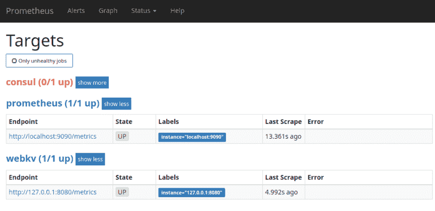
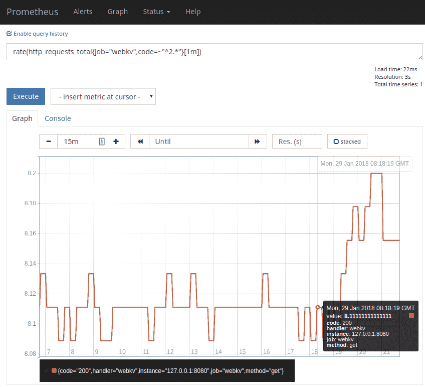
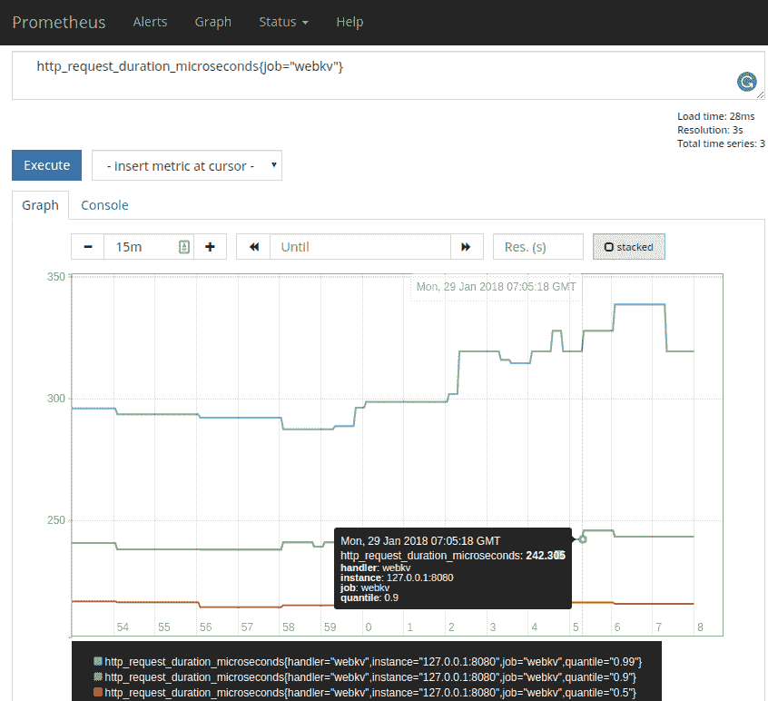
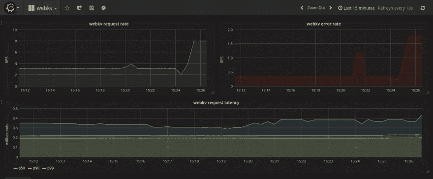

# 为普罗米修斯安装 Go 服务

> 原文：<https://dev.to/dzeban/instrumenting-a-go-service-for-prometheus-khp>

我是 DevOps 实践的大力支持者，并且一直热衷于操作我开发的东西。这就是为什么我对 DevOps、SRE、可观察性、服务发现和其他伟大的事情感到非常兴奋，我相信这些将把我们的行业转变为真正的软件工程。在这个博客中，我试图(在我做的其他很酷的事情中)分享一些例子，告诉你如何帮助你自己或你暴躁的运营人员运营你的服务。[上次](https://dev.to/blog/go-consul-service/)我们开发了一个典型的 web 服务，提供来自键值存储的数据，并在其中添加了 Consul 集成，用于服务发现。这一次，我们将对我们的代码进行监测。

## 为什么是仪器？

首先，您可能想知道为什么我们应该检测我们的代码，为什么不从外部收集监控所需的指标，就像安装 Zabbix 代理或设置 Nagios 检查一样？将监控目标视为黑盒的解决方案并没有什么问题。尽管有另一种方法可以做到这一点——白盒监控——在白盒监控中，您的服务作为工具本身提供了度量标准。这不仅仅是选择一种做事方式，这两种解决方案可以而且应该相互补充。例如，您可以将数据库服务器视为一个黑盒，提供可用内存等指标，同时检测数据库访问层来测量 DB 请求延迟。

这都是关于不同的观点，这在谷歌的 SRE 书中讨论过:

> 考虑黑盒监控与白盒监控的最简单方式是，黑盒监控是面向症状的，代表活跃的(而不是预测的)问题:“系统现在工作不正常。”白盒监控依赖于使用工具检查系统内部的能力，比如日志或 HTTP 端点。因此，白盒监控允许检测即将发生的问题、被重试掩盖的故障等等。…当收集遥测数据用于调试时，白盒监控是必不可少的。如果 web 服务器在处理大量数据库请求时显得很慢，您需要知道 web 服务器认为数据库有多快，以及数据库认为自己有多快。否则，您无法将实际上很慢的数据库服务器与 web 服务器和数据库之间的网络问题区分开来。

我的观点是，要获得系统的真正可观察性，您应该通过检测您的服务，用白盒来补充现有的黑盒监控。

## 什么仪器

现在，在我们确信仪器化是一件好事之后，让我们来考虑监控什么。很多人说您应该检测所有您能检测的东西，但是我认为这是过度工程化，您应该检测真正重要的东西，以避免代码库的复杂性和您的服务中不必要的 CPU 周期来收集膨胀的指标。

那么，我们应该探测哪些真正重要的事情呢？嗯，同一本 SRE 书中定义了所谓的**监控的四个黄金信号**:

*   流量或请求速率
*   错误
*   请求的延迟或持续时间
*   浸透

在这 4 个信号中，饱和度是最令人困惑的，因为不清楚如何测量它，或者它在软件系统中是否可能。我看到饱和主要是因为硬件资源，我不打算在这里介绍，查看 [Brendan Gregg 的使用方法](http://www.brendangregg.com/usemethod.html)了解这一点。

因为软件系统中的饱和度很难测量，所以有一个服务定制版本的 4 个黄金信号，称为[“红色方法”](https://www.weave.works/blog/the-red-method-key-metrics-for-microservices-architecture/)，它列出了 3 个指标:

*   请求速率
*   错误
*   **D** 持续时间(潜伏期)分布

这就是我们将在`webkv`服务中使用的工具。

我们将使用 Prometheus 来监控我们的服务，因为它是目前监控的首选工具，简单、易于设置且快速。我们将需要 [Prometheus Go 客户端库](https://godoc.org/github.com/prometheus/client_golang/prometheus)来检测我们的代码。

## 检测 HTTP 处理程序

Prometheus 的工作方式是从以简单的基于文本的公开格式提供指标的`/metrics` HTTP 处理程序中提取数据，因此我们需要计算红色指标，并通过专用端点将其导出。

幸运的是，所有这些指标都可以用一个`InstrumentHandler`助手轻松导出。

```
diff --git a/webkv.go b/webkv.go
index 94bd025..f43534f 100644 -------- a/webkv.go +++ b/webkv.go @@ -9,6 +9,7 @@ import (
        "strings"
        "time"

+       "github.com/prometheus/client_golang/prometheus"
        "github.com/prometheus/client_golang/prometheus/promhttp"

        "github.com/alexdzyoba/webkv/service"
@@ -32,7 +33,7 @@ func main() {
        if err != nil {
                log.Fatal(err)
        }
-       http.Handle("/", s) +       http.Handle("/", prometheus.InstrumentHandler("webkv", s))
        http.Handle("/metrics", promhttp.Handler())

        l := fmt.Sprintf(":%d", *port) 
```

Enter fullscreen mode Exit fullscreen mode

现在，要通过`/metrics`端点导出指标，只需添加另外两行:

```
diff --git a/webkv.go b/webkv.go
index 1b2a9d7..94bd025 100644 -------- a/webkv.go +++ b/webkv.go @@ -9,6 +9,8 @@ import (
        "strings"
        "time"

+       "github.com/prometheus/client_golang/prometheus/promhttp"
+
        "github.com/alexdzyoba/webkv/service"
 )

@@ -31,6 +33,7 @@ func main() {
                log.Fatal(err)
        }
        http.Handle("/", s)
+       http.Handle("/metrics", promhttp.Handler()) 
        l := fmt.Sprintf(":%d", *port)
        log.Print("Listening on ", l) 
```

Enter fullscreen mode Exit fullscreen mode

就是这样！

不，说真的，这就是让你的服务引人注目所需要做的。它是如此美好和容易，以至于你没有借口不去做它。

`InstrumentHandler`方便地包装您的处理程序并导出以下指标:

*   `http_request_duration_microseconds`汇总 50、90 和 99 个百分点
*   `http_request_size_bytes`汇总 50、90 和 99 个百分点
*   `http_response_size_bytes`汇总 50、90 和 99 个百分点
*   `http_requests_total`由状态代码和处理程序标记的计数器

还可以导出 Go 运行时信息，如一些 goroutines 和内存统计信息。

关键是您导出了简单的度量标准，可以很容易地在服务上进行计算，其他一切都是通过 Prometheus 及其强大的查询语言 PromQL 来完成的。

## 用普罗米修斯刮度量

现在你需要告诉普罗米修斯你的服务，这样它就会开始刮他们。我们可以用 [`static_configs`](https://prometheus.io/docs/prometheus/latest/configuration/configuration/#<static_config) 对端点进行硬编码，使其指向“localhost:8080”。但是还记得我们之前是如何在领事注册服务的吗？Prometheus 可以从 Consul 为我们的服务和任何其他服务发现抓取目标，只需一个作业定义:

```
- job_name: 'consul'
  consul_sd_configs:
    - server: 'localhost:8500'
  relabel_configs:
    - source_labels: [__meta_consul_service]
      target_label: job 
```

Enter fullscreen mode Exit fullscreen mode

这就是服务发现的真正魅力！你的行动伙伴会为此感谢你的:-)

(`relabel_configs`是必需的，因为否则所有服务都将作为`consul`被删除)

检查普罗米修斯识别新的目标:

[T2】](https://res.cloudinary.com/practicaldev/image/fetch/s--5pugoMEf--/c_limit%2Cf_auto%2Cfl_progressive%2Cq_auto%2Cw_880/https://alex.dzyoba.com/img/prometheus-consul-discovery.png)

耶！

## 红色法度量

现在让我们来计算红色方法的指标。第一个是请求速率，它可以通过`http_requests_total`度量来计算，如下所示:

```
rate(http_requests_total{job="webkv",code=~"^2.*"}[1m]) 
```

Enter fullscreen mode Exit fullscreen mode

我们过滤`webkv`作业的 HTTP 请求计数器和成功的 HTTP 状态代码，获取最近 1 分钟的值向量，然后获取一个比率，这基本上是第一个值和最后一个值之间的差。这为我们提供了在最后一分钟成功处理的请求数量。因为计数器在累积，所以即使一些刮擦失败，我们也不会错过值。

[T2】](https://res.cloudinary.com/practicaldev/image/fetch/s--Zz-17xBY--/c_limit%2Cf_auto%2Cfl_progressive%2Cq_auto%2Cw_880/https://alex.dzyoba.com/img/webkv-request-rate.png)

第二个是误差，我们可以根据与速率相同的指标来计算，但我们实际上想要的是误差的百分比。我是这么算的:

```
sum(rate(http_requests_total{job=“webkv”,code!~“^2.*“}[1m])) 
/ sum(rate(http_requests_total{job=“webkv”}[1m])) 
* 100 
```

Enter fullscreen mode Exit fullscreen mode

在这个错误查询中，我们计算了错误请求的比率，即没有 2xx 状态代码的请求。这将为每个状态代码提供多个系列，如 404 或 500，因此我们需要`sum`它们。接下来，我们做同样的`sum`和`rate`，但是对于所有的请求，不管它的状态如何，来获得总的请求率。最后，我们除以并乘以 100 得到一个百分比。

[T2】](https://res.cloudinary.com/practicaldev/image/fetch/s--yJKd4f8Q--/c_limit%2Cf_auto%2Cfl_progressive%2Cq_auto%2Cw_880/https://alex.dzyoba.com/img/webkv-errors.png)

最后，延迟分布直接取决于`http_request_duration_microseconds`指标:

```
http_request_duration_microseconds{job="webkv"} 
```

Enter fullscreen mode Exit fullscreen mode

[T2】](https://res.cloudinary.com/practicaldev/image/fetch/s--kpfAC4C7--/c_limit%2Cf_auto%2Cfl_progressive%2Cq_auto%2Cw_880/https://alex.dzyoba.com/img/webkv-latency.png)

这很简单，对于我的简单服务来说已经足够了。

如果您想为一些定制的指标进行检测，您可以很容易地做到。我将向您展示如何对来自`webkv`处理程序的 Redis 请求做同样的事情。这没有多大用处，因为普罗米修斯有一个专门的 [Redis 出口商](https://github.com/oliver006/redis_exporter)，但不管怎样，这只是为了说明。

## 定制指标的检测(Redis 请求)

正如您在前面几节中看到的，我们只需要两个指标就可以获得有意义的监控——一个用状态代码量化的 HTTP 请求的普通计数器和一个请求持续时间的[摘要](https://prometheus.io/docs/concepts/metric_types/)。

先从柜台说起。首先，为了让事情变得更好，我们用普罗米修斯`CounterVec`定义了一个新的类型`Metrics`，并将其添加到`Service`结构中:

```
-------- a/service/service.go +++ b/service/service.go @@ -13,6 +14,7 @@ type Service struct {
        Port        int
        RedisClient redis.UniversalClient
        ConsulAgent *consul.Agent
+       Metrics     Metrics
 }
+
+type Metrics struct {
+       RedisRequests *prometheus.CounterVec
+}
+ 
```

Enter fullscreen mode Exit fullscreen mode

接下来，我们必须注册我们的指标:

```
-------- a/service/service.go +++ b/service/service.go @@ -28,6 +30,15 @@ func New(addrs []string, ttl time.Duration, port int) (*Service, error) {
                Addrs: addrs,
        })

+       s.Metrics.RedisRequests = prometheus.NewCounterVec(
+               prometheus.CounterOpts{
+                       Name: "redis_requests_total",
+                       Help: "How many Redis requests processed, partitioned by status",
+               },
+               []string{"status"},
+       )
+       prometheus.MustRegister(s.Metrics.RedisRequests)
+
        ok, err := s.Check()
        if !ok {
                return nil, err 
```

Enter fullscreen mode Exit fullscreen mode

我们已经创建了一个`CounterVec`类型的变量，因为普通的`Counter`是针对单个时间序列的，并且我们有一个状态标签，这使得它成为时间序列的向量。

最后，我们需要根据状态递增计数器:

```
-------- a/service/redis.go +++ b/service/redis.go @@ -15,7 +15,9 @@ func (s *Service) ServeHTTP(w http.ResponseWriter, r *http.Request) {
        if err != nil {
                http.Error(w, "Key not found", http.StatusNotFound)
                status = 404
+               s.Metrics.RedisRequests.WithLabelValues("fail").Inc()
        }
+       s.Metrics.RedisRequests.WithLabelValues("success").Inc() 
        fmt.Fprint(w, val)
        log.Printf("url=\"%s\" remote=\"%s\" key=\"%s\" status=%d\n", 
```

Enter fullscreen mode Exit fullscreen mode

检查它的工作情况:

```
$ curl -s 'localhost:8080/metrics' | grep redis
# HELP redis_requests_total How many Redis requests processed, partitioned by status
# TYPE redis_requests_total counter
redis_requests_total{status="fail"} 904
redis_requests_total{status="success"} 5433 
```

Enter fullscreen mode Exit fullscreen mode

不错！

计算延迟分布稍微复杂一点，因为我们必须对请求进行计时，并将其放入分布桶中。还好有一个很好的`prometheus.Timer`帮手，帮忙测时间。至于分配桶，普罗米修斯有一个自动分配的`Summary`型。

好的，首先我们必须注册我们的新指标(将其添加到我们的`Metrics`类型中):

```
-------- a/service/service.go +++ b/service/service.go @@ -18,7 +18,8 @@ type Service struct {
 }

 type Metrics struct {
        RedisRequests  *prometheus.CounterVec
+       RedisDurations prometheus.Summary
 }

 func New(addrs []string, ttl time.Duration, port int) (*Service, error) {
@@ -39,6 +40,14 @@ func New(addrs []string, ttl time.Duration, port int) (*Service, error) {
        )
        prometheus.MustRegister(s.Metrics.RedisRequests)

+       s.Metrics.RedisDurations = prometheus.NewSummary(
+               prometheus.SummaryOpts{
+                       Name:       "redis_request_durations",
+                       Help:       "Redis requests latencies in seconds",
+                       Objectives: map[float64]float64{0.5: 0.05, 0.9: 0.01, 0.99: 0.001},
+               })
+       prometheus.MustRegister(s.Metrics.RedisDurations)
+
        ok, err := s.Check()
        if !ok {
                return nil, err 
```

Enter fullscreen mode Exit fullscreen mode

我们的新指标只是一个`Summary`，而不是一个`SummaryVec`，因为我们没有标签。我们定义了 3 个“目标”——基本上是计算分布的 3 个桶——50、90 和 99 个百分点。

下面是我们测量请求延迟的方法:

```
-------- a/service/redis.go +++ b/service/redis.go @@ -5,12 +5,18 @@ import (
        "log"
        "net/http"
        "strings"
+
+       "github.com/prometheus/client_golang/prometheus"
 )

 func (s *Service) ServeHTTP(w http.ResponseWriter, r *http.Request) {
    status := 200

    key := strings.Trim(r.URL.Path, "/")
+
+   timer := prometheus.NewTimer(s.Metrics.RedisDurations)
+   defer timer.ObserveDuration()
+
    val, err := s.RedisClient.Get(key).Result()
    if err != nil {
            http.Error(w, "Key not found", http.StatusNotFound)
            status = 404
            s.Metrics.RedisRequests.WithLabelValues("fail").Inc()
        }
    s.Metrics.RedisRequests.WithLabelValues("success").Inc()

    fmt.Fprint(w, val)
    log.Printf("url=\"%s\" remote=\"%s\" key=\"%s\" status=%d\n",
        r.URL, r.RemoteAddr, key, status)
} 
```

Enter fullscreen mode Exit fullscreen mode

是的，就这么简单。您只需创建一个新的计时器并推迟它的调用，这样它将在函数退出时被调用。虽然它会额外计算一个日志，但我对此没有意见。

默认情况下，此计时器以秒为单位测量时间。为了模仿`http_request_duration_microseconds`，我们可以实现`NewTimer`接受的`Observer`接口，以我们的方式进行计算:

```
-------- a/service/redis.go +++ b/service/redis.go @@ -14,7 +14,10 @@ func (s *Service) ServeHTTP(w http.ResponseWriter, r *http.Request) {

        key := strings.Trim(r.URL.Path, "/")

-       timer := prometheus.NewTimer(s.Metrics.RedisDurations)
+       timer := prometheus.NewTimer(prometheus.ObserverFunc(func(v float64) {
+               us := v * 1000000 // make microseconds
+               s.Metrics.RedisDurations.Observe(us)
+       }))
        defer timer.ObserveDuration()

        val, err := s.RedisClient.Get(key).Result()

-------- a/service/service.go
+++ b/service/service.go @@ -43,7 +43,7 @@ func New(addrs []string, ttl time.Duration, port int) (*Service, error) {
        s.Metrics.RedisDurations = prometheus.NewSummary(
                prometheus.SummaryOpts{
                        Name:       "redis_request_durations",
-                       Help:       "Redis requests latencies in seconds", +                       Help:       "Redis requests latencies in microseconds",
                        Objectives: map[float64]float64{0.5: 0.05, 0.9: 0.01, 0.99: 0.001},
                })
        prometheus.MustRegister(s.Metrics.RedisDurations) 
```

Enter fullscreen mode Exit fullscreen mode

就是这样！

```
$ curl -s 'localhost:8080/metrics' | grep -P '(redis.*durations)'
# HELP redis_request_durations Redis requests latencies in microseconds
# TYPE redis_request_durations summary
redis_request_durations{quantile="0.5"} 207.17399999999998
redis_request_durations{quantile="0.9"} 230.399
redis_request_durations{quantile="0.99"} 298.585
redis_request_durations_sum 3.290851703000006e+06
redis_request_durations_count 15728 
```

Enter fullscreen mode Exit fullscreen mode

现在，当我们有了漂亮的指标时，让我们为它们制作一个仪表板吧！

## Grafana 仪表盘

众所周知，一旦您有了 Prometheus，您最终将有 Grafana 来显示您的指标的仪表板，因为 Grafana 内置了对 Prometheus 作为数据源的支持。

在我的仪表板上，我刚刚把我们的红色指标和一些颜色。这是最终的仪表板:

[T2】](https://res.cloudinary.com/practicaldev/image/fetch/s--1n_BZyyh--/c_limit%2Cf_auto%2Cfl_progressive%2Cq_auto%2Cw_880/https://alex.dzyoba.com/img/webkv-dashboard.png)

请注意，对于延迟图，我为 0.5、0.9 和 0.99 分位数分别创建了 3 个系列，并将其除以 1000 得到毫秒值。

## 结论

这里没有魔法，使用 Prometheus 和 Grafana 这样的现代工具监控四个黄金信号或红色指标很容易，你真的需要它，因为没有它你会盲目飞行。所以下一次你开发任何服务的时候，只要添加一些工具就行了——友好一点，至少培养一些运营上的同情心。