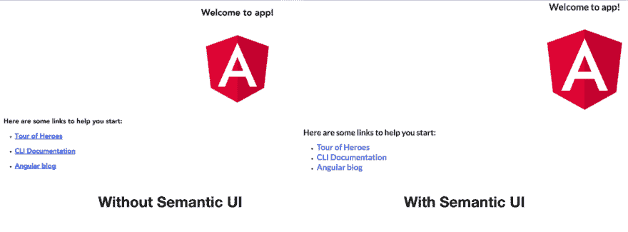

# 将语义 UI 集成到 Angular CLI 项目中

> 原文：<https://dev.to/chiangs/integrating-semantic-ui-to-an-angular-cli-project-20el>

### 我厌倦了 Bootstrap(好吧，我还是很爱它，经常用)。

我最近发现了语义 UI，到目前为止我很喜欢它。对于那些不熟悉语义 UI 的人来说，这是一个很像 Bootstrap 的样式框架。不同之处在于 Semantic 的类使用自然语言的语法，如名词/修饰语关系、词序和复数，来直观地链接概念。

因此，我现在正在研究它，并将其纳入我最新的 Angular CLI 项目中。你可以在这里查看他们的文档:[https://semantic-ui.com](https://semantic-ui.com/introduction/getting-started.html)

有几种方法可以包含它。最简单的方法是使用 CDN 或者只包含他们的 CSS 文件。这些选项的缺点是你只能使用它们的默认主题。通过用下面的方法安装语义 UI，您可以获得定制主题功能的全部力量。让我们开始吧。

### 你需要什么

*   节点. js
*   角度 CLI
*   语义用户界面
*   吞咽

### 安装

1.  Node.js

    前往 Node.js 网站:【https://nodejs.org/】

    确保你安装了 Node 6.9.0 或更高版本。

    打开一个终端，检查你的 npm 版本是 3.0.0 还是更高:`$ npm -v`。

    您也可以通过`$ node -v`检查您的节点版本。

2.  angular CLI & TypeScript
    T3】接下来安装 TypeScript(不需要，但是要用):`$ npm install -g typescript`。

    现在用`$ npm install -g @angular/cli`安装 Angular CLI。

3.  Gulp

    我们需要 Gulp 来构建我们语义 UI 主题的最终配置，所以我们来做一个 Gulp 的全局安装:

    `$ npm install --global gulp-cli`。

4.  语义 UI

    让我们从将语义 UI 安装到 Angular 项目中开始。

    如果您正在重新开始，使用 CLI 创建一个新的 Angular 项目:`$ ng new semanticui-angular-project`。

    `cd`进入你的项目的根目录，安装语义 UI: `$ npm install semantic-ui`。

    你会被提示几个问题，使用默认设置并安装到一个名为`semantic`的根文件夹中。

    [](https://res.cloudinary.com/practicaldev/image/fetch/s--RxUJSfqU--/c_limit%2Cf_auto%2Cfl_progressive%2Cq_auto%2Cw_880/https://i1.wp.com/www.chiangs.ninja/blog/wp-content/uploads/2017/10/Screen-Shot-2017-10-10-at-07.15.48.png%3Fresize%3D1170%252C165%26ssl%3D1)

接下来我们需要告诉项目包含`dist` CSS 和 JS 文件。你会注意到还没有一个`dist`文件夹。

你需要将`cd`放入`semantic`文件夹并运行`$ gulp build`。这将从`semantic/src/theme.config`获取默认配置，并将其构建到生产文件中。

您可以立即更新或定制构建。

接下来，打开你的`angular_cli.json`，你需要包含来自`dist`文件夹的 CSS 和 JS。

```
...
   "styles": [
        "../semantic/dist/semantic.min.css",
        "sass/styles.scss"
   ],
   "scripts": [
        "../semantic/dist/semantic.min.js"
   ],
... 
```

Enter fullscreen mode Exit fullscreen mode

此时，您可以运行您的项目了，您应该已经看到了一个细微的差别:

[](https://res.cloudinary.com/practicaldev/image/fetch/s--h47JjnVj--/c_limit%2Cf_auto%2Cfl_progressive%2Cq_auto%2Cw_880/https://i2.wp.com/www.chiangs.ninja/blog/wp-content/uploads/2017/10/Screen-Shot-2017-10-10-at-08.05.13.png%3Fresize%3D1170%252C432%26ssl%3D1)

从这里开始，您可以返回到`theme.config`文件并修改构建，但是我强烈建议您首先查看文档示例。在那之后，我通常会在`src/themes`中创建一个定制主题文件夹，从我想要使用/覆盖的各种主题中复制所有组件，然后将`theme.config`文件的相关部分更新为定制主题文件夹的名称。

只是不要忘记在您做出更改时再次运行`$ gulp build`！

所以你有它，玩得开心，请留下反馈或问题！