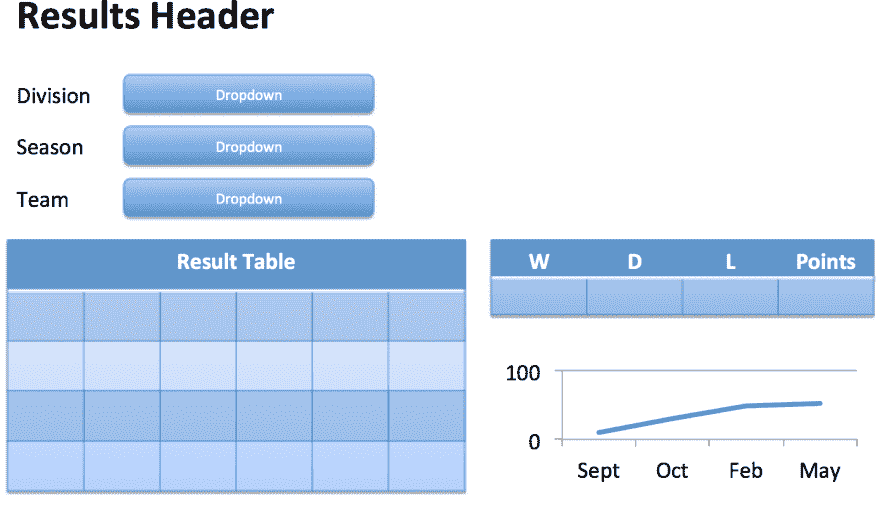
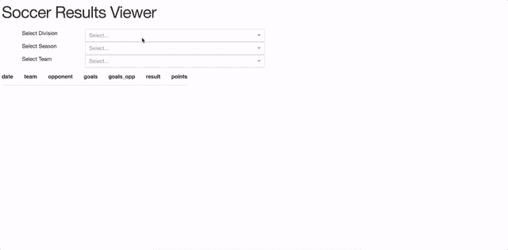

# Python 中基于 Web 的交互式仪表盘

> 原文：<https://dev.to/alysivji/interactive-web-based-dashboards-in-python-5hf>

*这篇[帖子](https://alysivji.github.io/reactive-dashboards-with-dash.html)最初发表于 [Siv 脚本](https://alysivji.github.io/)T5*

> #### [T2】总结](#summary)
> 
> *   Explore Plotly's new Dash library
> *   Discuss how to use MVC to build Dash application.
> *   Build interactive dashboards to show faster results in history.

* * *

我花了 2014-15 年的大部分时间学习 JavaScript，为一个工作项目创建基于网络的交互式仪表盘。我用[角度指令](https://angularjs.org/)包装了 [D3.js](https://d3js.org/) 来创建用于可视化数据的模块化组件。

数据分析不是 JavaScript 的强项之一；我的大部分代码试图用 JSON 数据拼凑出`DataFrame`式的操作。我错过了 r。我错过了 Python。我甚至想念 MATLAB。

几个月前，当我发现 Dash 时，我被震撼了。

有了 Dash，我们就可以用 **pure Python** 创建交互式的、基于 web 的仪表盘。所有的前端工作，所有可怕的 JavaScript，都不再是我们的问题了。

Dash 有多好用？大约一个小时后，使用 Docker Containers talk，通过<100 lines of code, I created a [仪表盘显示我的](https://github.com/alysivji/talks/blob/master/data-science-workflows-using-docker-containers/workflow3-data-driven-app/plot_timeseries.py)[数据科学工作流的实时流数据](http://bit.ly/siv-docker-for-data-science-chipy-talk)。

Dash 是一个强大的库，它简化了数据驱动应用程序的开发。Dash 让数据场景师成为[全栈开发者](http://www.laurencegellert.com/2012/08/what-is-a-full-stack-developer/)。

在本文中，我们将探索 Dash，讨论如何使用模型-视图-控制器模式来构建 Dash 应用程序，并构建一个仪表板来显示历史足球成绩。

* * *

## 仪表盘概述

> [Dash 是一个开源 Python 库，用于创建基于 Web 的反应式应用](https://medium.com/@plotlygraphs/introducing-dash-5ecf7191b503)

Dash 应用程序包含一个 Flask 服务器，它通过 HTTP 请求使用 JSON 包与前端 React 组件进行通信。

*这是什么意思？*我们可以运行 Flask 应用程序来创建一个带有仪表板的网页。浏览器中的交互可以调用代码来重新呈现页面的某些部分。

我们使用提供的 Python 接口来设计我们的应用程序布局，并支持组件之间的交互。用户交互触发 Python 函数；这些函数可以在将结果返回给指定组件之前执行任何操作。

Dash 应用程序是用 Python 写的。不需要 HTML 或 JavaScript。

我们还能够通过[包含的工具集](https://github.com/plotly/dash-components-archetype)将 React 组件打包成 Dash 可用的组件，从而插入 React 的[广泛生态系统](https://github.com/brillout/awesome-react-components)。

* * *

## Dash 应用程序设计:MVC 模式

当我浏览[文档](https://plot.ly/dash/)时，我一直注意到每个 Dash 应用程序都可以分为以下几个部分:

*   **数据操作** -执行读取/转换显示数据的操作
*   **仪表板布局** -直观地将数据呈现为输出表示
*   **组件之间的交互** -将用户输入转换为数据操作+渲染的命令

这就是模型-视图-控制器(MVC)模式的音乐！(注意:我在之前的一篇[文章](https://alysivji.github.io/flask-part2-building-a-flask-web-application.html#model-view-controller)中提到了 MVC)

设计 Dash 应用程序时，我们应该将代码分为三个部分:

1.  数据操作(模型)
2.  仪表板布局(视图)
3.  组件之间的交互(控制器)

我创建了下面的模板来帮助我们开始:

```
# standard library import os

# dash libs import dash
from dash.dependencies import Input, Output
import dash_core_components as dcc
import dash_html_components as html
import plotly.figure_factory as ff
import plotly.graph_objs as go

# pydata stack import pandas as pd
from sqlalchemy import create_engine

# set params conn = create_engine(os.environ['DB_URI'])

###########################
# Data Manipulation / Model
########################### 
def fetch_data(q):
    df = pd.read_sql(
        sql=q,
        con=conn
    )
    return df

#########################
# Dashboard Layout / View
######################### 
# Set up Dashboard and create layout app = dash.Dash()
app.css.append_css({
    "external_url": "https://codepen.io/chriddyp/pen/bWLwgP.css"
})

app.layout = html.Div([

    # Page Header
    html.Div([
        html.H1('Project Header')
    ]),

])

#############################################
# Interaction Between Components / Controller
############################################# 
# Template @app.callback(
    Output(component_id='selector-id', component_property='figure'),
    [
        Input(component_id='input-selector-id', component_property='value')
    ]
)
def ctrl_func(input_selection):
    return None

# start Flask server if __name__ == '__main__':
    app.run_server(
        debug=True,
        host='0.0.0.0',
        port=8050
    ) 
```

Enter fullscreen mode Exit fullscreen mode

* * *

## 历史对决仪表盘

在本节中，我们将创建一个全功能的 Dash 应用程序，用于查看历史足球数据。

我们将使用以下流程来创建/修改 Dash 应用程序:

1.  **创建/更新布局** -确定组件的放置位置
2.  **映射与其他组件的交互**——在回调装饰器中指定交互
3.  **连接数据模型** -连接交互和渲染的数据操作

* * *

### 设置环境和安装依赖项

仪表板文档中有[安装说明](https://plot.ly/dash/installation)。或者，我们可以创建一个`virtualenv`和`pip install`[需求文件](https://raw.githubusercontent.com/alysivji/historical-results-dashboard/master/requirements.txt)。

```
mkdir historical-results-dashboard && cd historical-results-dashboard
mkvirtualenv dash-app
wget https://raw.githubusercontent.com/alysivji/historical-results-dashboard/master/requirements.txt
pip install -r requirements.txt 
```

Enter fullscreen mode Exit fullscreen mode

数据存储在 SQLite 数据库:

```
wget https://github.com/alysivji/historical-results-dashboard/blob/master/soccer-stats.db?raw=true soccer-stats.db 
```

Enter fullscreen mode Exit fullscreen mode

从上面下载 Dash 应用程序模板文件:

```
wget https://gist.githubusercontent.com/alysivji/e85a04f3a9d84f6ce98c56f05858ecfb/raw/d7bfeb84e2c825cfb5d4feee15982c763651e72e/dash_app_template.py app.py 
```

Enter fullscreen mode Exit fullscreen mode

* * *

### 仪表盘布局(视图)

我们的 app 会是这样的:

[](https://res.cloudinary.com/practicaldev/image/fetch/s--6JtncyEI--/c_limit%2Cf_auto%2Cfl_progressive%2Cq_auto%2Cw_880/https://alysivji.github.img/11-20/11_dash_app_layout.png)

用户将能够通过下拉组件选择部门，赛季和球队。选择将触发更新表格(结果+赢/输/平局/点数摘要)和图表(累积点数对时间)的操作

我们首先将上面的布局翻译成 Dash 组件(需要两个[核心](https://github.com/plotly/dash-core-components) + [HTML](https://github.com/plotly/dash-html-components) 组件):

```
#########################
# Dashboard Layout / View
######################### 
def generate_table(dataframe, max_rows=10):
    '''Given dataframe, return template generated using Dash components
    '''
    return html.Table(
        # Header
        [html.Tr([html.Th(col) for col in dataframe.columns])] +

        # Body
        [html.Tr([
            html.Td(dataframe.iloc[i][col]) for col in dataframe.columns
        ]) for i in range(min(len(dataframe), max_rows))]
    )

def onLoad_division_options():
    '''Actions to perform upon initial page load'''

    division_options = (
        [{'label': division, 'value': division}
         for division in get_divisions()]
    )
    return division_options

# Set up Dashboard and create layout app = dash.Dash()
app.css.append_css({
    "external_url": "https://codepen.io/chriddyp/pen/bWLwgP.css"
})

app.layout = html.Div([

    # Page Header
    html.Div([
        html.H1('Soccer Results Viewer')
    ]),

    # Dropdown Grid
    html.Div([
        html.Div([
            # Select Division Dropdown
            html.Div([
                html.Div('Select Division', className='three columns'),
                html.Div(dcc.Dropdown(id='division-selector',
                                      options=onLoad_division_options()),
                         className='nine columns')
            ]),

            # Select Season Dropdown
            html.Div([
                html.Div('Select Season', className='three columns'),
                html.Div(dcc.Dropdown(id='season-selector'),
                         className='nine columns')
            ]),

            # Select Team Dropdown
            html.Div([
                html.Div('Select Team', className='three columns'),
                html.Div(dcc.Dropdown(id='team-selector'),
                         className='nine columns')
            ]),
        ], className='six columns'),

        # Empty
        html.Div(className='six columns'),
    ], className='twleve columns'),

    # Match Results Grid
    html.Div([

        # Match Results Table
        html.Div(
            html.Table(id='match-results'),
            className='six columns'
        ),

        # Season Summary Table and Graph
        html.Div([
            # summary table
            dcc.Graph(id='season-summary'),

            # graph
            dcc.Graph(id='season-graph')
            # style={}, 
        ], className='six columns')
    ]),
]) 
```

Enter fullscreen mode Exit fullscreen mode

##### 备注:

*   我们使用 HTML `<DIV>`元素和[破折号样式指南](https://codepen.io/chriddyp/pen/bWLwgP)来设计布局
*   表格有两种不同的呈现方式:[原生 HTML 或者 Plotly 表格](https://community.plot.ly/t/display-tables-in-dash/4707/13)
*   在本节中，我们只是对组件进行了线框化，数据将通过模型和控制器进行填充

* * *

### 部件间的相互作用(控制器)

一旦我们创建了我们的布局，我们将需要制定出各种组件之间的交互。我们使用提供的`app.callback()`装饰器来完成这项工作。

我们传递给装饰器的参数是:

*   输出组件+我们要更新的属性
*   可用于触发该功能的所有输入组件+属性的列表

我们的代码如下:

```
#############################################
# Interaction Between Components / Controller
############################################# 
# Load Seasons in Dropdown @app.callback(
    Output(component_id='season-selector', component_property='options'),
    [
        Input(component_id='division-selector', component_property='value')
    ]
)
def populate_season_selector(division):
    seasons = get_seasons(division)
    return [
        {'label': season, 'value': season}
        for season in seasons
    ]

# Load Teams into dropdown @app.callback(
    Output(component_id='team-selector', component_property='options'),
    [
        Input(component_id='division-selector', component_property='value'),
        Input(component_id='season-selector', component_property='value')
    ]
)
def populate_team_selector(division, season):
    teams = get_teams(division, season)
    return [
        {'label': team, 'value': team}
        for team in teams
    ]

# Load Match results @app.callback(
    Output(component_id='match-results', component_property='children'),
    [
        Input(component_id='division-selector', component_property='value'),
        Input(component_id='season-selector', component_property='value'),
        Input(component_id='team-selector', component_property='value')
    ]
)
def load_match_results(division, season, team):
    results = get_match_results(division, season, team)
    return generate_table(results, max_rows=50)

# Update Season Summary Table @app.callback(
    Output(component_id='season-summary', component_property='figure'),
    [
        Input(component_id='division-selector', component_property='value'),
        Input(component_id='season-selector', component_property='value'),
        Input(component_id='team-selector', component_property='value')
    ]
)
def load_season_summary(division, season, team):
    results = get_match_results(division, season, team)

    table = []
    if len(results) > 0:
        summary = calculate_season_summary(results)
        table = ff.create_table(summary)

    return table

# Update Season Point Graph @app.callback(
    Output(component_id='season-graph', component_property='figure'),
    [
        Input(component_id='division-selector', component_property='value'),
        Input(component_id='season-selector', component_property='value'),
        Input(component_id='team-selector', component_property='value')
    ]
)
def load_season_points_graph(division, season, team):
    results = get_match_results(division, season, team)

    figure = []
    if len(results) > 0:
        figure = draw_season_points_graph(results)

    return figure 
```

Enter fullscreen mode Exit fullscreen mode

##### 备注:

*   每个`app.callback()`装饰器可以绑定到一个输出`(component, property)`对
    *   我们需要创建额外的函数来改变多个输出组件
*   我们可以在这一部分添加数据操作代码，但是将应用程序分成组件会使其更容易使用

* * *

### (模型数据操作)

我们通过将模型连接到视图和控制器来完成仪表板:

```
###########################
# Data Manipulation / Model
########################### 
def fetch_data(q):
    result = pd.read_sql(
        sql=q,
        con=conn
    )
    return result

def get_divisions():
    '''Returns the list of divisions that are stored in the database'''

    division_query = (
        f'''
        SELECT DISTINCT division
        FROM results
        '''
    )
    divisions = fetch_data(division_query)
    divisions = list(divisions['division'].sort_values(ascending=True))
    return divisions

def get_seasons(division):
    '''Returns the seasons of the datbase store'''

    seasons_query = (
        f'''
        SELECT DISTINCT season
        FROM results
        WHERE division='{division}'
        '''
    )
    seasons = fetch_data(seasons_query)
    seasons = list(seasons['season'].sort_values(ascending=False))
    return seasons

def get_teams(division, season):
    '''Returns all teams playing in the division in the season'''

    teams_query = (
        f'''
        SELECT DISTINCT team
        FROM results
        WHERE division='{division}'
        AND season='{season}'
        '''
    )
    teams = fetch_data(teams_query)
    teams = list(teams['team'].sort_values(ascending=True))
    return teams

def get_match_results(division, season, team):
    '''Returns match results for the selected prompts'''

    results_query = (
        f'''
        SELECT date, team, opponent, goals, goals_opp, result, points
        FROM results
        WHERE division='{division}'
        AND season='{season}'
        AND team='{team}'
        ORDER BY date ASC
        '''
    )
    match_results = fetch_data(results_query)
    return match_results

def calculate_season_summary(results):
    record = results.groupby(by=['result'])['team'].count()
    summary = pd.DataFrame(
        data={
            'W': record['W'],
            'L': record['L'],
            'D': record['D'],
            'Points': results['points'].sum()
        },
        columns=['W', 'D', 'L', 'Points'],
        index=results['team'].unique(),
    )
    return summary

def draw_season_points_graph(results):
    dates = results['date']
    points = results['points'].cumsum()

    figure = go.Figure(
        data=[
            go.Scatter(x=dates, y=points, mode='lines+markers')
        ],
        layout=go.Layout(
            title='Points Accumulation',
            showlegend=False
        )
    )

    return figure 
```

Enter fullscreen mode Exit fullscreen mode

##### 备注:

*   每次有交互时，都会从数据库中查询数据
    *   我们可以通过记忆来提高性能
*   我们在创建 SQL 查询时使用了 f 字符串。代码为 Python 3.6+版本

* * *

### 运行应用

让我们运行`app.py`来确保一切正常。

```
$  export DB_URI=sqlite:///soccer-stats.db
$  python app.py
* Running on http://0.0.0.0:8050/ (Press CTRL+C to quit)
* Restarting with stat 
```

Enter fullscreen mode Exit fullscreen mode

打开 web 浏览器...

[T4】](https://res.cloudinary.com/practicaldev/image/fetch/s--I1bDmvRs--/c_limit%2Cf_auto%2Cfl_progressive%2Cq_66%2Cw_880/https://thepracticaldev.s3.amazonaws.com/i/lpaqrtxoayai0k3fs8xj.gif)

我们准备好了！

* * *

## 结论

Dash 是一个 Python 库，它简化了数据驱动的 web 应用程序开发。它结合了 Python 强大的数据生态系统和 JavaScript 最流行的前端库之一( [React](https://facebook.github.io/react/) )。

在以后的文章中，我将介绍将来自 [npm](https://www.npmjs.com/) 的 React 组件转换成 Dash 可用组件的[过程。敬请关注。](https://github.com/plotly/dash-components-archetype)

* * *

#### 附加资源

*   [破折号公告信](https://medium.com/@plotlygraphs/introducing-dash-5ecf7191b503)
*   [仪表板文档](https://plot.ly/dash/)
*   SciPy talk:[Dash——为技术计算构建用户界面的新框架](https://www.youtube.com/watch?v=sea2K4AuPOk)
*   [破折号风格指南](https://codepen.io/chriddyp/pen/bWLwgP)
*   [仪表盘图库](https://plot.ly/dash/gallery)
*   [Plotly 文档](https://plot.ly/python/)
*   [牛逼破折号](https://github.com/Acrotrend/awesome-dash)