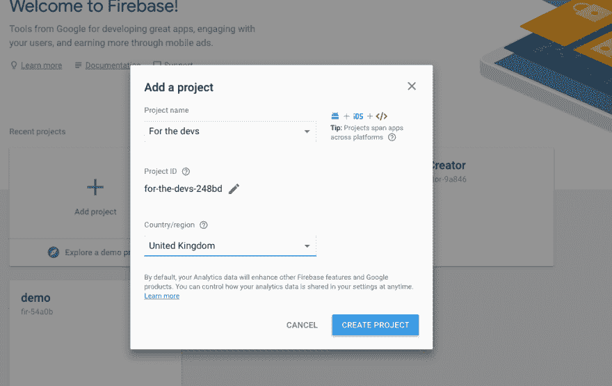
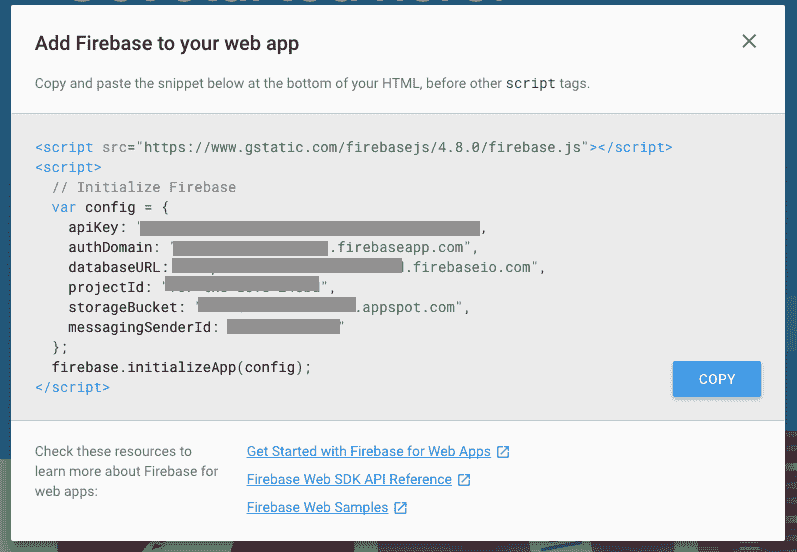
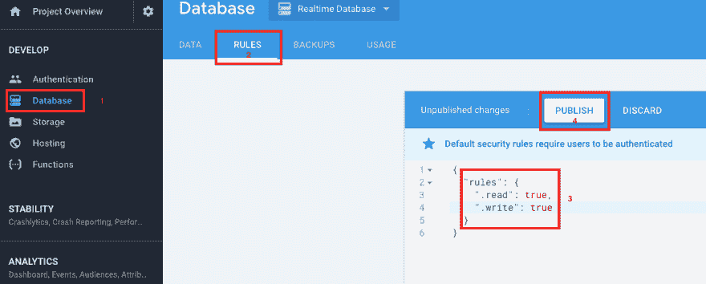

# firebase 实时数据库介绍

> 原文：<https://dev.to/aurelkurtula/introduction-to-firebases-real-time-database-89l>

Firebase 是一个平台，它为我们提供了许多通过简单的 SDK 公开的 google 云服务。提供的主要功能有:数据库、存储和身份验证。在本教程中，我将连接到一个数据库，并展示我们如何执行 CRUD 操作(即，我们如何创建、读取、修改和删除数据)。

让我们首先进入 firebase 控制台[console.firebase.google.com](https://console.firebase.google.com)(显然你必须登录你的谷歌账户)。然后只需点击“添加项目”，给你的项目一个名字，并创建项目。

[T2】](https://res.cloudinary.com/practicaldev/image/fetch/s--hlU7-s3T--/c_limit%2Cf_auto%2Cfl_progressive%2Cq_auto%2Cw_880/https://thepracticaldev.s3.amazonaws.com/i/hx7yx8i1rzupn6iq5w72.png)

在那之后，你会立即进入你的项目。正如你所看到的，你可以很容易地将这个项目链接到一个 iOS、Android 或 web 应用程序。我们将在客户端 JavaScript 中使用 firebase，因此点击“将 Firebase 添加到您的 web 应用程序中”

在那里，您可以获得连接到这个 firebase 项目所需的信息。

[T2】](https://res.cloudinary.com/practicaldev/image/fetch/s--L3u8nzxj--/c_limit%2Cf_auto%2Cfl_progressive%2Cq_auto%2Cw_880/https://thepracticaldev.s3.amazonaws.com/i/999xcvq5sbueiiu3ulhf.png)

我介绍了重要信息，主要是为了强调这些信息是私有的，我们今天处理这些数据的方式一点也不安全，但这是了解 firebase 如何工作的一个很好的方式。在后面的教程中，我们将介绍更安全的方法。

在开始编写代码之前，让我们确保能够在不需要身份验证的情况下读写数据库。**显然这是不好的做法，不应该在生产模式下进行**，但我们正在尝试。稍后将介绍身份验证

关闭上面的窗口，导航到数据库(位于左侧)，选择“实时数据库”，然后点击“规则”，然后只需将读写的`"auth != null"`更改为`true`，并选择发布。警告是合理的，但没关系。

[T2】](https://res.cloudinary.com/practicaldev/image/fetch/s--xMf_3yYo--/c_limit%2Cf_auto%2Cfl_progressive%2Cq_auto%2Cw_880/https://thepracticaldev.s3.amazonaws.com/i/hadrikd3k38q4ss6gj8f.png)

## 启动项目

我们将使用客户端 JavaScript。如果你想跟着做，你只需要一个`index.html`和一个`script.js`文件。将`script.js`文件和`firebase.js`文件(这是 firebase 自己指示我们做的)链接到 html 文件，如下所示:

```
<!DOCTYPE html>
<html lang="en">
<head>
  <meta charset="UTF-8">
  Playing with Firebase
  <script type="text/javascript" src="https://www.gstatic.com/firebasejs/4.8.0/firebase.js"></script>
</head>
<body>
  <script type="text/javascript" src="script.js"></script>
</body>
</html> 
```

Enter fullscreen mode Exit fullscreen mode

实际上，你可能有更多的 html，但这只是为了说明如何设置 firebase。在本教程中，我将说明如何在 firebase 中管理数据，在哪里放置结果由您决定。

我们将从粘贴上面 firebase 给我们的初始代码开始。

```
var config = {
  apiKey: "*******************",
  authDomain: "******.firebaseapp.com",
  databaseURL: "https://******.firebaseio.com",
  projectId: "******",
  storageBucket: "******.appspot.com",
  messagingSenderId: "***************"
};
firebase.initializeApp(config); 
```

Enter fullscreen mode Exit fullscreen mode

Firebase 给了我们一堆方法。值得注意的是，`auth()`，`database()`，`storage()`。所有这些都响应 Firebase 提供的服务。在本教程中，我们只处理数据库，所以让我们把它添加到代码中

```
const database = firebase.database() 
```

Enter fullscreen mode Exit fullscreen mode

### 写入数据库

我们正在处理一个非 sql 数据库。数据以 JSON 或 javaScript 对象的形式存储和组织。将下面的内容视为我们希望存储在数据库中的数据类型

```
{
  "items" : {
    "-L-stEfbU_e13v8dVUwe" : {
      "archived" : false,
      "completed" : false,
      "item" : "Get milk"
    }
  }
} 
```

Enter fullscreen mode Exit fullscreen mode

因此，我们希望将条目推入一个条目对象。如果你来自 SQL 背景，就把它想成；我们希望将数据推送到一个条目表中。

因此，我们需要指定保存数据的父属性的名称。我们这样做

```
const ref = database.ref('items'); 
```

Enter fullscreen mode Exit fullscreen mode

我们现在需要做的就是将`ref`视为一个容器，我们可以在其中添加或读取它的内容，所做的更改会反映到数据库中。

`database.ref('items')`返回一堆方法，其中一个是`push`，让我们使用它:

```
ref.push({
  item: "Get Milk",
  completed: false,
  archived: false
}) 
```

Enter fullscreen mode Exit fullscreen mode

我们的新对象立即被添加到数据库中的`items`对象中。Firebase 会自动为这个新对象创建一个惟一的标识符。

`push()`方法也返回一个对象，我们可以访问它，就像我们通常做的那样，通过将上面的方法附加到一个变量中

```
const result = ref.push({...}) 
```

Enter fullscreen mode Exit fullscreen mode

如果你控制`result`，你会看到我们能够使用像`catch`这样的方法来捕捉在将新对象推送到数据库时可能发生的任何错误，或者使用一个`then`方法来给我们机会在操作完成时做一些事情。我们还可以通过运行`result.key`来访问 firebase 自动生成的唯一标识符

## 读取数据

从数据库中读取有两种方法。有使用`once()`或`on()`的。顾名思义，`once()`读取数据一次，但不监听变化，而 as `on()`在每次数据变化时获取数据。

```
ref.on('value',callback(data)) 
```

Enter fullscreen mode Exit fullscreen mode

以完全相同的方式书写

```
ref.once('value',callback(data)) 
```

Enter fullscreen mode Exit fullscreen mode

`once()`和`on()`都观察事件。`value`是一个“[读取]和[监听]路径的整个内容的变化”——[docs](https://firebase.google.com/docs/database/web/read-and-write?authuser=0#listen_for_value_events)的事件。(内容路径是我们在`database.ref('items')`、`items`中指定的内容路径)

处理结果数据的方法有很多，其中之一就是遍历对象并将其注入 DOM。

```
let li = document.getElementById('items')
ref.on('value', function(data){
  let objKey = Object.keys(data.val());
  for(obj in objKey){
    let key = objKey[obj];
    li.innerHTML +=`
      <li>${data.val()[key].item}</li>
    `
  }
}) 
```

Enter fullscreen mode Exit fullscreen mode

## 更新数据

如上所述，我们添加到数据库中的每个对象都有一个新生成的标识符。为了更新这些对象中的一个，我们需要通过使用它的标识符来访问该对象，然后在其上调用一个`update()`方法。

```
ref.update({
  "-L-t-BeCnrFAfcrYLMjE" : {
    "archived" : false,
    "completed" : true,
    "item" : "Get milk"
  }
}) 
```

Enter fullscreen mode Exit fullscreen mode

显然，我们不需要像那样硬编码唯一标识符，但这就是对象更新的方式。

## 删除对象

移除对象非常容易。做这件事有多种方法。我们可以在引用想要删除的对象时调用`remove()`:

```
database.ref('items/-L-t-BeCnrFAfcrYLMjE').remove(); 
```

Enter fullscreen mode Exit fullscreen mode

或者我们可以使用 update 方法将对象“更新”到`null`，使其被移除

```
ref.update({ "-L-t-BeCnrFAfcrYLMjE" : null }) 
```

Enter fullscreen mode Exit fullscreen mode

## 
 [T3】
结论](#conclusion) 

这就是与 Firebase 实时数据库交互的基础。如果您在两个不同的浏览器中打开同一个应用程序，模拟不同的客户端，所有的数据库更改都会反映到所有的客户端，因此是实时的。

接下来，[阅读教程](https://dev.to/aurelkurtula/introduction-to-firebases-storage-e12)了解如何使用 firebase 的存储服务管理您的资产文件