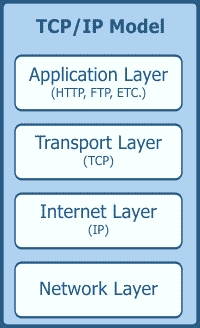
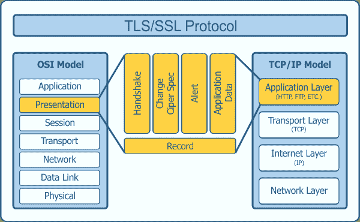

# MicroPython 中基于 SSL/TLS 的物联网安全

> 原文：<https://dev.to/kenwalger/iot-security-with-ssltls-in-micropython>

本周我和家人在旧金山、T2、T4 度假，在恶魔岛眺望海湾。对于那些不熟悉这个岛的人来说，它在距离旧金山海岸 1.25 英里的地方关押了一座最高级别的高安全性监狱长达 54 年。当想到阿卡特兹过去提供的高安全性时，它让我想到了今天的数字安全。

[T2】](https://www.kenwalger.com/blog/wp-content/uploads/2017/06/alcatraz-small-2.png)

具体来说，因为它与物联网(IoT)和联网设备必须考虑的因素有关。如果你一直在阅读我之前发表的与物联网相关的[博客文章](https://www.kenwalger.com/blog/iot/micropython-and-nodemcu-esp8266/)，你会记得我一直在使用一个[node MCU ESP8266](https://www.amazon.com/gp/product/B01LXCWQ0P/ref=as_li_tl?ie=UTF8&camp=1789&creative=9325&creativeASIN=B01LXCWQ0P&linkCode=as2&tag=kenwalgersite-20&linkId=95a468df91c13405da3634e14fbc55b1)设备和 [MicroPython](http://www.micropython.org) 来完成我的大部分工作。

我喜欢我的家庭，也想享受我的假期。因此，我选择不带我的物联网设备。在这篇文章中，我想谈谈物联网设备面临的一些安全问题。因此，请坐好，放下你的实验板，我们来看看一些概念。

### 网络概述

当我们谈论网络时，我们讨论的是设备之间相互通信的方式。这些设备当然可以是物联网设备。但是它超越了物理设备，因为*通常和设备本身一样重要。例如，在当今世界，流行的*方式*是通过以太网或 WiFi 和 TCP/IP。让我们简单看一下一些网络模型，看看它们是如何实现安全性的。*

 *##### 网络协议模型

我一度非常热衷于网络。在学习思科和 T2 微软的各种网络认证的过程中，有很多关于开放系统互联(OSI)网络模型的讨论。还有一种更简化的 TCP/IP 模型也很流行。

###### OSI 网络模型

这些模型将网络分为不同的层，从应用程序开始，一直到网络运行的物理电缆。从概念上讲，OSI 模型可以这样表示:

 OSI 网络模型

###### TCP/IP 网络模型

这里有几个“层”，所以为了简化，让我们看一下网络模型的 TCP/IP 表示。

 TCP/IP 网络模型

保护网络安全有许多不同的方法。有些比其他的更灵活。如果你想要一个非常安全的网络，你不需要把它与外界连接起来，并把它建成一个限制访问的加固的物理位置。安全，是的。因此，已经开发了在网络模型的更高层提供安全性的方法，该方法允许两个通信应用程序之间的隐私和数据完整性。

###### TLS/SSL 协议模型

软件行业长期以来一直使用加密协议来提供网络通信安全。对于物联网设备，使用 TLS 是很常见的——当我们开始谈论传输层安全(TLS)及其前身安全套接字层(SSL)等网络安全协议时，这些协议在我们的网络模型中处于什么位置？

 采用 TLS 协议的组网模式

我们看到 TLS 发生了相当多的变化，并且发生在网络模型的高层。这通常很好，因为它允许我们作为开发人员对协议进行有用的访问。此外，由于它是一个常用的协议，一般来说，我们对它的访问是非常直接的。

### 坦克激光瞄准镜（Tank Laser-Sight 的缩写）

网站使用 TLS 和以前的 SSL 来提供浏览器和 web 服务器之间的安全通信。物联网设备也可以利用 TLS。使用 TLS 的一些好处包括:

*   一个*私有*连接是通过对称加密技术建立的。
*   可以使用公钥加密技术来验证身份。
*   通过消息认证码的通信完整性。

TLS 建立在 SSL 标准之上，如上图所示，有两层。在 TLS 中有两个嵌入式协议，一个握手协议和一个记录协议。*握手*用于建立信息交换的格式。*记录*封装了数据本身。

这是对过程的过度简化。握手有许多步骤，除了从应用程序本身传递的信息之外，TLS 记录还包括多种类型的信息。两种内部协议都在不同程度上处理密码安全功能。

所有这些都在 TLS 内部进行，很明显整个事情有很多“活动部分”。我说过，在网络堆栈的高级别上拥有这些安全特性可以让开发人员的生活更轻松。幸运的是，在基于 MicroPython 的物联网世界中，利用和实现 TLS 相当简单。

### 微丝体

[MicroPython](http://www.micropython.org) 包括一个标准的 SSL/TLS [模块](https://micropython.org/resources/docs/en/latest/wipy/library/ussl.html)。这提供了对我们应用程序的客户端和服务器端 TLS 的访问。MicroPython 包含了`ssl.wrap_socket()`函数，它将一个流包装在一个 SSL 上下文中。根据特定的物联网设备和模块的实施方式，可能不完全支持`wrap_socket()`的某些功能。

### 包裹

在这个简短的讨论中，我展示了 TLS/SSL 安全性如何适应网络模型。我强烈建议在构建您的 MicroPython 项目时使用 SSL/TLS 模块。在当今这个网络攻击的时代，保护大大小小的设备之间的所有通信非常重要。

* * *

在 Twitter [@kenwalger](https://www.twitter.com/kenwalger) 上关注我，获取我在 MicroPython 和 IoT 上发布的最新消息，让我知道你正在用 MicroPython 构建什么。*