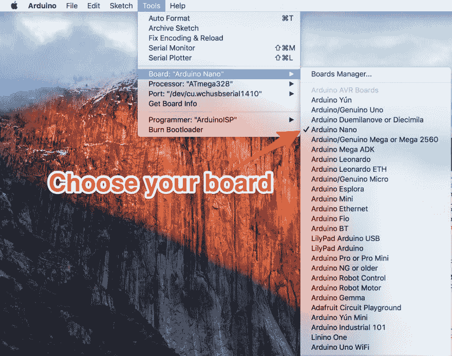
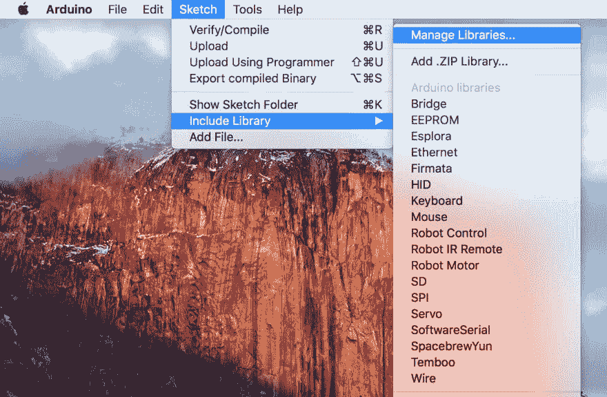
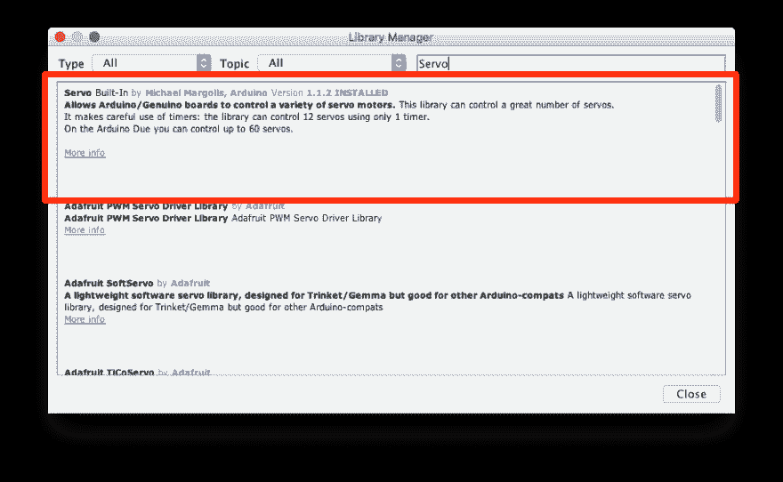
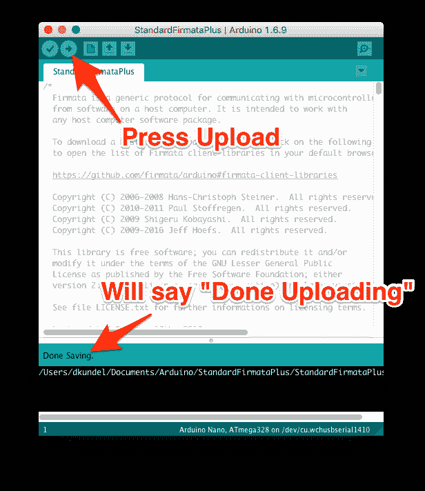
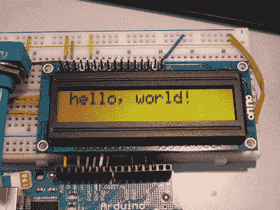
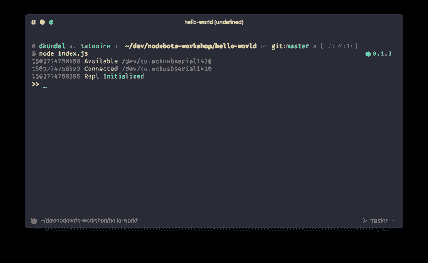
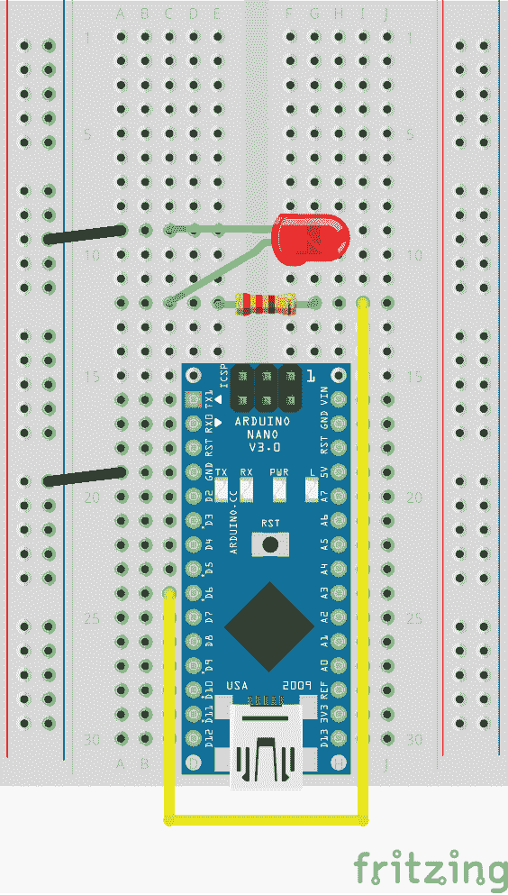
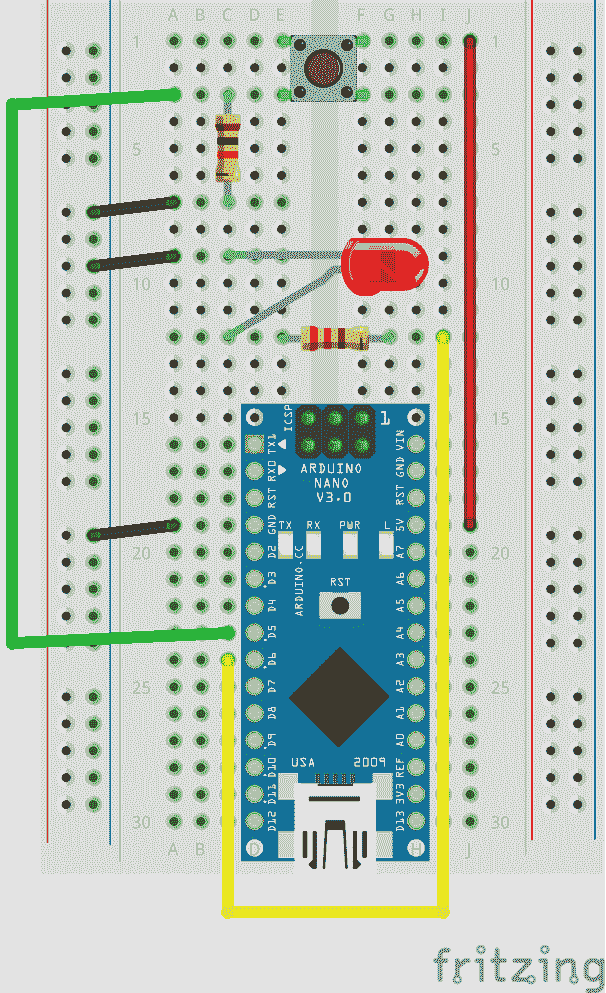
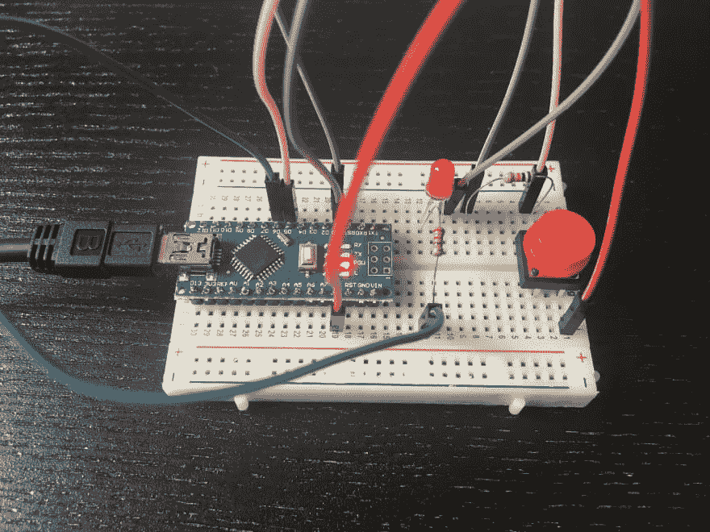

# 射流研究…💖硬件 Nodebots 和 Johnny-Five 入门

> 原文：<https://dev.to/dkundel/js--hardware--getting-started-with-nodebots-and-johnny-five-hk>

对于一些人来说，开始硬件黑客可能是相当可怕的。对于大多数开发者来说，电子世界是完全陌生的；此外，它要求你写 C/C++，这是有效的，但不是每个人都感到舒服。然而， [Nodebots](http://nodebots.io/) 运动是使用 JavaScript 开始硬件开发的一个好方法。在这篇文章中，我想通过一些非常基本的东西来引导你开始。

### JavaScript & &硬件？怎么会？

[T2】](https://res.cloudinary.com/practicaldev/image/fetch/s--siCf2Jsf--/c_limit%2Cf_auto%2Cfl_progressive%2Cq_auto%2Cw_880/https://thepracticaldev.s3.amazonaws.com/i/iuhjl9p4o3kcdi7fhxch.png)

有很多不同的项目旨在用 JavaScript 进行硬件开发。有些配备了特殊的硬件，如 [Tessel](https://tessel.io/) 或 [Espruino](https://www.espruino.com/) 。这两个都是很棒的项目，但在这篇文章中，我们将关注另一个选项。

我们将使用的选项是 npm 模块 [`johnny-five`](http://johnny-five.io/) 。Johnny-Five 不局限于某些硬件，而是使用各种 I/O 插件[支持各种不同的微控制器平台(包括 Tessel)](http://johnny-five.io/platform-support/) 。唯一的缺点是其中一些平台(如 Arduino)不允许您直接在微控制器上执行 JS 代码。相反，您可以在“主机系统”上执行它。

Arduino 的工作方式是，使用 Node.js 在您的“主机系统”(例如，您的计算机)上执行 JS 代码，然后 [`johnny-five`](https://npm.im/johnny-five) 模块通过 [`serialport`](https://npm.im/serialport) 模块将操作发送到运行 [`firmata`固件](https://github.com/firmata/arduino/)的 Arduino，该固件用于远程控制 Arduino。这样，当硬件连接到我们的计算机时，我们可以完全控制它。

### 要求

对于本教程，你需要一些东西。首先你需要在你的电脑上安装以下东西:

*   [Node.js](https://nodejs.org/) 和 [npm](https://npmjs.com)
*   [Arduino IDE](https://www.arduino.cc/en/Main/Software) 上传微控制器上的`firmata`固件
*   您最喜欢的代码编辑器

此外，您还需要一些硬件组件:

*   Arduino(或 Arduino 克隆)。我会用 Arduino Nano。[查看 Johnny-Five 页面，了解支持的不同页面](http://johnny-five.io/platform-support/)
*   1 个红色 LED
*   1x 按钮
*   1 个 220ω的电阻器(有红棕色条纹)。请注意，对于不同的 LED 颜色，您可能需要不同的电阻值
*   1 个 10kΩ的电阻器(条纹为棕色-黑色-橙色)
*   1 块试验板，用于连接设置—[类似于这个尺寸的东西应该足够了](https://www.sparkfun.com/products/12002)
*   几根跳线或结实的电线把一切连接起来

### 安装固件

我们需要做的第一件事是确保你的 Arduino 被正确识别。将其插入电脑，点击`Tools`菜单。在那里，你要选择你正在使用的各自的板——在我的例子中，我必须选择 Arduino Nano。

[T2】](https://res.cloudinary.com/practicaldev/image/fetch/s--WBsRxfhc--/c_limit%2Cf_auto%2Cfl_progressive%2Cq_auto%2Cw_880/https://thepracticaldev.s3.amazonaws.com/i/kha23e5semauxmpis8da.png)

还要确保在`Tools → Port`下选择正确的端口。它应该包含类似于`usbserial`的内容。如果没有列出这样的端口，请确保安装了 Arduino 所需的驱动程序。

[T2】](https://res.cloudinary.com/practicaldev/image/fetch/s--kX6_qrjQ--/c_limit%2Cf_auto%2Cfl_progressive%2Cq_auto%2Cw_880/https://thepracticaldev.s3.amazonaws.com/i/rn7zq64ix3ml5n589ha8.png)

接下来，我们需要在 Arduino 上安装 firmata 固件，以便能够与之通信。打开 Arduino IDE，点击`Sketch → Include Library → Manage Libraries`并搜索库，安装`Servo`库。

[T2】](https://res.cloudinary.com/practicaldev/image/fetch/s--CUCv-I1V--/c_limit%2Cf_auto%2Cfl_progressive%2Cq_auto%2Cw_880/https://thepracticaldev.s3.amazonaws.com/i/u9zmacqizwkimzhbdhrd.png)

[T2】](https://res.cloudinary.com/practicaldev/image/fetch/s--mxhkLEKA--/c_limit%2Cf_auto%2Cfl_progressive%2Cq_auto%2Cw_880/https://thepracticaldev.s3.amazonaws.com/i/3tf87md1lv0ql558o4j0.png)

最后，我们需要将`StandardFirmataPlus.ino`文件下载到我们的 Arduino 项目目录中(默认情况下在 Mac 中的`~/Documents/Arduino`下)并上传到我们的 Arduino。你可以通过进入首选项并查找 *Sketchbook 位置*来找到你的 Arduino 目录。

[从 GitHub](https://raw.githubusercontent.com/firmata/arduino/master/examples/StandardFirmataPlus/StandardFirmataPlus.ino) 下载`StandardFirmataPlus.ino`文件，放在你 Arduino 目录下的`StandardFirmataPlus`目录下。打开`StandardFirmataPlus.ino`文件，点击*上传*按钮。这将编译位并上传到你的 Arduino。上传完成后，您可以关闭 Arduino IDE。您现在已经为一些 JavaScript 做好了准备！

注意:如果上传代码失败，尝试用安装“伺服”库的方法安装“Firmata”库。

[T2】](https://res.cloudinary.com/practicaldev/image/fetch/s--y0oPyfVo--/c_limit%2Cf_auto%2Cfl_progressive%2Cq_auto%2Cw_880/https://thepracticaldev.s3.amazonaws.com/i/13liyvkwhd1njk0pmkag.png)

### “你好世界”的硬件

[T2】](https://res.cloudinary.com/practicaldev/image/fetch/s--wr5Rmr_l--/c_limit%2Cf_auto%2Cfl_progressive%2Cq_auto%2Cw_880/https://thepracticaldev.s3.amazonaws.com/i/akbius717p9jsh76j24r.png)

硬件中的 Hello World 可能会让 led 闪烁。好的方面是 Arduinos 通常已经在板上有一个 LED，我们可以用它来查看一切是否正常，而不必连接任何东西。所以让我们开始吧！

通过在命令行中运行以下几行，在计算机上的任意位置(比如您的主目录)创建一个新的 Node.js 项目:

```
mkdir nodebots
cd nodebots
npm init -y 
```

Enter fullscreen mode Exit fullscreen mode

接下来安装`johnny-five`模块:

```
npm install johnny-five --save 
```

Enter fullscreen mode Exit fullscreen mode

创建一个名为`index.js`的文件，并将以下代码放入其中:

```
const { Led, Board } = require('johnny-five');
const board = new Board();
board.on('ready', onReady); 
```

Enter fullscreen mode Exit fullscreen mode

这将创建一个新的 Board 实例，并等待发出`ready`事件。这意味着`johnny-five`库连接到 Arduino。然后我们调用一个仍然缺失的`onReady`函数。通过在你的`index.js` :
的底部放置下面的行来添加它

```
function onReady() {
  // if we don't pass a port to the Led constructor it will use
  // the default port (built-in LED)
  const led = new Led();

  // This will grant access to the led instance
  // from within the REPL that's created when
  // running this program.
  board.repl.inject({
      led: led
  });

  led.blink();
  // run in the REPL led.stop() to make it stop blinking
} 
```

Enter fullscreen mode Exit fullscreen mode

现在我们需要做的就是开始我们的脚本:

```
node index.js 
```

Enter fullscreen mode Exit fullscreen mode

控制台应该输出几条消息，然后启动 REPL，如下所示:

[T2】](https://res.cloudinary.com/practicaldev/image/fetch/s--QQEHvczz--/c_limit%2Cf_auto%2Cfl_progressive%2Cq_auto%2Cw_880/https://thepracticaldev.s3.amazonaws.com/i/6nic4mzo6xa806ctpcmi.png)

此外，您应该会看到板上的 LED 开始闪烁。您可以通过键入 REPL:
来停止闪烁

```
led.stop() 
```

Enter fullscreen mode Exit fullscreen mode

要停止程序，输入`.exit`或按两次`Ctrl+C`。

### 与外部 LED 通话

[T2】](https://res.cloudinary.com/practicaldev/image/fetch/s--5i30V8GJ--/c_limit%2Cf_auto%2Cfl_progressive%2Cq_auto%2Cw_880/https://thepracticaldev.s3.amazonaws.com/i/ctba2b6f33ulvrxo2b9k.png)

现在，很明显，只与主板上的硬件对话是一种限制，并不是我们在入侵硬件时通常想要做的。为此，我们应该与一些外部硬件对话。因此，让我们从以下硬件入手:

*   1 个 220ω电阻(红-红-棕色)
*   1 个 LED
*   你的面包板
*   你的一些电线

断开 Arduino 连接，并按照以下方式将所有设备插入试验板:

[T2】](https://res.cloudinary.com/practicaldev/image/fetch/s--RgTDsUcT--/c_limit%2Cf_auto%2Cfl_progressive%2Cq_auto%2Cw_880/https://thepracticaldev.s3.amazonaws.com/i/8edko7sfe4jdeovvgduq.png)

基本上，您需要创建以下电路:

> Arduino 上的 D6 引脚(或任何其他数字引脚)→电阻器的一侧→LED 的长腿(阳极)→LED 的短腿(阴极)→Arduino 上的 GND

在这个电路中，如果我们打开引脚`D6`，它将开始点亮 LED。

现在让我们更新代码来使用 LED。您需要做的就是将`6`作为参数传递给`Led`构造函数。请注意，对于不同的 Arduino 或如果您选择了不同的端口，这可能会有所不同。在您的`index.js` :
中进行更改

```
function onReady() {
  const led = new Led(6);
  // … leave remaining code
} 
```

Enter fullscreen mode Exit fullscreen mode

重新运行您的程序，外部 LED 灯应该开始闪烁，而不是板载 LED 灯🎉

### 按下按钮

[T2】](https://res.cloudinary.com/practicaldev/image/fetch/s--bMXdLRco--/c_limit%2Cf_auto%2Cfl_progressive%2Cq_auto%2Cw_880/https://thepracticaldev.s3.amazonaws.com/i/ky1sri2r8lk70fdcc949.png)

如果没有一些用户交互，硬件黑客会是什么样子？所以让我们添加一个按钮。抓住你剩下的组件:

*   1x 10kΩ(棕色-黑色-橙色)
*   1x 按钮
*   更多剩余电线

按照以下方式将它们添加到电路中:

[T2】](https://res.cloudinary.com/practicaldev/image/fetch/s--ryX97NeF--/c_limit%2Cf_auto%2Cfl_progressive%2Cq_auto%2Cw_880/https://thepracticaldev.s3.amazonaws.com/i/wctre68ei7waznpnsm9u.png)

> 将一个引脚连接到 Arduino 上的 5V，将对角引脚连接到一个 10kΩ电阻和 Arduino 上的 D5 引脚。将电阻器的另一端连接到 Arduino 的 GND 以闭合电路。

现在，您的设置应该如下所示:

[T2】](https://res.cloudinary.com/practicaldev/image/fetch/s--jAVXOnPq--/c_limit%2Cf_auto%2Cfl_progressive%2Cq_auto%2Cw_880/https://thepracticaldev.s3.amazonaws.com/i/mwavvlwtsz3lip3lqz1g.png)

使用按钮之类的东西是 JavaScript 硬件黑客真正闪光的地方。如果我们想知道按钮是否被按下或释放，我们所要做的就是监听`press` / `release`事件。就这么简单。换你的`index.js` :

```
const { Led, Board, Button } = require('johnny-five');
const board = new Board();

board.on('ready', onReady);

let button;
let led;
function onReady() {
  button = new Button(5);
  led = new Led(6);
  button.on('press', () => led.on());
  button.on('release', () => led.off());

  // This will grant access to the led instance
  // from within the REPL that's created when
  // running this program.
  board.repl.inject({
    led: led
  });

  // led.blink();
  // run in the REPL led.stop() to make it stop blinking
} 
```

Enter fullscreen mode Exit fullscreen mode

重启脚本，开始按按钮。当按下按钮时，LED 应该亮起，当松开按钮时，LED 停止亮起。

### 那为什么不是 API？

[T2】](https://res.cloudinary.com/practicaldev/image/fetch/s--wkOlisNX--/c_limit%2Cf_auto%2Cfl_progressive%2Cq_auto%2Cw_880/https://thepracticaldev.s3.amazonaws.com/i/g4v06hptptghthb7dbs9.png)

我最喜欢 nodebots 的一点是，我们可以利用整个 npm 生态系统。因此，让我们使用`express`启动一个快速 web 服务器，并点亮每个请求的 LED，让我们使用`got`向[请求 Bin](https://requestb.in/) 发出一个 HTTP `POST`请求。

使用`npm` :
安装两个模块

```
npm install express got --save 
```

Enter fullscreen mode Exit fullscreen mode

接下来，我们需要这两个依赖项，并创建一个 express 应用程序。修改您的`index.js` :

```
const { Led, Board, Button } = require('johnny-five');
const express = require('express');
const got = require('got');
const board = new Board();
const app = express();

app.get('*', (req, res) => {
  led.on();
  // turn off LED after 1 second
  setTimeout(() => led.off(), 1000);
  res.send('Hello!');
});

board.on('ready', onReady); 
```

Enter fullscreen mode Exit fullscreen mode

接下来我们需要调整按钮的事件处理程序，让 express 服务器开始监听:

```
function onReady() {
  button = new Button(5);
  led = new Led(6);
  button.on('press', () => {
    got
      .post('YOUR_REQUEST_BIN_URL')
      .then(() => {
        console.log('Made request');
      })
      .catch(err => {
        console.error(err);
      });
  });
  // button.on('release', () => led.off());
  app.listen(3000, () => {
    console.log('Server listening on port 3000');
  });

  // This will grant access to the led instance
  // from within the REPL that's created when
  // running this program.
  board.repl.inject({
    led: led
  });
} 
```

Enter fullscreen mode Exit fullscreen mode

确保用有效的 [RequestBin](https://requestb.in/) URL 替换`YOUR_REQUEST_BIN_URL`。你可以在他们的网站上创建一个。

现在重启你的程序，等待它表明服务器正在监听。导航到 [http://localhost:3000](http://localhost:3000/) ，您应该会看到 LED 灯亮起一秒钟。刷新页面，你会再次看到它。然后，按下按钮并刷新您的 RequestBin 页面，以查看所做的请求。

### 接下来是什么？

太棒了，就是这样！你刚刚迈出了可爱的机器人世界的第一步。但这仅仅是开始。现在是时候找到一个项目，开始研究你需要什么零件。如果你想知道如何处理这些事情，可以看看我在[上的博文，看看我是如何用 Johnny-Five 和 Tessel](https://moin.world/2017/04/01/how-we-hacked-our-coffee-machine-with-javascript/) 黑掉一台咖啡机的。你还应该[检查一下你周围是否有本地的 nodebots 聚会](http://nodebots.io/#meetups)。其他有用的资源包括:

*   [显示如何与各种组件交互的 Johnny-Five 示例页面](http://johnny-five.io/examples/)
*   [`nodebots-workshop`](https://www.npmjs.com/package/nodebot-workshop) 以其多样的演习
*   GitHub 上的[牛逼节点机器人](https://github.com/IainIsCreative/awesome-nodebots)列表

如果你有任何正在或计划用 JS 开发的很酷的硬件项目，我很想听听它们！如果您有任何问题，也可以随时联系我们:

*   电子邮件:[dkundel@twilio.com](//mailto:dkundel@twilio.com)
*   推特: [@dkundel](https://twitter.com/dkundel)
*   GitHub: [dkundel](https://github.com/dkundel)

[T2】](https://res.cloudinary.com/practicaldev/image/fetch/s--UeX0RIZl--/c_limit%2Cf_auto%2Cfl_progressive%2Cq_auto%2Cw_880/https://thepracticaldev.s3.amazonaws.com/i/zp865bzsm16w1yucgk23.png)