# Kossel 迷你建筑

> 原文：<https://dev.to/ladvien/kossel-mini-build-3hoa>

我想我应该给我的 Kossel 一个“机器人”页面，因为 Silas 问 Kossel 是什么，我告诉他，“一个 3D 打印机，”我早熟的儿子回答说，“不，它是一个机器人。”

这里的许多信息都是从我的构建博客上复制的，但是我稍微重新考虑了一下它的表达方式，因为之前已经有两本关于 Kossel 的构建指南。

1.  [Blokmer 的 Kossel 迷你构建指南](http://blomker.com/Kossel_Mini_Assembly_Guide_V1.0.pdf)
2.  [Build 3d printer 的 Kossel 构建指南](http://www.builda3dprinter.eu/build-manuals/)

两者都是由出售 Kossel 工具包的组织组织起来的。Blokmer 的指南要详细得多，节奏也很慢。当然，我从 builda3dprinter(这里称为 B3DP)购买了我的工具包，并尽可能多地使用他们的指南，也就是说，B3DP 指南有许多**缺失的信息。我不会抱怨太多，因为我喜欢他们的工具包，但它确实让我知道我将如何处理这里的信息。**

我将写这篇**指南作为现有构建指南的补充。**例如，Kossel 有一个自动调平探头，组装起来有点问题。两位导游都没有很好地解释其装配的几个关键部分。因此，我将主要关注缺失的信息。

**购买 Kossel 材料:**

[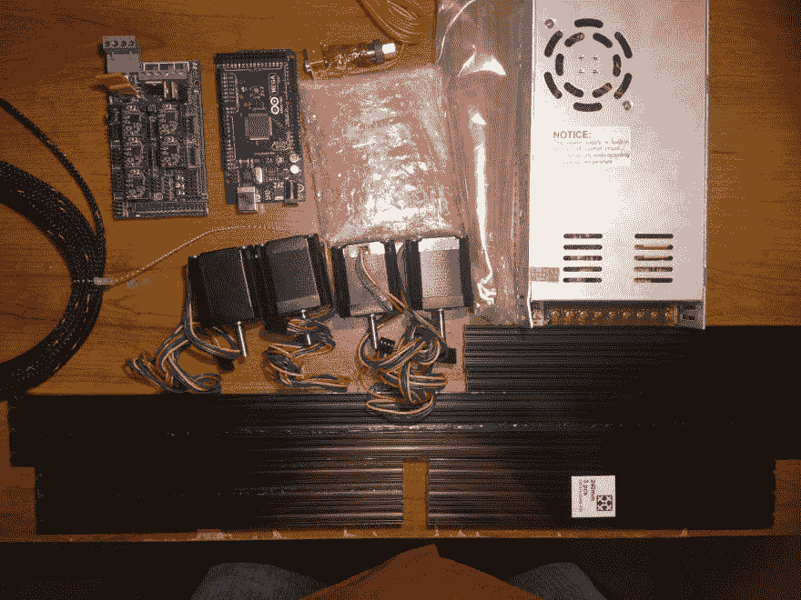T2】](https://res.cloudinary.com/practicaldev/image/fetch/s--1t7RiKI3--/c_limit%2Cf_auto%2Cfl_progressive%2Cq_auto%2Cw_880/https://ladvien.cimg/IMG_0427.jpg)

我从中国采购了一些零件，并从 www.builda3dprinter.eu 购买了主要零件。

**易贝和 Fasttech**

3 辆 [NEMA 17 型汽车](http://www.ebay.com/itm/5-PCS-NEMA-17-CNC-Step-Stepping-Stepper-Motor-40mm-1-7A-56-6oz-in-Bipolar/121040301978?_trksid=p2047675.c100011.m1850&_trkparms=aid%3D333008%26algo%3DRIC.MBE%26ao%3D1%26asc%3D20477%26meid%3D5415016813753636661%26pid%3D100011%26prg%):42.00 美元

1 个[行星步进器](http://www.ebay.com/itm/5-PCS-NEMA-17-CNC-Step-Stepping-Stepper-Motor-40mm-1-7A-56-6oz-in-Bipolar/121040301978?_trksid=p2047675.c100011.m1850&_trkparms=aid%3D333008%26algo%3DRIC.MBE%26ao%3D1%26asc%3D20477%26meid%3D5415016813753636661%26pid%3D100011%26prg%):60.00 美元

[12V，30A 电源](http://www.fasttech.com/product/1270406-12v-30a-regulated-switching-power-supply):31.39 美元

[斜坡和 A4988 驱动程序](http://www.ebay.com/sch/i.html?_odkw=ramps&_osacat=0&_from=R40&_trksid=p2045573.m570.l1313&_nkw=ramps+1.4&_sacat=0):31.00 美元

Arduino Mega:15.81 美元

J 型头 MK-V，0.4 毫米喷嘴，1.75 毫米:36.99 美元

[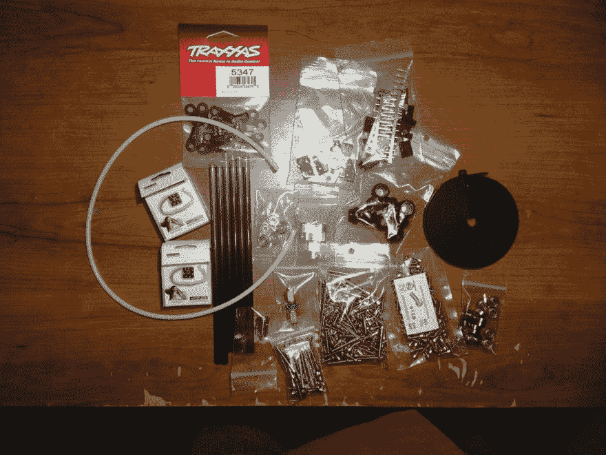T2】](https://res.cloudinary.com/practicaldev/image/fetch/s--nL9_kceh--/c_limit%2Cf_auto%2Cfl_progressive%2Cq_auto%2Cw_880/https://ladvien.cimg/IMG_0433.jpg)

剩下的，我从 [www.builda3dprinter.eu](http://www.builda3dprinter.eu) 买了几个“套件”。

**B3DP 套件**

[Kossel 套件(塑料部件)](http://www.builda3dprinter.eu/shop/kossel-kit/kossel-kit-request-color/):55 美元

[Kossel 的螺母和螺栓套件](http://www.builda3dprinter.eu/shop/kossel-kit/nuts-bolts-kit-kossel/):30 美元

[Kossel 的 OpenBeam 套件](http://www.builda3dprinter.eu/shop/kossel-kit/openbeam-kit-kossel/):70 美元

[轨道到车轮转换套件](http://www.builda3dprinter.eu/shop/kossel-kit/rails-to-wheels-conversion-kit/):50 美元

其余部分:115 美元

运费:约 50 美元

**必需品总计:587.19 美元**

[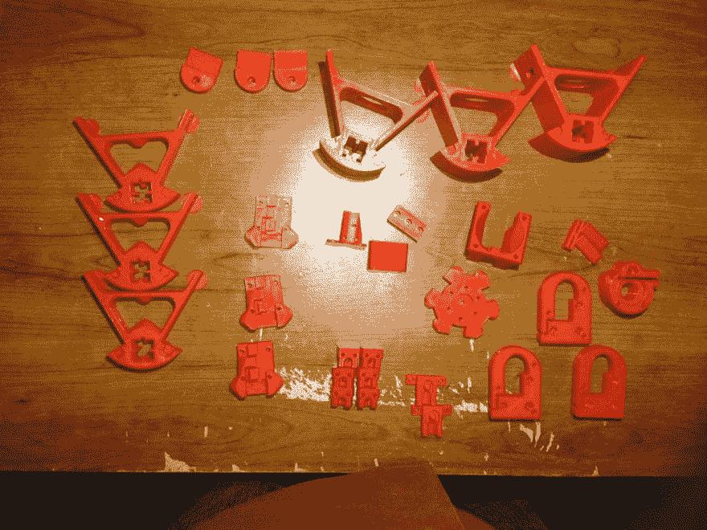T2】](https://res.cloudinary.com/practicaldev/image/fetch/s--xaRvNDdY--/c_limit%2Cf_auto%2Cfl_progressive%2Cq_auto%2Cw_880/https://ladvien.cimg/IMG_0442.jpg)

买了所有的必需品后，我买了一些我觉得会让房子整洁的东西。

[皱巴巴的电线包](http://www.ebay.com/itm/360681423484?ssPageName=STRK:MEWNX:IT&_trksid=p3984.m1439.l2649):10.02 美元

小拉链 x 100 美元:3.85 美元

大拉链带 x 50 美元:4.85 美元

[彩色热收缩](http://www.ebay.com/itm/360638274171?var=630110369586&ssPageName=STRK:MEWNX:IT&_trksid=p3984.m1439.l2649)x140:11.78 美元

**整洁度总计:30.50 美元**

**总要素和整洁度:617.69 美元**

[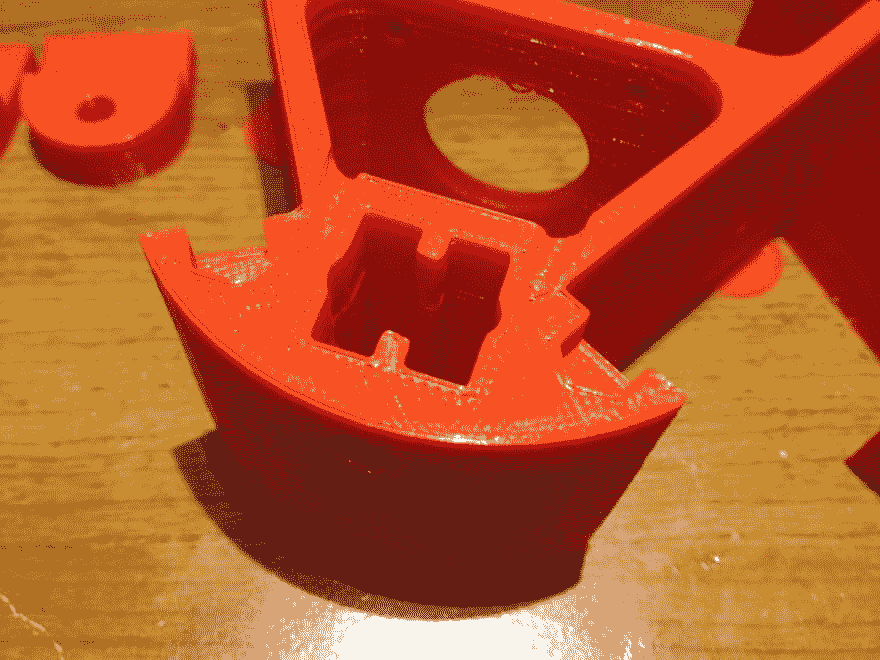T2】](https://res.cloudinary.com/practicaldev/image/fetch/s--0C2IEXc3--/c_limit%2Cf_auto%2Cfl_progressive%2Cq_auto%2Cw_880/https://ladvien.cimg/IMG_0443.jpg)

**关于[www . build a3 d printer . eu](http://www.builda3dprinter.eu)T3】**

我必须说我对 B3DP 的感觉很复杂。作为一名心理健康工作者，当有人有复杂的感觉时，我们会创建一个利弊的 T 形图。这是我在 B3DP 套件上的。

**缺点:**

1.  短约 20 M3 坚果。
2.  六周的处理和交付时间
3.  没有提供关于效应器的明确文件
4.  缺少内六角扳手、弹簧和安全销(用于自动探头)。这不包括在他们的[清单中](http://www.builda3dprinter.eu/shop/kossel-kit/6-whats-included/)没有包括的东西。
5.  引脚连接器既便宜又不可靠
6.  文档中的巨大漏洞。

**优点:**

1.  塑料零件质量非常好。
2.  给我一个免费的[硼硅板](http://www.builda3dprinter.eu/shop/kossel-kit/6-rest/#)作为对延误的回应。
3.  沟通好(他们很快回复了我所有的问题)。
4.  他们的套件配合得很好。

公平地说，我还没有完成构建，但是写下这些，**我会说我会再次购买 B3DP 套件**。

很难定价的一点是部分精确性和协同性。由于这些部件要一起工作，校准就简单多了(仍然不容易)。例如，不必测量杆的长度、支架偏移等。B3DP 提供了一个 Marlin(delta 的固件),其中已经输入了这些测量值。总之，**B3DP 已经完成了一半的校准。**

[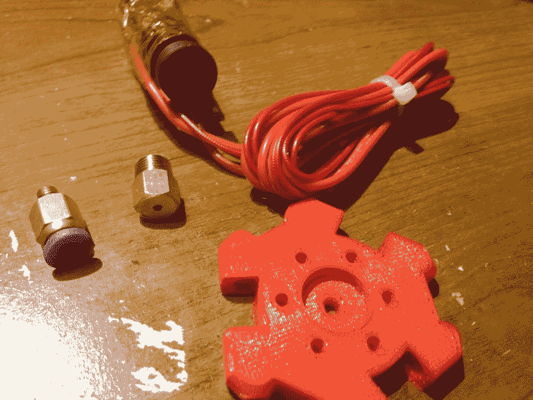T2】](https://res.cloudinary.com/practicaldev/image/fetch/s--PJi2b-r_--/c_limit%2Cf_auto%2Cfl_progressive%2Cq_auto%2Cw_880/https://ladvien.cimg/IMG_0447.jpg)

**购买“Doh”s！**

**1。效应器不匹配:**

B3DP 为我提供了一台 [MK V 末端执行器](https://github.com/jcrocholl/kossel/blob/master/effector.stl)，我买了一台 [MK IV J-Head](http://jheadnozzle.blogspot.com/) 挤出机，广告上称其为 MK V。易贝，指给你看。到目前为止，这还没有造成任何问题，我只是把黄铜结束了我的挤出机，并把它推到位。不确定效应器塑料和聚四氟乙烯管之间的开放区域将导致我今后的问题，如灯丝聚束。

[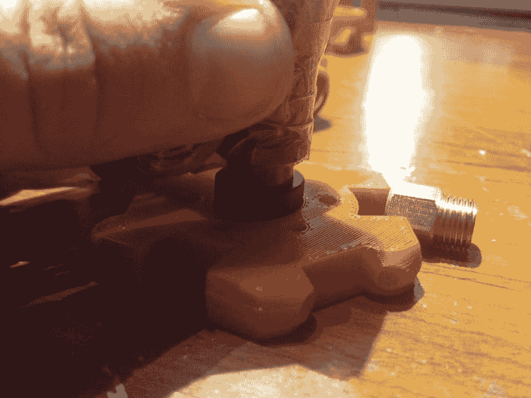T2】](https://res.cloudinary.com/practicaldev/image/fetch/s--nZyK88W6--/c_limit%2Cf_auto%2Cfl_progressive%2Cq_auto%2Cw_880/https://ladvien.cimg/IMG_0449.jpg)

**2。挤出机必须有一个*齿轮*步进电机:**

我买了五个一批的步进电机。我想，“我将用 3 表示 X，Y，Z 轴，用 1 表示挤压机。”嗯，这是我应该做更多研究的地方。科塞尔的原始设计需要一个 NEMA 17 **齿轮**步进电机。所以，我崩溃了，为挤压机订购了一个**齿轮**步进电机。我有点低于预算，觉得这是一个更好的选择，而不是挣扎着试图得到当前的电机，我必须与 B3DP 发送的工作。

但要明确的是【B3DP 的挤出机是为带有 8 毫米轴的步进电机制造的。实际上，这些零件来自最初的设计，它需要一个齿轮步进电机和一个 22 齿的正齿轮，以及一个直径为 8 毫米的轴。“普通”NEMA17 有一个直径为 5 毫米的轴。我见过一些使用常规步进机和 5 毫米直径正齿轮的挤出机设计，*，但这不是 B3DP 套件附带的。*

**组装**

正如我所说的，我不会详细讨论这个组件，因为有两个指南。但是我会包括大部分构建的延时(容易拍摄的)和现有构建指南中没有的东西的注释。

**1。[夹具设置&轨道末端](http://www.youtube.com/watch?v=odlyVY3Sziw)T3】**

[组装视频](http://www.youtube.com/watch?v=odlyVY3Sziw)

Blokemer 指南指出，我应该攻丝和钻孔 Traxxas 结束和碳棒。我从 Harbor Freight 购买了公制丝锥和模具，但当我检查从 B3DP 收到的零件时，我注意到无头螺栓太小，无法抓住碳棒的内部。而且，我不知道如何使用我的水龙头和死亡；这导致我意识到我有错误的螺纹尺寸。有道理，我用的是美国的工具和除美国以外其他地方的零件。

我很幸运。**根据 [B3DP 手册](http://www.builda3dprinter.eu/build-manuals/kossel_mini/start-building/build-diagonal-arms/)你不需要敲击任何东西。**只需将无头螺栓拧入 Traxxas 末端，然后使用慢凝环氧树脂将末端粘到碳棒上。在 Traxxas 末端拧上无头螺栓非常顺利。嗯，胶合是另一回事。

没有太多要说的设置碳棒和 Traxxas 结束夹具。只需遵循 [Blomker 指南](http://blomker.com/Kossel_Mini_Assembly_Guide_V1.0.pdf)第 3-6 页的说明。我用了一个直角尺和一个速度直角尺，直角尺对齐轨道，然后速度直角尺对齐一端的机器螺丝。我读到过，手臂可以偏离指南概述的 180 毫米，但**他们应该都一样长。**我的目标是找出比其他杆长的杆，并把它们锉短一点。

后期制作注意事项:**我在我的塑料零件中发现了来自 B3DP 的“备用”对象——我意识到它们是夹具位**。Doh。

**2。[粘合 Traxxas 两端(和一个大 F ' up)](http://youtu.be/pO9BQj8K6RI)T3】**

[视频](http://youtu.be/pO9BQj8K6RI)

我从港口货运公司买了一些便宜的慢凝环氧树脂。我把它和一个切棍(一个我最喜欢的工具)混合在一起，开始把它涂在 Traxxas 的两端。然后，我失败了。

我把 Traxxas 的一端放进了环氧树脂里。我试过用酒精和丙酮清洗。但是仍然有一些残留物阻碍了球节像我希望的那样自由移动。叹气。我继续前进，并订购了更多的 Traxxas 头，所以，如果有人需要额外的，因为他们在环氧树脂下降，只是让我知道。我要十一个。

还有一点需要注意的是，**确保从 Traxxas 端和杆接头上擦去多余的环氧树脂。**我担心两者之间的密封不当，留下了额外的球状部分。它漏进了 [1515 横梁](https://www.kickstarter.com/projectss/ttstam/openbeam-an-open-source-miniature-construction-sys)的缝隙里。当然，我想，“当我把这些碎片拼在一起时，我会确保把恶心的部分翻进去，这样就不会引人注意了。”嗯，把它栓在塑料片上的螺母也在里面。总之造成了很多问题。如果可以的话，我会在把它们放在夹具上之前把它们擦掉。

**3。[底部三力组件](http://youtu.be/_eOBF8TvbYg)T3】**

[视频](http://youtu.be/_eOBF8TvbYg)

我不喜欢“底部装配”这个名字，所以我把这个步骤重新命名为:底部三力装配。在很大程度上，一帆风顺。只要确保你几乎没有拧紧螺母就行了。如果它们太紧，你就不能让塑料唇在它们周围闭合。同样，**他们有上有下。**

把轴加到底部三力有点棘手。首先，需要注意的是，Triforce 作品有“上”和“下”之分:

[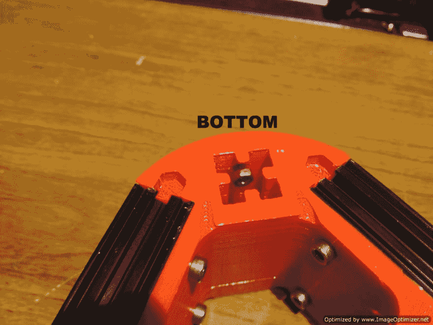T2】](https://res.cloudinary.com/practicaldev/image/fetch/s--23H19DHW--/c_limit%2Cf_auto%2Cfl_progressive%2Cq_auto%2Cw_880/https://ladvien.cimg/BOTTOM_PLAS_TRI_Optimized.jpg)

[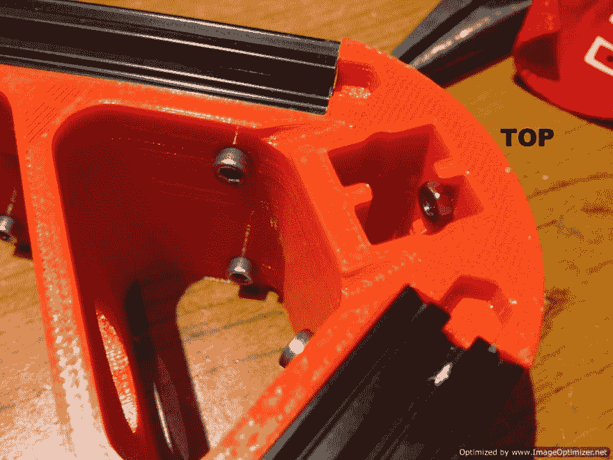T2】](https://res.cloudinary.com/practicaldev/image/fetch/s--H0pEGskp--/c_limit%2Cf_auto%2Cfl_progressive%2Cq_auto%2Cw_880/https://ladvien.cimg/TOP_PLAS_TRI_Optimized.jpg)

[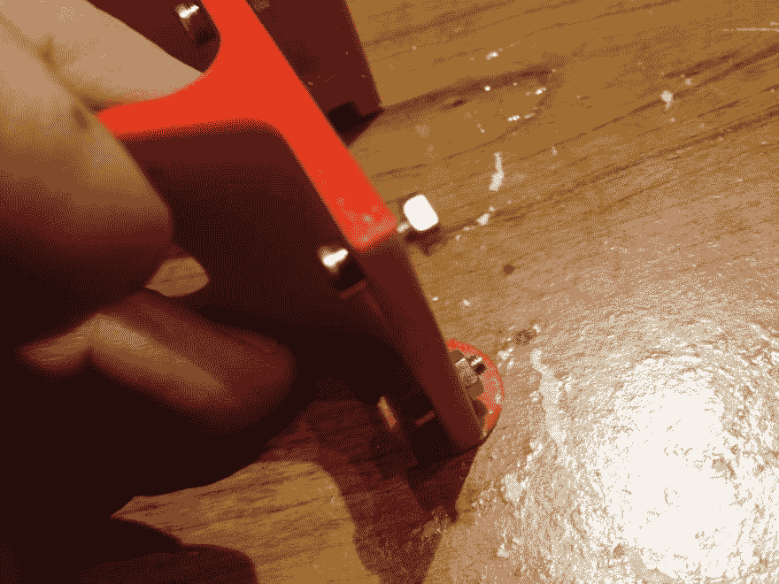](https://res.cloudinary.com/practicaldev/image/fetch/s--Z5dmjoRZ--/c_limit%2Cf_auto%2Cfl_progressive%2Cq_auto%2Cw_880/https://ladvien.cimg/IMG_0468.jpg)

底部 Triforce 组件上的小圆形标签用于打印，可以用锋利的刀和稳定的手移除。在没有稳定的手的情况下，大量的血和急诊室的访问就足够了。

另外，不要把任何螺栓拧得太紧，直到你把所有零件都压在一起。我已经看过了[博客](http://blomker.com/Kossel_Mini_Assembly_Guide_V1.0.pdf)指南的第 28-32 页，但是我意识到对各方给予的需求比预期的要多。你会注意到，在我视频的结尾，我努力不让自己看起来像个十足的傻瓜，试图把所有的碎片拼在一起。

[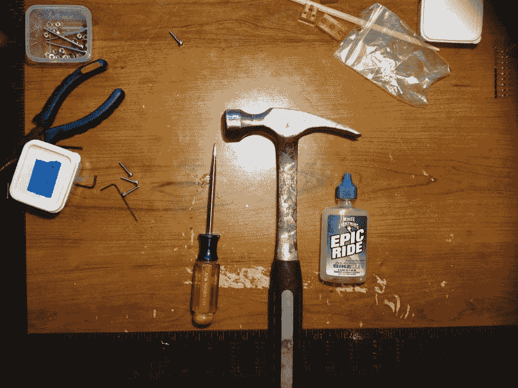T2】](https://res.cloudinary.com/practicaldev/image/fetch/s--Ux2N3j6w--/c_limit%2Cf_auto%2Cfl_progressive%2Cq_auto%2Cw_880/https://ladvien.cimg/IMG_0490.jpg)

当然，我没有意识到这一点，直到我已经螺栓底部三力下来，并开始试图推动第一轴到位。我迅速拉开底部，翻转我剩下的那块塑料片，这样我所有的塑料片都在“顶部”有了双叉导轨

现在，我已经看到了六种不同的将 1515 压入印刷塑料的方法。我尝试了我的热枪，但真的很小心，我会变形一块，我将不得不等待 6 个星期从 B3DP 得到另一个。我最终使用了以下工具:

为了将杆压入，我开始将杆插入第一个螺母。然后，当它开始变紧时，我在边缘涂了一点自行车油(绿色瓶子),翻转组件，放在我的腿上。我将已经开始的杆的一端压在瓷砖地板上，并用拳头敲打接收端(组件)。

[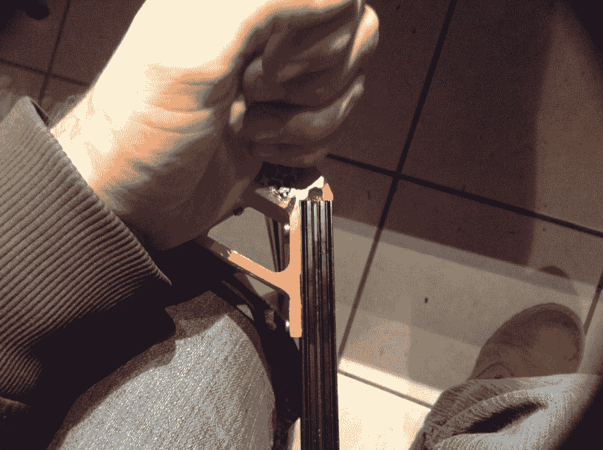T2】](https://res.cloudinary.com/practicaldev/image/fetch/s--Hy2pj4wr--/c_limit%2Cf_auto%2Cfl_progressive%2Cq_auto%2Cw_880/https://ladvien.cimg/Beat_the_Rod.jpg)

嗯，这招很管用。有点太棒了。这根杆子滑过去没被冲平。这就是螺丝刀和锤子出现的地方。我只是把组件放在膝盖上，但把杆子从地板上抬起来。然后用螺丝刀的尖端抵住 1515 杆的末端，我用锤子轻轻敲打螺丝刀。这使我能够将 1515 杆与 Triforce 组件的底部塑料齐平。

**4。[车架总成](http://youtu.be/_vCunTe3lPg)T3】**

[视频](http://youtu.be/_vCunTe3lPg)

车厢组装进行得相当顺利。我不得不为车厢上的大部分螺栓打孔，因为孔里还留有印刷卷筒纸。但是在洞被清除之后，它是非常直截了当的。我从 [B3DP](http://www.builda3dprinter.eu/build-manuals/kossel_mini/start-building/build-carriage/) 开始跟着导游走。

一些注意事项:**如果你还没有整理你的螺栓，最好现在就做。如果你所有的螺栓集中在一起[数字卡尺](http://www.ebay.com/itm/Digital-Electronic-Gauge-Stainless-Steel-Vernier-Caliper-150mm-6inch-Micrometer-/121118369552?pt=LH_DefaultDomain_0&hash=item1c3337a710)是天赐之物。你只需从头的正下方量起，直到杆身的末端。**

[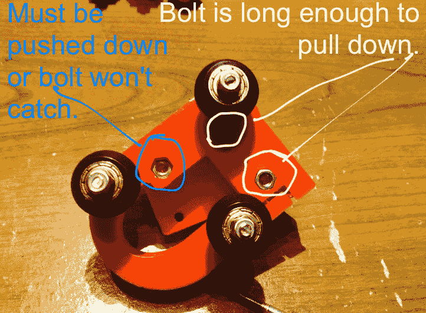T2】](https://res.cloudinary.com/practicaldev/image/fetch/s--Hb9cjVjo--/c_limit%2Cf_auto%2Cfl_progressive%2Cq_auto%2Cw_880/https://ladvien.cimg/Carriage_Assembly_Nut_Sink.png)

有三个螺母需要压入支架组件的塑料中。我使用热肠软化预定孔的塑料，然后通过将平头螺丝刀的尖端放在螺母上并用锤子轻敲螺母，将螺母轻轻压到位。这种方法效果很好。**一个例外，**有三个螺母，但是两个螺栓是 25mm，一个是 16mm。**16 毫米的螺栓不够长，抓不住螺母的螺纹，除非你把它深深地敲进孔里。**我希望这张照片能让你明白:

**5。[电机和终点挡板](http://youtu.be/xpg4aCajRbI)T3】**

[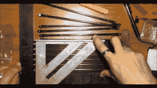T2】](https://res.cloudinary.com/practicaldev/image/fetch/s--Yjc3KB6V--/c_limit%2Cf_auto%2Cfl_progressive%2Cq_auto%2Cw_880/https://ladvien.cimg/mqdefault.jpg)

底部终端停止和电机顺利。

只有一点关于马达的建议:**确保你轻敲塑料上的孔，以防止当你试图将螺栓拧入马达孔时，任何塑料碎片与螺栓错位。**

另外，**不要拧紧任何螺栓，直到你的所有螺栓都正确启动***。我发现他们经常会误解，我认为这是因为角度太苛刻了。*

 *[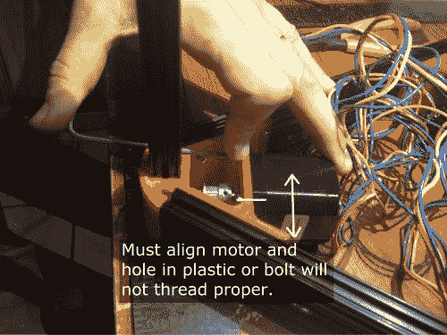T2】](https://res.cloudinary.com/practicaldev/image/fetch/s--1ml2eChw--/c_limit%2Cf_auto%2Cfl_progressive%2Cq_auto%2Cw_880/https://ladvien.cimg/IMG_0510.jpg)

哦，还有一点，**为这个过程购买一个长 2mm 的球形内六角扳手**。正如你可能注意到的，在我的视频开始时，我用一个短的无球艾伦内六角扳手试了试，但没有成功。

[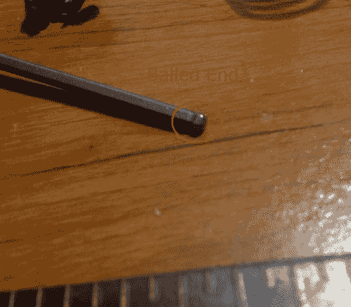T2】](https://res.cloudinary.com/practicaldev/image/fetch/s--1t1uBsfu--/c_limit%2Cf_auto%2Cfl_progressive%2Cq_auto%2Cw_880/https://ladvien.cimg/IMG_0513.jpg)

**6。[滑架臂和效应器组件](http://youtu.be/URMOpAK5ZWI)T3】**

[视频](http://youtu.be/URMOpAK5ZWI)

几个音符，

车厢装配非常简单，只要确保你按照说明做，不要着急。但是我组装效果器有点困难。主要是，J 形头的**圆形部分无法放入孔中。**我已经尽可能避免使用热风枪，但在这里我用它来充分加热塑料，并将 J 形头压到位。

1.  [顶部三力、PSU、斜坡 1.4 和附着效应器](http://youtu.be/kvdlXrVaKeE)

[视频](http://youtu.be/kvdlXrVaKeE)

在这里我对 B3DP 有点不耐烦了。首先，有三个部分**它们不包括[中的](http://www.builda3dprinter.eu/shop/kossel-kit/6-rest/)**其余的套件，而且在“[中也没有提到什么不包括在](http://www.builda3dprinter.eu/shop/kossel-kit/6-whats-included/)部分。它们是**自动调平**的弹簧、安全销和内六角扳手。

自动关卡有点复杂。你需要找到三个零件:安全销、内六角扳手和弹簧。我在易贝订购了一把内六角扳手。我从我妻子的东西里“借”来的安全别针。我从一些旧别针上取下的弹簧。经过一番摆弄，我终于能拼凑出一些东西来了。

现在，我需要声明，在我最初的博客中，我对 B3DP 有点不公平。我抱怨他们送来了自动探测的按钮开关。问题是他们提供了一个按钮开关，而不是按钮*和*手臂开关。

[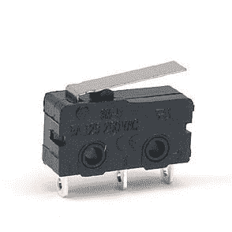T2】](https://res.cloudinary.com/practicaldev/image/fetch/s--LIvMDIen--/c_limit%2Cf_auto%2Cfl_progressive%2Cq_auto%2Cw_880/https://ladvien.cimg/Microswitch-e1387892435677.jpg)

**手臂和按钮**

[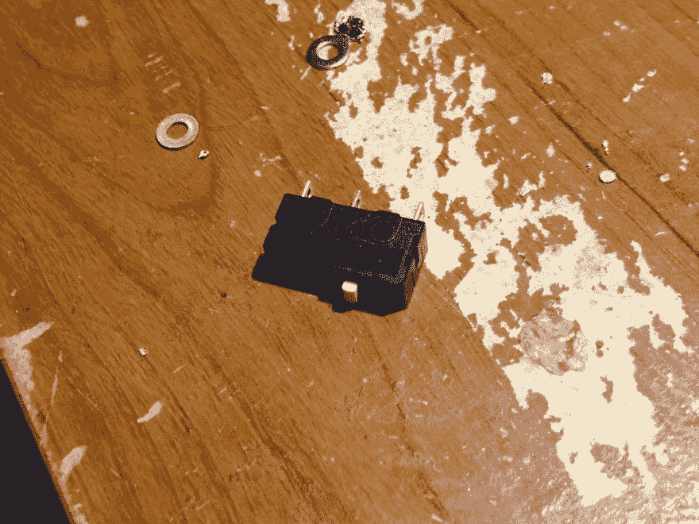T2】](https://res.cloudinary.com/practicaldev/image/fetch/s--b6zp1OjL--/c_limit%2Cf_auto%2Cfl_progressive%2Cq_auto%2Cw_880/https://ladvien.cimg/IMG_0600.jpg)

**按钮开关**

[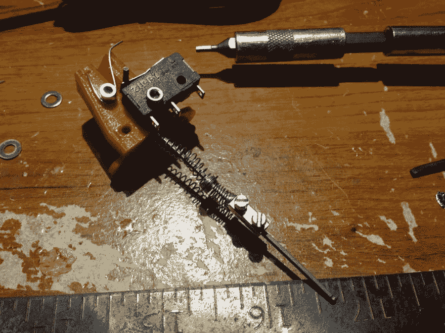T2】](https://res.cloudinary.com/practicaldev/image/fetch/s--rqWkA5F_--/c_limit%2Cf_auto%2Cfl_progressive%2Cq_auto%2Cw_880/https://ladvien.cimg/IMG_0573.jpg)

这不应该困扰我太多，因为三个终点挡板的工作。但当它来到自动水平，艾伦内六角钩应该抓住上面显示的开关的金属臂，引导它到按钮。嗯，我发现当内六角扳手坐在按钮上时，它不是向下按，而是向左或向右滑动。不管我做了多少调整，我都无法让它坐好。最终，我在 Radio Shack 花了 3 美元买到了“合适的”交换机。

这是我的自动水平调整后的样子。当我测试它卸下它的工作。

[T2】](https://res.cloudinary.com/practicaldev/image/fetch/s--e-qNIRtK--/c_limit%2Cf_auto%2Cfl_progressive%2Cq_auto%2Cw_880/https://ladvien.cimg/IMG_0652.jpg)

**但是，**当我安装自动探针并开始使用它时，我发现臂会卡在安全销螺栓下面。嗯。

所以，我觉得我欠 B3DP *一半*一个道歉。

实际上，我最终使用了发给我的交换机，我为抱怨错误的交换机而道歉。但是为了让我被送去的开关正常工作，我必须一层一层地热缩。这使得手臂不得不抓住按钮。热收缩有一些天然的阻力。这种必要的修改可能需要纳入 B3DP 指南。

关于电源。

[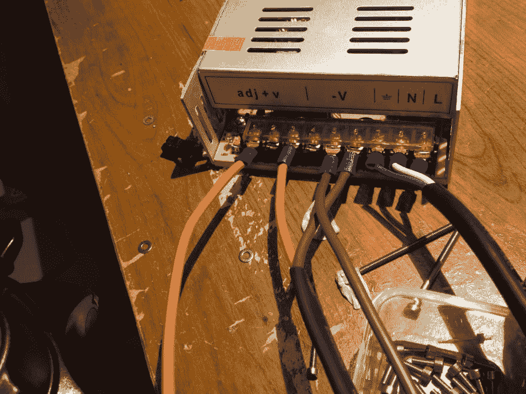T2】](https://res.cloudinary.com/practicaldev/image/fetch/s--W3_OzPNv--/c_limit%2Cf_auto%2Cfl_progressive%2Cq_auto%2Cw_880/https://ladvien.cimg/IMG_0603.jpg)

我试着从易贝买了一根便宜的电脑电源线。但当我把末端切掉后，发现铜比电话线中的还少。我牺牲了我的一条旧电脑电源线。电源线没有我想要的那么长，但它有足够的铜来拉 PSU 可能的 30A 电源。

给 PSU 装上电线，

*   **绿色< - >接地**
*   **白色< - >白色**
*   **黑色< - > L(ive)**

另外，如果你用的是 fasttech.com PSU，我注意到它默认为 240 伏。如果你在美国，一定要打开侧面的开关。

将我的 PSU 连接到斜坡后，我打开它，寻找蓝烟。没什么。哇哦！

[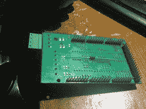T2】](https://res.cloudinary.com/practicaldev/image/fetch/s--d4ZRtwsu--/c_limit%2Cf_auto%2Cfl_progressive%2Cq_auto%2Cw_880/https://ladvien.cimg/IMG_0604_0.jpg)

但是我有另一个问题。下面的超级巨星没有获得能量。嗯，我挠了挠头，然后实际上阅读了[斜坡](http://reprap.org/wiki/RAMPS_1.4)手册。显然，贴在我的坡道下腹部的二极管使它能够由 12V PSU 供电。我把它焊接好了。

焊接完二极管后，一切看起来都正常了。我继续像正常一样连接其他的东西。

[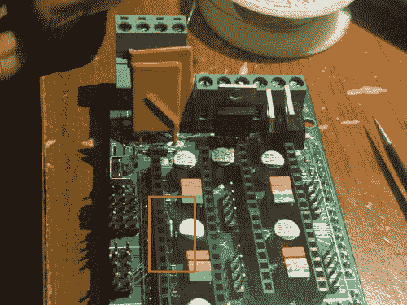T2】](https://res.cloudinary.com/practicaldev/image/fetch/s--5IHC3_5J--/c_limit%2Cf_auto%2Cfl_progressive%2Cq_auto%2Cw_880/https://ladvien.cimg/IMG_0607.png)

12V 至 Arduino 巨型二极管布局

[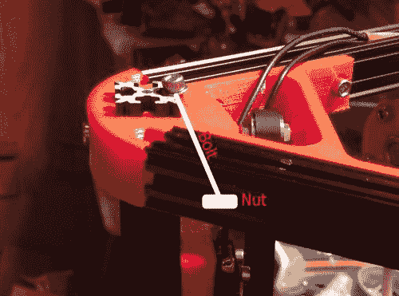T2】](https://res.cloudinary.com/practicaldev/image/fetch/s--p4liJKYb--/c_limit%2Cf_auto%2Cfl_progressive%2Cq_auto%2Cw_880/https://ladvien.cimg/IMG_0653_-_Copy.jpg)

在这里，我换了档，把最高的三分力合在一起。

我要记下一点。同样，顶部三力有一个“底部”和一个“顶部”它与张紧螺栓有关，它必须从顶部外侧到底部内侧倾斜。像这样，

之后，我渴望穿上上衣，系好腰带。这需要一点勇气，因为 B3DP 发送我的同步带在一个角色。我不得不削减，担心他们给了我足够的皮带，如果我削减了一点，就必须等待另一条皮带。但这是徒劳的，我受够了。

[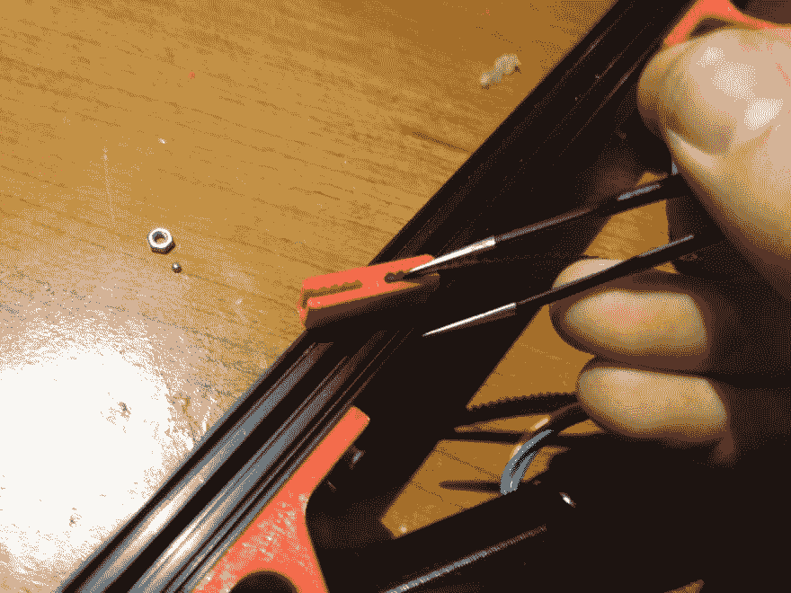T2】](https://res.cloudinary.com/practicaldev/image/fetch/s--8RnD_R5z--/c_limit%2Cf_auto%2Cfl_progressive%2Cq_auto%2Cw_880/https://ladvien.cimg/IMG_0588.jpg)

为了切断皮带，我只是把它们串起来，如图所示，并在接头槽的末端留下大约四个橡胶齿。当顶三力打开时，多余的小空间可以调节。为此，有三个拉紧螺栓。

[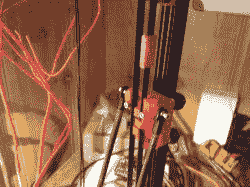T2】](https://res.cloudinary.com/practicaldev/image/fetch/s--HVNGy1no--/c_limit%2Cf_auto%2Cfl_progressive%2Cq_auto%2Cw_880/https://ladvien.cimg/IMG_05792.jpg)

这是传送带在适当的位置应该看起来的样子， ***除了*应该在车厢下面，否则它会撞到车厢前的终点挡板。**

**(顺便说一下，从现在开始，我使用了大量的图片，因为考虑到其物理尺寸，Kossel 的视频有点困难)**

然后，我收紧顶部三力，并迅速挂钩坡道。我上传了马林鱼固件，并能够让马达响应一个方向。当我试图将冷却风扇挂在斜坡上时，问题出现了。三个 fet 中的两个输出 0v。哇哇哇。

显然，斜坡上的电源控制[fet 不良](http://letsmakerobots.com/node/40734)？

[T2】](https://res.cloudinary.com/practicaldev/image/fetch/s---udqw7Yb--/c_limit%2Cf_auto%2Cfl_progressive%2Cq_auto%2Cw_880/https://ladvien.cimg/800px-RAMPS1-3_mosfet.jpg)

后来发现(Brassfly 和 Bdk6 其实想通了)还不错的 fet。在第一个 12V 电源轨的某个地方出现了迹线短路。哦好吧。我花 14 美元订购了另一个斜坡板，并在它找到我的时候休息了 18 天。

1.  [它还活着！](http://youtu.be/z67Q4nY6NBk)

[视频](http://youtu.be/z67Q4nY6NBk)

我收到新的斜坡板的那天晚上，我把所有的东西都接好了。果然，我打开了电源，所有的蓝仙女都呆在他们的硅家里。然后，我运行闪烁草图来检查引脚 8、9、10 上的功率 fet。他们都像预期的那样通电，吐出 12v。

接下来，我上传了布洛克默的马林素描。*大错特错。*

Blokmer 和 B3DP 都提供了一个马林草图，其中已经插入了 Configuration.cpp 中的“典型”测量值。我实际上是把柴油加入了汽油发动机。

1.  [Blokmer 的马林固件专用于 Blokmer 的 Kossel、Pronterface 和 Slicer](http://www.blomker.com/KosselMini_Windows.zip) (。zip 适用于 Windows)
2.  [B3DP 的设置页面](http://www.builda3dprinter.eu/build-manuals/kossel_mini/initial-set-up/)。它链接到特定于 B3DP Kossel、Pronterface 和 KISSlice 的 Marlin 固件。

当然，我用 B3DP 版本的 Blokmer 固件拔了很多头发。最后我下载了 B3DP 的马林和 Blokmer 的 zip 文件。也就是说，我使用了适当的马林鱼与 Pronterface 和切片器。

在我继续之前，我想检查一下线路。

以下是 B3DP 接线图:

[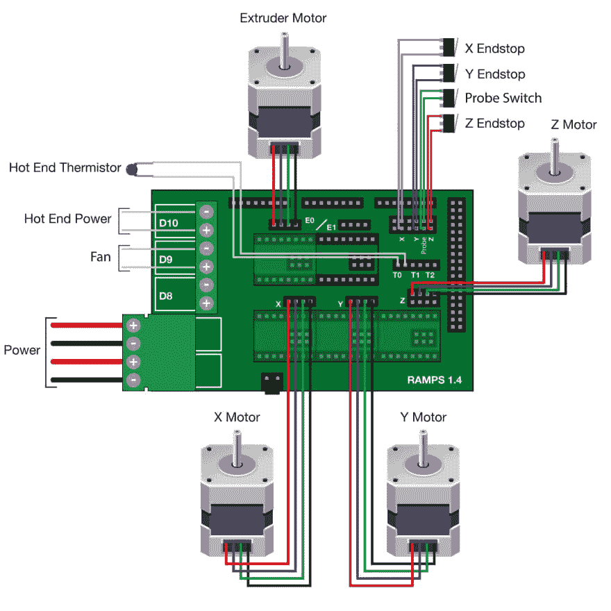T2】](https://res.cloudinary.com/practicaldev/image/fetch/s--vj9YHq2J--/c_limit%2Cf_auto%2Cfl_progressive%2Cq_auto%2Cw_880/https://ladvien.cimg/Wiring_3Dprinter_000.jpg)

当然，我的步进电机有不同颜色的电线，但我猜对了。真的，我想它们会向上或向下移动，如果需要的话，我可以切换它们。提醒一句，**确保将每个步进器连接到相应的终点挡板。如果没有，当您第一次将终点挡板复位时，一个或两个电机将停止，但其他两个或一个将继续，因为它们的终点挡板没有被触发，导致您的皮带变松。例如，电机 X 将碰到终点挡板 Z，但不会关闭，因为 X 终点挡板没有被切换。并且 X 终点挡板不会关闭，因为电机 Z 已经停止，因为它的终点挡板已经被触发。**

清澈如泥？只要确保每个终点挡板都连接到合适的电机上。

关于热敏电阻，它是非极化的。插上电源就行了。

好的。我将认为这个构建的“机械”部分已经完成。现在，我将开始做一些困难的事情:**校准**。*