# Kossel 迷你校准

> 原文：<https://dev.to/ladvien/kossel-mini-calibration-38i3>

这是我的[机器人冶金 101 - AVR 课日志](http://letsmakerobots.com/node/39996)的延续

这是我的 Kossel 迷你构建日志的第二部分

*   [Kossel 迷你构建日志-物理构建](http://letsmakerobots.com/robot/projects/kossel-build-log)

当我下定决心制造一台 3D 打印机时，我知道我要倒霉了。我知道我要花大量的时间来校准这该死的东西。好吧，我的高估与事实相去甚远。我花了几天时间校准这台该死的机器。提醒你，很大程度上是因为我拒绝了“RTFM”但另一部分是因为似乎没有校准 Kossel Mini 的手册。因此，我将尝试向 delta printer 的后代展示我所学到的东西。

请注意，本指南将关注其他文档来源的“漏洞”，更具体地说，是以下方面的漏洞:

*   [Build 3d printer 的 Kossel 构建指南](http://www.builda3dprinter.eu/build-manuals/)
*   [Blokmer 的 Kossel 构建指南](http://blomker.com/Kossel_Mini_Assembly_Guide_V1.0.pdf)

让我们从获取固件和软件开始。

我在我的打印机的物理构造中提到，我从 build 3d printer . eu 购买了大部分材料作为套件。我对套件很满意。我对物理构建的最大挫折是我不理解各部分是如何一起工作的(例如，自动探测)。无论如何，来自 B3DP 的 Ardon Camp 为他的套件提供了一些启动固件，这些固件列在他的“[初始设置](http://www.builda3dprinter.eu/build-manuals/kossel_mini/initial-set-up/)页面上

1.  [用于 B3DP Kossel 迷你套件的 Marlin Arduino 固件](http://www.builda3dprinter.eu/Firmware.zip)
2.  [正面](http://koti.kapsi.fi/~kliment/printrun/)
3.  [KISSlicer](http://www.kisslicer.com/)

截至目前，我用 Repetier 换出了 Proterface，用 Slic3r 换出了 KISSlicer。

1.  [重复](http://www.repetier.com/download/)
2.  [Slic3r](http://slic3r.org/download)

我们应该有固件(马林)和主机(Repetier 或 Pronterface)。现在怎么办？

嗯，后视力是 20/20，所以这是我的建议。

1.  **熟悉 g 代码**

大多数 3D 打印机固件都是根据一组称为 g 代码的标准指令运行的，这些指令通过串行连接发送到打印机。一切都有一个代码，打开加热器，走到终点，将设置写入 EEPROM。我的建议是，在你开始移动打印机的任何部件之前，通读所有的 g 代码。这将让你了解你的软件如何与打印机对话。

*   [G 代码维基](http://reprap.org/wiki/G-code)

[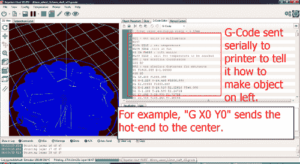T2】](https://res.cloudinary.com/practicaldev/image/fetch/s--JMUscZ1N--/c_limit%2Cf_auto%2Cfl_progressive%2Cq_auto%2Cw_880/https://ladvien.cimg/G-Code.png)

1.  **检查，在测试电机之前再次检查末端制动器连接**

既然我们已经学习了 g 代码，我们知道检查终点挡板是否被触发的代码是 M119。尝试用电子方式移动任何东西之前，请检查几次。如果一切都连接正确，它应该是这样的，

**没有按下按钮:**

1.  Y_MAX:打开
2.  X_MAX:打开
3.  Z_Min:已触发
4.  Z_Max:打开

**按下所有按钮:**

1.  Y_MAX:已触发
2.  X_MAX:已触发
3.  Z_Min:打开
4.  Z_Max:已触发

正确地使用这些触发器是很重要，否则，你的热端会撞到什么东西上。例如，如果其中一个终点挡板没有触发，那么连接的车厢将继续试图拉过终点挡板，这将导致您的皮带扣分离。

[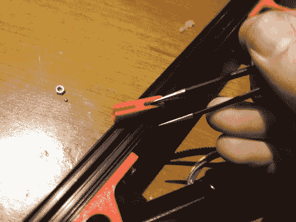T2】](https://res.cloudinary.com/practicaldev/image/fetch/s--gSnAlsTf--/c_limit%2Cf_auto%2Cfl_progressive%2Cq_auto%2Cw_880/https://ladvien.cimg/Link_Info.jpg)

当你做调整的时候，期待你的链接分开几次。

由于直率和谦逊，我在校准我的 Kossel 时犯了很多错误，以至于我的链节开始伸长，无法正确地握住皮带。

我用钳子夹住它们，同时用打火机加热底部，就能把它们弯回原位。

[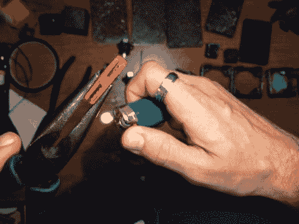T2】](https://res.cloudinary.com/practicaldev/image/fetch/s--Go0Yo-68--/c_limit%2Cf_auto%2Cfl_progressive%2Cq_auto%2Cw_880/https://ladvien.cimg/IMG_0738.jpg)

1.  **粉丝**

Kossel Mini 有一个 40×40 毫米的小风扇，直接吹向热端，*一直*。

[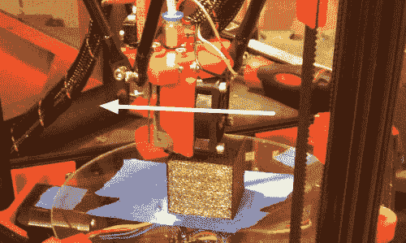T2】](https://res.cloudinary.com/practicaldev/image/fetch/s--a3xblL10--/c_limit%2Cf_auto%2Cfl_progressive%2Cq_auto%2Cw_880/https://ladvien.cimg/IMG_0679.png)

这是必需的，因为热端支架实际上是一个印刷部件，这意味着它是塑料的，因此，如果热端外部没有不断冷却，它会熔化支架，并在您的印刷板上崩溃。

风扇应该在 12V 电压下工作。你有几个选择。您可以将风扇连接到 PSU 本身，这将导致每次打印机打开时风扇都打开。或者，你可以把风扇绑在斜坡板上。

我选择了坡道。不要问我，可能是因为我直觉地找到一种方法，通过可能的最艰难的手段来做某事。

无论如何，这里是我如何有我所有的风扇，(1)在 hotend，(2)冷却我的挤出机步进机，(3)一个 80 毫米冷却打印床。

[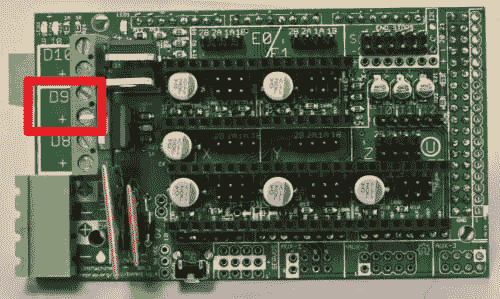 ](https://res.cloudinary.com/practicaldev/image/fetch/s--PHEYqHaH--/c_limit%2Cf_auto%2Cfl_progressive%2Cq_auto%2Cw_880/https://ladvien.cimg/Ramps_14_D9.png) **然后我把这些风扇都接到 D9 上。**

我想暂时岔开话题。电源端子 D8、D9 和 D10 是简单的高功率 N 沟道 MOSFETs，由 Arduino Mega 的 D8、D9 和 D10 引脚进行 PWM 控制。如果你想要确切的规格，这里有[数据表](http://www.st.com/web/en/resource/technical/document/datasheet/CD00002690.pdf)。

好的。现在我们有一些事情要在固件中设置，以使风扇正确运行。首先，确保您使用的是 Configuration.h 下的选项

*   **#定义主板 33**

这将斜坡上的三个电源通道设置为如下功能:

1.  **D10 =挤出机加热器(热端)**
2.  **D9 =粉丝**
3.  **D8 =加热床**

现在这是设置，然后一切都应该工作 hunky-dorky，对不对？嗯，算是吧。

我遇到了两个问题。首先，风扇没有自动打开，我不得不发送 g 代码命令“M106 SXXX”来让它打开，XXX 是 0-255 之间的一个数字来设置风扇的 PWM(还有，命令 M107 以前是关闭它，但现在我们只是发送“M106 S0”)。

第二个问题，我的风扇不喜欢用 PWM 启动。有时会，有时不会。通常，我开始打印时，只会发现我的热端熔化了效应器塑料。叹气。

现在有些比我更了解马林的人大概会指出 **Configuration_adv.h，**下的选项

*   **#定义 FAN_KICKSTART_TIME 100**

该数字是在切换到基于温度的 PWM 之前全速驱动风扇的毫秒数。现在，我试着调整这个数字，但我发现我的风扇仍然会在它变慢的时候锁定。呃。这是我写这篇文章的一个原因，如果其他人有解决方案，请在评论中添加。:)

[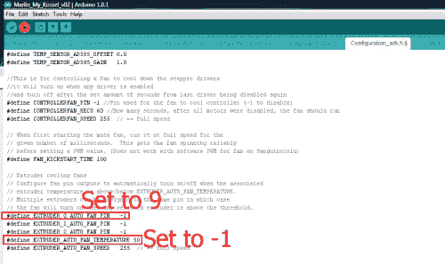](https://res.cloudinary.com/practicaldev/image/fetch/s--_WdMlrTt--/c_limit%2Cf_auto%2Cfl_progressive%2Cq_auto%2Cw_880/https://ladvien.cimg/Auto_Fan_Config2.png) 我最终做的是找到让我的 D9 频道一直满功率运行的选项。

在 **Configuration_adv.h** 文件下，我找到了定义挤出机风扇行为的选项。首先，我通过设置将 D9 频道设置为我们的粉丝频道

*   **#定义挤压机 _ 0 _ 自动 _ 风扇 _ 引脚 9**

然后，我将启动温度改为-1，这意味着热端需要低于冰点才能关闭风扇。所以，一个黑客总是打开开关。

**4。物理打印校准**

“但是我买了一个 Kossel，因为它有一个自动探头！“是的，我很谦虚地说，这些话确实在我脑海中闪过。然而，我认识到，自动探针就像电子产品中的许多东西一样，拥有它很好，但不能取代它背后的能力或理解。我要说的是，auto-probe _ 是为了让你的身体校准保持在正轨上，即使在大量使用之后，而不是补偿差的校准。_

好吧，校准。

我找不到任何关于如何校准机器的 Kossel Mini 具体指南，但我在

*   [德尔塔打印机谷歌集团](https://groups.google.com/forum/#!forum/deltabot)

在经历了许多帖子之后，我拼凑出了自己的校准方法。但是关于这个问题的标准博客是:

*   [在 3D Delta 打印机上](http://minow.blogspot.com/index.html#4918805519571907051)

在我们开始校准之前，让我们定义并商定我们要校准的内容。

[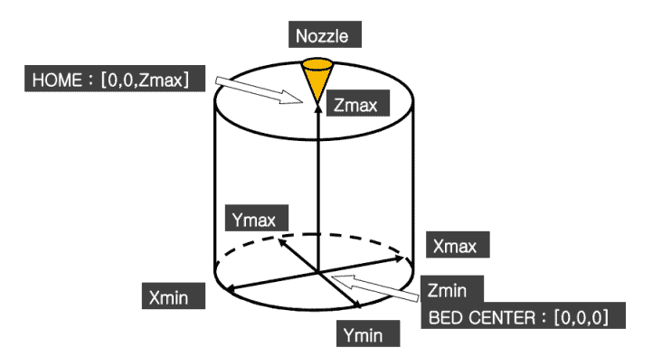T2】](https://res.cloudinary.com/practicaldev/image/fetch/s--iKTzbIf8--/c_limit%2Cf_auto%2Cfl_progressive%2Cq_auto%2Cw_880/https://ladvien.cimg/Calibration_Variables_v01.png)

(图片不要脸，还可能违法？复制自 [Blokmer 的 Kossel Build](http://blomker.com/Kossel_Mini_Assembly_Guide_V1.0.pdf) 指南)

好了，我们开始吧:

**步骤#1 -校准 ZMax**

这需要小心。转到 **Configuration.h** 并设置，

*   **#定义手动 _Z_HOME_POS 270**

这将告诉您的打印机，您的构建体积比实际体积大，但我们这样做是为了在我们尝试将热端尽可能靠近床时，固件不会阻止我们。现在，进行纸测试。

为了简洁起见，我将定义一次纸质测试，然后简称为纸质测试。

这个想法是，当打印机被告知去**Z0 时，最终你想要热端和打印机床之间大约一张纸的宽度空间。* *纸张测试包括将一张纸放在打印床上，然后手动降低热端，开始时 10 毫米一步，但当您靠近时，0.1 毫米一步。当热端施加足够的压力在纸上产生一点阻力时，你停止下降。这是笔试。

好的。你小心地降低热端，直到它通过纸测试。然后，发送 g 代码以获取 Z 位置。

*   **M114**

打印机将响应 X、Y、Z 和 E(挤压机)的当前值。你只想要你现在的 Z 值。取 Z 值并从 270 减去它，这将是您的新手动 _Z_HOME_POS。也就是说，

*   MANUAL_Z_HOME_POS = 270 -通过纸张测试获得的 Z 值。

**如果我的解释很烂，参考[blok mer H07](http://blomker.com/Kossel_Mini_Assembly_Guide_V1.0.pdf)T3】**

**步骤#2 -校准物理中心**

现在，有一种方法可以在你的马林固件中设置你的构建板的中心，但是最好只在那里调整它之后*，你已经将物理部件设置得非常接近中心。这就是我所做的。*

[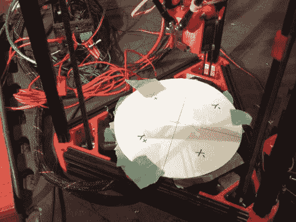](https://res.cloudinary.com/practicaldev/image/fetch/s--3_MfYKBe--/c_limit%2Cf_auto%2Cfl_progressive%2Cq_auto%2Cw_880/https://ladvien.cimg/IMG_0781.jpg) 我用 Eagle Cad 做了一个直径 170 毫米的圆，并标注了精确的圆心(如下)。然后，我把它按比例印在一张纸上。我把这张纸剪下来，放在我的构建板上，然后用胶带粘好。

[T2】](https://res.cloudinary.com/practicaldev/image/fetch/s---gO5ZI7O--/c_limit%2Cf_auto%2Cfl_progressive%2Cq_auto%2Cw_880/https://ladvien.cimg/IMG_0782.jpg)

*   [170mm 直径圆模板](https://ladvien.cimg/Kossel_Calibration.pdf)

接下来，我降低高度，直到它接近中心。

使用控制，我试图中心热端以上的圆圈，我可以做到最好。这有助于在每次移动前多次改变你的角度。一旦它处于中心位置，我们就要进行测量，但在此之前有一些重要的事情需要知道。步进电机将从其保持位置超时，进入空闲位置。注意不要让他们在接下来的两步中超时，因为你需要重新开始会损失一点时间。要让他们参与进来，只需向一个方向微步，然后向右后退。

[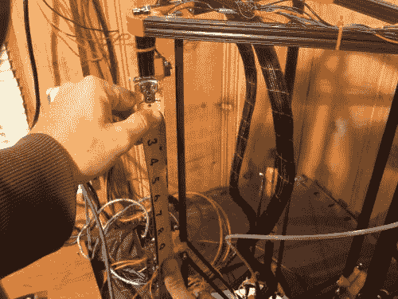](https://res.cloudinary.com/practicaldev/image/fetch/s--VoXlh-UZ--/c_limit%2Cf_auto%2Cfl_progressive%2Cq_auto%2Cw_880/https://ladvien.cimg/IMG_0783.jpg) 好的，测量从一节车厢的顶部到终点挡板上的塑料底部，基本上就是终点挡板按钮被按下时的位置。此外，终点并不重要，因为我们的目标是让他们都一样。

好的，在这一部分你需要一把锯子来给你一个方形的切口。我用了一个测速角尺和一个圆锯。还有，更小的板子，像一块装饰板。按照你测量的长度切一块木头。

[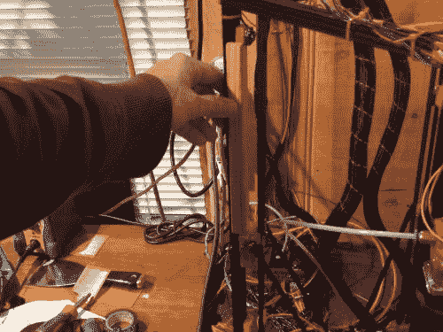](https://res.cloudinary.com/practicaldev/image/fetch/s--PpESO54z--/c_limit%2Cf_auto%2Cfl_progressive%2Cq_auto%2Cw_880/https://ladvien.cimg/IMG_0786.jpg) 把那块木头拿到印刷厂去。降低热端到 Z0。然后，使用目标模板重新居中。现在，把切好的木头放在每个终点挡板和各自车厢的顶部之间，小心不要让马达空转。如果终点挡板太高，降低它，直到它与木头齐平。如果木头放不进去，抬起末端挡板，确保它平齐。通过这种方式，您可以确保每个臂与印刷床的距离相等，同时保持热端居中。

完成后，您必须重复第 1 步。这将设置居中度*和* Z 偏移。

现在，通过发送 g 代码对此进行测试:

*   **G X0 Y0 Z15**

如果一切正常，热端将神奇地找到它的方式到打印床的中心，同时停留在表面以上 15 毫米。如果一切顺利，微步热端回到表面，以确保我们保持正确的 Z 偏移(又名，打印量)。

**步骤#3 -平面打印表面**

即使经历了这一切，我们仍然没有结束。Kossel 上还有另一个需要校准的变量，即平板的平面度。

我们已经校准了 Kossel 的打印体积高度。这意味着，如果我们发出命令 **G X0 Y0 Z0** ，那么 hot end-应该停在打印床的中心，离表面大约 0.1 毫米。但是，德尔塔打印机有一个额外的变量**平整度。**考虑以下两幅图像:

[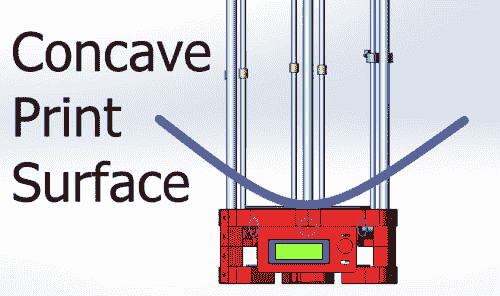T2】](https://res.cloudinary.com/practicaldev/image/fetch/s--WhPh3a25--/c_limit%2Cf_auto%2Cfl_progressive%2Cq_auto%2Cw_880/https://ladvien.cimg/Concave.png)

[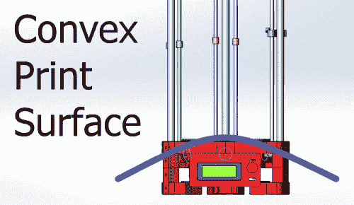](https://res.cloudinary.com/practicaldev/image/fetch/s--VznCCxrg--/c_limit%2Cf_auto%2Cfl_progressive%2Cq_auto%2Cw_880/https://ladvien.cimg/Convex.png) 根据马林固件，此图中的蓝线是打印表面。

你知道这会产生什么问题吗？中心 Z 偏移可能是正确的，但随着热端向边缘移动，它会逐渐上升，直到热端停留在距离打印表面 2-10 毫米的位置。

让我们看看另一个可能更具破坏性的场景。

根据固件，如果打印床是凸形的，那么热端在中心时可能是正确的，但当你到达边缘时，机器会试图将你的热端埋入玻璃板中。

这就是为什么 Johann 的自动探测对 Kossel 的构建是一个很好的补充。但是先不要操之过急，先进行物理校准。

嗯，这是一种谎言。为了纠正平坦度，我们将调整固件。科塞尔平面度依赖于变量 **DELTA_RADIUS** ，它是几个变量的总和。因此，为了调整 DELTA_RADIUS，我们重点关注增加或减少其中一个变量。我随机选择了 **DELTA_SMOOTH_ROD_OFFSET** 。

好的，调整是非常直接的，但是需要修补才能正确。但是在我们做出调整之前，我们需要知道该往哪个方向走。我们可以通过目视比较当热端位于中心时热端和印刷表面之间的距离与当热端靠近其中一个塔时热端和印刷表面之间的距离之间的差异来确定这一点。让我们回到图片。

[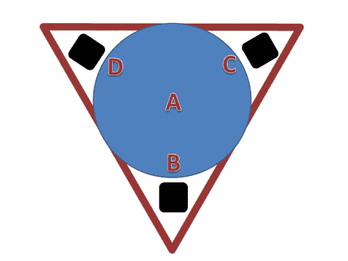T2】](https://res.cloudinary.com/practicaldev/image/fetch/s--C9LvaPGx--/c_limit%2Cf_auto%2Cfl_progressive%2Cq_auto%2Cw_880/https://ladvien.cimg/Kossel_Flatness.png)

这个图像是为了给你一个想法，我们想要比较哪些点的平坦度。例如，如果科塞尔在 A 点通过了笔试，那么它应该在 B 点、C 点和 d 点通过。

但是如果 **Kossel 在 A 点通过了纸张测试，而在 B、C 和 D 点太高，那么你就有一个凹的印刷表面。**

同样，如果 **Kossel 在 A 点通过纸张测试，而在 B、C 和 D 点太低，那么你就有一个凸起的印刷表面。**

*   **B 高度> A 高度=凹面**
*   **B 高度< A 高度=凸面**

还有一点，你可能会问如何找到点 B，C 和 d，我用了下面的计算

*   **Xb =(建造半径)* COS *(B 塔角度)**
*   **Yb =(建造半径)* SIN *(B 塔角度)**

此外，要知道你的塔应该在 90 度，210 度，330 度

如果你有和我一样的建造半径，170，那么你的点数应该是。

1.  **Y70，X0**
2.  **Y-35，X-60**
3.  **Y-35，X60.62**

但是请记住，我们真的希望这四点都能通过笔试。

让我们继续讨论如何进行调整。我不会进入数学解释如何调整 DELTA_RADIUS 影响平坦度，主要是因为我不理解它。但其次，因为我们不需要了解它来调整它。只要知道以下几点，

1.  增加 DELTA_SMOOTH_ROD_OFFSET 会降低 hotend。
2.  **减少 DELTA_SMOOTH_ROD_OFFSET 会增加 hotend。**

真的，它正在改变固件的扁平化理念。

现在，通过比较点 A 与点 B、C 和 d，根据您收集的视觉信息进行调整。然后，再次比较它们，再次调整。比较，调整。不定式的。

请不要以为你已经完成了。做这些最后的调整意味着你真的需要回去从第一步开始，再做一遍，因为任何调整都会使之前的调整偏离一点点。因此，这是真的，调整是一个无限减少误差的过程，永远不会达到完美。很高兴与漂亮该死的接近:)

**6。自动探测**

物理校准已经完成，现在让我们来看看是什么让我们成为 Kossel 用户，我们各自的自动探针。

自动探针是为了保持 Kossel 迷你打印平面。也就是说，它旨在调整印刷床中的*轻微*不一致或*轻微*机械不均衡。

好吧，作为本文的其余部分，我不打算重复已经讨论过的内容。例如设置自动探测。回头参考一下[布洛克默](http://blomker.com/Kossel_Mini_Assembly_Guide_V1.0.pdf)，或者 [B3DP](http://www.builda3dprinter.eu/build-manuals/) 。但是我觉得他们忽略了一些事情:

**#1 - G28 取消 G29 数据**

**我认为这是校准指南中最重要的遗漏**。G28 是归位塔终点挡板的 g 代码，只要知道无论何时你这样做，它将取消你从自动探针上获得的读数。**请注意，Slic3r 在每次打印前都会添加一个 G28 命令。**

[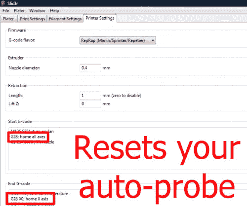](https://res.cloudinary.com/practicaldev/image/fetch/s--KFeKkmDO--/c_limit%2Cf_auto%2Cfl_progressive%2Cq_auto%2Cw_880/https://ladvien.cimg/Auto-probe_reset2.png) 把这个从 Slic3r 中去掉，

1.  转到“打印机设置”
2.  在“启动 g 代码”下，删除“G28home 所有轴”行。
3.  在“结束 g 代码”下删除“G28 X0X 轴原点”并替换为“G1 X0 Y0 Z220 F5000”

第三步只是一个建议，但你确实希望你的酒店在完成后远离印刷品，这样你就不会发现任何着火的东西。你只是不想重置你的自动探测数据。

是的，我花了大约 20 个小时来调整我的自动水平，每次我的打印没有调整时我都挠头。(如果不是因为 [Hoff70](http://letsmakerobots.com/user/18659) ，我现在还在挠头)。

我没有 T2 聪明，只是顺从。

**#2 从挤压机中找出 Z 探头的 X、Y、Z 偏移量。**

Z 探头并不直接位于热端的顶端，因此我们必须针对这种偏移进行调整。为了找到这个数字，我做了以下工作。

1.  放置[纸模板](https://ladvien.cimg/Kossel_Calibration.pdf)并使其居中。
2.  发送命令: **G X0 Y0 Z10**
3.  将自动探头置于活动位置(好像要读取读数)。
4.  使用 Repetier 或 Pronterface，将效应器从中心位置移动，直到 Z 探针的尖端居中。
5.  然后降低效应器，直到 Z 探针通过纸张测试。
6.  之后，发送 g 代码: **M114** 。输出是我们的自动探针偏移。

把你的阅读材料放进马林的三个定义里

*   **#定义 X _ 探针 _ 偏移 _ 来自 _ 挤压机**
*   **#定义 Y _ PROBE _ OFFSET _ FROM _ EXTRUDER**
*   **#定义 Z _ PROBE _ OFFSET _ FROM _ EXTRUDER**

至于方向性，**我发现如果我的 X 或 Y 数字是负数，我告诉固件我的自动探针偏移到-X 或-Y 区域**。当然，Z-probe 偏移量总是负的，否则你就有麻烦了。

**#3 -可视化自动探头读数**

这是另一个我觉得被导游忽略的重要部分。自动探测数据意味着什么？

别问我，那需要数学。我更喜欢看照片。那么，我们如何把数据变成图片呢？嗯，有几种方法，但实际上，任何将一组点变成平面的程序。

Delta Google 组的一个人给 MATLAB 写了这个 Python 脚本。

*   [MATLAB](http://www.mathworks.com/products/matlab/)
*   [平面可视化器](https://github.com/brandonheller/delta_calibration)

我没有 MATLAB，目前也没有大学，所以我不得不另想办法。嗯，我的职业是心理健康，我使用 Excel 进行大量的统计分析(嘿，SPSS 也要花钱)。无论如何，下面是我在 Excel 中可视化数据的步骤。

**1。运行自动探测。**一旦自动探测完成，它将发回一组点。复制它们。

[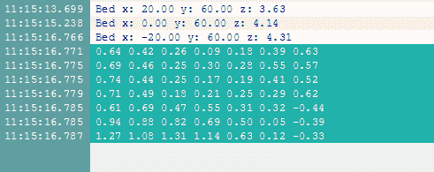T2】](https://res.cloudinary.com/practicaldev/image/fetch/s--Wpnc2h-o--/c_limit%2Cf_auto%2Cfl_progressive%2Cq_auto%2Cw_880/https://ladvien.cimg/Excel_auto_probe1.png)

1.  **将积分粘贴到 Excel 中。**它会抱怨格式化，按 OK。

[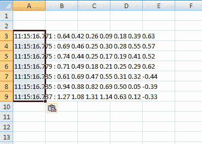T2】](https://res.cloudinary.com/practicaldev/image/fetch/s--R-fcO9RW--/c_limit%2Cf_auto%2Cfl_progressive%2Cq_auto%2Cw_880/https://ladvien.cimg/Excel_auto_probe2.png)

**3。如果您点击格式化选项并选择“文本导入向导”**然后，您可以选择“空格分隔”粘贴选项。基本上，这将导致 Excel 翻译

[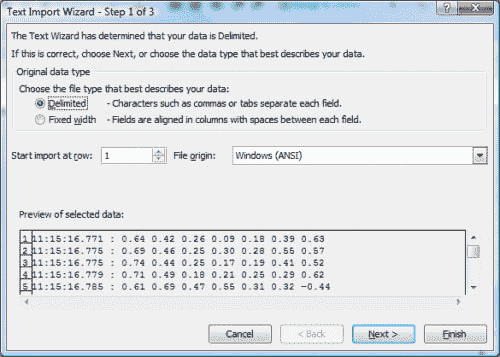T2】](https://res.cloudinary.com/practicaldev/image/fetch/s--JOI0J4if--/c_limit%2Cf_auto%2Cfl_progressive%2Cq_auto%2Cw_880/https://ladvien.cimg/Excel_auto_probe3.png)

**4。一旦你在 Excel 中有了正确的数据，让我们制作一个图表。选择您的数据集，然后转到图形类型“表面”**

[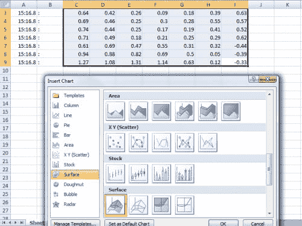T2】](https://res.cloudinary.com/practicaldev/image/fetch/s--GaA2nC70--/c_limit%2Cf_auto%2Cfl_progressive%2Cq_auto%2Cw_880/https://ladvien.cimg/Excel_auto_probe4.png)

**5。这是图表。**

[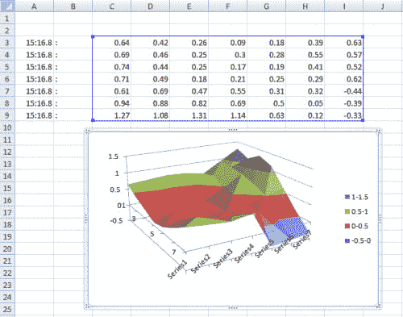T2】](https://res.cloudinary.com/practicaldev/image/fetch/s--OXQNbk9D--/c_limit%2Cf_auto%2Cfl_progressive%2Cq_auto%2Cw_880/https://ladvien.cimg/Excel_auto_probe5.png)

1.  你可以用这些数据做几件事，但前提是你要有一个定位点。也就是说，图形上的哪个区域代表印刷表面上的区域。为了找到自动探测数据的方向，我在其中一个塔附近的打印表面上构建了一个块，如下所示:

[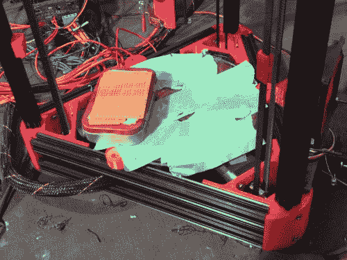T2】](https://res.cloudinary.com/practicaldev/image/fetch/s--mQhsAB0o--/c_limit%2Cf_auto%2Cfl_progressive%2Cq_auto%2Cw_880/https://ladvien.cimg/IMG_0792.jpg)

小心，如果你的 Z 型探头缩回得不够远，它会把你的肿块撞到腰带上。

您可以在 Marlin 固件中调整 Z 探针在两次探测之间缩回的距离。在 **Configuration.h** 调整下，

*   **#定义 Z_RAISE_BETWEEN_PROBING**

如果一切顺利，当你运行你的自动探测数据，你会得到一个很好的图表表面肿块。这将让你在调整方面做出明智的决定。

1.  我想指出的最后一点。如果你的自动探针在机械上不可靠，这些都没用。但是你怎么知道是不是呢？好吧，直到有人纠正我，我做了以下。

2.  运行了大约 20 次自动探测。

3.  每次之后，我取数据的平均值。

4.  然后，在我有了大约 20 个平均值后，我计算了这些平均值的标准差。

5.  这个数字是你的自动探针机械可靠性的一个公平指标。也就是说，它给你的读数可靠吗？数字越小，越可靠。

当然，我不擅长数学，而且我是纯粹的黑客，所以如果不正确的话，有更懂逻辑的人告诉我。

说到这里，我将以这样一句话结束我的演讲:我是一名黑客。我写这篇文章不是为了指出我所知道的一切，而是我所学到的。如果有人发现不正确的信息，请评论；我会很快做出改变。我最不想做的事就是误导别人。